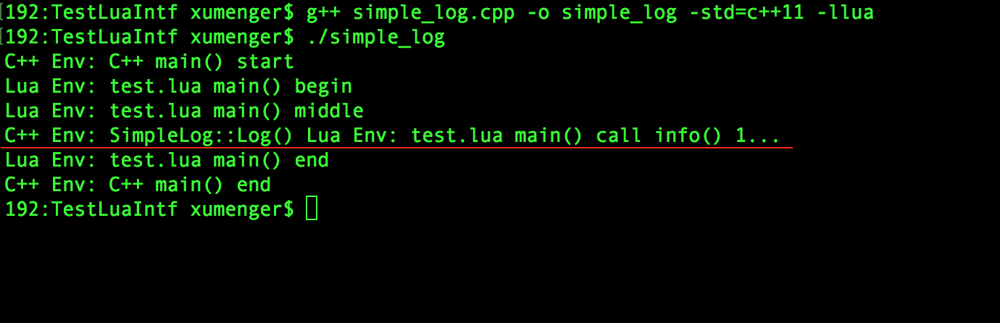

>翻译自[https://github.com/SteveKChiu/lua-intf](https://github.com/SteveKChiu/lua-intf)

lua-intf 是C++ 11 与Lua 语言之间的一种绑定机制，它提供了三种不同的API

* LuaBinding：导出C++ 类、函数给Lua 脚本使用
* LuaRef：用于访问Lua Object 的高级别API
* LuaState：为Lua C API 提供的低级别包装器

除了C++ 11、Lua 之外，lua-intf 没有其他需要依赖的。而且它是一个只有头文件的库，也就是说没有makefile 或者其他安装操作，直接拷贝lua-intf 源码到你的项目中，在代码中包含LuaIntf.h 即可

## Lua 和C++ 的错误处理

默认使用LuaIntf，最好使用C++ 编译器编译Lua，这样允许Lua 库在出现错误时抛出异常，而且保证栈上的C++ 对象被正确的析构

更多关于错误处理的内容，可以参见[http://lua-users.org/wiki/ErrorHandlingBetweenLuaAndCplusplus](http://lua-users.org/wiki/ErrorHandlingBetweenLuaAndCplusplus)

如果你坚持想在C 环境下编译Lua，而且可以忍受issue 问题，你可以在#include LuaIntf.h 头文件之前先# define LUAINTF_LINK_LUA_COMPILED_IN_CXX 0

```c
#define LUAINTF_LINK_LUA_COMPILED_IN_CXX 0
#include "LuaIntf/LuaIntf.h"
```

## 在C++ 环境下编译Lua

预编译的Lua 库大多数发行版都是在C 环境下编译的，如果需要在C++ 环境下编译Lua 库，你可能需要自己手动操作。在C++ 环境下编译Lua 其实也很简单，首先先把Lua 源码下载下来

```shell
curl http://www.lua.org/ftp/lua-5.3.0.tar.gz -o lua-5.3.0.tar.gz
tar xf lua-5.3.0.tar.gz
cd lua-5.3.0
```

在不同的环境下使用不同的命令进行编译构建

```shell
# Linux环境下编译
make linux MYCFLAGS="-x c++" CC="g++"

# Mac OSX 环境下编译
make macosx MYCFLAGS="-x c++" MYLDFLAGS="-lc++"

## 在Windows 下用MINGW 或MSYS 编译
make mingw MYCFLAGS="-x c++" CC="g++"
```

而且你可以选择指定路径进行安装

```shell
make install INSTALL_TOP=<path>
```

## 为Lua 脚本导出C++ 类或函数

比如下面这个C++ 类

```c++
class Web
{
public:
    // base_url is optional
    Web(const std::string &base_url);
    ~Web();

    static void go_home();

    static std::string home_url();
    static void set_home_url(const std::string &url);

    std::string url() const;
    void set_url(const std::string &url);
    std::string resolve_url(const std::string &uri);

    // doing reload if uri is empty
    std::string load(const std::string &uri);
}
```

使用下面的代码可以将Web 类导出

```c++
LuaBinding(L).beginClass<Web>("Web")
    .addConstructor(LUA_ARGS(_opt<std::string>))
    .addStaticProperty("home_url", &Web::home_url, &Web::set_home_url)
    .addStaticFunction("go_home", &Web::go_home)
    .addProperty("url", &Web::url, &Web:set_url)
    .addFunction("resolve_url", &Web::resolve_url)
    .addFunction("load", &Web::load, LUA_ARGS(_opt<std::string>))
    .addStaticFunction("lambda", [] {
        // you can use C++11 lambda expression here too
        return "yes";
    })
.endClass();
```

在Lua 代码中可以这样使用Web 类

```lua
local w = Web()                            -- auto w = Web("");
w.url = "http://www.xumenger.com"          -- w.set_url("http://www.xumenger.com");
local page = w:load()                      -- auto page = w.load("");
page = w:load("http://www.google.com")     -- page = w.load("http://www.google.com");
local url = w.url                          -- auto url = w.url();
```

## Lua 调用C++ 的例子

编写C++ 代码simplelog.cpp，如下

```c++
#define LUAINTF_LINK_LUA_COMPILED_IN_CXX 0
#include "LuaIntf/LuaIntf.h"

#include <iostream>
#include <lua.hpp>
#include <string>

using namespace std;

struct lua_State;

class SimpleLog
{
public:
    static SimpleLog *getInstance() {
        static SimpleLog instance;
        return &instance;
    }

    ~SimpleLog();

    void Log(const string &str);
    void BindLua(lua_State *L);

private:
    SimpleLog();
};

SimpleLog::SimpleLog() {
    
}

SimpleLog::~SimpleLog() {
    
}

void SimpleLog::Log(const string &str) {
    cout << str << endl;
}

namespace 
{
    using LuaRef = LuaIntf::LuaRef;

    void LuaLog(const string &str) {
        SimpleLog::getInstance()->Log(str);
    }

    namespace LuaSimpleLog
    {
        void Bind(lua_State *L) {
            assert(L);
            LuaIntf::LuaBinding(L).beginModule("simple_log")
                     .addFunction("log", &LuaLog)
                     .endModule();
        }
    };
};

void SimpleLog::BindLua(lua_State *L) {
    LuaSimpleLog::Bind(L);
}


int main()
{
    lua_State *L = luaL_newstate();
    luaL_openlibs(L);
    SimpleLog::getInstance()->BindLua(L);
    cout << "C++ main() start" << endl;
    luaL_dofile(L, "./test.lua");
    cout << "C++ main() end" << endl;
    return 0;
}
```

编写log.lua 代码如下

```lua
local Log = {}
local log = simple_log.log

function Log:new(log_name)
    assert("table" == type(self))
    assert(not log_name or "string" == type(log_name))
    local log = {}
    log.log_name = log_name or "log"
    setmetatable(log, self)
    self.__index = self
    return log
end

function Log:set_log_name(log_name)
   self.log_name = log_name
end

function Log:info(pattern, ...)
    log(string.format(pattern, ...))
end

function Log:debug()
    print("log.lua debuf()")
end

return Log
```

编写test.lua 内容如下

```lua
local function main()

    print("test.lua main() begin")
    local p = "../TestLuaIntf"
    package.path = package.path .. ";" .. p .. "/" .. "TestLuaIntf" .. "/?.lua"

    print("test.lua main() middle")

    local log = require("log"):new("svn_log")
    log:info("test.lua main() call info() %d...", 1)

    print("test.lua main() end")
end

xpcall(main, function(...)
    local msg = {...};
    for k, v in pairs(msg) do
        print("k=" .. tostring(k) .. " v =" .. tostring(v))
    end
    print(tostring() .. " 123")
end)
```

编译C++ 程序运行效果如下



>这里的流程时通过C++ 调用lua 接口luaL_dofile(L, "test.lua") 来执行test.lua，test.lua 中require("log")，然后lua 再调用C++ 的函数Log 完成打印

## 更多资料

* [https://github.com/SteveKChiu/lua-intf](https://github.com/SteveKChiu/lua-intf)
* [A template class for binding C++ to Lua(翻译)](https://www.cnblogs.com/lontoken/p/3508067.html)
* [C++和Lua交互教程（基于LuaBridge）](https://blog.csdn.net/FL63Zv9Zou86950w/article/details/78402879)
* [Error Handling Between Lua And Cplusplus](http://lua-users.org/wiki/ErrorHandlingBetweenLuaAndCplusplus)
* [利用lua-intf来调用C++函数](https://blog.csdn.net/suyinfan/article/details/75271024)
* [C++用LuaIntf调用Lua代码示例](https://blog.csdn.net/jq0123/article/details/53545004)
* [Lua与C/C++混合编程](http://www.xumenger.com/lua-c-cpp-20180202/)
