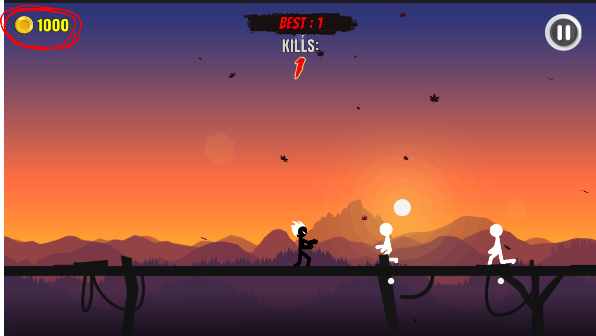

>本文就是记录自己的一次瞎胡闹！！

随便在网上找了一款使用Unity3D 开发的Android 手游，其运行效果是这样的


## Unity3D逆向工具

使用ApkDb 反编译apk 文件（在apk 上右键-->使用APKDB编译），得到以下文件夹


使用Unity3D 开发的Android 游戏的资源、C# 代码都在assets 文件夹中！Unity3D 所有资源、代码都在/assets/bin/data 里面

* settings.xml: Unity3D的配置文件
* splash.png: apk默认启动图
* sharedassets0.assets: Unity3D资源文件打包文件
* sharedassets0.assets.split: Unity3D资源文件打包文件
* Managed文件夹: Unity3D游戏源代码，是一些DLL文件
* unity default resources: Unity3D语言包

使用.Net Reflector（需要按照Reflexil 插件）打开Assembly-CSharp.dll（大多数Unity3D 游戏的代码逻辑都在这里，也有很多游戏会有很多其他的DLL，具体情况具体分析）


>.Net Reflector 会把DLL 中的代码以C# 语言的方式反编译出来，对着代码进行逆向分析相对来说就方便很多了

>可以直接在.Net Reflector 中按照类名、方法名、字符串等进行搜索（如果程序加密了就不好办了），.Net Reflector 上的各个菜单项、工具栏多点点，了解它们的功能！

>Tools-->Reflexil 打开Reflexil 插件，这个插件用来修改程序集的IL 并保存到磁盘文件！

## Android Killer

上面是使用ApkDb 对apk 文件进行反编译，其实我们还可以选择功能更强大的Android Killer，使用Android Killer 打开apk 文件进行反汇编和分析


另外如果在电脑上安装像海马玩模拟器等，可以直接在Android Killer 上连接到该设备，很方便的进行安装apk、运行程序进行测试


>不过不知道为什么我这里找不到对应的模拟器，而且使用海马玩模拟器安装上面那个游戏竟然运行不起来，算了，还是使用夜神模拟器吧

>这种情况经常会遇到，如果暂时没有空去查清楚原因，那么试着换个工具临时解决一下

另外在Android Killer 的工程管理器可以看到apk 文件反编译后的目录结构，其实和ApkDb 一样，Android Killer 将其反编译后也是将这些文件放在某个本地目录下的，不过ApkDb 是直接放在apk 文件的相同路径下，对于Android Killer 我们需要在工程管理器上选中文件，右键-->打开方式-->打开文件路径，这样接下来才可以继续使用.Net Reflector 打开对应的DLL 文件对Unity3D 的代码进行逆向和修改


## 简单逆向实践

Unity3D 游戏逆向分析的思路与其他软件逆向分析思路一样（以下是针对最基础的游戏进行分析的思路，有强校验、加密的就不是这个思路了。本文不涉及，主要是水平不够）

1. 反编译游戏
2. 常用的关键字搜索关键方法
3. 分析方法内容，修改数据、修改逻辑
4. 保存文件，运行游戏验证
5. 分析-->修改-->验证...如此反复

首先要去玩这个游戏，大概了解其玩法。上手之后发现没杀死一个敌人，金币数量就加2

对于本文这个例子，我想要修改游戏，使我的金币数量很多，金币一般都用coin 命名相关变量、函数，所以直接在.Net Reflector 中搜索coin（当然也有游戏反套路而行，使用别的命名规范，或者加密，那这种传统方法就不行了），搜索到的内容如下


逐个分析与coin 相关的函数、变量，选择了AddCoin 这个方法，通过Reflector 的分析功能，看一下有哪些地方会调用这个函数


再看该方法的具体代码，其本来的内容是这样的

```c#
public void AddCoin(int _coin)
{
    this.levelProgress.coins += _coin;
    if (!this.levelProgress.coinsCompleted && (this.levelProgress.coins >= this.levels[this.currentLevel].coins))
    {
        this.levelProgress.coinsCompleted = true;
    }
}
```


>选中该方法后，Tools-->Reflexil，打开Reflexil 插件可以看到这个方法对应的IL，因为后面需要通过修改字IL 修改程序逻辑

盲猜其就是在杀死敌人时调用该方法加金币，看看这个函数每次加的金币数量是传入的参数\_coin，我可以把每次加金币的数量写死为1000（在对应的指令上右键-->Edit），这样每次杀死一个敌人就会加1000 个金币了


>如果只是修改指令，那么上面对应的代码是不会变的，我这里是因为修改指令后，将dll 重新保存，然后用Reflector 重新打开后，所以C# 代码和IL 指令都变了

在Reflector 中，找到对应的DLL，右键-->Reflexil-->另存为，覆盖掉原来的DLL，然后再用Android Killer 重新打包APK 文件


重新在模拟器中安装，然后运行游戏，结果发现没有效果，每次击杀敌人后硬币数量还只是加2 而已！

## 不可能一次成功

很显然上一次的修改不成功，利用Reflector 的分析功能，看到这个AddCoin() 函数会在哪里被调用


再进一步分析调用了AddCoin() 函数的地方，结合玩游戏时游戏的表现，发现这些并不是在游戏中击杀敌人时会执行的逻辑，怪不得上面的修改无效！

继续去逆向分析，寻找其他的函数。实在没有找到Coin 相关的逻辑，不过本文只是演示如何逆向，所以我找到了另一个可以修改并直观看到效果的点，在玩游戏的时候，每击杀一个敌人，Kill 值也会增加，找到了与敌人相关的类、方法


reset() 方法中有设置每次击杀敌人的时候Kill 增加的值


直接修改指令（这里是修改保存后重新使用Reflector 打开的效果）


重新打包安装游戏后，结果在游戏的时候根本就杀不了敌人，直接被别人干死，估计这个值还和敌人的战斗力有关，并不是和分数值有关

## 再一再二再三

将修改该回去，然后基于上面的尝试继续分析，发现EnemyType 下的hit() 方法中有很多关于得分的逻辑

其中有Kill 得分的逻辑


也有Coin 得分的逻辑


准备只修改Coin 的逻辑演示一下逆向效果

如何快速找到金币的逻辑在Reflexil IL 中的指令？选择将Reflector 中的代码**以IL 显示**，这种显示方式会保留变量等信息，然后在Reflector 中找到C# 对应的IL，前面有偏移地址信息，再去根据这个找到Reflexil 中的IL 指令


```IL
L_04da: ldc.i4.0 
L_04db: stloc.s num9
L_04dd: ldarg.0 
L_04de: ldfld valuetype EnemyController/EnemyType EnemyController::enemyType
L_04e3: brtrue L_04f6

L_04e8: ldc.i4.0 
L_04e9: ldc.i4.3 
L_04ea: call int32 [UnityEngine]UnityEngine.Random::Range(int32, int32)
L_04ef: stloc.s num9

L_04f1: br L_053d
L_04f6: ldarg.0 
L_04f7: ldfld valuetype EnemyController/EnemyType EnemyController::enemyType
L_04fc: ldc.i4.1 
L_04fd: bne.un L_0522

L_0502: ldc.i4.2 
L_0503: ldc.i4.5 
L_0504: call int32 [UnityEngine]UnityEngine.Random::Range(int32, int32)
L_0509: stloc.s num9

L_050b: ldsfld class GameController GameController::s
L_0510: dup 
L_0511: ldfld int32 GameController::redEnemiesKilled
L_0516: ldc.i4.1 
L_0517: add 
L_0518: stfld int32 GameController::redEnemiesKilled
L_051d: br L_053d

L_0522: ldc.i4.5 
L_0523: ldc.i4.8 
L_0524: call int32 [UnityEngine]UnityEngine.Random::Range(int32, int32)
L_0529: stloc.s num9

L_052b: ldsfld class GameController GameController::s
L_0530: dup 
L_0531: ldfld int32 GameController::greenEnemiesKilled
L_0536: ldc.i4.1 
L_0537: add 
L_0538: stfld int32 GameController::greenEnemiesKilled
L_053d: ldsfld class GameController GameController::s
L_0542: dup 
L_0543: ldfld int32 GameController::coinsCollected
L_0548: ldloc.s num9
L_054a: add 
L_054b: stfld int32 GameController::coinsCollected
L_0550: ldsfld class StatsManager StatsManager::s
L_0555: dup 
L_0556: ldfld int32 StatsManager::coins
L_055b: ldloc.s num9
L_055d: add 
L_055e: stfld int32 StatsManager::coins
```

找到IL 指令后，修改其逻辑（直接赋值，删除后面取随机值的逻辑，了解IL 函数调用、IL 赋值、IL 堆栈等IL 指令，就知道要删除调用Random() 并赋值给num9 的IL 指令），每次杀死一个敌人，金币数增加1000


```IL
L_04da: ldc.i4 0x3e8
L_04df: stloc.s num9
L_04e1: ldarg.0 
L_04e2: ldfld valuetype EnemyController/EnemyType EnemyController::enemyType
L_04e7: brtrue L_04f1

L_04ec: br L_0526
L_04f1: ldarg.0 
L_04f2: ldfld valuetype EnemyController/EnemyType EnemyController::enemyType
L_04f7: ldc.i4.1 
L_04f8: bne.un L_0514

L_04fd: ldsfld class GameController GameController::s
L_0502: dup 
L_0503: ldfld int32 GameController::redEnemiesKilled
L_0508: ldc.i4.1 
L_0509: add 
L_050a: stfld int32 GameController::redEnemiesKilled
L_050f: br L_0526

L_0514: ldsfld class GameController GameController::s
L_0519: dup 
L_051a: ldfld int32 GameController::greenEnemiesKilled
L_051f: ldc.i4.1 
L_0520: add 
L_0521: stfld int32 GameController::greenEnemiesKilled
L_0526: ldsfld class GameController GameController::s
L_052b: dup 
L_052c: ldfld int32 GameController::coinsCollected
L_0531: ldloc.s num9
L_0533: add 
L_0534: stfld int32 GameController::coinsCollected
L_0539: ldsfld class StatsManager StatsManager::s
L_053e: dup 
L_053f: ldfld int32 StatsManager::coins
L_0544: ldloc.s num9
L_0546: add 
L_0547: stfld int32 StatsManager::coins
```

>找到C# 代码对应的IL 指令要求我们对IL 指令集有所了解才行，本文不赘言，后面会专门整理文章

保存DLL，对Apk 重新打包，运行游戏，果然，在游戏中每击杀一个敌人，金币数量就加1000



Unity3D 游戏主要使用C# 开发，对游戏的修改，其实主要是对C# IL 的修改，可以先看[《读懂IL代码就这么简单 (一)》](http://www.lupaworld.com/article-229958-1.html)去了解一下IL，接下来我会从我的角度整理一篇关于C# IL 的文章

>以上只是以一个最简单的修改游戏的例子展示逆向的过程，改个金币数量这种行为到底还是太没技术含量了，而且也根本没有对游戏逻辑进行深入的分析！纯粹是小打小闹

>我在逆向修改这个游戏的时候，也不是立马就找到了对应的方法的，也是结合Reflector 的搜索、分析功能，分析和修改了各种函数，然后再重新生成游戏程序，运行游戏验证是否修改正确...如此反复在各个DLL 中搜索各种可能的函数，各种尝试之后才找到了关键函数并修改成功的

>本文也只是很简单的分析，更多的游戏逻辑、玩法根本没有花时间去细究

## 参考资料

* [记一次安卓Unity3d游戏的逆向分析](https://www.jianshu.com/p/2957621f720f)
* [基于unity3d游戏的android版本逆向初探](https://bbs.pediy.com/thread-212532.htm)
* [IL指令详细表](https://www.cnblogs.com/knowledgesea/p/5461040.html)
* [读懂IL代码就这么简单 (一)](http://www.lupaworld.com/article-229958-1.html)
* [IL指令详细](https://www.cnblogs.com/zery/p/3368460.html)
