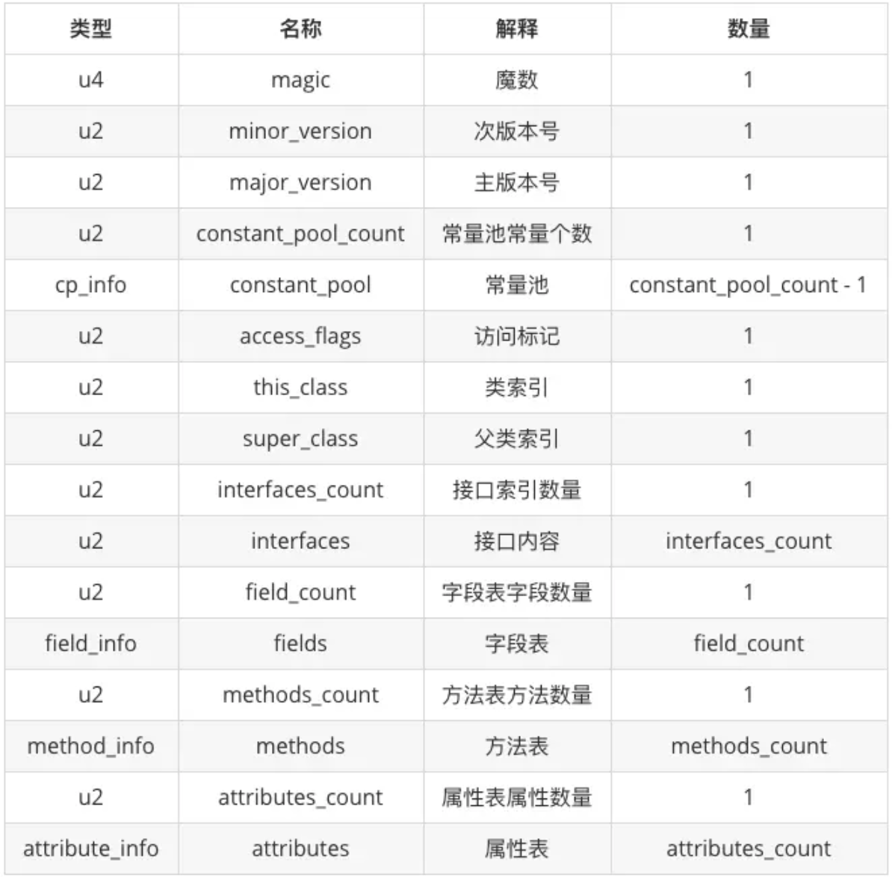

编写一个简单的Java 程序如下

```java
package com.test;

public class OpCode {
    private int m;
    public String str;

    public int function(int i, String s) {
        this.m = i;
        this.str = s;

        if (i > 0) {
            System.out.println("测试判断");
        }

        while (i > 0) {
            System.out.println("测试循环: " + str);
            i--;
        }

        return m + m;
    }
}
```

编译Java 程序，然后直接看.class 文件内容


然后使用javap -verbose OpCode.class 查看.class 内容如下

```
Classfile /Users/xumenger/Desktop/code/Java/opcode/OpCode.class
  Last modified 2019-7-6; size 778 bytes
  MD5 checksum 26b433c4df122c28db3014237e71b3d2
  Compiled from "OpCode.java"
public class com.test.OpCode
  minor version: 0
  major version: 52
  flags: ACC_PUBLIC, ACC_SUPER
Constant pool:
   #1 = Methodref          #13.#27        // java/lang/Object."<init>":()V
   #2 = Fieldref           #12.#28        // com/test/OpCode.m:I
   #3 = Fieldref           #12.#29        // com/test/OpCode.str:Ljava/lang/String;
   #4 = Fieldref           #30.#31        // java/lang/System.out:Ljava/io/PrintStream;
   #5 = String             #32            // 测试判断
   #6 = Methodref          #33.#34        // java/io/PrintStream.println:(Ljava/lang/String;)V
   #7 = Class              #35            // java/lang/StringBuilder
   #8 = Methodref          #7.#27         // java/lang/StringBuilder."<init>":()V
   #9 = String             #36            // 测试循环:
  #10 = Methodref          #7.#37         // java/lang/StringBuilder.append:(Ljava/lang/String;)Ljava/lang/StringBuilder;
  #11 = Methodref          #7.#38         // java/lang/StringBuilder.toString:()Ljava/lang/String;
  #12 = Class              #39            // com/test/OpCode
  #13 = Class              #40            // java/lang/Object
  #14 = Utf8               m
  #15 = Utf8               I
  #16 = Utf8               str
  #17 = Utf8               Ljava/lang/String;
  #18 = Utf8               <init>
  #19 = Utf8               ()V
  #20 = Utf8               Code
  #21 = Utf8               LineNumberTable
  #22 = Utf8               function
  #23 = Utf8               (ILjava/lang/String;)I
  #24 = Utf8               StackMapTable
  #25 = Utf8               SourceFile
  #26 = Utf8               OpCode.java
  #27 = NameAndType        #18:#19        // "<init>":()V
  #28 = NameAndType        #14:#15        // m:I
  #29 = NameAndType        #16:#17        // str:Ljava/lang/String;
  #30 = Class              #41            // java/lang/System
  #31 = NameAndType        #42:#43        // out:Ljava/io/PrintStream;
  #32 = Utf8               测试判断
  #33 = Class              #44            // java/io/PrintStream
  #34 = NameAndType        #45:#46        // println:(Ljava/lang/String;)V
  #35 = Utf8               java/lang/StringBuilder
  #36 = Utf8               测试循环:
  #37 = NameAndType        #47:#48        // append:(Ljava/lang/String;)Ljava/lang/StringBuilder;
  #38 = NameAndType        #49:#50        // toString:()Ljava/lang/String;
  #39 = Utf8               com/test/OpCode
  #40 = Utf8               java/lang/Object
  #41 = Utf8               java/lang/System
  #42 = Utf8               out
  #43 = Utf8               Ljava/io/PrintStream;
  #44 = Utf8               java/io/PrintStream
  #45 = Utf8               println
  #46 = Utf8               (Ljava/lang/String;)V
  #47 = Utf8               append
  #48 = Utf8               (Ljava/lang/String;)Ljava/lang/StringBuilder;
  #49 = Utf8               toString
  #50 = Utf8               ()Ljava/lang/String;
{
  public java.lang.String str;
    descriptor: Ljava/lang/String;
    flags: ACC_PUBLIC

  public com.test.OpCode();
    descriptor: ()V
    flags: ACC_PUBLIC
    Code:
      stack=1, locals=1, args_size=1
         0: aload_0
         1: invokespecial #1                  // Method java/lang/Object."<init>":()V
         4: return
      LineNumberTable:
        line 3: 0

  public int function(int, java.lang.String);
    descriptor: (ILjava/lang/String;)I
    flags: ACC_PUBLIC
    Code:
      stack=3, locals=3, args_size=3
         0: aload_0
         1: iload_1
         2: putfield      #2                  // Field m:I
         5: aload_0
         6: aload_2
         7: putfield      #3                  // Field str:Ljava/lang/String;
        10: iload_1
        11: ifle          22
        14: getstatic     #4                  // Field java/lang/System.out:Ljava/io/PrintStream;
        17: ldc           #5                  // String 测试判断
        19: invokevirtual #6                  // Method java/io/PrintStream.println:(Ljava/lang/String;)V
        22: iload_1
        23: ifle          60
        26: getstatic     #4                  // Field java/lang/System.out:Ljava/io/PrintStream;
        29: new           #7                  // class java/lang/StringBuilder
        32: dup
        33: invokespecial #8                  // Method java/lang/StringBuilder."<init>":()V
        36: ldc           #9                  // String 测试循环:
        38: invokevirtual #10                 // Method java/lang/StringBuilder.append:(Ljava/lang/String;)Ljava/lang/StringBuilder;
        41: aload_0
        42: getfield      #3                  // Field str:Ljava/lang/String;
        45: invokevirtual #10                 // Method java/lang/StringBuilder.append:(Ljava/lang/String;)Ljava/lang/StringBuilder;
        48: invokevirtual #11                 // Method java/lang/StringBuilder.toString:()Ljava/lang/String;
        51: invokevirtual #6                  // Method java/io/PrintStream.println:(Ljava/lang/String;)V
        54: iinc          1, -1
        57: goto          22
        60: aload_0
        61: getfield      #2                  // Field m:I
        64: aload_0
        65: getfield      #2                  // Field m:I
        68: iadd
        69: ireturn
      LineNumberTable:
        line 8: 0
        line 9: 5
        line 11: 10
        line 12: 14
        line 15: 22
        line 16: 26
        line 17: 54
        line 20: 60
      StackMapTable: number_of_entries = 2
        frame_type = 22 /* same */
        frame_type = 37 /* same */
}
SourceFile: "OpCode.java"
```

## .class文件格式

.class 文件中主要有常量池、字段表、方法表和属性表等内容。整个 .class 文件本质上就是一张表，由下表所示的数据项构成



总的来说，.class 文件包括七个部分

* 魔数与class 文件版本
* 常量池
* 访问标志
* 类索引、父类索引、接口索引
* 字段表集合
* 方法表集合
* 属性表集合

这里就不逐个字节分析.class 文件，结合javap 查看.class 文件的内容，可以以对人更友好的方式查看.class 的内容，展示出来的结果都是分析好的，所以要善用javap 这种成熟的工具

## Java字节码

还是以本文最开始的java 代码为例，其中有的function() 函数内容如下

```java
    public int function(int i, String s) {
        this.m = i;
        this.str = s;

        if (i > 0) {
            System.out.println("测试判断");
        }

        while (i > 0) {
            System.out.println("测试循环: " + str);
            i--;
        }

        return m + m;
    }
```

对应的opcode 为

```
  public int function(int, java.lang.String);
    descriptor: (ILjava/lang/String;)I
    flags: ACC_PUBLIC
    Code:
      stack=3, locals=3, args_size=3
         0: aload_0
         1: iload_1
         2: putfield      #2                  // Field m:I
         5: aload_0
         6: aload_2
         7: putfield      #3                  // Field str:Ljava/lang/String;
        10: iload_1
        11: ifle          22
        14: getstatic     #4                  // Field java/lang/System.out:Ljava/io/PrintStream;
        17: ldc           #5                  // String 测试判断
        19: invokevirtual #6                  // Method java/io/PrintStream.println:(Ljava/lang/String;)V
        22: iload_1
        23: ifle          60
        26: getstatic     #4                  // Field java/lang/System.out:Ljava/io/PrintStream;
        29: new           #7                  // class java/lang/StringBuilder
        32: dup
        33: invokespecial #8                  // Method java/lang/StringBuilder."<init>":()V
        36: ldc           #9                  // String 测试循环:
        38: invokevirtual #10                 // Method java/lang/StringBuilder.append:(Ljava/lang/String;)Ljava/lang/StringBuilder;
        41: aload_0
        42: getfield      #3                  // Field str:Ljava/lang/String;
        45: invokevirtual #10                 // Method java/lang/StringBuilder.append:(Ljava/lang/String;)Ljava/lang/StringBuilder;
        48: invokevirtual #11                 // Method java/lang/StringBuilder.toString:()Ljava/lang/String;
        51: invokevirtual #6                  // Method java/io/PrintStream.println:(Ljava/lang/String;)V
        54: iinc          1, -1
        57: goto          22
        60: aload_0
        61: getfield      #2                  // Field m:I
        64: aload_0
        65: getfield      #2                  // Field m:I
        68: iadd
        69: ireturn
```

## Java字节码速查


指令码                 |  助记符          | 说明
----------------------|-----------------|----------------------
0x00  &nbsp;&nbsp;    | nop             | 什么都不做
0x01  &nbsp;&nbsp;    | aconst\_null    | 将null推送至栈顶
0x02  &nbsp;&nbsp;    | iconst\_m1      | 将int型-1推送至栈顶
0x03  &nbsp;&nbsp;    | iconst\_0       | 将int型0推送至栈顶
0x04  &nbsp;&nbsp;    | iconst\_1       | 将int型1推送至栈顶
0x05  &nbsp;&nbsp;    | iconst\_2       | 将int型2推送至栈顶
0x06  &nbsp;&nbsp;    | iconst\_3       | 将int型3推送至栈顶
0x07  &nbsp;&nbsp;    | iconst\_4       | 将int型4推送至栈顶
0x08  &nbsp;&nbsp;    | iconst\_5       | 将int型5推送至栈顶
0x09  &nbsp;&nbsp;    | lconst\_0       | 将long型0推送至栈顶
0x0a  &nbsp;&nbsp;    | lconst\_1       | 将long型1推送至栈顶
0x0b  &nbsp;&nbsp;    | fconst\_0       | 将float型0推送至栈顶
0x0c  &nbsp;&nbsp;    | fconst\_1       | 将float型1推送至栈顶
0x0d  &nbsp;&nbsp;    | fconst\_2       | 将float型2推送至栈顶
0x0e  &nbsp;&nbsp;    | dconst\_0       | 将double型0推送至栈顶
0x0f  &nbsp;&nbsp;    | dconst\_1       | 将double型1推送至栈顶
0x10  &nbsp;&nbsp;    | bipush          | 将单字节的常量值(-128~127)推送至栈顶
0x11  &nbsp;&nbsp;    | sipush          | 将一个短整型常量值(-32768~32767)推送至栈顶
0x12  &nbsp;&nbsp;    | ldc             | 将int, float或String型常量值从常量池中推送至栈顶
0x13  &nbsp;&nbsp;    | ldc\_w          | 将int, float或String型常量值从常量池中推送至栈顶（宽索引）
0x14  &nbsp;&nbsp;    | ldc2\_w         | 将long或double型常量值从常量池中推送至栈顶（宽索引）
0x15  &nbsp;&nbsp;    | iload           | 将指定的int型本地变量推送至栈顶
0x16  &nbsp;&nbsp;    | lload           | 将指定的long型本地变量推送至栈顶
0x17  &nbsp;&nbsp;    | fload           | 将指定的float型本地变量推送至栈顶
0x18  &nbsp;&nbsp;    | dload           | 将指定的double型本地变量推送至栈顶
0x19  &nbsp;&nbsp;    | aload           | 将指定的引用类型本地变量推送至栈顶
0x1a  &nbsp;&nbsp;    | iload\_0        | 将第一个int型本地变量推送至栈顶
0x1b  &nbsp;&nbsp;    | iload\_1        | 将第二个int型本地变量推送至栈顶
0x1c  &nbsp;&nbsp;    | iload\_2        | 将第三个int型本地变量推送至栈顶
0x1d  &nbsp;&nbsp;    | iload\_3        | 将第四个int型本地变量推送至栈顶
0x1e  &nbsp;&nbsp;    | lload\_0        | 将第一个long型本地变量推送至栈顶
0x1f  &nbsp;&nbsp;    | lload\_1        | 将第二个long型本地变量推送至栈顶
0x20  &nbsp;&nbsp;    | lload\_2        | 将第三个long型本地变量推送至栈顶
0x21  &nbsp;&nbsp;    | lload\_3        | 将第四个long型本地变量推送至栈顶
0x22  &nbsp;&nbsp;    | fload\_0        | 将第一个float型本地变量推送至栈顶
0x23  &nbsp;&nbsp;    | fload\_1        | 将第二个float型本地变量推送至栈顶
0x24  &nbsp;&nbsp;    | fload\_2        | 将第三个float型本地变量推送至栈顶
0x25  &nbsp;&nbsp;    | fload\_3        | 将第四个float型本地变量推送至栈顶
0x26  &nbsp;&nbsp;    | dload\_0        | 将第一个double型本地变量推送至栈顶
0x27  &nbsp;&nbsp;    | dload\_1        | 将第二个double型本地变量推送至栈顶
0x28  &nbsp;&nbsp;    | dload\_2        | 将第三个double型本地变量推送至栈顶
0x29  &nbsp;&nbsp;    | dload\_3        | 将第四个double型本地变量推送至栈顶
0x2a  &nbsp;&nbsp;    | aload\_0        | 将第一个引用类型本地变量推送至栈顶
0x2b  &nbsp;&nbsp;    | aload\_1        | 将第二个引用类型本地变量推送至栈顶
0x2c  &nbsp;&nbsp;    | aload\_2        | 将第三个引用类型本地变量推送至栈顶
0x2d  &nbsp;&nbsp;    | aload\_3        | 将第四个引用类型本地变量推送至栈顶
0x2e  &nbsp;&nbsp;    | iaload          | 将int型数组指定索引的值推送至栈顶
0x2f  &nbsp;&nbsp;    | laload          | 将long型数组指定索引的值推送至栈顶
0x30  &nbsp;&nbsp;    | faload          | 将float型数组指定索引的值推送至栈顶
0x31  &nbsp;&nbsp;    | daload          | 将double型数组指定索引的值推送至栈顶
0x32  &nbsp;&nbsp;    | aaload          | 将引用型数组指定索引的值推送至栈顶
0x33  &nbsp;&nbsp;    | baload          | 将boolean或byte型数组指定索引的值推送至栈顶
0x34  &nbsp;&nbsp;    | caload          | 将char型数组指定索引的值推送至栈顶
0x35  &nbsp;&nbsp;    | saload          | 将short型数组指定索引的值推送至栈顶
0x36  &nbsp;&nbsp;    | istore          | 将栈顶int型数值存入指定本地变量
0x37  &nbsp;&nbsp;    | lstore          | 将栈顶long型数值存入指定本地变量
0x38  &nbsp;&nbsp;    | fstore          | 将栈顶float型数值存入指定本地变量
0x39  &nbsp;&nbsp;    | dstore          | 将栈顶double型数值存入指定本地变量
0x3a  &nbsp;&nbsp;    | astore          | 将栈顶引用型数值存入指定本地变量
0x3b  &nbsp;&nbsp;    | istore\_0       | 将栈顶int型数值存入第一个本地变量
0x3c  &nbsp;&nbsp;    | istore\_1       | 将栈顶int型数值存入第二个本地变量
0x3d  &nbsp;&nbsp;    | istore\_2       | 将栈顶int型数值存入第三个本地变量
0x3e  &nbsp;&nbsp;    | istore\_3       | 将栈顶int型数值存入第四个本地变量
0x3f  &nbsp;&nbsp;    | lstore\_0       | 将栈顶long型数值存入第一个本地变量
0x40  &nbsp;&nbsp;    | lstore\_1       | 将栈顶long型数值存入第二个本地变量
0x41  &nbsp;&nbsp;    | lstore\_2       | 将栈顶long型数值存入第三个本地变量
0x42  &nbsp;&nbsp;    | lstore\_3       | 将栈顶long型数值存入第四个本地变量
0x43  &nbsp;&nbsp;    | fstore\_0       | 将栈顶float型数值存入第一个本地变量
0x44  &nbsp;&nbsp;    | fstore\_1       | 将栈顶float型数值存入第二个本地变量
0x45  &nbsp;&nbsp;    | fstore\_2       | 将栈顶float型数值存入第三个本地变量
0x46  &nbsp;&nbsp;    | fstore\_3       | 将栈顶float型数值存入第四个本地变量
0x47  &nbsp;&nbsp;    | dstore\_0       | 将栈顶double型数值存入第一个本地变量
0x48  &nbsp;&nbsp;    | dstore\_1       | 将栈顶double型数值存入第二个本地变量
0x49  &nbsp;&nbsp;    | dstore\_2       | 将栈顶double型数值存入第三个本地变量
0x4a  &nbsp;&nbsp;    | dstore\_3       | 将栈顶double型数值存入第四个本地变量
0x4b  &nbsp;&nbsp;    | astore\_0       | 将栈顶引用型数值存入第一个本地变量
0x4c  &nbsp;&nbsp;    | astore\_1       | 将栈顶引用型数值存入第二个本地变量
0x4d  &nbsp;&nbsp;    | astore\_2       | 将栈顶引用型数值存入第三个本地变量
0x4e  &nbsp;&nbsp;    | astore\_3       | 将栈顶引用型数值存入第四个本地变量
0x4f  &nbsp;&nbsp;    | iastore         | 将栈顶int型数值存入指定数组的指定索引位置
0x50  &nbsp;&nbsp;    | lastore         | 将栈顶long型数值存入指定数组的指定索引位置
0x51  &nbsp;&nbsp;    | fastore         | 将栈顶float型数值存入指定数组的指定索引位置
0x52  &nbsp;&nbsp;    | dastore         | 将栈顶double型数值存入指定数组的指定索引位置
0x53  &nbsp;&nbsp;    | aastore         | 将栈顶引用型数值存入指定数组的指定索引位置
0x54  &nbsp;&nbsp;    | bastore         | 将栈顶boolean或byte型数值存入指定数组的指定索引位置
0x55  &nbsp;&nbsp;    | castore         | 将栈顶char型数值存入指定数组的指定索引位置
0x56  &nbsp;&nbsp;    | sastore         | 将栈顶short型数值存入指定数组的指定索引位置
0x57  &nbsp;&nbsp;    | pop             | 将栈顶数值弹出 (数值不能是long或double类型的)
0x58  &nbsp;&nbsp;    | pop2            | 将栈顶的一个（long或double类型的)或两个数值弹出（其它）
0x59  &nbsp;&nbsp;    | dup             | 复制栈顶数值并将复制值压入栈顶
0x5a  &nbsp;&nbsp;    | dup\_x1         | 复制栈顶数值并将两个复制值压入栈顶
0x5b  &nbsp;&nbsp;    | dup\_x2         | 复制栈顶数值并将三个（或两个）复制值压入栈顶
0x5c  &nbsp;&nbsp;    | dup2            | 复制栈顶一个（long或double类型的)或两个（其它）数值并将复制值压入栈顶
0x5d  &nbsp;&nbsp;    | dup2\_x1        | 【待补充】
0x5e  &nbsp;&nbsp;    | dup2\_x2        | 【待补充】
0x5f  &nbsp;&nbsp;    | swap            | 将栈最顶端的两个数值互换(数值不能是long或double类型的)
0x60  &nbsp;&nbsp;    | iadd            | 将栈顶两int型数值相加并将结果压入栈顶
0x61  &nbsp;&nbsp;    | ladd            | 将栈顶两long型数值相加并将结果压入栈顶
0x62  &nbsp;&nbsp;    | fadd            | 将栈顶两float型数值相加并将结果压入栈顶
0x63  &nbsp;&nbsp;    | dadd            | 将栈顶两double型数值相加并将结果压入栈顶
0x64  &nbsp;&nbsp;    | isub            | 将栈顶两int型数值相减并将结果压入栈顶
0x65  &nbsp;&nbsp;    | lsub            | 将栈顶两long型数值相减并将结果压入栈顶
0x66  &nbsp;&nbsp;    | fsub            | 将栈顶两float型数值相减并将结果压入栈顶
0x67  &nbsp;&nbsp;    | dsub            | 将栈顶两double型数值相减并将结果压入栈顶
0x68  &nbsp;&nbsp;    | imul            | 将栈顶两int型数值相乘并将结果压入栈顶
0x69  &nbsp;&nbsp;    | lmul            | 将栈顶两long型数值相乘并将结果压入栈顶
0x6a  &nbsp;&nbsp;    | fmul            | 将栈顶两float型数值相乘并将结果压入栈顶
0x6b  &nbsp;&nbsp;    | dmul            | 将栈顶两double型数值相乘并将结果压入栈顶
0x6c  &nbsp;&nbsp;    | idiv            | 将栈顶两int型数值相除并将结果压入栈顶
0x6d  &nbsp;&nbsp;    | ldiv            | 将栈顶两long型数值相除并将结果压入栈顶
0x6e  &nbsp;&nbsp;    | fdiv            | 将栈顶两float型数值相除并将结果压入栈顶
0x6f  &nbsp;&nbsp;    | ddiv            | 将栈顶两double型数值相除并将结果压入栈顶
0x70  &nbsp;&nbsp;    | irem            | 将栈顶两int型数值作取模运算并将结果压入栈顶
0x71  &nbsp;&nbsp;    | lrem            | 将栈顶两long型数值作取模运算并将结果压入栈顶
0x72  &nbsp;&nbsp;    | frem            | 将栈顶两float型数值作取模运算并将结果压入栈顶
0x73  &nbsp;&nbsp;    | drem            | 将栈顶两double型数值作取模运算并将结果压入栈顶
0x74  &nbsp;&nbsp;    | ineg            | 将栈顶int型数值取负并将结果压入栈顶
0x75  &nbsp;&nbsp;    | lneg            | 将栈顶long型数值取负并将结果压入栈顶
0x76  &nbsp;&nbsp;    | fneg            | 将栈顶float型数值取负并将结果压入栈顶
0x77  &nbsp;&nbsp;    | dneg            | 将栈顶double型数值取负并将结果压入栈顶
0x78  &nbsp;&nbsp;    | ishl            | 将int型数值左移位指定位数并将结果压入栈顶
0x79  &nbsp;&nbsp;    | lshl            | 将long型数值左移位指定位数并将结果压入栈顶
0x7a  &nbsp;&nbsp;    | ishr            | 将int型数值右（符号）移位指定位数并将结果压入栈顶
0x7b  &nbsp;&nbsp;    | lshr            | 将long型数值右（符号）移位指定位数并将结果压入栈顶
0x7c  &nbsp;&nbsp;    | iushr           | 将int型数值右（无符号）移位指定位数并将结果压入栈顶
0x7d  &nbsp;&nbsp;    | lushr           | 将long型数值右（无符号）移位指定位数并将结果压入栈顶
0x7e  &nbsp;&nbsp;    | iand            | 将栈顶两int型数值作“按位与”并将结果压入栈顶
0x7f  &nbsp;&nbsp;    | land            | 将栈顶两long型数值作“按位与”并将结果压入栈顶
0x80  &nbsp;&nbsp;    | ior             | 将栈顶两int型数值作“按位或”并将结果压入栈顶
0x81  &nbsp;&nbsp;    | lor             | 将栈顶两long型数值作“按位或”并将结果压入栈顶
0x82  &nbsp;&nbsp;    | ixor            | 将栈顶两int型数值作“按位异或”并将结果压入栈顶
0x83  &nbsp;&nbsp;    | lxor            | 将栈顶两long型数值作“按位异或”并将结果压入栈顶
0x84  &nbsp;&nbsp;    | iinc            | 将指定int型变量增加指定值（i++, i--, i+=2）
0x85  &nbsp;&nbsp;    | i2l             | 将栈顶int型数值强制转换成long型数值并将结果压入栈顶
0x86  &nbsp;&nbsp;    | i2f             | 将栈顶int型数值强制转换成float型数值并将结果压入栈顶
0x87  &nbsp;&nbsp;    | i2d             | 将栈顶int型数值强制转换成double型数值并将结果压入栈顶
0x88  &nbsp;&nbsp;    | l2i             | 将栈顶long型数值强制转换成int型数值并将结果压入栈顶
0x89  &nbsp;&nbsp;    | l2f             | 将栈顶long型数值强制转换成float型数值并将结果压入栈顶
0x8a  &nbsp;&nbsp;    | l2d             | 将栈顶long型数值强制转换成double型数值并将结果压入栈顶
0x8b  &nbsp;&nbsp;    | f2i             | 将栈顶float型数值强制转换成int型数值并将结果压入栈顶
0x8c  &nbsp;&nbsp;    | f2l             | 将栈顶float型数值强制转换成long型数值并将结果压入栈顶
0x8d  &nbsp;&nbsp;    | f2d             | 将栈顶float型数值强制转换成double型数值并将结果压入栈顶
0x8e  &nbsp;&nbsp;    | d2i             | 将栈顶double型数值强制转换成int型数值并将结果压入栈顶
0x8f  &nbsp;&nbsp;    | d2l             | 将栈顶double型数值强制转换成long型数值并将结果压入栈顶
0x90  &nbsp;&nbsp;    | d2f             | 将栈顶double型数值强制转换成float型数值并将结果压入栈顶
0x91  &nbsp;&nbsp;    | i2b             | 将栈顶int型数值强制转换成byte型数值并将结果压入栈顶
0x92  &nbsp;&nbsp;    | i2c             | 将栈顶int型数值强制转换成char型数值并将结果压入栈顶
0x93  &nbsp;&nbsp;    | i2s             | 将栈顶int型数值强制转换成short型数值并将结果压入栈顶
0x94  &nbsp;&nbsp;    | lcmp            | 比较栈顶两long型数值大小，并将结果（1，0，-1）压入栈顶
0x95  &nbsp;&nbsp;    | fcmpl           | 比较栈顶两float型数值大小，并将结果（1，0，-1）压入栈顶；当其中一个数值为NaN时，将-1压入栈顶
0x96  &nbsp;&nbsp;    | fcmpg           | 比较栈顶两float型数值大小，并将结果（1，0，-1）压入栈顶；当其中一个数值为NaN时，将1压入栈顶
0x97  &nbsp;&nbsp;    | dcmpl           | 比较栈顶两double型数值大小，并将结果（1，0，-1）压入栈顶；当其中一个数值为NaN时，将-1压入栈顶
0x98  &nbsp;&nbsp;    | dcmpg           | 比较栈顶两double型数值大小，并将结果（1，0，-1）压入栈顶；当其中一个数值为NaN时，将1压入栈顶
0x99  &nbsp;&nbsp;    | ifeq            | 当栈顶int型数值等于0时跳转
0x9a  &nbsp;&nbsp;    | ifne            | 当栈顶int型数值不等于0时跳转
0x9b  &nbsp;&nbsp;    | iflt            | 当栈顶int型数值小于0时跳转
0x9c  &nbsp;&nbsp;    | ifge            | 当栈顶int型数值大于等于0时跳转
0x9d  &nbsp;&nbsp;    | ifgt            | 当栈顶int型数值大于0时跳转
0x9e  &nbsp;&nbsp;    | ifle            | 当栈顶int型数值小于等于0时跳转
0x9f  &nbsp;&nbsp;    | if\_icmpeq      | 比较栈顶两int型数值大小，当结果等于0时跳转
0xa0  &nbsp;&nbsp;    | if\_icmpne      | 比较栈顶两int型数值大小，当结果不等于0时跳转
0xa1  &nbsp;&nbsp;    | if\_icmplt      | 比较栈顶两int型数值大小，当结果小于0时跳转
0xa2  &nbsp;&nbsp;    | if\_icmpge      | 比较栈顶两int型数值大小，当结果大于等于0时跳转
0xa3  &nbsp;&nbsp;    | if\_icmpgt      | 比较栈顶两int型数值大小，当结果大于0时跳转
0xa4  &nbsp;&nbsp;    | if\_icmple      | 比较栈顶两int型数值大小，当结果小于等于0时跳转
0xa5  &nbsp;&nbsp;    | if\_acmpeq      | 比较栈顶两引用型数值，当结果相等时跳转
0xa6  &nbsp;&nbsp;    | if\_acmpne      | 比较栈顶两引用型数值，当结果不相等时跳转
0xa7  &nbsp;&nbsp;    | goto            | 无条件跳转
0xa8  &nbsp;&nbsp;    | jsr             | 跳转至指定16位offset位置，并将jsr下一条指令地址压入栈顶
0xa9  &nbsp;&nbsp;    | ret             | 返回至本地变量指定的index的指令位置（一般与jsr, jsr_w联合使用）
0xaa  &nbsp;&nbsp;    | tableswitch     | 用于switch条件跳转，case值连续（可变长度指令）
0xab  &nbsp;&nbsp;    | lookupswitch    | 用于switch条件跳转，case值不连续（可变长度指令）
0xac  &nbsp;&nbsp;    | ireturn         | 从当前方法返回int
0xad  &nbsp;&nbsp;    | lreturn         | 从当前方法返回long
0xae  &nbsp;&nbsp;    | freturn         | 从当前方法返回float
0xaf  &nbsp;&nbsp;    | dreturn         | 从当前方法返回double
0xb0  &nbsp;&nbsp;    | areturn         | 从当前方法返回对象引用
0xb1  &nbsp;&nbsp;    | return          | 从当前方法返回void
0xb2  &nbsp;&nbsp;    | getstatic       | 获取指定类的静态域，并将其值压入栈顶
0xb3  &nbsp;&nbsp;    | putstatic       | 为指定的类的静态域赋值
0xb4  &nbsp;&nbsp;    | getfield        | 获取指定类的实例域，并将其值压入栈顶
0xb5  &nbsp;&nbsp;    | putfield        | 为指定的类的实例域赋值
0xb6  &nbsp;&nbsp;    | invokevirtual   | 调用实例方法
0xb7  &nbsp;&nbsp;    | invokespecial   | 调用超类构造方法，实例初始化方法，私有方法
0xb8  &nbsp;&nbsp;    | invokestatic    | 调用静态方法
0xb9  &nbsp;&nbsp;    | invokeinterface | 调用接口方法
0xba  &nbsp;&nbsp;    | \-\-            | &nbsp;
0xbb  &nbsp;&nbsp;    | new             | 创建一个对象，并将其引用值压入栈顶
0xbc  &nbsp;&nbsp;    | newarray        | 创建一个指定原始类型（如int, float, char…）的数组，并将其引用值压入栈顶
0xbd  &nbsp;&nbsp;    | anewarray       | 创建一个引用型（如类，接口，数组）的数组，并将其引用值压入栈顶
0xbe  &nbsp;&nbsp;    | arraylength     | 获得数组的长度值并压入栈顶
0xbf  &nbsp;&nbsp;    | athrow          | 将栈顶的异常抛出
0xc0  &nbsp;&nbsp;    | checkcast       | 检验类型转换，检验未通过将抛出ClassCastException
0xc1  &nbsp;&nbsp;    | instanceof      | 检验对象是否是指定的类的实例，如果是将1压入栈顶，否则将0压入栈顶
0xc2  &nbsp;&nbsp;    | monitorenter    | 获得对象的锁，用于同步方法或同步块
0xc3  &nbsp;&nbsp;    | monitorexit     | 释放对象的锁，用于同步方法或同步块
0xc4  &nbsp;&nbsp;    | wide            | 【待补充】
0xc5  &nbsp;&nbsp;    | multianewarray  | 创建指定类型和指定维度的多维数组（执行该指令时，操作栈中必须包含各维度的长度值），并将其引用值压入栈顶
0xc6  &nbsp;&nbsp;    | ifnull          | 为null时跳转
0xc7  &nbsp;&nbsp;    | ifnonnull       | 不为null时跳转
0xc8  &nbsp;&nbsp;    | goto\_w         | 无条件跳转（宽索引）
0xc9  &nbsp;&nbsp;    | jsr\_w          | 跳转至指定32位offset位置，并将jsr_w下一条指令地址压入栈顶

## 参考资料

* [C# IL指令速查](http://www.xumenger.com/csharp-il-20190630/)
* [JVM内存分配策略](http://www.xumenger.com/java-gc-memory-201903115/)
* [Java并发编程](http://www.xumenger.com/java-concurrency-20190211/)
* [Java杂谈](http://www.xumenger.com/talk-java-20180819/)
* [Java注解](http://www.xumenger.com/java-annotation-20181014/)
* [Java中的Class和Object](http://www.xumenger.com/java-class-object-20181009/)
* [图文详解 Java 字节码，想不懂都难！](https://www.jianshu.com/p/1d895401aecb)
* [认识 .class 文件的字节码结构](https://www.jianshu.com/p/e5062d62a3d1)
* [从 Java 字节码到 ASM 实践](https://www.jianshu.com/p/c2c1d350d245)
* [虚拟机字节码执行引擎（读书笔记）](https://www.jianshu.com/p/58f876f2e8b8)
