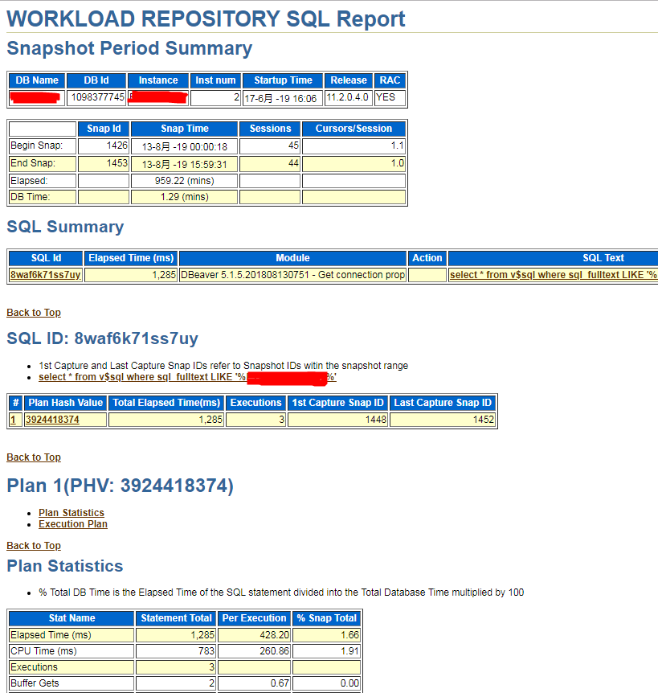

在官网[http://www.oracle.com/technetwork/database/enterprise-edition/downloads/112010-win64soft-094461.html?ssSourceSiteId=otncn](http://www.oracle.com/technetwork/database/enterprise-edition/downloads/112010-win64soft-094461.html?ssSourceSiteId=otncn) 下载win64_11gR2_client.zip（注意选择正确的版本）

下载完成后，点击setup.exe 进行安装

如果报错显示“不满足最低配置”，依次打开stage\cvu\cvu_prereq.xml，修改其中的MAX_LENGTH 值为合适的值，再重新安装即可


>如果参考[Navicat Premium 连接Oracle 数据库](https://www.cnblogs.com/1102whw/p/8607294.html)，从[https://www.oracle.com/database/technologies/instant-client/winx64-64-downloads.html](https://www.oracle.com/database/technologies/instant-client/winx64-64-downloads.html)下载instantclient-basic-windows.x64-11.2.0.4.0.zip、instantclient-sqlplus-windows.x64-11.2.0.4.0.zip，为Navicat 配置完成后，会缺少awrrpt.sql 等关键文件，所以还是下载win64_11gR2_client.zip！

打开Navicat，【工具】-->【选项】-->【OCI】，配置OCI library、SQL Plus

* D:\APP\xum\product\11.2.0\client_1\BIN\oci.dll
* D:\APP\xum\product\11.2.0\client_1\BIN\sqlplus.exe

配置完成后，重启Navicat，然后在Navicat 上对应的Oracle 连接上，【右键】-->【命令行界面】，即可打开SQL Plus 命令行界面

## 如何生成AWR报告

```sql
-- 查看用户
show parameter db_name


-- 开始执行压测后执行，生成AWR 快照
exec DBMS_WORKLOAD_REPOSITORY.CREATE_SNAPSHOT();

-- 在这个时间段内进行压测

-- 结束压测后再次执行，再次生成AWR 快照
exec DBMS_WORKLOAD_REPOSITORY.CREATE_SNAPSHOT();


-- 生成AWR报告
@?/rdbms/admin/awrrpt
```

查看用户


在执行压测前后生成快照


`@?/rdbms/admin/awrrpt`，生成AWR 报告，选择格式、天数、开始节点和结束节点（这里选择了比较近的两个节点，建议实际选择跨度大一些的两个节点，方便观察更多细节）


输入想要生成的报告名称，以html 格式结尾


等待一会，生成的AWR 报告的路径在登录数据库的路径。D:\APP\xum\product\11.2.0\client_1\BIN

使用Chrome 打开之后看到的内容大概是这样的（AWR 报告实在太长，这里截图只展示很小的一部分）


>[AWR报告分析解读](https://www.cnblogs.com/hhandbibi/p/6721654.html)

>[Oracle AWR性能优化一例](https://blog.51cto.com/hunter8888/2350476?source=dra)

>AWR 反应的是点对点的数据。比如说，生成一个今天9:00到12:00的AWR 报告，那么，看到的就是12:00和9:00两个时间点的变化。但9:00-10:00、10:00-11:00、11:-12:00 分别是什么样的，看不到

## 通过AWR报告分析某SQL

```sql
-- 查询AWR 配置
select * from dba_hist_wr_control;


-- 调整AWR 收集SQL 的设置，因为默认情况下AWR 并非捕获所有SQL，此调整是为了让AWR 收集实验过程中的SQL
-- 将topnsql 参数设置为最大值，以确保任意sql 只要执行一次即可写入到快照
exec dbms_workload_repository.modify_snapshot_settingS(topnsql=>'MAXIMUM');


-- 开始执行压测后执行，生成AWR 快照
exec DBMS_WORKLOAD_REPOSITORY.CREATE_SNAPSHOT();

-- 在这个时间段内进行压测

-- 结束压测后再次执行，再次生成AWR 快照
exec DBMS_WORKLOAD_REPOSITORY.CREATE_SNAPSHOT();


-- 根据关键字查找某个SQL，注意检查LAST_ACTIVE_TIME 这个列的值在我们抓快照的时间段内
select * from v$sql where sql_fulltext like '%table_name%'; 
-- 或者
select *from v$sqlarea where sql_fulltext like '%table_name%'


-- 生成某个SQL_ID 的AWR 报告
@?/rdbms/admin/awrsqrpt
```

按照上面的说明，调整AWR 收集SQL 的设置


在执行压测前后生成快照

查询某个SQL 的信息，注意检查LAST_ACTIVE_TIME 这个列的值在我们抓快照的时间段内


通过以上SQL 获取某条SQL 的SQL_ID，比如8waf6k71ss7uy

`@?/rdbms/admin/awrsqrpt`，与生成awrrpt 类似，前面都需要选择格式、天数、开始节点和结束节点，不同的是需要指定要生成报告的SQL_ID

* `@?/rdbms/admin/awrrpt.sql`   -- 标准报告，特定时间段内总体性能报告
* `@?/rdbms/admin/awrddrpt.sql` -- 对比报告，两个时间段内性能对比
* `@?/rdbms/admin/ashrpt.sql`   -- ASH报告，特定时间段内历史会话性能报告
* `@?/rdbms/admin/awrsqrpt.sql` -- SQL报告，特定时间段内SQL性能报告

生成html 文件，使用Chrome 打开后大概是这样的



而且还可以在这里看到这条SQL 的执行计划的信息

>[MySQL/Oracle执行计划](http://www.xumenger.com/oracle-mysql-explain-20190218/)

>[查看执行计划的几种方式总结](https://blog.csdn.net/u013820054/article/details/38942233)

但每次都去查看AWR 报告是一件很繁琐的事情，如果可以单独的查看哪些有问题的SQL，就不用每次都去生成一个AWR 报告了。dba_hist_sqlstat 这个视图记录了每次snap_id 里面的SQL 信息

```sql
select v.sql_text,
       m.* 
from (select distinct snap_id, 
             sql_id,
             executions_delta,
             trunc(max(elapsed_time_delta) over(partition by snap_id, sql_id) / 1000000, 0) max_elapsed,
             trunc((max(elapsed_time_delta) over(partition by snap_id, sql_id)) / (sum(elapsed_time_delta) over(partition by snap_id)), 2) * 100 per_total
       from dba_hist_sqlstat t 
	   where t.snap_id in (select max(snap_id) from dba_hist_sqlstat)
	  )m, v$sql v
where m.sql_id = v.sql_id and m.max_elapsed >= 60
```

这个脚本是查找m.max_elapsed >= 60（这边的单位是秒），也是1分钟的时间，可以根据系统的实际情况进行定义

执行上面的SQL（改了一下条件），可以看到最后一个SQL 的耗时最长，占总体消耗的47%，显然这个是最有必要优化的SQL！


## 清除缓冲池中的执行计划

按照上面的方法可以查看SQL 的AWR 报告，但是想要查看某个绑定变量的SQL，虽然是在快照期间执行的，但是发现v$sql 中的LAST_ACTIVE_TIME 没有更新！Why？

```sql
select * 
from v$sql 
where 
    sql_id = '11nsx249u9t10'; 
```


Oracle清空Shared Pool

```sql
-- 根据SQL_ID 查询对应的执行计划信息
SELECT SQL_TEXT, SQL_ID, UTL_RAW.CAST_TO_RAW(ADDRESS), HASH_VALUE, EXECUTIONS, LOADS, PARSE_CALLS, INVALIDATIONS  
FROM v$sqlarea  V
WHERE SQL_ID = '2p8j2gvy6hbq3';


-- 07000101C773B270是ADDRESS
-- 329573408是HASH_VALUE
call sys.dbms_shared_pool.purge('07000101C773B270,329573408','c')
```

这样可以具体清楚Shared Pool 中的某个SQL 的执行计划，再去v$sqlarea、v$sql 中就查询不到对应的记录了

>但是为什么再次执行SQL 之后，再去v$sqlarea 中还是查询不到记录呢？

>MySQL 数据库呢？

## 参考资料

* [ORACLE调优深入理解AWR报告](https://www.cnblogs.com/tenchina/p/8609448.html)
* [oracle中如何生成awr报告](https://www.cnblogs.com/hhandbibi/p/6721330.html)
* [Navicat Premium 连接Oracle 数据库](https://www.cnblogs.com/1102whw/p/8607294.html)
* [oracle11G AWR使用及分析](https://www.cnblogs.com/david-zhang-index/archive/2012/08/21/2649252.html)
* [AWR报告分析解读](https://www.cnblogs.com/hhandbibi/p/6721654.html)
* [使用AWR生成一条sql的执行统计报告](https://blog.51cto.com/hbxztc/1897981)
* [Oracle AWR 阙值影响历史执行计划](https://blog.csdn.net/leshami/article/details/8732708)
* [如何查找sql运行的次数、涉及的记录行数、绑定变量的值等](https://blog.csdn.net/qq_40687433/article/details/79246638)
* [Oracle --获取绑定变量的值](https://www.cnblogs.com/princessd8251/p/4211163.html)
* [根据awr报告查看最慢的sql语句](http://blog.itpub.net/12679300/viewspace-2125679/)
* [【云和恩墨大讲堂】SQL玩转AWR裸数据 ](https://www.sohu.com/a/121927948_505827)
* [深入理解JAVA虚拟机之JVM调优长篇](https://cloud.tencent.com/developer/article/1353746)
* [MySQL/Oracle数据库优化总结（非常全面）](https://blog.csdn.net/baidu_37107022/article/details/77460464)
* [多库多事务降低数据不一致概率](https://www.w3cschool.cn/architectroad/architectroad-multi-database-and-multi-transaction.html)
* [巧用CAS解决数据一致性问题](https://www.w3cschool.cn/architectroad/architectroad-solve-data-consistency-with-cas.html)
* [CAS下ABA问题及优化方案](https://www.w3cschool.cn/architectroad/architectroad-cas-optimization.html)
* [库存扣多了，到底怎么整](https://www.w3cschool.cn/architectroad/architectroad-inventory.html)
* [库存扣减还有这么多方案？](https://www.w3cschool.cn/architectroad/architectroad-inventory-continued.html)
* [浅谈CAS在分布式ID生成方案上的应用](https://www.w3cschool.cn/architectroad/architectroad-cas-in-distributed-id.html)
* [OGG同步Oracle到Kafka(Kafka Connect Handler)](https://www.cnblogs.com/zhugablog/p/8515506.html)
* [OGG 从Oracle备库同步数据至kafka](https://www.cnblogs.com/halberd-lee/p/11018819.html)
* [Oracle 11g如何清除share pool中某条SQL的执行计划](https://www.linuxidc.com/Linux/2015-02/113382.htm)
* [使用dbms_shared_pool.purge清除共享池中的SQL执行计划](https://blog.csdn.net/u013249984/article/details/77963525)
* [查看执行计划的几种方式总结](https://blog.csdn.net/u013820054/article/details/38942233)
* [Oracle AWR性能优化一例](https://blog.51cto.com/hunter8888/2350476?source=dra)
* [Oracle内存结构：SGA PGA UGA](https://www.cnblogs.com/xqzt/p/4999513.html)
