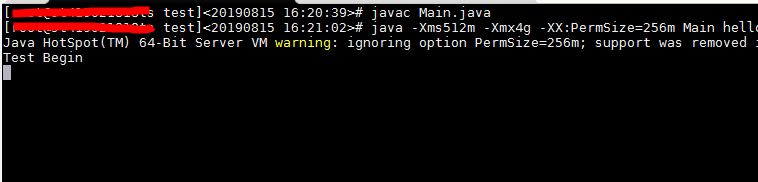
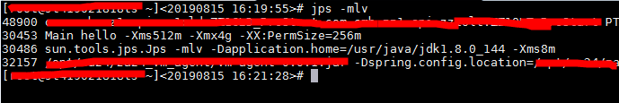
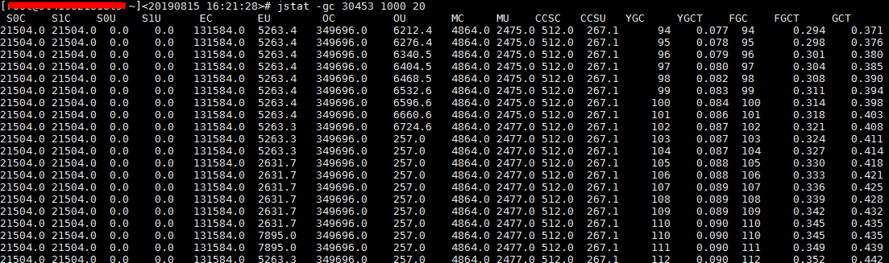
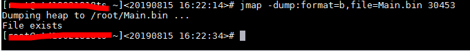
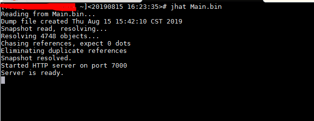
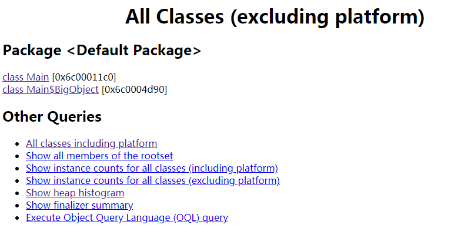
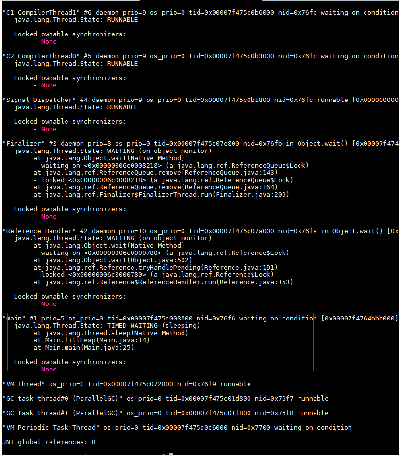

JDK 自带了很多好用的监控工具，下面分别使用这些工具具体来对一个JVM 程序进行一个分析

编写一个简单的测试程序如下

```java
import java.util.ArrayList;
import java.util.List;


public class Main 
{
    static class BigObject {
        public byte[] mem = new byte[64 * 1024];
    }

    public static void fillHeap(int num) throws Exception {
        List<BigObject> list = new ArrayList<BigObject>();
        for (int i = 0; i < num; i++) {
            Thread.sleep(10);
            list.add(new BigObject());
        }

        System.gc();
    }

    public static void main(String[] args) throws Exception {
        System.out.println("Test Begin");

        for (int i = 0; i < 1000; i++) {
            fillHeap(i);
        }

        System.out.println("Test End");
    }
}
```

编译代码，并启动进程

>javac Main.java

>java -Xms512m -Xmx4g -XX:PermSize=256m Main hello



>jps -mlv

-m 输出虚拟机进程启动时传递给主类main() 函数的参数；-l 输出主类全名，如果进程执行的是jar 包，输出jar 路径；-v 输出虚拟机进程启动时显式指定的JVM 参数



jstat 用于监控虚拟机各种运行状态信息，可以显示本地或远程虚拟机进程中的类装载、内存、垃圾回收、JIT 编译等运行数据

>jstat -gc pid interval times

监控指定pid 的GC 信息，每个interval 毫秒输出一次，共输出times 次



列名  | 含义
------|-------------------------
S0C   | 第一个幸存区的大小
S1C   | 第二个幸存区的大小
S0U   | 第一个幸存区的使用大小
S1U   | 第二个幸存区的使用大小
EC    | 伊甸园区的大小
EU    | 伊甸园区的使用大小
OC    | 老年代大小
OU    | 老年代使用大小
MC    | 方法区大小
MU    | 方法区使用大小
CCSC  | 压缩类空间大小
CCSU  | 压缩类空间使用大小
YGC   | 年轻代垃圾回收次数
YGCT  | 年轻代垃圾回收消耗时间
FGC   | 老年代垃圾回收次数
FGCT  | 老年代垃圾回收消耗时间
GCT   | 垃圾回收消耗总时间

jstat 还支持更多的参数

参数              | 说明 
------------------|--------------------------------------------------------------------------------
-class            | 检视类装载、卸载数量、总空间以及类装载所耗费的时间
-gc               | 检视Java堆情况，包括Eden区、两个survivor区、老年代、永久代的容量、已用空间、GC时间合计等
-gccapacity       | 与-gc基本相同，但输出主要关注Java堆各个区域使用的最大、最小空间
-gcutil           | 与-gc基本相同，但输出主要关注已使用空间占总空间的百分比
-gccause          | 与-gcutil功能一样，但会额外输出导致上一次GC产生的原因
-gcnew            | 检视新生代GC状况
-gcnewcapacity    | 与-gcnew基本相同，但输出主要关注使用到的最大、最小空间
-gcold            | 检视老年代GC状况
-gcoldcapacity    | 与-gcold基本相同，但输出主要关注使用到的最大、最小空间
-gcpermcapacity   | 输出永久代使用到的最大、最小空间
-compiler         | 输出JIT编译器编译过的方法、耗时等信息
-printcompilation | 输出已经被JIT编译的方法

生成堆转储快照

>jmap -dump:format=b,file=Main.bin 30453



启动内置的HTTP 服务端（默认7000 端口）

>jhat Main.bin



然后可以直接通过浏览器查看dump 文件分析情况



查看当前时刻的线程快照，线程快照是当前虚拟机内每个线程正在执行的方法堆栈的集合，生成线程快照的主要目的是定位线程长时间停顿的原因，如线程死锁、死循环、网络通讯阻塞等

>jstack -l 30453



>除了上面介绍的这些命令行工具，还有一些可视化工具，包括JConsole、VisualVM

>这里只是介绍JVM 的一些监控工具，另外还有像jdb 等工具的使用就不在这里介绍了

## 参考资料

* 《深入理解Java虚拟机》
* [JVM内存分配策略](http://www.xumenger.com/java-gc-memory-201903115/)
* [Java字节码速查](http://www.xumenger.com/java-jvm-opcode-20190706/)
* [jstat命令查看jvm的GC情况 （以Linux为例）](https://www.cnblogs.com/yjd_hycf_space/p/7755633.html)
