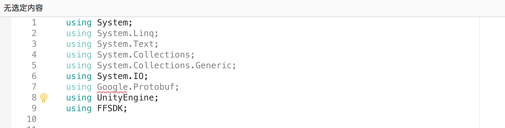
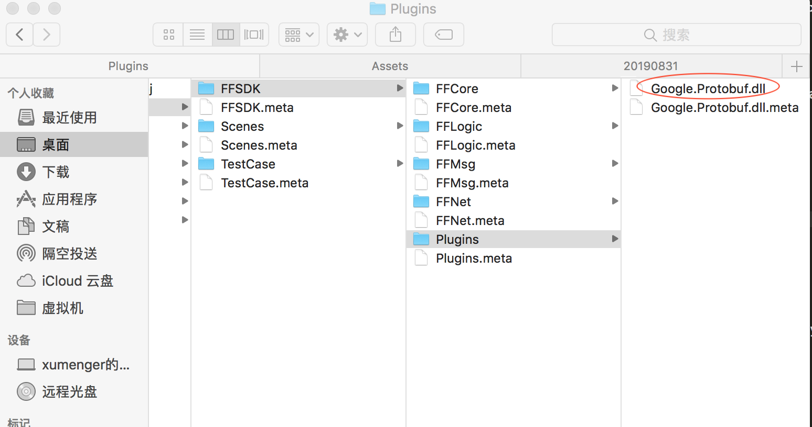
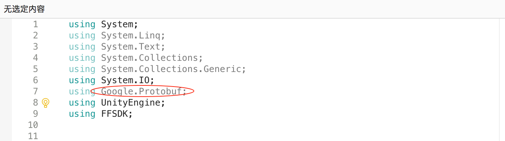

>之前相关的文章有[《序列化协议Protobuf》](http://www.xumenger.com/protobuf-20190525/)

依然在Linux 上可以直接编译proto 文件，可以直接得到C# 文件

```bash
protoc -I=./ --csharp_out=./ ./Example.proto
```

但将生成的.cs 文件导入到Visual Studio 中之后，引用Google.Protobuf 的地方报错



怎么办，下载[Google.Protobuf.dll](../media/20190831/Google.Protobuf.dll.zip)，将其放到Unity3D 项目目录下即可，类似下图



然后再**重启Visual Studio**，现在不再报错了


