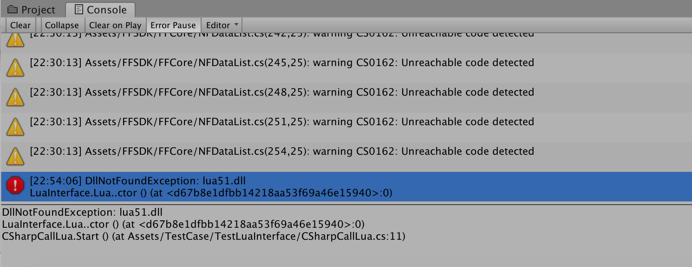
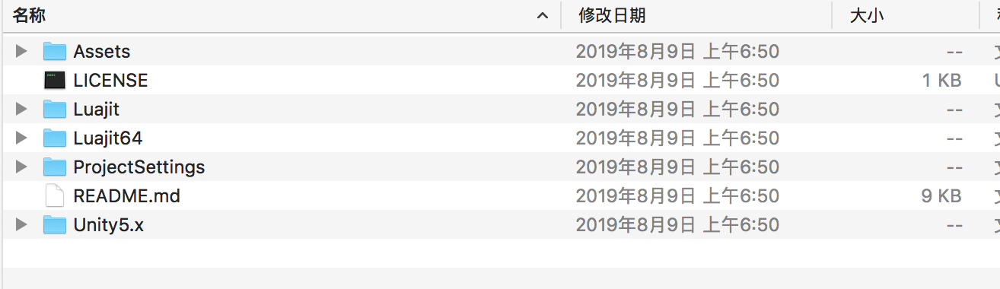
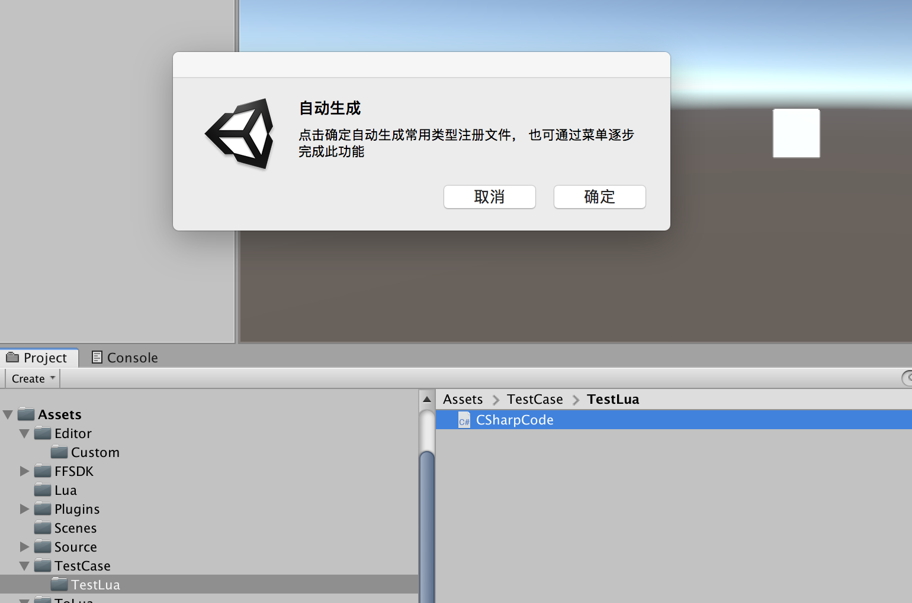
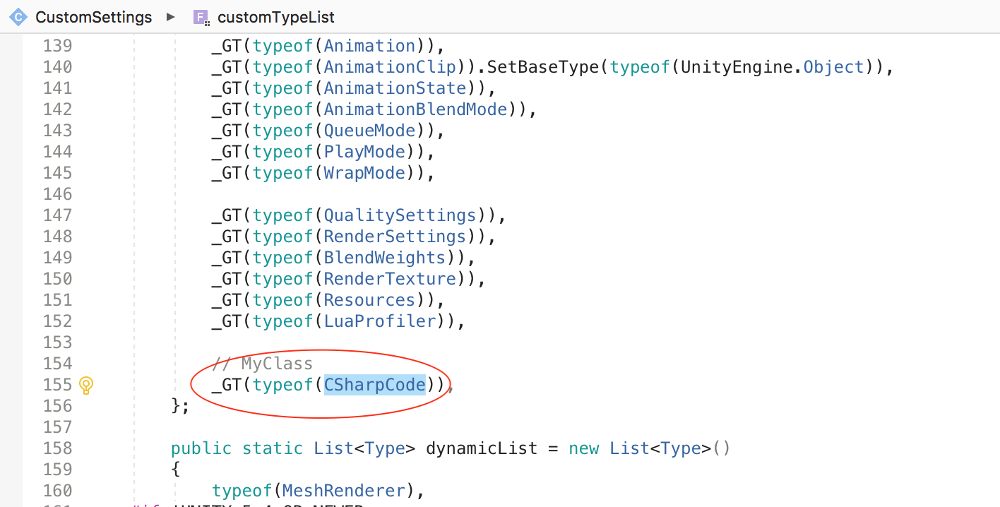
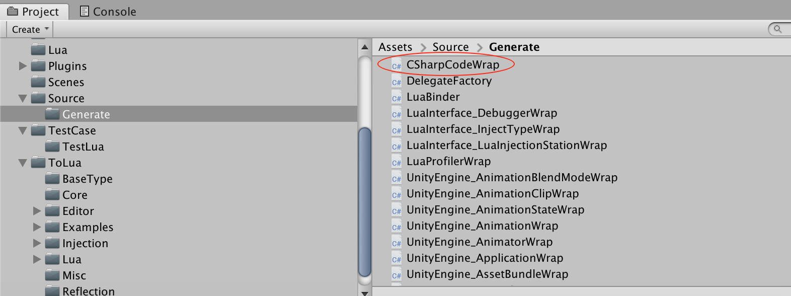
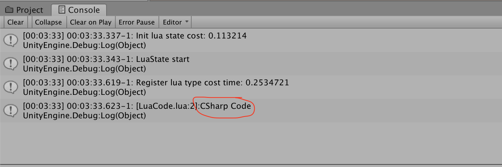

关于Lua、C# 的语法，这里不做介绍，之前有很多文章都有涉及，可以翻看一下（本文参考资料部分会列出相关文章），OK，接下来专注于C# Lua 热更新技术

## LuaInterface

[LuaInterface](http://luaforge.net/projects/luainterface/) 包括两个核心库，一个是LuaInterface.dll，一个是Luanet.dll，可以通过LuaInterface.dll 完成Lua 与C#（CLR）之间的互相调用

去[http://files.luaforge.net/releases/luainterface/luainterface](http://files.luaforge.net/releases/luainterface/luainterface) 下载相应版本的LuaInterface，比如我下载[1.5.3版本](http://files.luaforge.net/releases/luainterface/luainterface/1.5.3)

参考[Visual Studio下使用Protobuf](http://www.xumenger.com/csharp-protobuf-20190831/)，将解压后的lua51.dll、LuaInterface.dll、luanet.dll 放到Unity 项目的Plugins 目录下即可

测试一下，在C# 中执行Lua 代码，编写代码如下

```c#
using System.Collections;
using System.Collections.Generic;
using UnityEngine;
using LuaInterface;

public class CSharpCallLua : MonoBehaviour
{
    private void Start()
    {
        // 创建Lua解释器
        Lua lua = new Lua();

        // 创建Lua整形变量
        lua["num"] = 34;

        // 创建Lua字符串变量
        lua["str"] = "string";

        // 创建表 tab = []
        lua.NewTable("tab");

        Debug.Log((string)lua["str"]);
    }
}
```

结果在运行的时候出现报错



>查阅一些资料，发现LuaInterface.dll 是C# 的DLL，但是Luanet.dll、lua51.dll 是C 的DLL，依赖于Windows，所以无法在MacOS 上运行

## ToLua

直接在[https://github.com/topameng/tolua/releases](https://github.com/topameng/tolua/releases)下载，解压后是这样的目录结构



直接将Assets、Unity5.x 目录拖到Unity 项目目录下，与原有的目录合并、覆盖即可

等待Unity 加载完成，点击确认，目录结构如下



>Editor/CustomSettings 主要是定义哪些类作为静态类、哪些类需要导出、哪些委托需要导出，注册到Lua 中的类型也都需要在这里导入，ToLua 已经提供了Unity 大部分的基础类型，如果需要导入我们自己的类，也可以在这里添加

开始编写测试代码，看C# 与Lua 的相互调用，先编写一个C# 代码如下

```C#
using System.Collections;
using System.Collections.Generic;
using UnityEngine;

public class CSharpCode : MonoBehaviour
{
    public static string GetString()
    {
        // 直接返回一个字符串
        return "CSharp Code";
    }
}
```

编写这个脚本是为了给Lua 调用的，接下来再在CustomSettings 中添加我们的这个类，以供Lua 调用



然后在Unity 的【菜单栏】-->【Lua】-->【Clear wrap file】，可以看到重新生成新的wrap 文件



然后在Assets/Lua 下新增一个lua 文件，可以在这里调用刚才写的C# 代码，LuaCode.lua

```lua
local s = CSharpCode.GetString()
print(s)
```

再编写一个C# 脚本，在这里调用LuaCode.lua 中的源码

```c#
using System.Collections;
using System.Collections.Generic;
using UnityEngine;
using LuaInterface;

public class TestCallLua : MonoBehaviour
{
    private LuaState lua = null;

    void Start()
    {
        // 定义Lua加载器，加载Lua文件
        new LuaResLoader();

        // 初始化Lua虚拟机
        lua = new LuaState();

        // 开启Lua虚拟机
        lua.Start();

        // 向虚拟机注册wrap类
        LuaBinder.Bind(lua);

        // 打开Lua文件
        lua.DoFile("LuaCode.lua");
    }
}
```

运行效果如下



## 使用ToLua实现游戏逻辑

之前写的一些文章中，都是使用C# 来编写游戏逻辑的，现在有了ToLua，以及后续热更新的考虑，我们将游戏逻辑写到Lua 中

编写Controller.lua 如下

```lua
local this = Controller
local GameObject = UnityEngine.GameObject
local Input = UnityEngine.Input
local RigidBody = UnityEngine.RigidBody
local Color = UnityEngine.Color

local Sphere    -- Unity中的一个球体
local rigid     -- 刚体
local force     -- 力


-- 下面在Lua 中使用Start、Update函数名，与C# 中使用Start、Update没有任何关系
-- 我们可以在Lua 中取任何名字
```

编写C# 代码如下，可以在C# 中直接调用Lua 代码，然后将这个C# 文件拖到某个游戏物体上即可实现对其的逻辑控制

```c#

```

## 参考资料

* [Visual Studio下使用Protobuf](http://www.xumenger.com/csharp-protobuf-20190831/)
* [C# IL指令速查](http://www.xumenger.com/csharp-il-20190630/)
* [lua-intf使用手册](http://www.xumenger.com/luaintf-20190607/)
* [Lua与C/C++混合编程](http://www.xumenger.com/lua-c-cpp-20180202/)
* [Redis下使用Lua脚本](http://www.xumenger.com/lua-redis-20180127/)
* [Lua简明教程](http://www.xumenger.com/lua-20180126/)
* [Lua与.net的CLR相互调用](https://www.cnblogs.com/fuyunzzy/p/6424381.html)
* [Unity热更新专题(三)Unity热更新之LuaInterface(上)](https://blog.csdn.net/e295166319/article/details/60769275)
* [MAC 系统无法使用LuaInterface.dll](http://www.sikiedu.com/classroom/5/thread/535)
