本文展示Blender 的一些基础用法，熟悉Blender 快捷键！Blender 可以进行建模、贴图、绑定骨骼、动画制作等高级功能，很强大！

本文使用的Blender ，是直接从[官网](https://www.blender.org/)下载的**Blender 2.80 beta**

>本文涉及到的所有快捷键，都用【扩起来】，表示强调

## Blender操作时显示快捷键

首先去[https://github.com/nutti/Screencast-Keys](https://github.com/nutti/Screencast-Keys)下载这个python 文件，保存到本地，解压后，找到src 下的screencastkeys 文件夹

然后去/Applications/ 目录下找到blender.app，右键-->显示包内容

进入Contents/Resources/2.80/scripts/addons_contrib，将screencastkeys 文件夹放到这里

Blender-->编辑-->设置-->插件-->测试版，搜索Screencast，勾选并保存设置

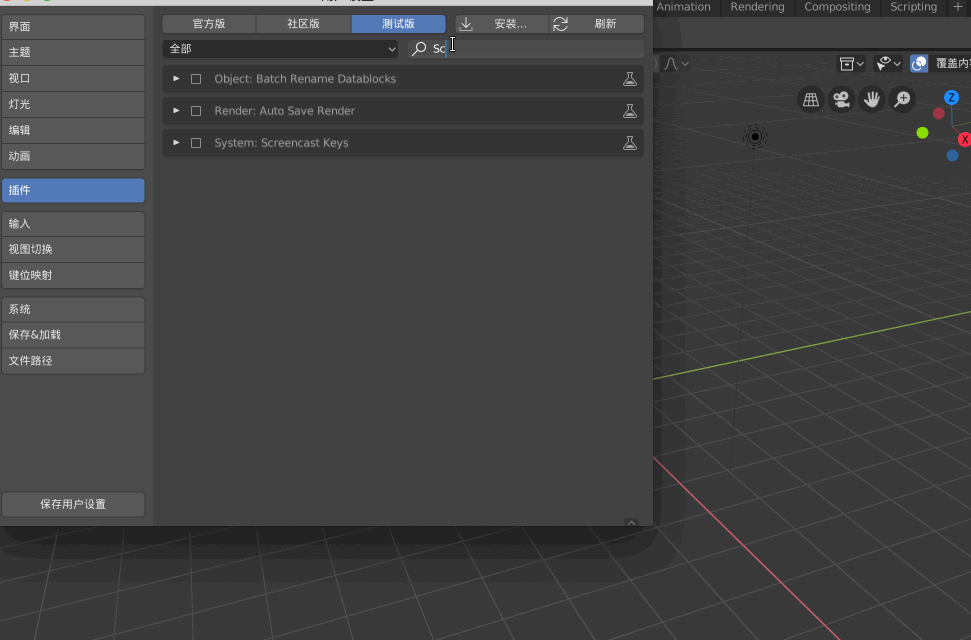

进入Blender 3D 视图后，【n】呼唤出面板，可以看到Screencast，然后勾选即可

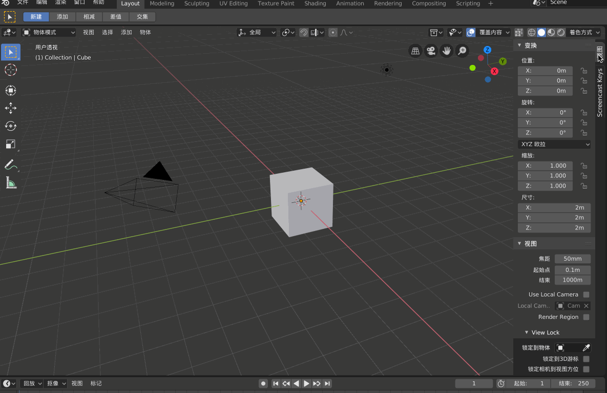

## Blender常用操作

这是四个最常用的快捷键

* 【g】 移动（Position）
* 【s】 缩放（Scale）
* 【r】 旋转（Rotation）
* 【e】 延伸（Extension）

视图切换，正常如果电脑带有小键盘，那么可以使用小键盘切换视图，如果没有小键盘，那么就需要使用模拟数字键盘

Blender-->编辑-->设置-->输入-->勾选 模拟数字键盘

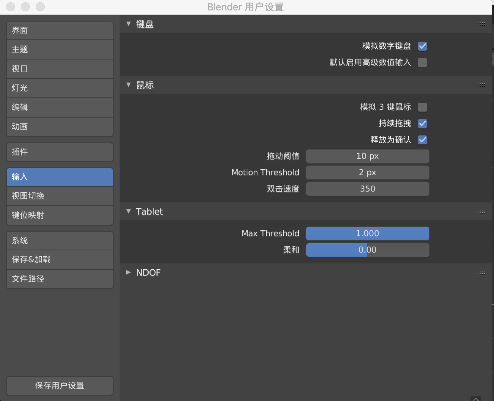

* 【1】 正视图
* 【3】 右视图
* 【7】 顶视图
* 【5】 正交模式（显示经纬线）

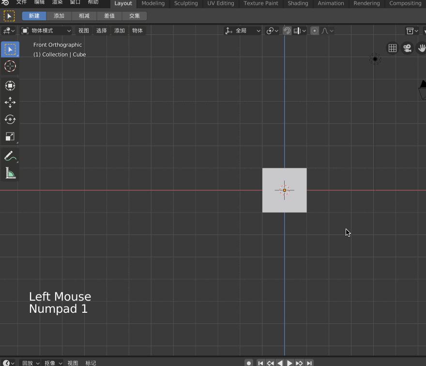

## 添加背景图片

在Blender 中，单位是1米，也就是说，每个方格的边长是1米，所以在建模的时候要保证与现实中的比例一致，不要失调！

接下来演示对着下面这个简单的原画（一个正视图、一个侧视图）进行建模

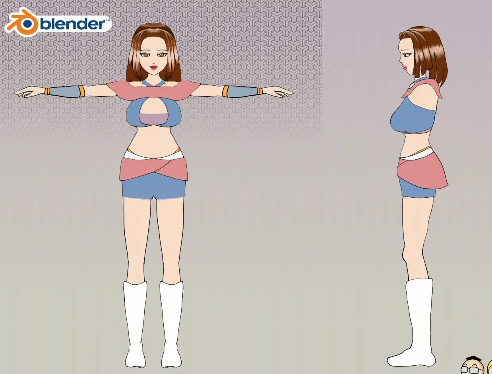

>在Blender 2.8 中，Background images 被移除了，但是我们在建模的时候需要导入图片对着图片一步步的建模、雕刻，现在怎么办？

可以这样来添加背景图，【1】切换到正视图，【添加】-->【图像】-->【Background】，这样可以为正视图添加一个背景图片，同样的【3】切换到测试图，也添加一个图片

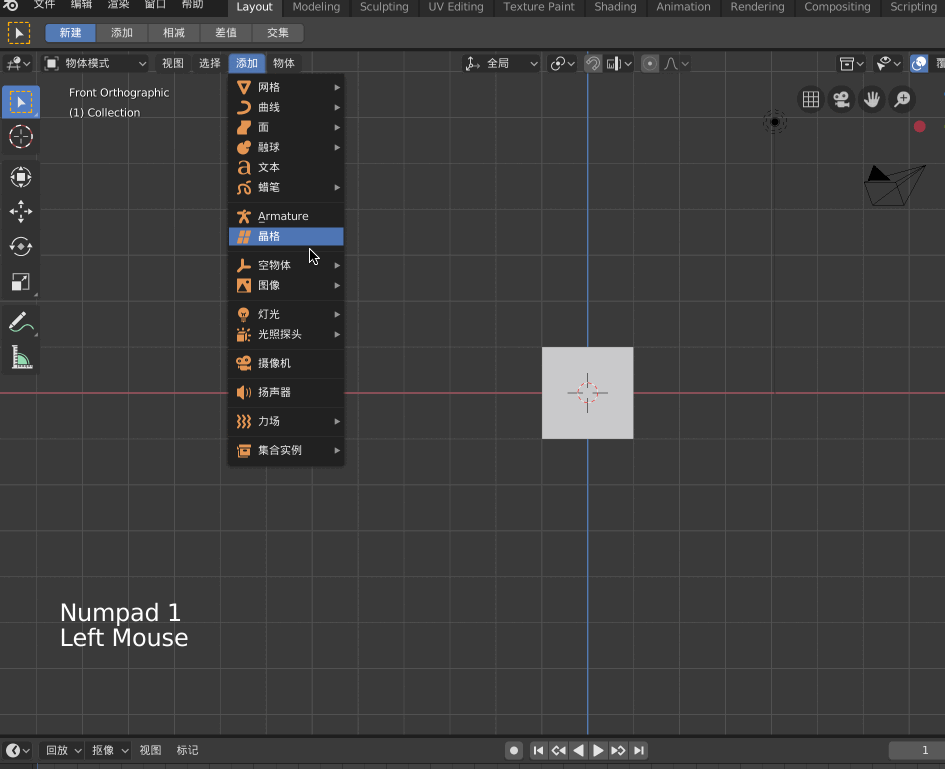

>这里是通过界面中的【添加】菜单来添加背景图的，也可以通过快捷键【Shift-A】呼唤出【添加】菜单

>注意，Blender 中的每个格子是1m，而我们上面导入的图片很明显占了将近4个格子，也就是人快要4米了！为了与现实世界保持一致，应该将二次元女性调整为1.7 米左右

这种方式添加的背景图片，会在Screen Collection 中显示为Empty，为了方便管理，一定要重命名，否则当当前视图中加入的物体越来越多后，会很乱！

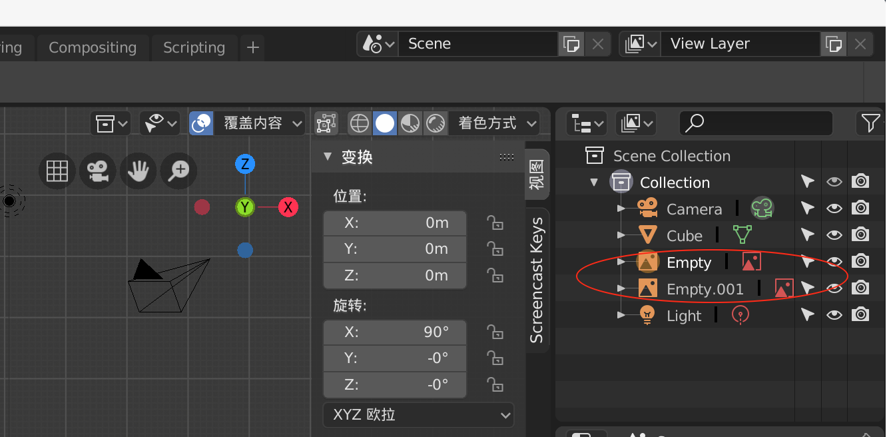

## 调整背景图片

在调整背景图片之前，要先说一下，刚才导入图片后，简单的调整了图片大小后，但是发现图片在整个Blender 视图下绝对大小还是太下，在MacOS 下，可以按contorl，然后双指往上下滑动触摸屏以实现整个视图的放大和缩小

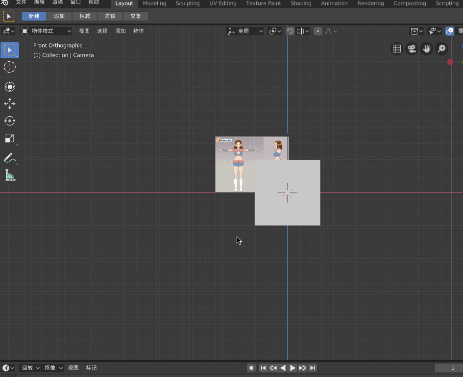

上面说了需要调整背景图片的大小，以符合Blender 的单位！

比如上面的图片中有需要建模人物的正视图，也有需要建模的人物的侧视图，都还需要继续进行调整

在正视图模式下，需要将图片中的人物的正视图部分做如下调整，两个脚的中心移动到**原点**的位置、脚需要踩到**红线**上

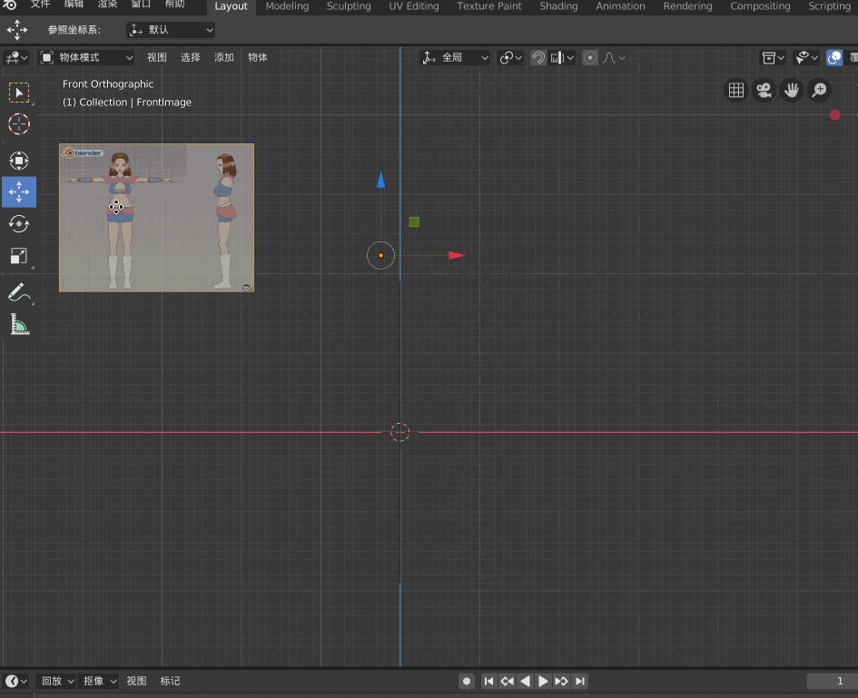

在侧视图模式下，也需要做对应调整，比如保证侧视图的人物与正视图的人物高度一致、脚也要踩到**绿线**上、脚的中心也要放到**原点**上

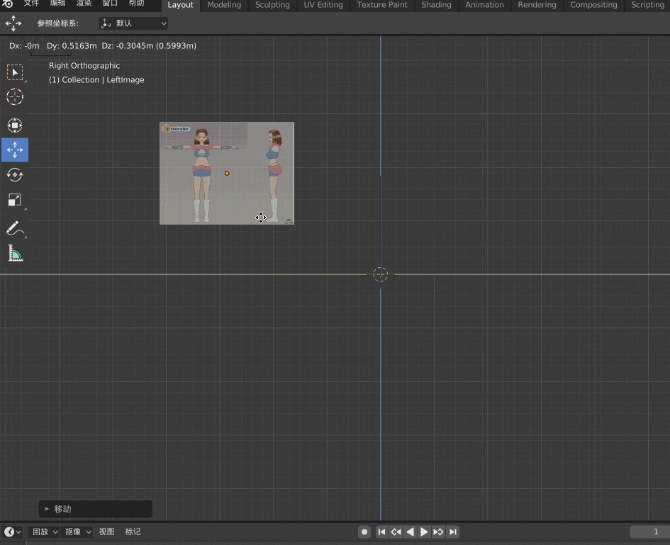

>导入背景图之后，就是对着背景图进行建模了，这些操作我放到下一篇文章中进行展示

## 其他常用操作

上面通过展示一个简单的建模流程来展示Blender 的常用操作，下面记录一些常用的操作，但是单独拿出来强调一下我觉得更好

比如你不小心将Cursor 从原点的位置移出去，可以通过【shift-c】恢复到原点

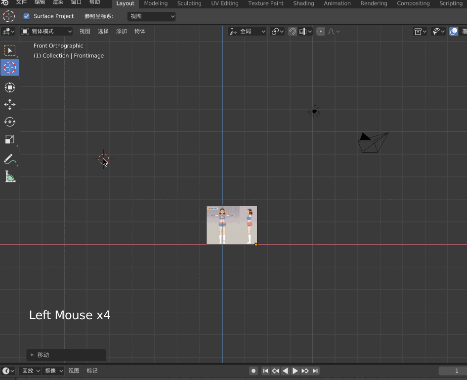

选中物体后，【x】快捷键可以呼出删除选项

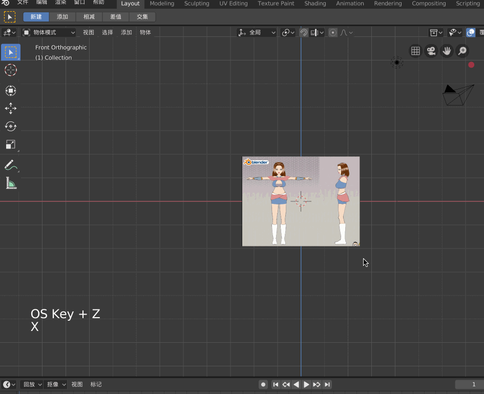

以上面这个图片为例，图片中人物的脚和图片下沿还是有点距离的，想要在调整图片位置的时候，将人物的脚瞄准原点、红线，那么最好是将图片的透明度设置一下，这样就可以透过图片看到后面的经纬线

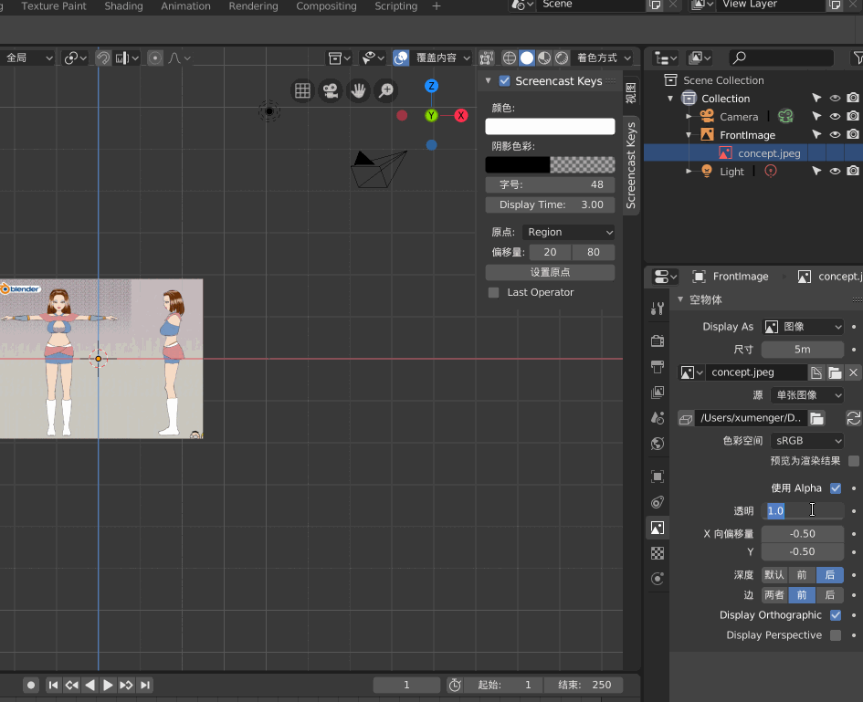

如果想要实现整个Blender 工作视图的移动，可以选择当前视图中的某个物体，移动它，然后【shift-c】通过定位Cursor 到原点的方式即可实现整个Blender 工作视图的移动

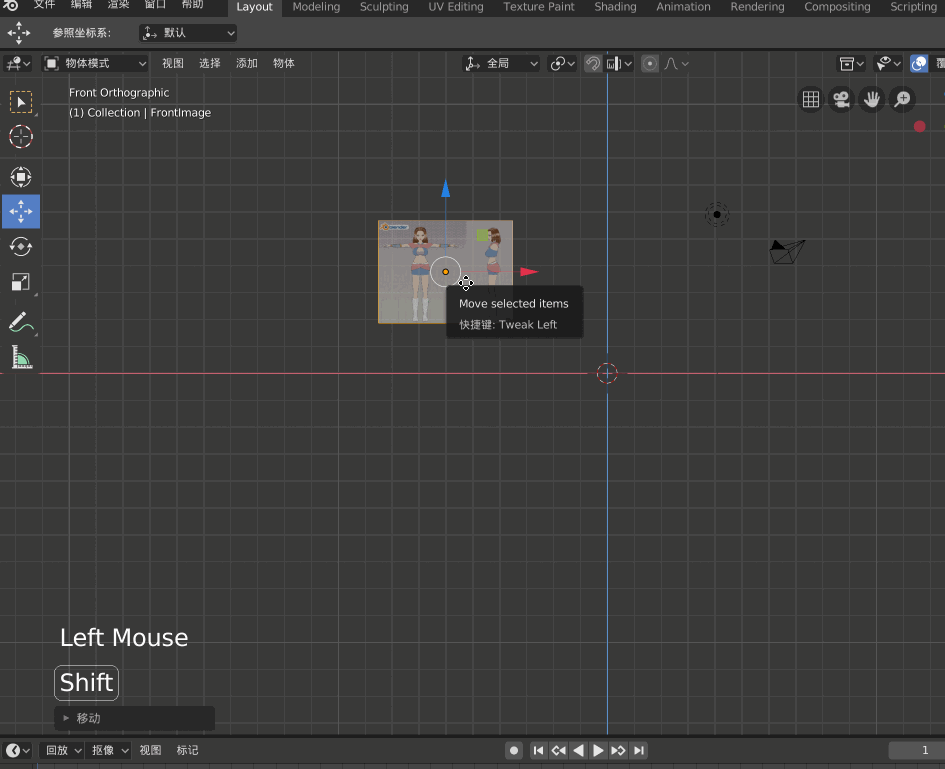

>这个方法有点太蠢，最好的方法是按shift 键，然后双指在触摸屏上移动来实现整个Blender 视图的移动！！！

>【control + 双指触屏上下拖动】来扩大或缩小视图；【shift + 双指触屏移动】来实现Blender 视图的移动！

比如我们分别在正视图、侧视图中都导入了同一个图片，显然在建模的时候，要求正视图下图片和侧视图下的图片大小一致，我们可以手动调整好正视图的大小，然后侧视图直接按照正视图的大小进行对应设置即可

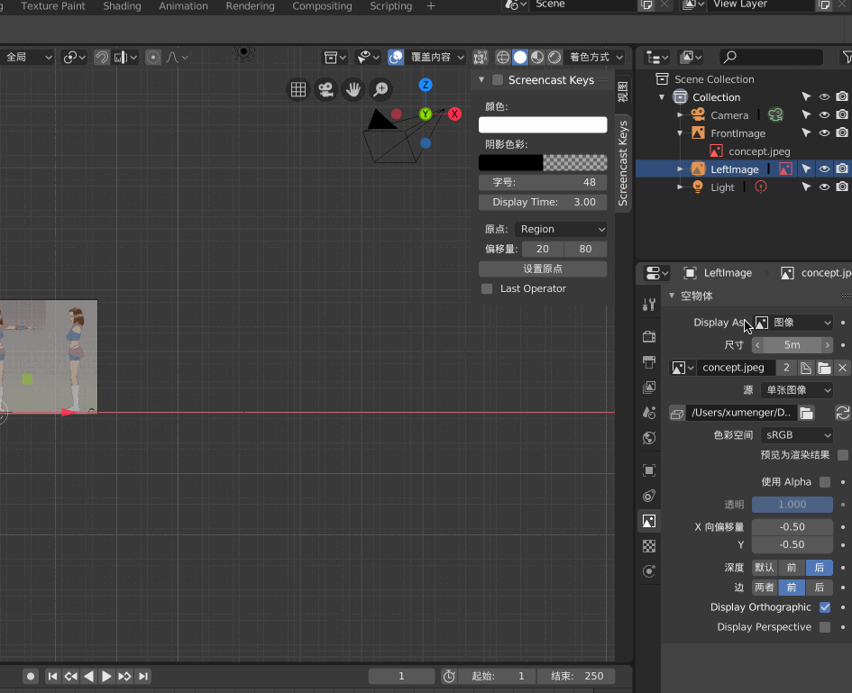

>在使用Blender 的时候，其操作模式、操作习惯，其实可以经常与Unity 进行比较，都是类似的工具！

## 参考资料

* [Blender 学习 (Mac 版)](https://www.jianshu.com/p/192dd5b1676b)
* [Blender Hello World](https://segmentfault.com/a/1190000020099954?utm_source=tag-newest)
* [[傅老師/Blender教學] 05 - 建置軀幹的兩種方式(Torso)](https://www.bilibili.com/video/av16796352)
* [美术丨快速入门！Blender基础教程（一）：基本操作 ](https://www.sohu.com/a/130979988_466876)
* [blender怎么开启模拟数字键盘? blender笔记本数字键盘的使用方法](https://www.jb51.net/softjc/605073.html)
* [Cannot find Background Images feature in Blender 2.8](https://blender.stackexchange.com/questions/110532/cannot-find-background-images-feature-in-blender-2-8)
* [https://www.mixamo.com/](https://www.mixamo.com/)
* [Blender 2.81 参考手册](https://docs.blender.org/manual/zh-hans/dev/index.html)