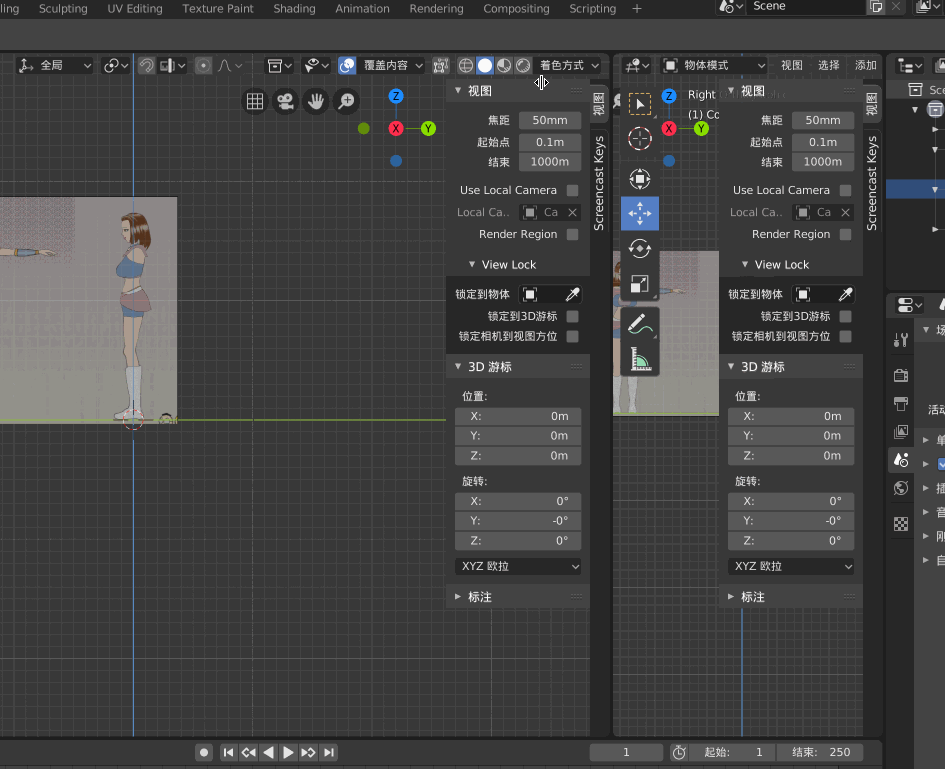
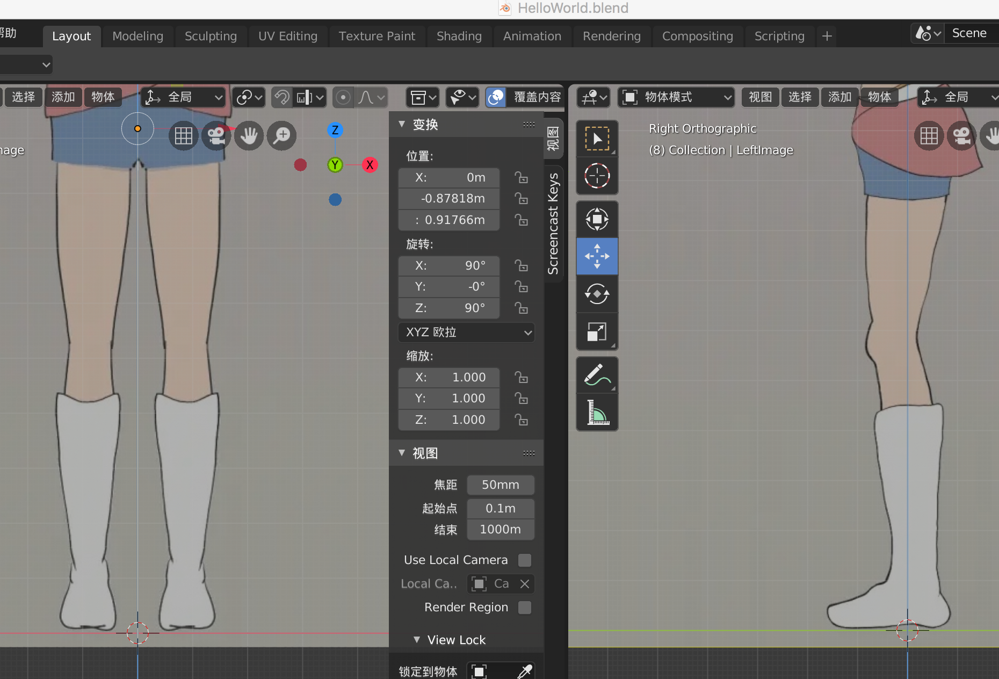
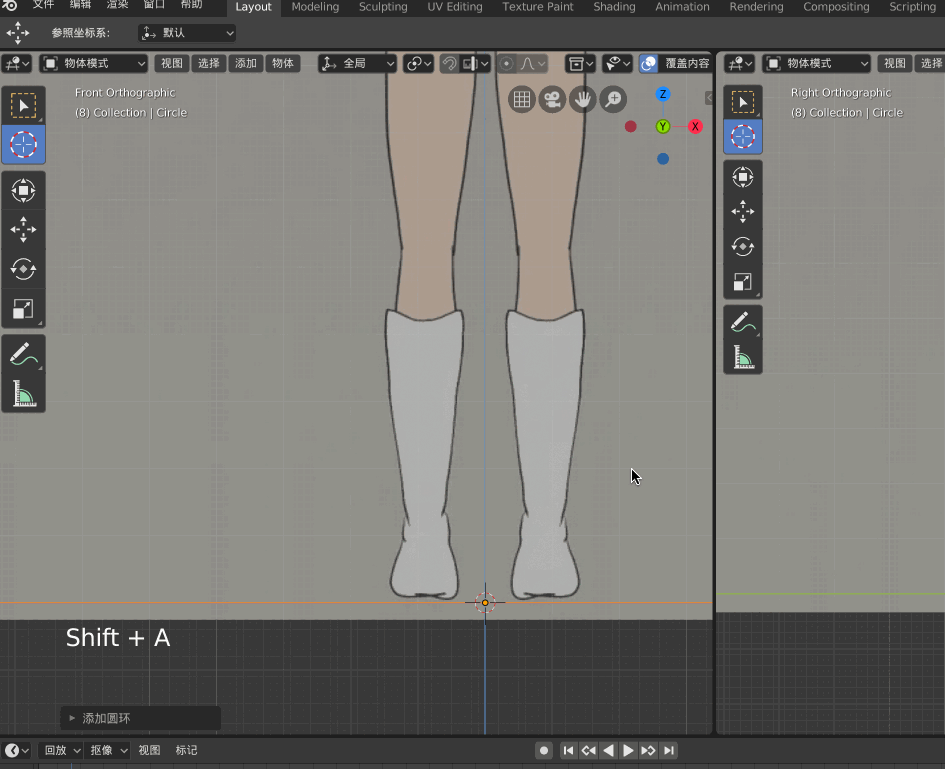
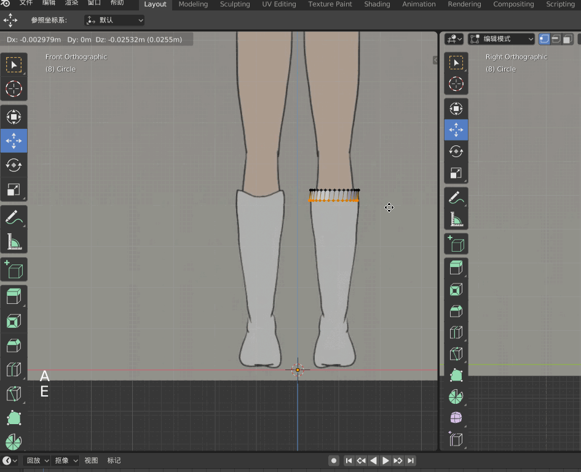
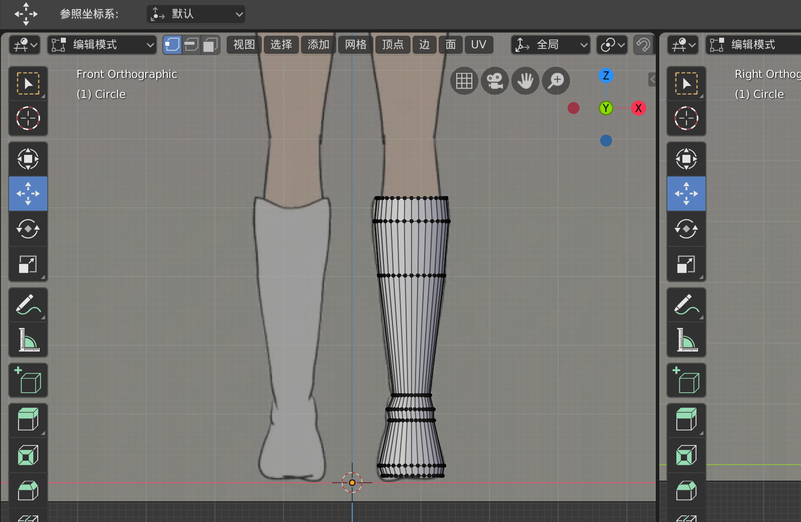
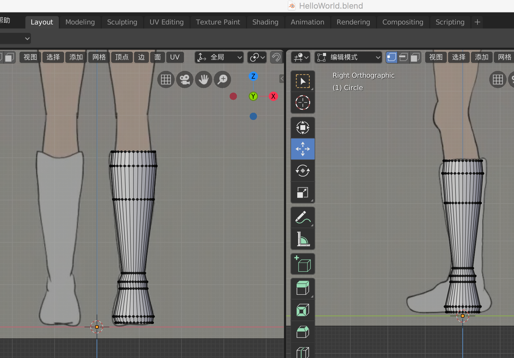
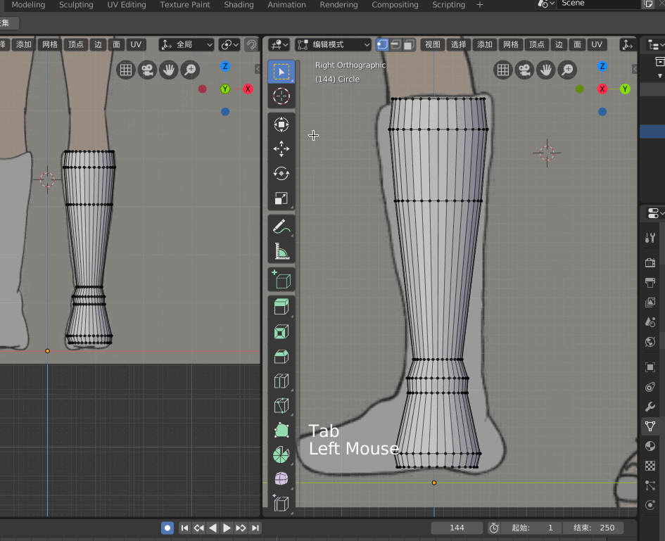
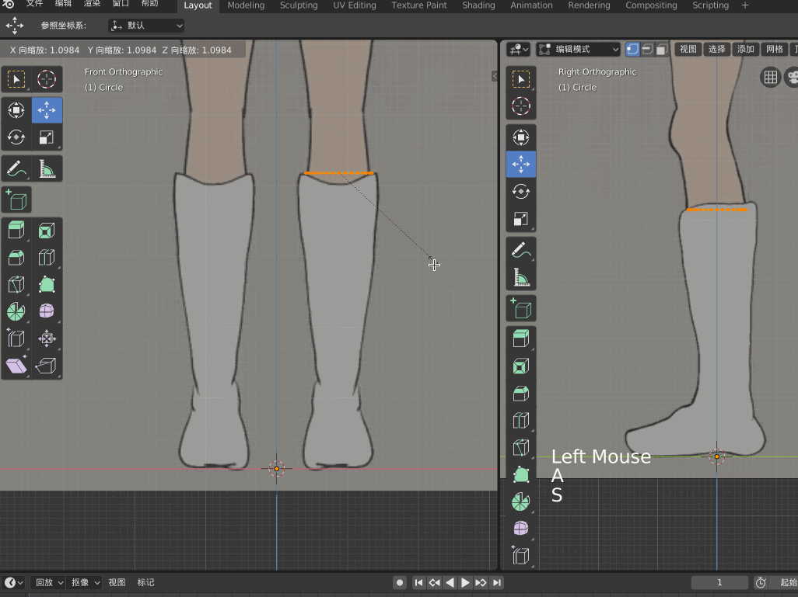
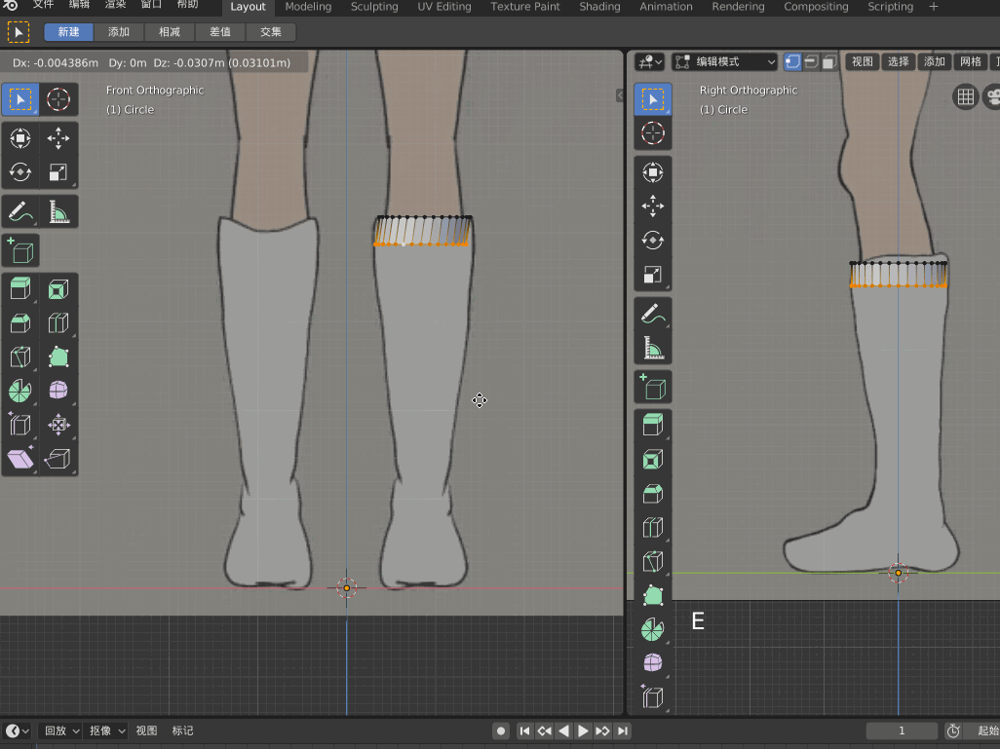

## 开始建模

OK，上面将背景图摆好了之后，接下来就是对着正视图、侧视图分别进行建模，其实就是对着正视图和侧视图进行描写

比如我们对着正视图和侧视图建立靴子的3D 模型！

为了方便在建模的时候同时看到正视图和侧视图，Blender 提供了很强大的功能，可以在视窗的右上角显示为“+”时，往左拖出，这样可以在左边的视窗选择正视图，在右边的视窗选择侧视图，这样建模的时候，可以同时看多个视图，很方便

>如果想关闭打开的多个视窗，可以到视窗的左上角，显示为“+”时往右拖，上图也有展示

调整视窗，使其中一个显示正视图，一个显示侧视图，接下来就可以进行建模了

接下来打算从一个圆开始延展出一个靴子！首先【shift-a】，在原点处创建一个Circle，【tab】进入顶点模式，按【s】键然后将圆缩小，然后把圆拖到正视图的靴子顶部

>【tab】进入顶点模式（object modle->edit modle），【tab】退出顶点模式（edit modle->object modle）

>本文最开始的时候就强调了，最常用的四个快捷键中，有【s】，即缩放，这里就用到了。如果只按【s】那么将进行所有角度的伸缩，如果按【s】再按【z】将只进行z 轴上的伸缩，【s】【y】也是只在y 轴伸缩

在顶点模式下，【a】选中圆圈上所有的点，按【e】，拉着鼠标往下拖，然后就可以往下延伸出来，这样就可以模拟出靴子的圆柱形

另外因为靴子有粗有细，所以可以在按【e】并按住鼠标往下延伸了之后，可以按【s】进行扩大或者缩小

重复这样的方式就可以拖出来一个靴子的形状（这是正视图观察视角）

## 侧视图修整

按照上面的操作，在正视图大致延展出来一个靴子的形状，接下来同步看一下侧视图是这样的，显然侧视图还需要修正

比如从上往下数的第二个圆圈在侧面视图明显比靴子小，所以需要拉大，首先【tab】切换到顶点模式，【选中箭头工具】，然后用箭头选中所有的顶点，按【s】去进行缩放

oh，no！竟然将整个模型缩放了，而不是将这些点组成的面缩放，那怎么办？

目前能想到的办法就是在正视图做一次操作对应在侧视图赶紧修改，正视图第一次按【s】调整好大小后，发现侧视图的与原图还是不一致，再按【s】，按【y】，然后仅在y 轴进行放大

往下每延伸一次，侧视图也对应做调整和修改，比如正视图长按【e】往下延伸之后，按【s】对正视图放大没有问题了，但是侧视图的还是比原图小，再按【s】，按一下【y】，对侧视图在y 轴进行缩放

>用以上同样的方法，拿到一个正视图和侧视图的图片后，放到Blender 中对着去描就行了，比如一个人物模型，其脖子、隔壁、腿、身躯基本都可以用这种方式做出来一个基本的模型！

上面对于Blender 的基础操作有了一些认知，但是在我实际建模的过程中还是遇到了各种问题，本文还是以初步对Blender 有所认知为目的，以下问题仅在此列一下，暂不给予解决和说明

* 在新建一个Circle 的时候，如何设置顶点数
* 当在Blender 中做出来很多顶点时，想要选中某个或某些顶点怎么操作
* 比如Circle，【e】延伸后，发现左边和背景图一致，但右边窄了，这种怎么拉伸仅补右边？
* 对于一个Circle，想在正视图全选上面的点，但是在侧视图看明明有一部分点还没有选到，这是因为什么？

诸如此类，在Blender 的操作过程中还是有很多的细节上面的坑的，这里就不赘言了，以后我尽量详细整理出来！

以上种种，估计还是要对Blender、渲染的原理进行深入研究之后，才能很好的解决，否则只不过是掌握了一些快捷键、一些操作方法而已

## 注意事项

经常保存Blender 工程，因为Blender 2.8 不是很稳定，经常会崩溃，不保存文件，那么辛辛苦苦的工作成果随时就直接没有了！

Blender 中的单位是1m，也就是每个格子的边长是1m，在使用Blender 工作的时候，注意与现实世界保持相对一致

>本文简单展示了Blender 的交互逻辑、常用的功能，其实Blender 更加强大，还可以进行贴图、绑定骨骼、制作动画等等，后续我用到的时候会尝试同步整理一些文章的！

* 如何做出来头发的效果
* 如果做出来的模型顶点数太多，如何操作以降顶点数
* Blender 如何进行贴图
* Blender 如果绑定骨骼
* Blender 如何制作动画效果