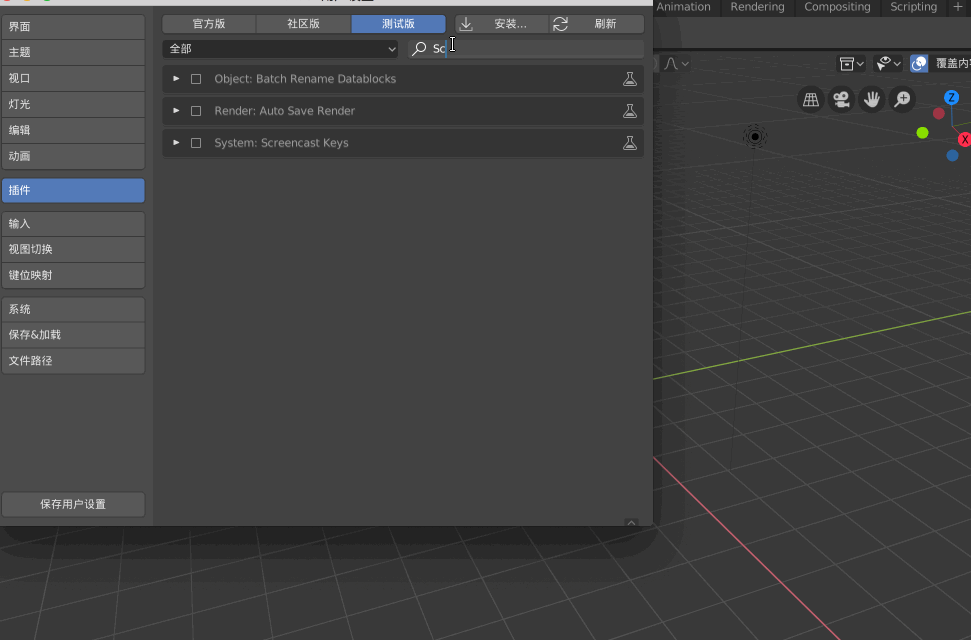
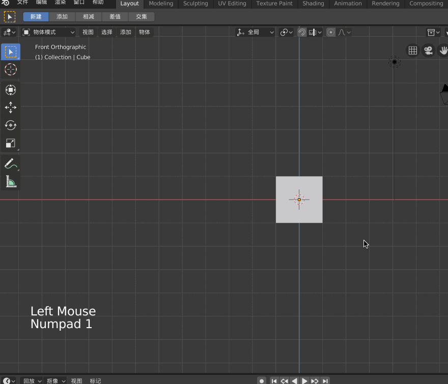

本文展示Blender 的一些基础用法，熟悉Blender 快捷键！Blender 可以进行建模、贴图、绑定骨骼、动画制作等高级功能，很强大！

本文使用的Blender ，是直接从[官网](https://www.blender.org/)下载的**Blender 2.80 beta**

>本文涉及到的所有快捷键，都用【扩起来】，表示强调

## Blender操作时显示快捷键

首先去[https://github.com/nutti/Screencast-Keys](https://github.com/nutti/Screencast-Keys)下载这个python 文件，保存到本地，解压后，找到src 下的screencastkeys 文件夹

然后去/Applications/ 目录下找到blender.app，右键-->显示包内容

进入Contents/Resources/2.80/scripts/addons_contrib，将screencastkeys 文件夹放到这里

Blender-->编辑-->设置-->插件-->测试版，搜索Screencast，勾选并保存设置

进入Blender 3D 视图后，【N】呼唤出面板，可以看到Screencast，然后勾选即可

## Blender常用操作

这是四个最常用的快捷键

* 【g】 移动（Position）
* 【s】 缩放（Scale）
* 【r】 旋转（Rotation）
* 【e】 延伸（Extension）

视图切换，正常如果电脑带有小键盘，那么可以使用小键盘切换视图，如果没有小键盘，那么就需要使用模拟数字键盘

Blender-->编辑-->设置-->输入-->勾选 模拟数字键盘

* 【1】 正视图
* 【3】 右视图
* 【7】 顶视图
* 【5】 正交模式（显示经纬线）

## 添加背景图片

在Blender 中，单位是1米，也就是说，每个方格的边长是1米，所以在建模的时候要保证与现实中的比例一致，不要失调！

接下来演示对着下面这个简单的原画进行建模

>在Blender 2.8 中，Background images 被移除了，但是我们在建模的时候需要导入图片对着图片一步步的建模、雕刻，现在怎么办？

可以这样来添加背景图，【1】切换到正视图，【添加】-->【图像】-->【Background】，这样可以为正视图添加一个背景图片，同样的【3】切换到测试图，也添加一个图片

>注意，Blender 中的每个格子是1m，而我们上面导入的图片很明显占了将近4个格子，也就是人快要4米了！为了与现实世界保持一致，应该将二次元女性调整为1.7米左右

这种方式添加的背景图片，会在Screen Collection 中显示为Empty，为了方便管理，一定要重命名，否则当当前视图中加入的物体越来越多后，会很乱！

## 调整背景图片

上面说了需要调整背景图片

## 参考资料

* [Blender 学习 (Mac 版)](https://www.jianshu.com/p/192dd5b1676b)
* [Blender Hello World](https://segmentfault.com/a/1190000020099954?utm_source=tag-newest)
* [[傅老師/Blender教學] 05 - 建置軀幹的兩種方式(Torso)](https://www.bilibili.com/video/av16796352)
* [美术丨快速入门！Blender基础教程（一）：基本操作 ](https://www.sohu.com/a/130979988_466876)
* [blender怎么开启模拟数字键盘? blender笔记本数字键盘的使用方法](https://www.jb51.net/softjc/605073.html)
* [Cannot find Background Images feature in Blender 2.8](https://blender.stackexchange.com/questions/110532/cannot-find-background-images-feature-in-blender-2-8)
* [https://www.mixamo.com/](https://www.mixamo.com/)