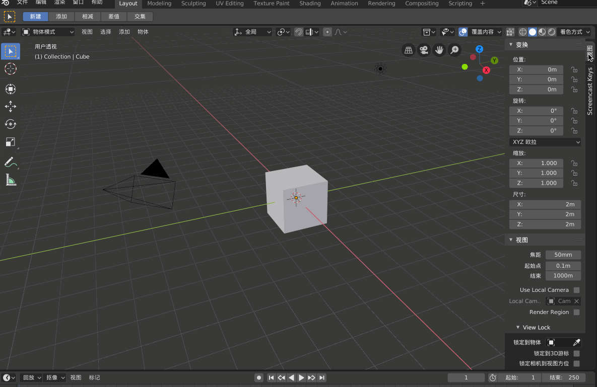
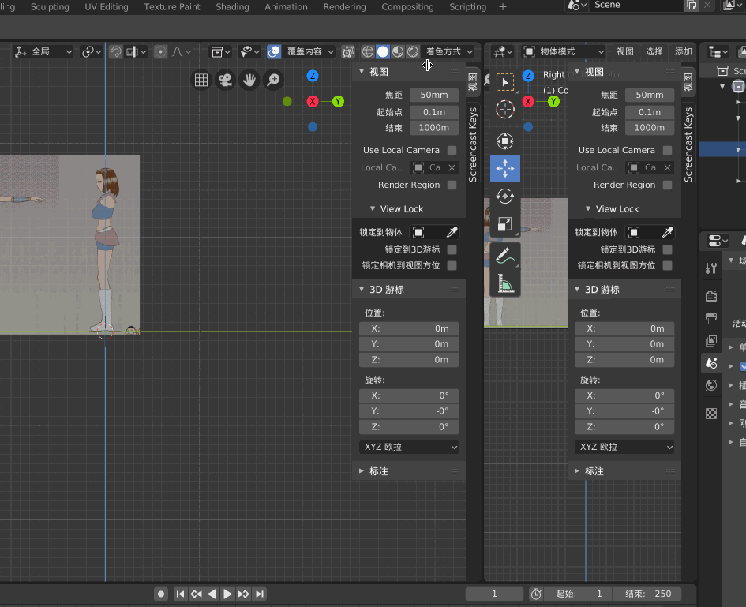
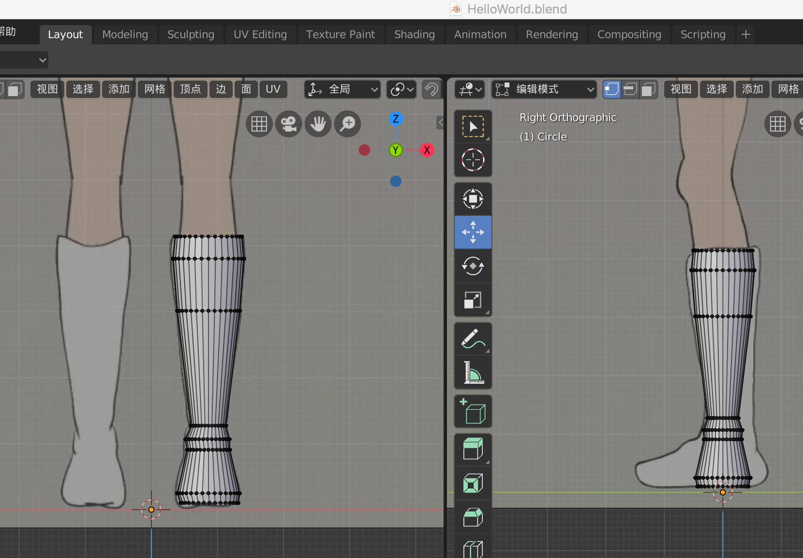
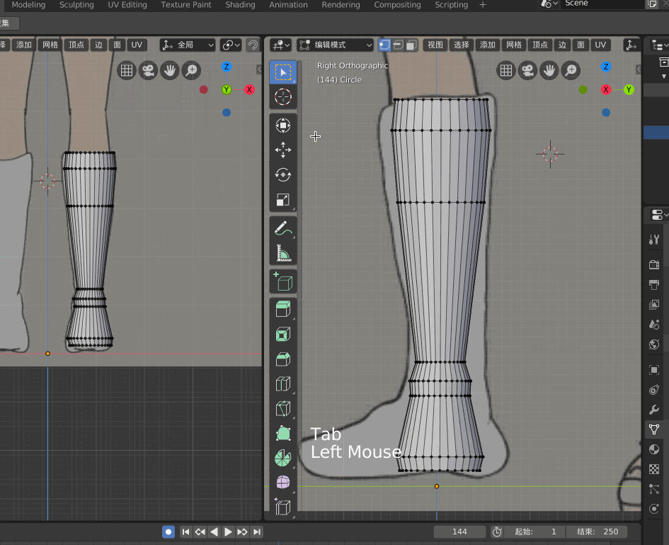
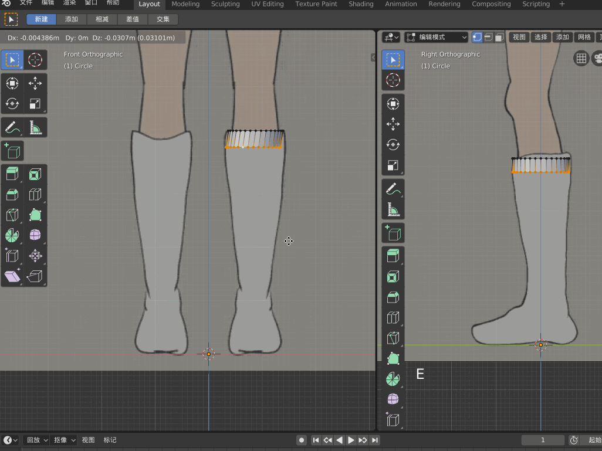
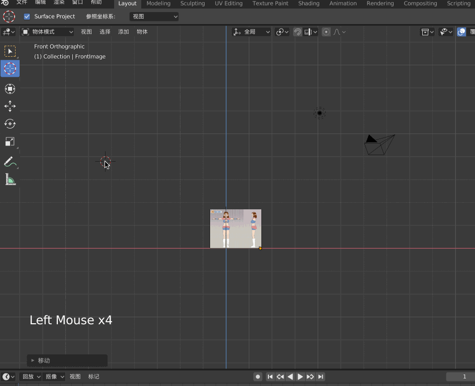
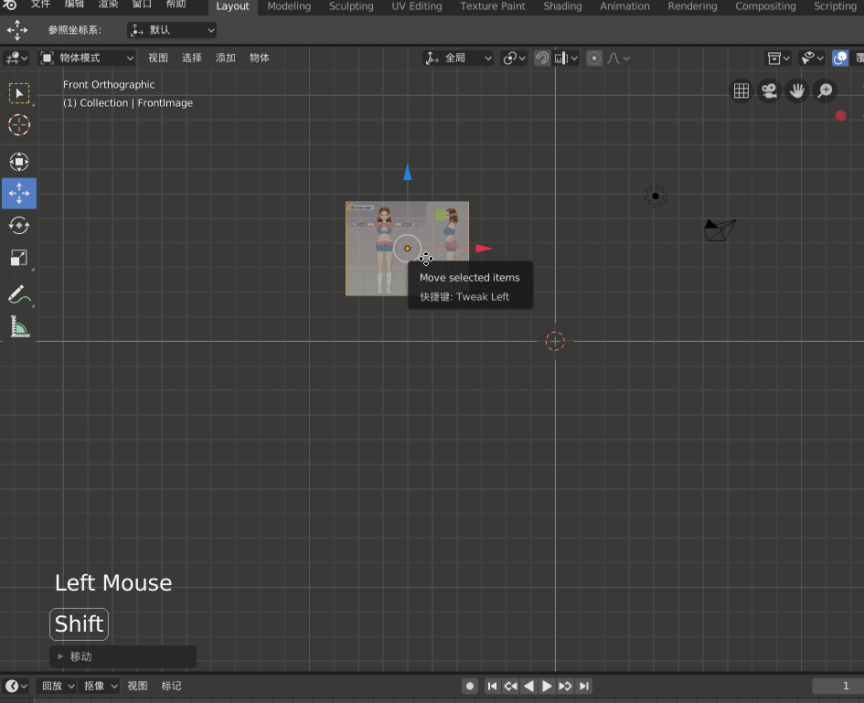

本文展示Blender 的一些基础用法，熟悉Blender 快捷键！Blender 可以进行建模、贴图、绑定骨骼、动画制作等高级功能，很强大！

本文使用的Blender ，是直接从[官网](https://www.blender.org/)下载的**Blender 2.80 beta**

>本文涉及到的所有快捷键，都用【扩起来】，表示强调

## Blender操作时显示快捷键

首先去[https://github.com/nutti/Screencast-Keys](https://github.com/nutti/Screencast-Keys)下载这个python 文件，保存到本地，解压后，找到src 下的screencastkeys 文件夹

然后去/Applications/ 目录下找到blender.app，右键-->显示包内容

进入Contents/Resources/2.80/scripts/addons_contrib，将screencastkeys 文件夹放到这里

Blender-->编辑-->设置-->插件-->测试版，搜索Screencast，勾选并保存设置

进入Blender 3D 视图后，【n】呼唤出面板，可以看到Screencast，然后勾选即可

## Blender常用操作

这是四个最常用的快捷键

* 【g】 移动（Position）
* 【s】 缩放（Scale）
* 【r】 旋转（Rotation）
* 【e】 延伸（Extension）

视图切换，正常如果电脑带有小键盘，那么可以使用小键盘切换视图，如果没有小键盘，那么就需要使用模拟数字键盘

Blender-->编辑-->设置-->输入-->勾选 模拟数字键盘

* 【1】 正视图
* 【3】 右视图
* 【7】 顶视图
* 【5】 正交模式（显示经纬线）

## 添加背景图片

在Blender 中，单位是1米，也就是说，每个方格的边长是1米，所以在建模的时候要保证与现实中的比例一致，不要失调！

接下来演示对着下面这个简单的原画（一个正视图、一个侧视图）进行建模

>在Blender 2.8 中，Background images 被移除了，但是我们在建模的时候需要导入图片对着图片一步步的建模、雕刻，现在怎么办？

可以这样来添加背景图，【1】切换到正视图，【添加】-->【图像】-->【Background】，这样可以为正视图添加一个背景图片，同样的【3】切换到测试图，也添加一个图片

>这里是通过界面中的【添加】菜单来添加背景图的，也可以通过快捷键【Shift-A】呼唤出【添加】菜单

>注意，Blender 中的每个格子是1m，而我们上面导入的图片很明显占了将近4个格子，也就是人快要4米了！为了与现实世界保持一致，应该将二次元女性调整为1.7 米左右

这种方式添加的背景图片，会在Screen Collection 中显示为Empty，为了方便管理，一定要重命名，否则当当前视图中加入的物体越来越多后，会很乱！

## 调整背景图片

在调整背景图片之前，要先说一下，刚才导入图片后，简单的调整了图片大小后，但是发现图片在整个Blender 视图下绝对大小还是太下，在MacOS 下，可以按contorl，然后双指往上下滑动触摸屏以实现整个视图的放大和缩小

上面说了需要调整背景图片的大小，以符合Blender 的单位！

比如上面的图片中有需要建模人物的正视图，也有需要建模的人物的侧视图，都还需要继续进行调整

在正视图模式下，需要将图片中的人物的正视图部分做如下调整，两个脚的中心移动到**原点**的位置、脚需要踩到**红线**上

在侧视图模式下，也需要做对应调整，比如保证侧视图的人物与正视图的人物高度一致、脚也要踩到**绿线**上、脚的中心也要放到**原点**上

## 开始建模

OK，上面将背景图摆好了之后，接下来就是对着正视图、侧视图分别进行建模，其实就是对着正视图和侧视图进行描写

比如我们对着正视图和侧视图建立靴子的3D 模型！

为了方便在建模的时候同时看到正视图和侧视图，Blender 提供了很强大的功能，可以在视窗的右上角显示为“+”时，往左拖出，这样可以在左边的视窗选择正视图，在右边的视窗选择侧视图，这样建模的时候，可以同时看多个视图，很方便

>如果想关闭打开的多个视窗，可以到视窗的左上角，显示为“+”时往右拖，上图也有展示

调整视窗，使其中一个显示正视图，一个显示侧视图，接下来就可以进行建模了

接下来打算从一个圆开始延展出一个靴子！首先【shift-a】，在原点处创建一个Circle，【tab】进入顶点模式，按【s】键然后将圆缩小，然后把圆拖到正视图的靴子顶部

>【tab】进入顶点模式（object modle->edit modle），【tab】退出顶点模式（edit modle->object modle）

>本文最开始的时候就强调了，最常用的四个快捷键中，有【s】，即缩放，这里就用到了。如果只按【s】那么将进行所有角度的伸缩，如果按【s】再按【z】将只进行z 轴上的伸缩，【s】【y】也是只在y 轴伸缩

在顶点模式下，【a】选中圆圈上所有的点，按【e】，拉着鼠标往下拖，然后就可以往下延伸出来，这样就可以模拟出靴子的圆柱形

另外因为靴子有粗有细，所以可以在按【e】并按住鼠标往下延伸了之后，可以按【s】进行扩大或者缩小

重复这样的方式就可以拖出来一个靴子的形状（这是正视图观察视角）

## 侧视图修整

按照上面的操作，在正视图大致延展出来一个靴子的形状，接下来同步看一下侧视图是这样的，显然侧视图还需要修正

比如从上往下数的第二个圆圈在侧面视图明显比靴子小，所以需要拉大，首先【tab】切换到顶点模式，【选中箭头工具】，然后用箭头选中所有的顶点，按【s】去进行缩放

oh，no！竟然将整个模型缩放了，而不是将这些点组成的面缩放，那怎么办？

目前能想到的办法就是在正视图做一次操作对应在侧视图赶紧修改，正视图第一次按【s】调整好大小后，发现侧视图的与原图还是不一致，再按【s】，按【y】，然后仅在y 轴进行放大

往下每延伸一次，侧视图也对应做调整和修改，比如正视图长按【e】往下延伸之后，按【s】对正视图放大没有问题了，但是侧视图的还是比原图小，再按【s】，按一下【y】，对侧视图在y 轴进行缩放

>用以上同样的方法，拿到一个正视图和侧视图的图片后，放到Blender 中对着去描就行了，比如一个人物模型，其脖子、隔壁、腿、身躯基本都可以用这种方式做出来一个基本的模型！

上面对于Blender 的基础操作有了一些认知，但是在我实际建模的过程中还是遇到了各种问题，本文还是以初步对Blender 有所认知为目的，以下问题仅在此列一下，暂不给予解决和说明

* 在新建一个Circle 的时候，如何设置顶点数
* 当在Blender 中做出来很多顶点时，想要选中某个或某些顶点怎么操作
* 比如Circle，【e】延伸后，发现左边和背景图一致，但右边窄了，这种怎么拉伸仅补右边？
* 对于一个Circle，想在正视图全选上面的点，但是在侧视图看明明有一部分点还没有选到，这是因为什么？

诸如此类，在Blender 的操作过程中还是有很多的细节上面的坑的，这里就不赘言了，以后我尽量详细整理出来！

以上种种，估计还是要对Blender、渲染的原理进行深入研究之后，才能很好的解决，否则只不过是掌握了一些快捷键、一些操作方法而已

## 其他常用操作

上面通过展示一个简单的建模流程来展示Blender 的常用操作，下面记录一些常用的操作，但是单独拿出来强调一下我觉得更好

比如你不小心将Cursor 从原点的位置移出去，可以通过【shift-c】恢复到原点

选中物体后，【x】快捷键可以呼出删除选项

以上面这个图片为例，图片中人物的脚和图片下沿还是有点距离的，想要在调整图片位置的时候，将人物的脚瞄准原点、红线，那么最好是将图片的透明度设置一下，这样就可以透过图片看到后面的经纬线

如果想要实现整个Blender 工作视图的移动，可以选择当前视图中的某个物体，移动它，然后【shift-c】通过定位Cursor 到原点的方式即可实现整个Blender 工作视图的移动

>这个方法有点太蠢，最好的方法是按shift 键，然后双指在触摸屏上移动来实现整个Blender 视图的移动！！！

>【control + 双指触屏上下拖动】来扩大或缩小视图；【shift + 双指触屏移动】来实现Blender 视图的移动！

比如我们分别在正视图、侧视图中都导入了同一个图片，显然在建模的时候，要求正视图下图片和侧视图下的图片大小一致，我们可以手动调整好正视图的大小，然后侧视图直接按照正视图的大小进行对应设置即可

>在使用Blender 的时候，其操作模式、操作习惯，其实可以经常与Unity 进行比较，都是类似的工具！

## 注意事项

经常保存Blender 工程，因为Blender 2.8 不是很稳定，经常会崩溃，不保存文件，那么辛辛苦苦的工作成果随时就直接没有了！

Blender 中的单位是1m，也就是每个格子的边长是1m，在使用Blender 工作的时候，注意与现实世界保持相对一致

>本文简单展示了Blender 的交互逻辑、常用的功能，其实Blender 更加强大，还可以进行贴图、绑定骨骼、制作动画等等，后续我用到的时候会尝试同步整理一些文章的！

* 如何做出来头发的效果
* 如果做出来的模型顶点数太多，如何操作以降顶点数
* Blender 如何进行贴图
* Blender 如果绑定骨骼
* Blender 如何制作动画效果

## 参考资料

* [Blender 学习 (Mac 版)](https://www.jianshu.com/p/192dd5b1676b)
* [Blender Hello World](https://segmentfault.com/a/1190000020099954?utm_source=tag-newest)
* [[傅老師/Blender教學] 05 - 建置軀幹的兩種方式(Torso)](https://www.bilibili.com/video/av16796352)
* [美术丨快速入门！Blender基础教程（一）：基本操作 ](https://www.sohu.com/a/130979988_466876)
* [blender怎么开启模拟数字键盘? blender笔记本数字键盘的使用方法](https://www.jb51.net/softjc/605073.html)
* [Cannot find Background Images feature in Blender 2.8](https://blender.stackexchange.com/questions/110532/cannot-find-background-images-feature-in-blender-2-8)
* [https://www.mixamo.com/](https://www.mixamo.com/)
* [Blender 2.81 参考手册](https://docs.blender.org/manual/zh-hans/dev/index.html)