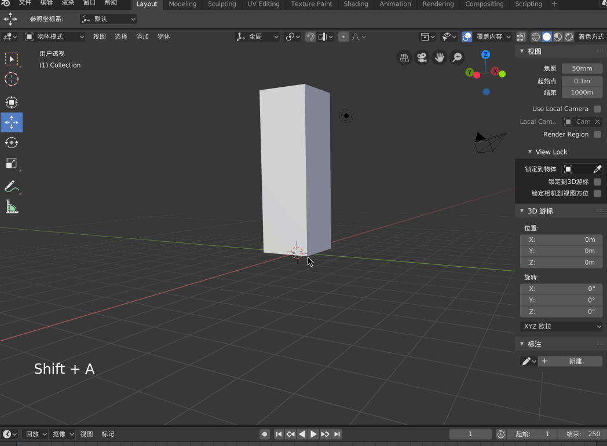

>[[傅老師/Blender教學] 30 - 人物綁骨#1(Rigging#1)](https://www.bilibili.com/video/av18439606)

>[Blender 基础 骨架 01](https://blog.csdn.net/github_35160620/article/details/52208012)

建模、贴图这些流程太复杂了，假如这些步骤已经完成了，现在拿到了一个模型，那么接下来要做的就是绑定骨骼了

接下来在Blender 中添加一个Cube，然后沿着z 轴将其适当拉长，本文不在人物模型上绑骨，就在这个简单的长方体上绑骨，能够了解骨骼的一些特性即可

另外需要将Cube 整体往上拉，底部中心点和坐标原点放到一起

## 骨头相关的基础操作

然后【shift-a】，添加一个Armature，但这时候看不到骨头（被Cube 挡住了），【z】切换为线条显示，现在，你就可以看到刚刚添加的骨头了

>每个骨头都有前端、骨干、后端三个部分！

【tab】进入编辑模式，按【g】，鼠标拖动骨头的顶点可以以另一个顶点为中心拖动旋转骨头，如果选中骨干，则可以整体移动骨头

选中骨干后，【r】可以旋转、【s】可以放大、【e】可以沿着选中的点再长出一根骨头

用上面的基础操作在Cube 中加三根骨骼

## 姿势模式（pose mode）

上面将骨骼摆好之后，可以进入姿势模式去为骨骼摆各种姿势，选中骨头后，【r】可以摆动姿势

比如从编辑模式下切换到姿势模式下去摆动骨骼后，可以按【alt-r】（清空所有旋转）、【alt-g】（清空所有位移）、【alt-s】（清空所有缩放），可以【a】选中所有骨头，这样可以一次清空所有骨头的旋转、位移、缩放等

骨头可以动了，但是为什么外面的Cube 模型没有动呢，在为模型绑定骨骼的时候，显然是希望绑定骨骼后，通过骨骼控制模型的动作呀

可以到层级里面看到骨骼与Cube 完全是两个不相关的东西，首先需要告诉Blender，Cube 要按照Armature 的姿势去进行变动，也就是将二者绑定起来

在物体模式下，先用鼠标选中Cube，按【shift】再用鼠标选中骨架，然后按【control-p】，选择【附带自动权重】

>附带空顶点组、附带封套权重又分别是什么意思？

接下来就可以在姿势模式下通过骨骼来控制模型的动作了

很显然，骨骼的动作导致Cube 形变很大，因为Cube 只有8 个顶点、而且没有设置骨骼权重，所以这里看起来很僵硬

当然，也就是说，为人物绑定骨骼的时候，到这一步还远远没有结束，为了做出来舒服、流畅、自然的动画效果，绑定骨骼还有很多的事情要做，包括添加更多顶点、设置每节骨骼控制哪些顶点、设置权重等等！本文就不做介绍了，希望通过上面的梳理，能够达到熟悉Blender 相关操作的程度就可以了，要想真正用好Blender，还有很长的路要走，要探索更多的玩法、要大量反复的进行建模/绑骨实践、了解Blender 的工作原理。总之，罗马不是一天建成的！

在了解了绑定骨骼的基础原理后，可以使用一些成熟的插件来帮助更快的工作，比如有一些插件帮助快速为人形模型绑定骨骼。另外还有一个强大的线上绑定骨骼的网站：[https://www.mixamo.com/](https://www.mixamo.com/)，这里也有大量的动画、模型资源！

## 参考资料

* [Blender 基础 骨架 01](https://www.cnblogs.com/aobosir/p/5928604.html)
* [Blender简易教程](https://huangwang.github.io/2018/09/19/Blender%E7%AE%80%E6%98%93%E6%95%99%E7%A8%8B/)
* [Blender Q&A](https://indienova.com/u/justus/blogread/11977)
* [Blender 基础 骨架 01](https://blog.csdn.net/github_35160620/article/details/52208012)
* [骨架修改器](https://docs.blender.org/manual/zh-hans/dev/modeling/modifiers/deform/armature.html)
