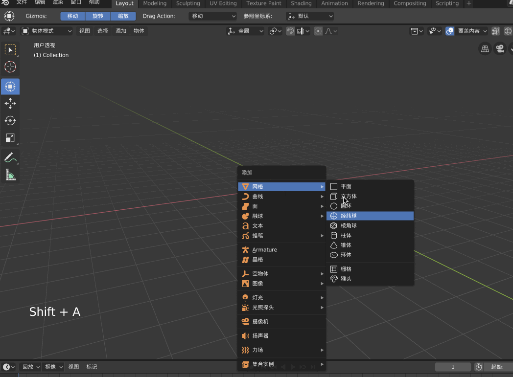

前面几篇文章通过一些简单例子的演示，具体展示了Blender 的一些常用操作、快捷键，本文进行一个系统的梳理，将之前零散的技术点系统化、完整化

另外对于上面几篇文章中没有讲到的内容这里也会有所补充

## 首先汇总常用快捷键

* 【shift - s】，指定游标的选项
* 【shift - c】将游标重新置到原点处
* 【g】移动，【g - x】仅按x轴移动，对应【g - y】、【g - z】
* 【s】缩放，【s - x】仅沿x轴缩放，对应【s - y】、【s - z】
* 【e】演示，【e - x】仅沿x轴延伸，对应【e - y】、【e - z】
* 【r】旋转，【r - x】仅沿x轴旋转，对应【r - y】、【r - z】
* 【r - r】可以实现360度任意角度旋转
* 【a】选中所有物体
* 【shift - a】新建物体
* 【control - p]，确定两个物体的父子关系。如果绑骨，要先选中模型再选中骨骼
* 【x】选中物体后删除
* 【n】唤出右边菜单
* 【t】唤出左边菜单

另外还有在MacOS 下使用触摸板的交互操作

* 【二指滑动】旋转整个视图
* 【shift - 二指滑动】移动整个视图
* 【control - 二指滑动】缩放整个视图

## 编辑模式

【tab】从物体模式切换到编辑模式

在编辑模式下的左上角可以选择对点、线、面进行操作，对于点、线、面都可以使用上面的那些快捷键进行旋转【r】、缩放【s】、移动【g】、延伸【e】等动作

这个操作特别重要，因为在建模的时候，几乎就是对任何物体的点、线、面进行操作

也可以在按住【shift】的情况下，同时点击点、线、面操作，那么到物体上，按点就是点、按线就是线、按面就是面

## 环切

## 