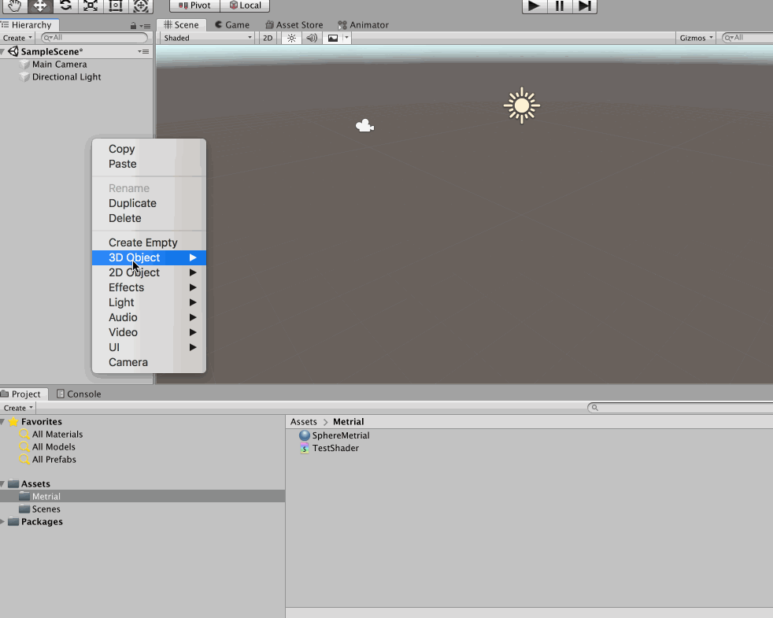
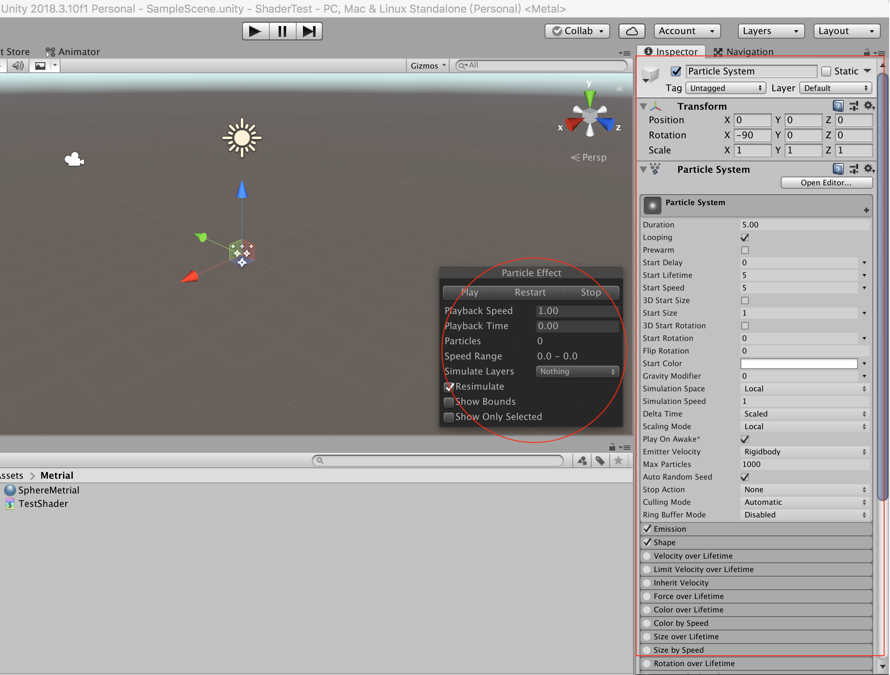
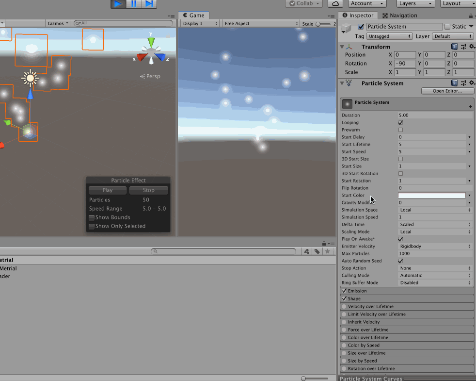

>所谓粒子系统，就是由大量且微小的游戏对象所组成的组合体，如日常生活中的火焰、烟尘、瀑布等。和着色器（Shader）类似，粒子系统也是为了增加游戏的画面表现力和可玩性而专门开发出的技术

>使用粒子系统可以很好地模拟出日常生活中的某些自然现象，以及更好地表现游戏壮观、瑰丽的场景。在游戏中起到一种模拟真实、合理夸张的游戏特效，可以很好地使玩家投入到开发人员所构造出来的魅力无限的虚拟世界中

在做游戏的时候，想要实现各种炫酷的特效，那么就要用到粒子系统！本文就从零开始做一个简单的特效来展示粒子系统的知识和操作细节

先最简单的添加一个粒子效果，其运行效果就是这样的（简单的来说，就是粒子系统在喷射）

相应的，可以在Scence、Inspector 视图看到粒子系统的属性栏（这些是后续使用粒子系统做出来“牛逼”特效的关键！再次强调，在一个游戏中，画面的冲击力和代入感是极其极其重要的）

>同样的，我们可以看到粒子系统的参数真的是特别的多，所以要慢慢花时间研究和练习了

>当然这些参数的调整可以通过编写C# 代码的方式来进行控制，那么就可以做出来更加丰富的效果了

## 一些基础参数的展示

在Inspector 中的Particle System 可以做一些基础参数的配置，比如改变粒子的颜色、大小等等

通过这些基础的配置，直观、感性的了解了粒子系统的视觉效果，那么接下来再对Unity3D 的粒子系统进行详细、全面、深入的剖析和实践