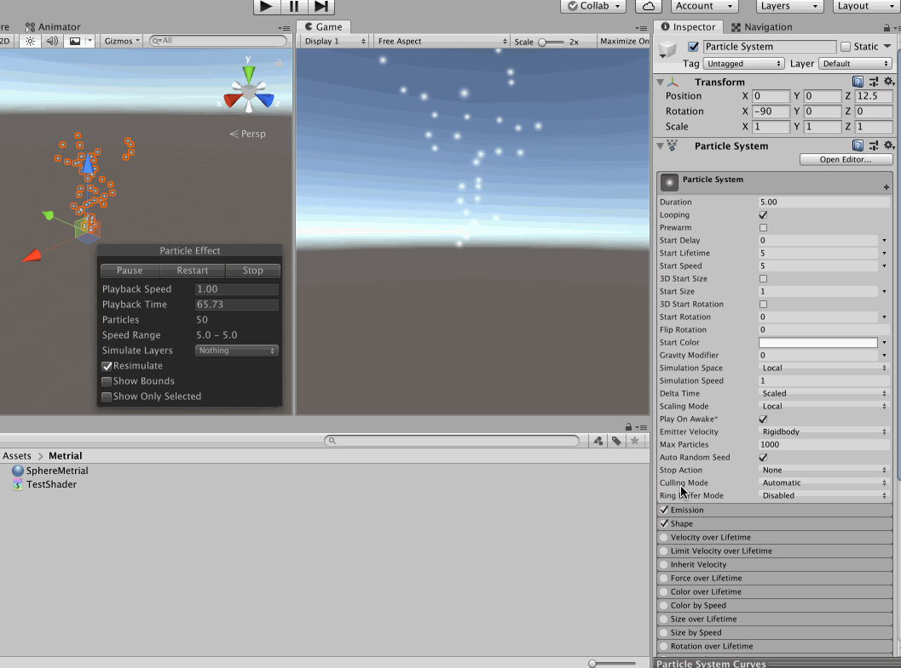

>所谓粒子系统，就是由大量且微小的游戏对象所组成的组合体，如日常生活中的火焰、烟尘、雷电、瀑布、喷泉、导弹尾焰、火车烟囱、攻击特效、喷血、掉落的金属火星、喷气等。和着色器（Shader）类似，粒子系统也是为了增加游戏的画面表现力和可玩性而专门开发出的技术

>使用粒子系统可以很好地模拟出日常生活中的某些自然现象，以及更好地表现游戏壮观、瑰丽的场景。在游戏中起到一种模拟真实、合理夸张的游戏特效，可以很好地使玩家投入到开发人员所构造出来的魅力无限的虚拟世界中

在做游戏的时候，想要实现各种炫酷的特效，那么就要用到粒子系统！本文就从零开始做一个简单的特效来展示粒子系统的知识和操作细节

先最简单的添加一个粒子效果，其运行效果就是这样的（简单的来说，就是粒子系统在喷射）

相应的，可以在Scence、Inspector 视图看到粒子系统的属性栏（这些是后续使用粒子系统做出来“牛逼”特效的关键！再次强调，在一个游戏中，画面的冲击力和代入感是极其极其重要的）

>同样的，我们可以看到粒子系统的参数真的是特别的多，所以要慢慢花时间研究和练习了

>当然这些参数的调整可以通过编写C# 代码的方式来进行控制，那么就可以做出来更加丰富的效果了

## 一些基础参数的展示

在Inspector 中的Particle System 可以做一些基础参数的配置，比如改变粒子的颜色、大小等等

上面的动图中，设置了初始大小、初始速度、初始颜色、渐变等属性。更多的属性整理如下

属性名称            |  属性说明
-------------------|-----------------------------------------
Duration           | 发射粒子的持续时间（喷射周期）
Looping            | 是否循环发射
Prewarm            | 预热（Looping状态下预产生下一周期的粒子）
Start Delay        | 发射粒子之前的延迟（Perwarm状态下无法延迟）
Start Lifetime     | 开始的生命周期
Start Speed        | 发射时的速度（m/s）
3D Start Size      | 三维尺寸
Start Size         | 初始尺寸
3D Start Rotation  | 三维旋转
Start Rotation     | 开始旋转角
Randomize Rotation | 随机数旋转
Start Color        | 发射时的颜色
Gravity Modifier   | 重力修改器（相当于物理管理器中重力加速度的重力密度）
Simulation Space   | 模拟空间
Simulation Speed   | 模拟速度
Delta Time         | 时间增量
Scaling Mode       | 扩展模式
Play On Awake      | 是否开始自动播放
Emitter Velocity   | 发射器速度
Max Particle       | 发射的最大数量（一个周期内的最大发射数量，超过则停止发射），手游建议不超过50
Auto Random Seed   | 随机种子

通过这些基础的配置，直观、感性的了解了粒子系统的视觉效果（更多的配置自己分别去试一下）

粒子系统是比较消耗系统的性能的，所以真实做到一个游戏中，如何针对粒子系统进行优化？！

## 制作火焰效果

首先创建一个Particle System，然后，在Shape（形状）属性中选择Cone，Angle（角度）设置为0，Radius（半径）设置为0.1，这样就有一种一缕青烟的效果了

设置Duration（发射持续时间）为1s，Start Lifetime（开始生命周期）为1，Start Speed（开始速度）为10，Start Size（开始大小）设置为随机在两个固定数值之间取数值（Random Between Two Constants），设置为0.5至1.5

在发射器（Emission）属性，设置Rate over Time（发射率）为每秒20

设置粒子的颜色变化，勾选Color Over Lifetime，在Gradient Editor 定义4个标签

1. R: 255, G: 255, B: 255
2. R: 255, G: 200, B: 20
3. R: 255, G: 0, B: 0
4. R: 0, G: 0, B: 0

如果感觉粒子的颜色搭配不太好看，那么可以调整一下标签的分布

设置Size Over Lifetime（粒子大小随生命周期变化方式），使用Curve 图形的方式

设置拖尾效果。展开Render（渲染）面板，选择Render Mode 为Stretched Billbord，其中Speed Scale 子属性设置为0.2

最终的效果展示如下

>本文仅仅是使用Unity3D 的粒子系统做出来了一个简单的效果，显然通过配置Inspector 的参数，各种组合，可以做出来各种炫酷的特效，这里就不做展示了
