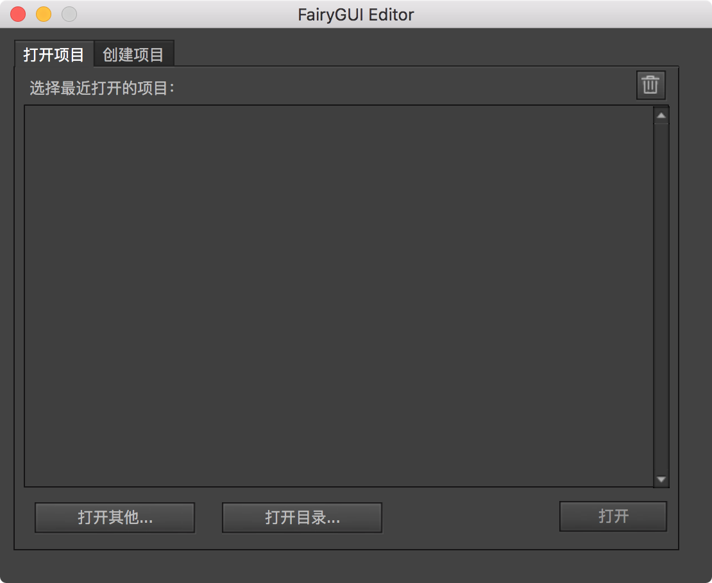
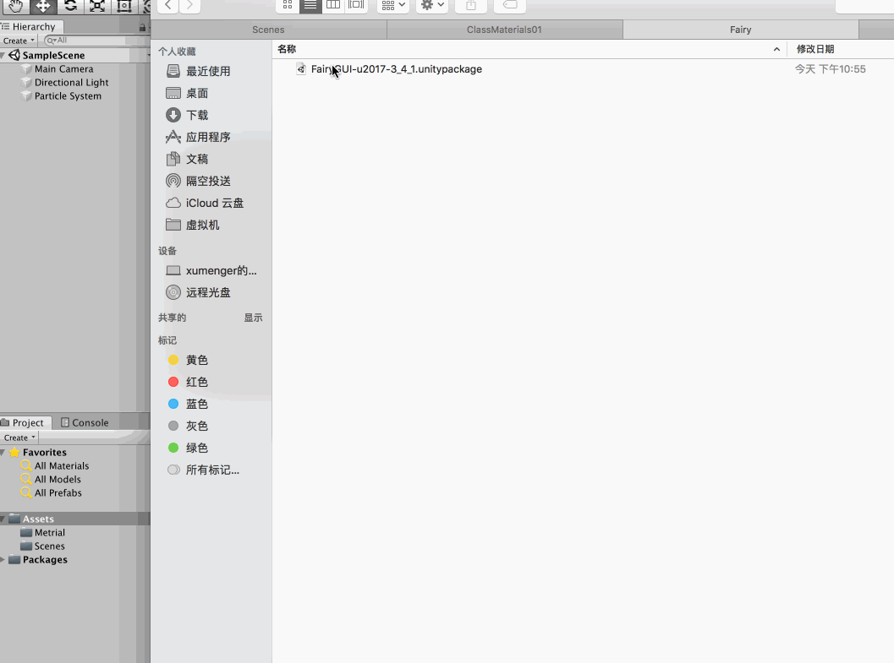
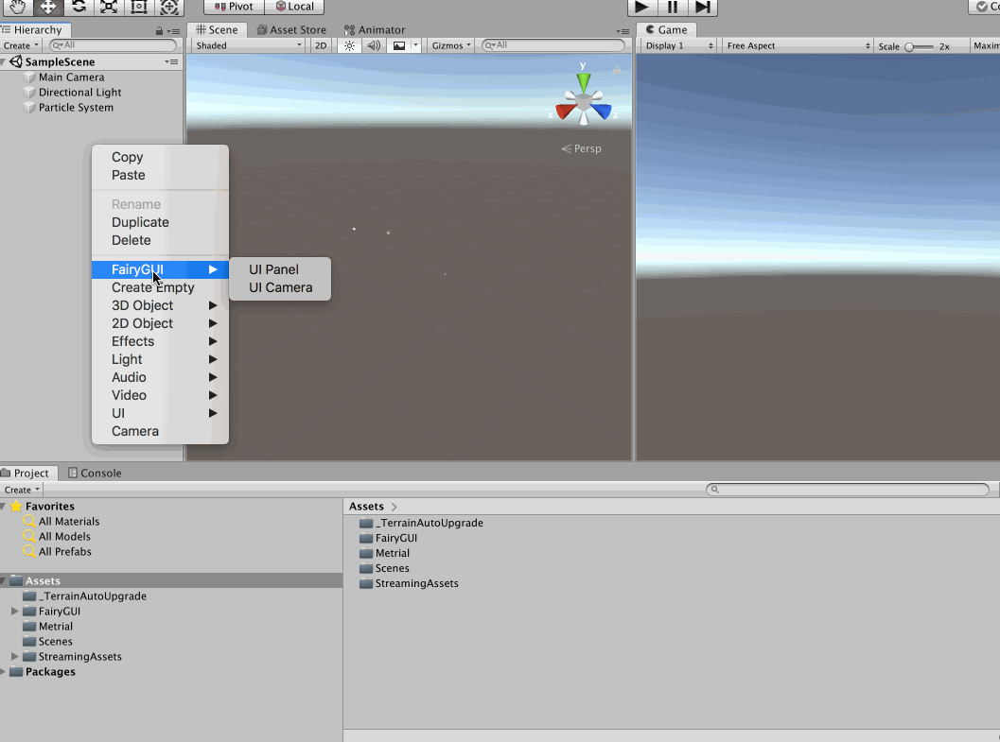
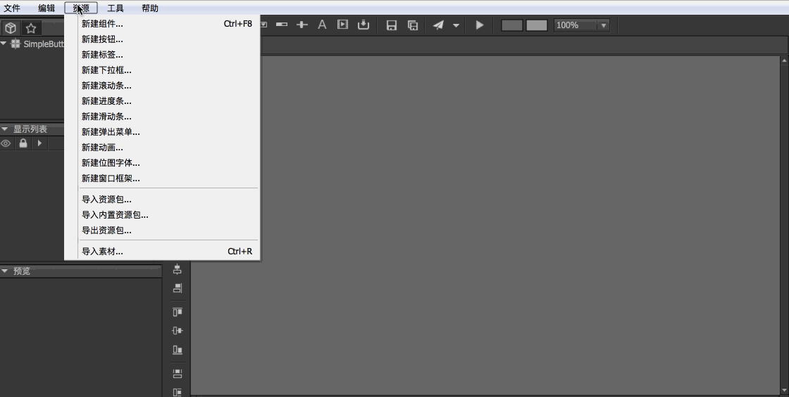
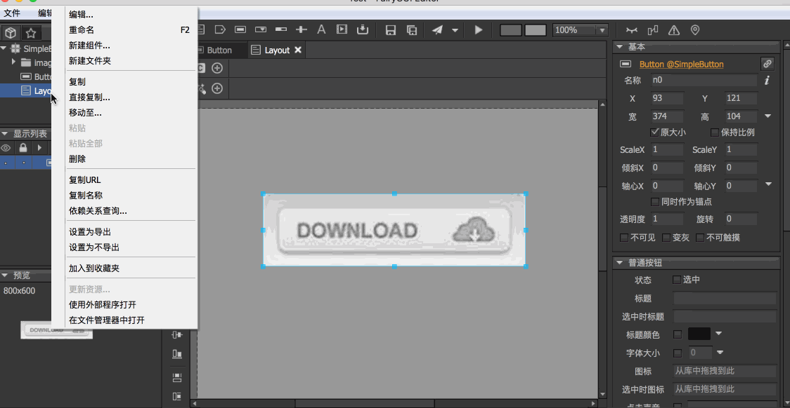

>[http://fairygui.com/](http://fairygui.com/)。这是一个免费的跨平台开源UI 解决方案

>感谢[傅老师](https://www.bilibili.com/video/av35647057/?p=1)

在[http://fairygui.com/product/](http://fairygui.com/product/)下载FairyGUI 编辑器，下载下来后，比如我的是MacOS 系统，解压zip 文件后，得到FairyGUI-Editor.app，为了方便使用，直接将其拖到/Applications 目录下，然后在桌面创建快捷方式，方便使用，其打开后的界面是这样的

另外还需要安装Unity SDK，比如去[github](https://github.com/fairygui/FairyGUI-unity/releases) 下载最新的Unity SDK，可以选择下载.unitypackage 和.zip 格式的，.zip 格式的是精简版的，而.unitypackage 格式的带有一些案例，所以我下载.unitypackage

直接导入到Unity 项目中即可

然后在Unity 中可以创建Fairy 提供的相应组件，这样就说明安装成功了

## 做一个按钮

在FairyGUI Editor 中创建一个项目，然后新建一个布局、导入图片素材、新建一个按钮

然后将该Fairy GUI 项目发布到某个Unity 项目的Assets/Resources 目录下（注意将Layout 设置为导出）

然后在Unity 中创建一个UI Panel（默认会创建一个Stage Camera，这个相机是用来渲染UI 的，注意取消勾选Main Camera 的UI））

>在UI Panel 的Package Name 那里可以看到好多的包名，因为Fairy GUI 的.unitypackage 文件中带有很多事例的UI 效果（建议去研究一下）

>本文只简单展示了Button 的用法，更多的UI 组件可以自己去研究一下