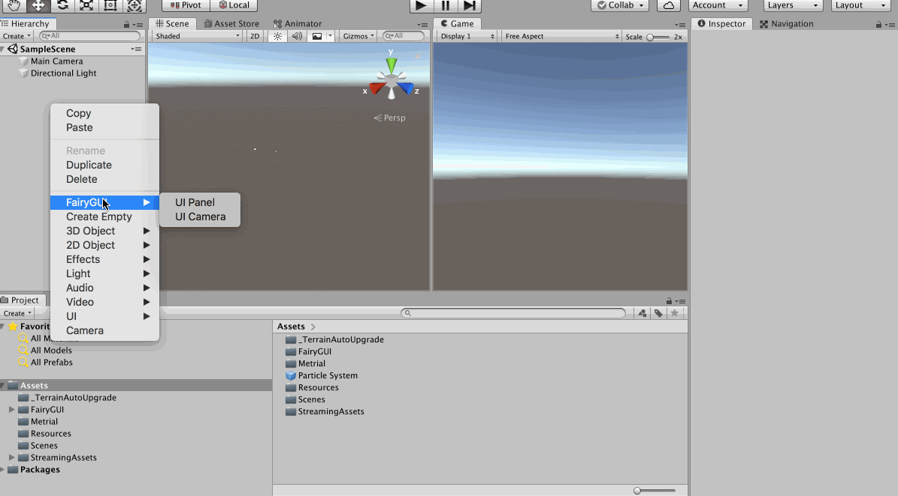
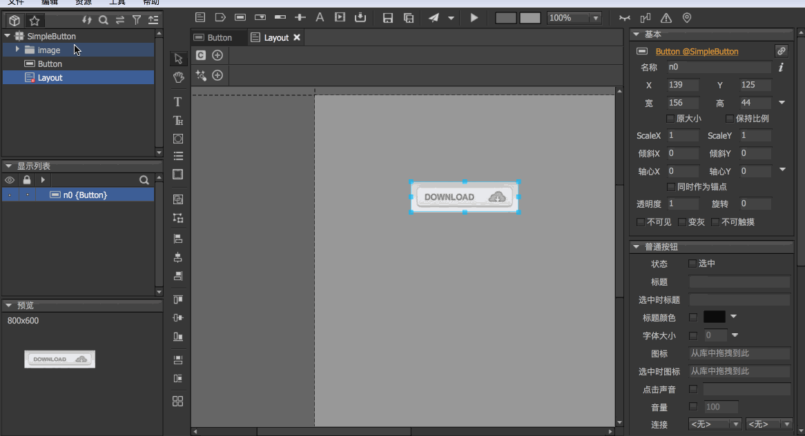
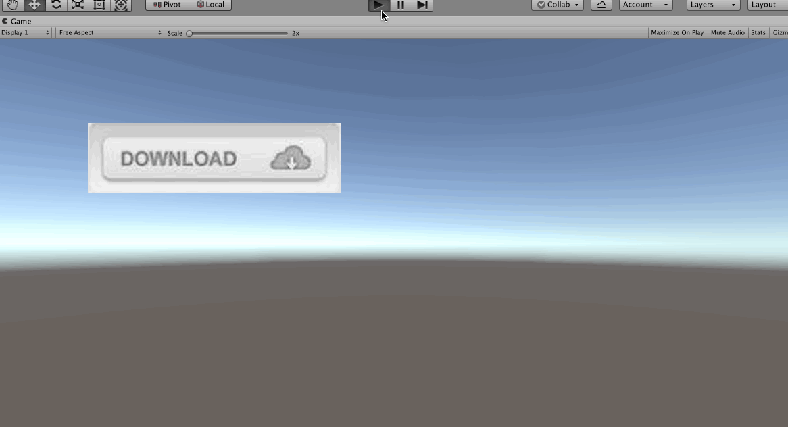
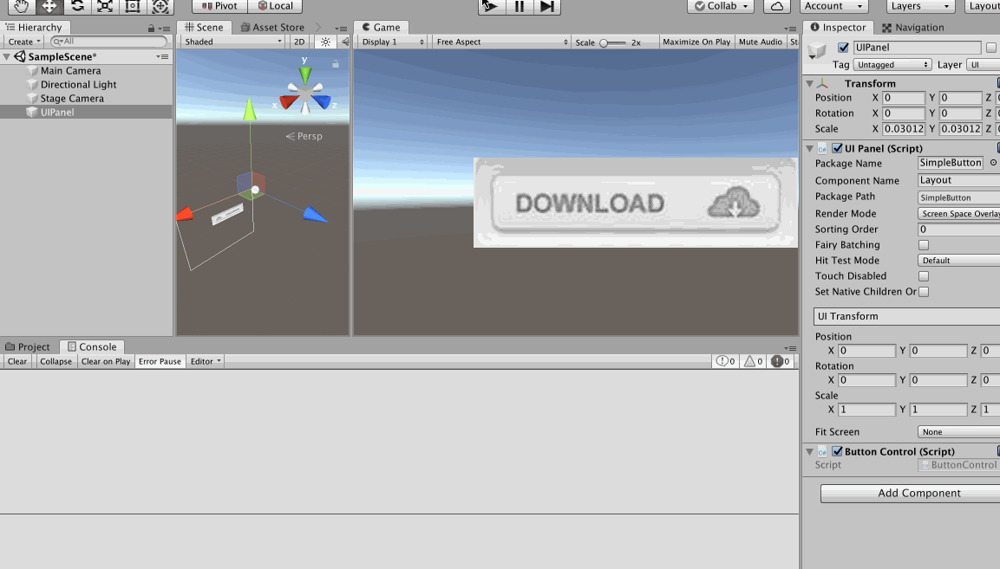

>[http://fairygui.com/](http://fairygui.com/)。这是一个免费的跨平台开源UI 解决方案

>感谢[傅老师](https://www.bilibili.com/video/av35647057/?p=1)

在[http://fairygui.com/product/](http://fairygui.com/product/)下载FairyGUI 编辑器，下载下来后，比如我的是MacOS 系统，解压zip 文件后，得到FairyGUI-Editor.app，为了方便使用，直接将其拖到/Applications 目录下，然后在桌面创建快捷方式，方便使用，其打开后的界面是这样的


另外还需要安装Unity SDK，比如去[github](https://github.com/fairygui/FairyGUI-unity/releases) 下载最新的Unity SDK，可以选择下载.unitypackage 和.zip 格式的，.zip 格式的是精简版的，而.unitypackage 格式的带有一些案例，所以我下载.unitypackage

直接导入到Unity 项目中即可


然后在Unity 中可以创建Fairy 提供的相应组件，这样就说明安装成功了


## 做一个按钮

在FairyGUI Editor 中创建一个项目，然后新建一个布局、导入图片素材、新建一个按钮


然后将该Fairy GUI 项目发布到某个Unity 项目的Assets/Resources 目录下（注意将Layout 设置为导出）


然后在Unity 中创建一个UI Panel（默认会创建一个Stage Camera，这个相机是用来渲染UI 的，注意取消勾选Main Camera 的UI））



>在UI Panel 的Package Name 那里可以看到好多的包名，因为Fairy GUI 的.unitypackage 文件中带有很多事例的UI 效果（建议去研究一下）

## 为UI添加动态效果

可以在Fairy GUI 中简单的实现一个UI 的动画效果，比如弹入、弹出等

比如下面在Fairy GUI 中实现最开始的时候按钮在布局之外，然后飞到布局内（这里的每一步操作都是很重要的）



发布到Unity 之后，在Unity 中可以看到运行效果是这样的



## 编写代码控制UI

针对上面的特效可以编写代码去控制，同时对于Button 的点击事件可以编写回调函数

为UI Panel 添加一个C# 脚本，然后编写代码如下

```c#
using System.Collections;
using System.Collections.Generic;
using UnityEngine;
using FairyGUI;

public class ButtonControl : MonoBehaviour
{
    private UIPanel panel;
    private GComponent ui;

    private Transition buttonTrans;

    // Start is called before the first frame update
    void Start()
    {
        panel = GetComponent<UIPanel>();
        ui = panel.ui;
        // 获取在Fairy GUI 中设置的动效
        // 这里建议在Fairy 中进行一个有意义的命名
        buttonTrans = ui.GetTransition("t2");

        // 为所有的Button 设置点击事件
        GObject[] objs = ui.GetChildren();
        foreach(var obj in objs)
        {
            if (obj as GButton != null)
            {
                obj.onClick.Add( () => { OnFairyButtonClick(obj.name); } );
            }
        }
    }

    // Update is called once per frame
    void Update()
    {
        // 如果按下A，就播放Button 的动效
        if (Input.GetKeyDown(KeyCode.A)) {
            buttonTrans.Play();
        }
    }

    public void OnFairyButtonClick(string name)
    {
        switch (name)
        {
            case "n0":
                print("button down");
                break;
            default:
                break;
        }
    }
}
```

现在程序的运行效果就是这样的了



>本文只简单展示了Button 的用法，更多的UI 组件可以自己去研究一下