在制作RPG 游戏的时候，实现各种流畅的动画效果是必不可少的，行走、奔跑、跳跃、砍杀、防御等等，而Unity3D 就提供了很强大的动画系统，下面跟随我去感受一下

>再次强调，下面展示的动画效果都是比较初级和简单的，要制作一个成熟的RPG 游戏，单动画状态机里面就可能存在数十种状态，如果管理这些状态也不是一件易事

## 动画的一些基础概念

在当前场景中新建一个Plane（平面），然后为其添加地砖贴图（使用贴图可以简单高效的做出很多中视觉效果），然后拖动一个模型到场景中，大概就是这个效果


可以在Project 中看到模型的层级下有一个ybotAvatar，这就是模型的骨骼


还可以在骨骼编辑模式下通过骨骼为模型摆出各种动作、姿势


>建议去仔细研究一个模型的每一个骨骼，去尝试编辑一下骨骼！

在对应的动画文件的配置上，有一个Source 选项，这里选择的就是对应模型的骨骼


动画类型有四种：None（无动画）、Legacy（Animation动画）、Generic（通用型动画）、Humanoid（人型动画）


## 搭建简单场景

基于上面的简单场景，通过两个Cube 制作两个墙，墙中间放一个门


为了区分门和墙，所以为墙添加一个简单的颜色材质


为了解决上面出现的门滑到墙里出现的渲染问题，可以将门的大小（Scale）设置的稍微比墙小一些


## 让模型动起来

为人物添加胶囊碰撞体和刚体，为了控制人物后续的碰撞等行为


为人物添加脚本，让人物可以通过键盘控制动起来（暂时不加动画效果）

```c#
using System.Collections;
using System.Collections.Generic;
using UnityEngine;

public class PlayerControl : MonoBehaviour
{
    // Start is called before the first frame update
    void Start()
    {
        
    }

    // Update is called once per frame
    void Update()
    {
        // 垂直轴（w、s或者上下键）
        float vertical = Input.GetAxis("Vertical");
        // 水平轴（a、d或者左右键）
        float horizontal = Input.GetAxis("Horizontal");
        // 方向向量
        Vector3 dir = new Vector3(horizontal, 0, vertical);
        if(dir != Vector3.zero)
        {
            // 旋转
            transform.rotation = Quaternion.LookRotation(dir);
            // 移动
            transform.Translate(Vector3.forward * 2 * Time.deltaTime);
        }
    }
}
```

>注意，比如一些行走动画，有的动画自带移动，有的动画只有行走的动作，但并不会真正产生位移！

运行效果如下


哎，为什么碰到墙之后就倒下了呢？需要为模型刚体固定旋转，然后就可以解决这个问题了


## 添加动画

人物可以动起来了，接下来我们就要添加动画，这里就简单的添加人物站立和走路的动画

首先我们看到这个人物是自带Animator 组件的，但是没有动画控制器

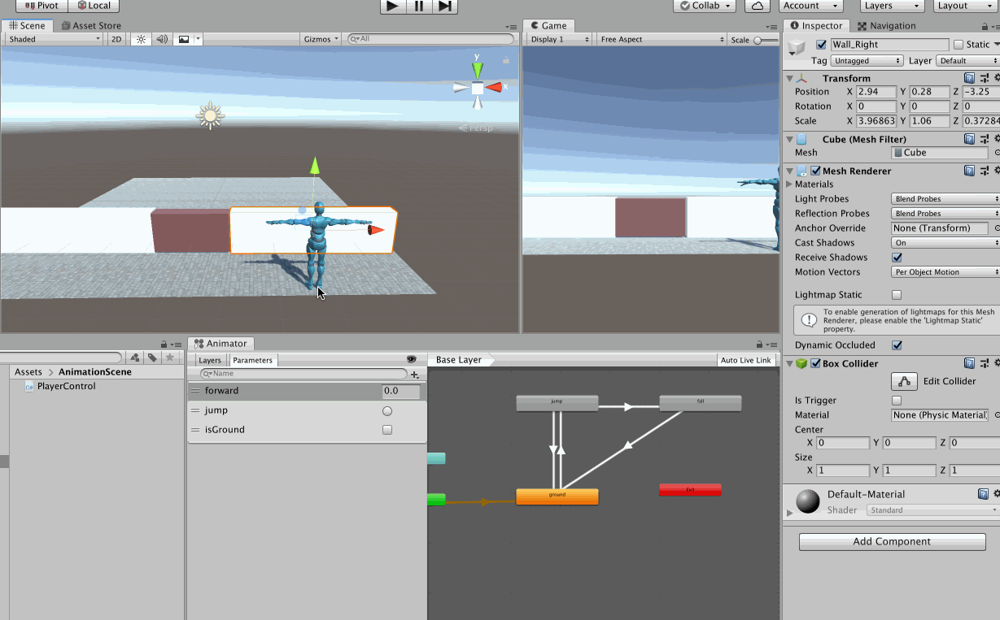

所以接下来要创建一个Animator Controller，专门给这个人物使用

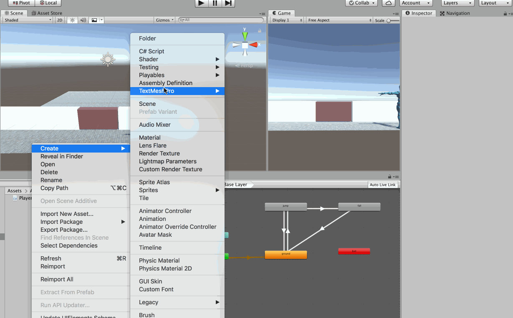

但是现在是没有任何效果的，接下来就要为这个动画控制器编辑动画状态机，就如前面所说，只有站立和行走两个状态

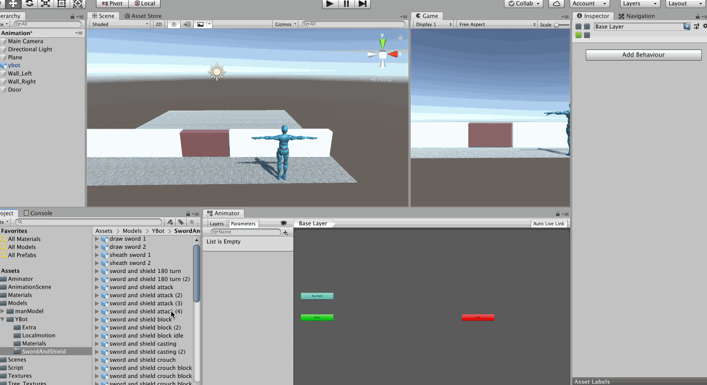

默认就是进入Idle 状态，现在不修改代码，直接运行的效果是这样的

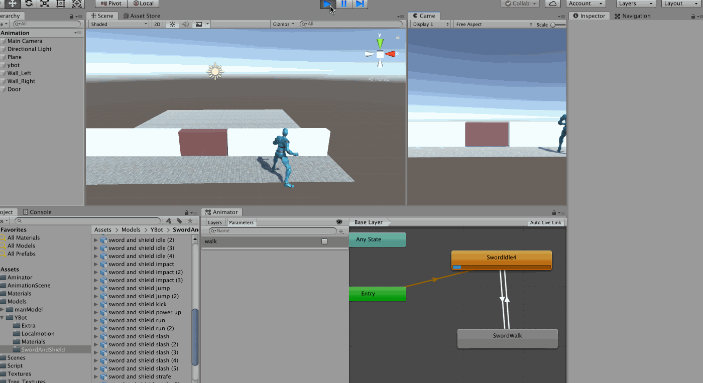

为什么人飞起来了？找到对应的动画，去【Inspector】-->【Animation】中进行设置

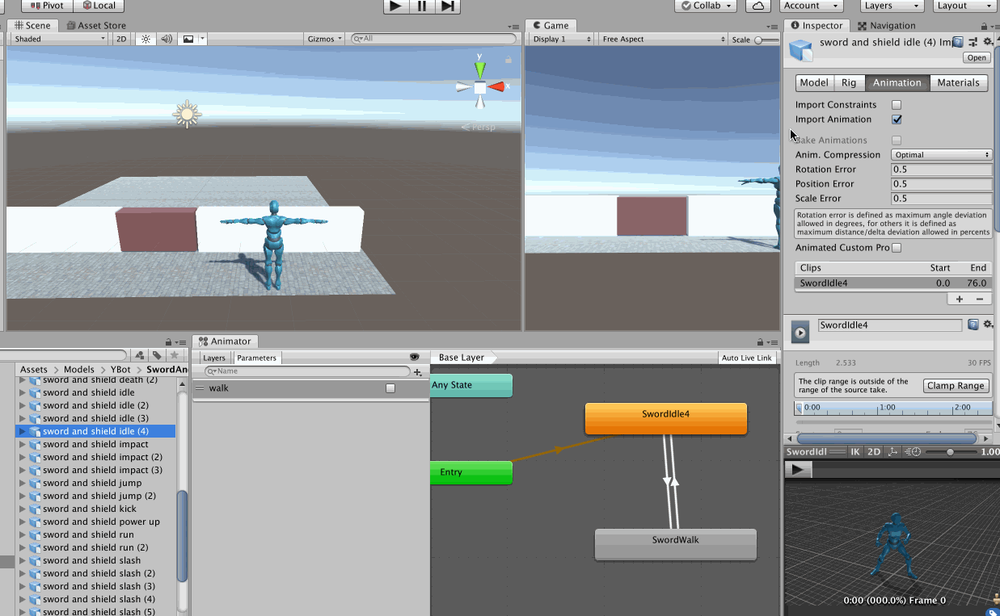

然后优化代码如下

```c#
using System.Collections;
using System.Collections.Generic;
using UnityEngine;

public class PlayerControl : MonoBehaviour
{
    private Animator anim;

    // Start is called before the first frame update
    void Start()
    {
        anim = GetComponent<Animator>();
    }

    // Update is called once per frame
    void Update()
    {
        // 垂直轴（w、s或者上下键）
        float vertical = Input.GetAxis("Vertical");
        // 水平轴（a、d或者左右键）
        float horizontal = Input.GetAxis("Horizontal");
        // 方向向量
        Vector3 dir = new Vector3(horizontal, 0, vertical);
        if(dir != Vector3.zero)
        {
            // 旋转
            transform.rotation = Quaternion.LookRotation(dir);
            // 移动
            transform.Translate(Vector3.forward * 2 * Time.deltaTime);
            // 播放行走动画
            anim.SetBool("walk", true);
        }
        else
        {
            // 播放站立动画
            anim.SetBool("walk", false);
        }
    }
}
```

现在人物在站立和行走的时候就会有动感话效果了

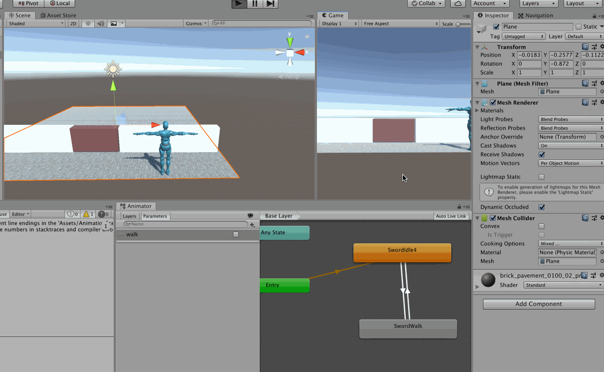

还有一个问题，为什么当人物运行起来的时候没有立马播放行走动画呢，因为少勾选了【Has Exit Time】，所以不能实现随时切换到下一个动画，必须是等当前动画播放完才能播放下一个动画，重新配置一下之后

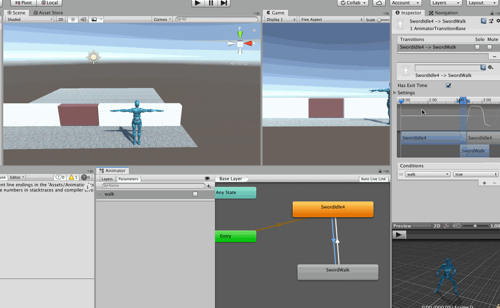

>再次强调一下，这里只是简单的展示动画效果，想想在一个游戏中一个人物会存在站立、行走、奔跑、左手攻击、右手攻击、左手防御、右手防御、被击中、倒地等大量的动画，如何使用动画状态机组织这些动画，显然也并非易事！

## 自动门

基于上面的场景，接下来使用动画实现一个自动门的效果，当人物出现在门的一定范围内门就会自动打开，否则就会自动关闭

首先为门添加一个Animation 组件，然后选中这个门，打开Animation 编辑界面（【Windows】-->【Animation】）

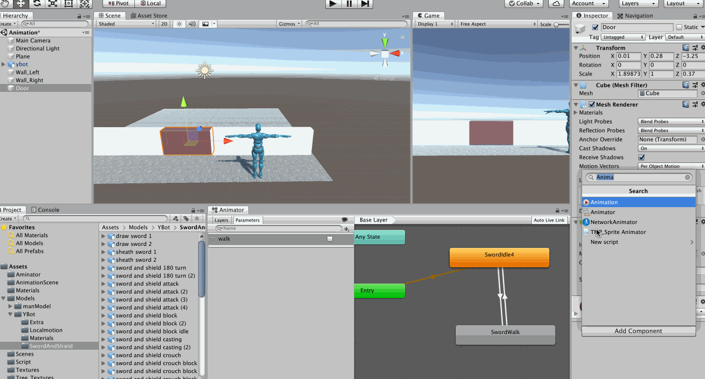

可以看到动画编辑界面上有时间轴，因为我们需要控制门的移动，所以就为门的Transform.Position 属性做动画就好了

现在看到Door 的位置是一个没有规律的坐标，为了好控制Door 的位置，先在Door 上建一个空物体（这样可以使其位置与Door 一致），然后将这个空物体挪到和Door 一个层级，然后再将Door 挪到这个空物体下面，这样Door 的相对坐标就好控制了

接下来就是通过关键帧控制门的移动，第一帧的位置是原始位置，第二帧的位置是开门后的位置，然后中间的帧Unity3D 会自动补上

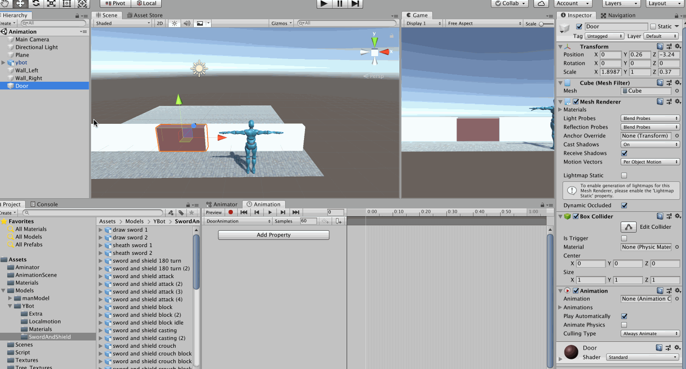

然后为了实现发现人物接近门的时候触发自动开门，那么就需要为门加一个触发器，注意是为门的父节点（那个空物体），而不是门，因为门会动，而我们不希望触发器位置发生变化

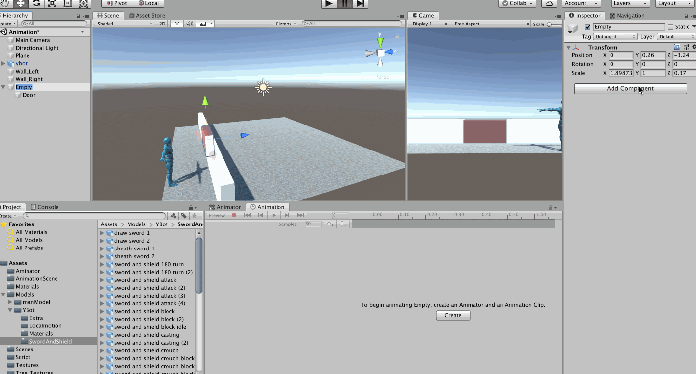

然后为空物体编写脚本如下

```c#
using System.Collections;
using System.Collections.Generic;
using UnityEngine;

public class DoorControl : MonoBehaviour
{
    private Animation ani;

    // Start is called before the first frame update
    void Start()
    {
        ani = transform.GetChild(0).GetComponent<Animation>();
    }

    private void OnTriggerEnter(Collider other)
    {
        // 动画状态
        AnimationState state = ani["DoorAnimation"];
        // 当前播放的时间
        state.time = 0;
        // 播放速度
        state.speed = 1;
        // 播放开门动画
        ani.Play("DoorAnimation");
    }

    private void OnTriggerExit(Collider other)
    {
        // 动画状态
        AnimationState state = ani["DoorAnimation"];
        // 当前播放的时间
        state.time = state.length;
        // 播放速度
        state.speed = -1;
        // 播放开门动画
        ani.Play("DoorAnimation");
    }
}
```

然后就可以实现想要的效果了

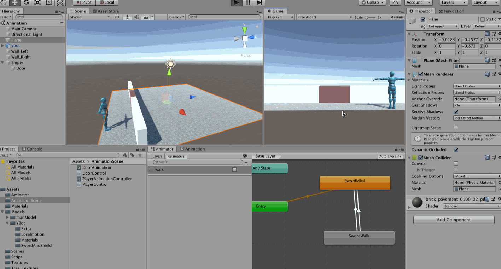

>根据这个思路，我们可以实现各种效果，比如游戏中的机关、电梯、陷阱等等

>当然，也可以通过编写代码控制门的position 来自动开关门，那这两种方法，哪种方法更加节能？或者还有没有其他更好的方法

>上面看到通过设置关键帧，Unity3D 在关键帧之间会自动填充动画，那么完全可以通过骨骼，在不同的关键帧为人物摆出不同的动作，然后利用Unity3D 的自动补全动画的特性，可以比较方便的做出丰富的动画效果

## 使用动画实现特效

实现一个球体的大小、颜色的变化特效（显然可以通过贴图等实现更加炫酷的特效）

新建一个球体，然后为其添加Animation 组件，再去编辑动画

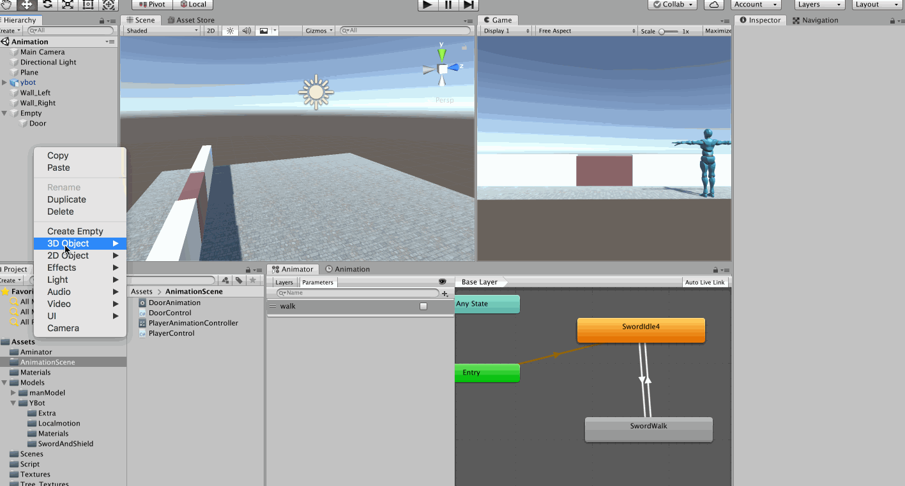

首先将该Animation 的Wrap Mode 设置为Ping Pang（动画可以持续来回播放）。然后设置关键帧，初始帧就是其初始的样子，第一个关键帧设置大小、颜色等属性，然后将该Animation 赋给该球体的Animation 组件

然后再去看运行后的动画效果

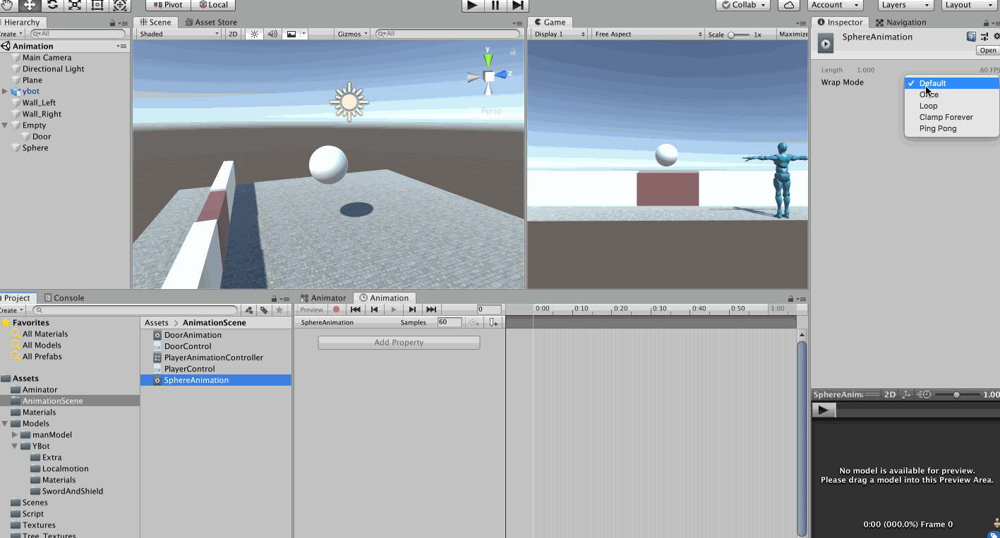

>除了使用动画实现特效，更为主流的还是使用粒子系统、Shader，那到底哪种是更优的选择呢？
