在制作RPG 游戏的时候，实现各种流畅的动画效果是必不可少的，行走、奔跑、跳跃、砍杀、防御等等，而Unity3D 就提供了很强大的动画系统，下面跟随我去感受一下

>再次强调，下面展示的动画效果都是比较初级和简单的，要制作一个成熟的RPG 游戏，单动画状态机里面就可能存在数十种状态，如果管理这些状态也不是一件易事

## 动画的一些基础概念

在当前场景中新建一个Plane（平面），然后为其添加地砖贴图（使用贴图可以简单高效的做出很多中视觉效果），然后拖动一个模型到场景中，大概就是这个效果

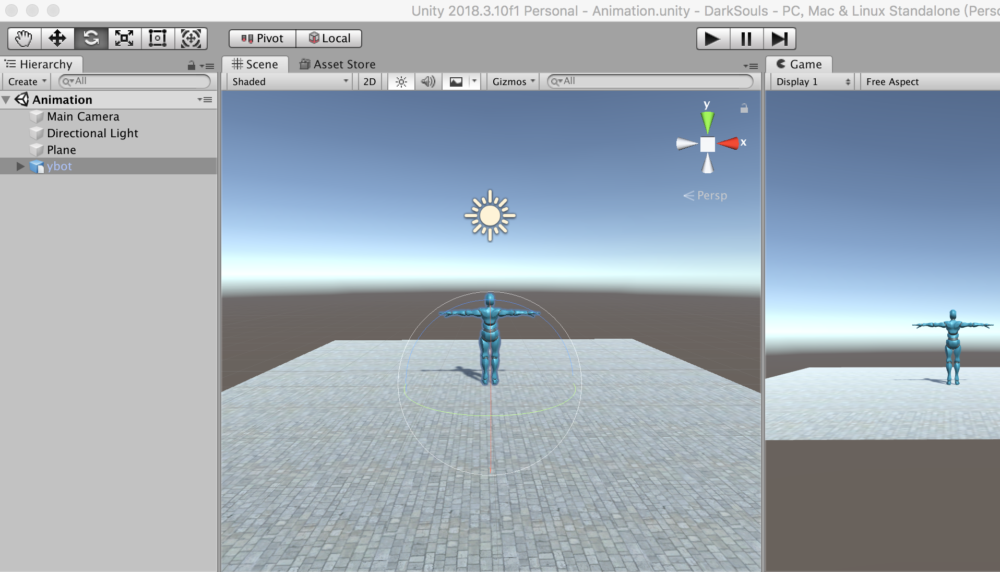

可以在Project 中看到模型的层级下有一个ybotAvatar，这就是模型的骨骼

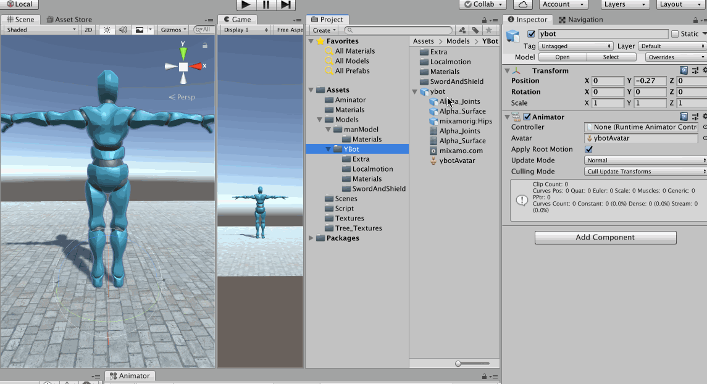

还可以在骨骼编辑模式下通过骨骼为模型摆出各种动作、姿势

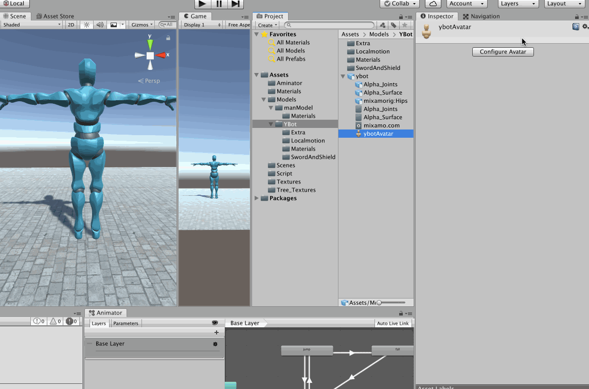

>建议去仔细研究一个模型的每一个骨骼，去尝试编辑一下骨骼！

在对应的动画文件的配置上，有一个Source 选项，这里选择的就是对应模型的骨骼


动画类型有四种：None（无动画）、Legacy（Animation动画）、Generic（通用型动画）、Humanoid（人型动画）

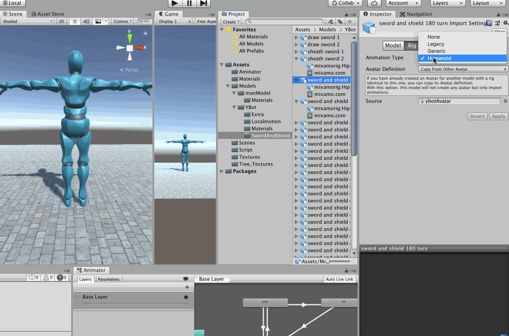

## 搭建简单场景

基于上面的简单场景，通过两个Cube 制作两个墙，墙中间放一个门

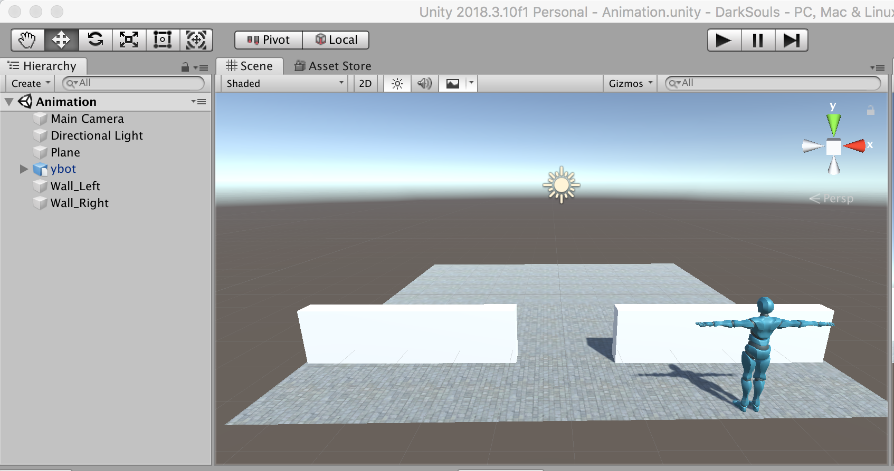

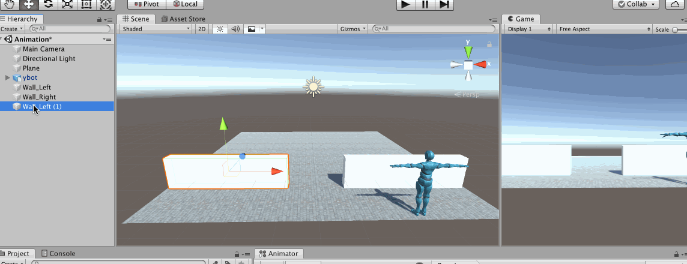

为了区分门和墙，所以为墙添加一个简单的颜色材质

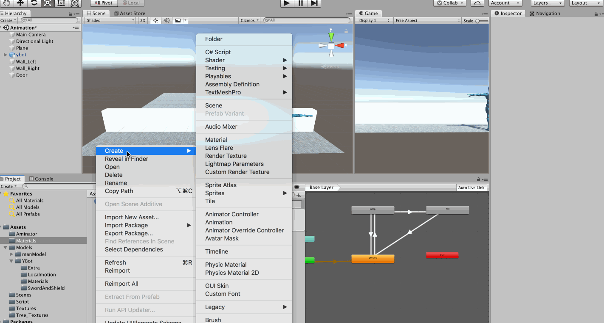

为了解决上面出现的门滑到墙里出现的渲染问题，可以将门的大小（Scale）设置的稍微比墙小一些

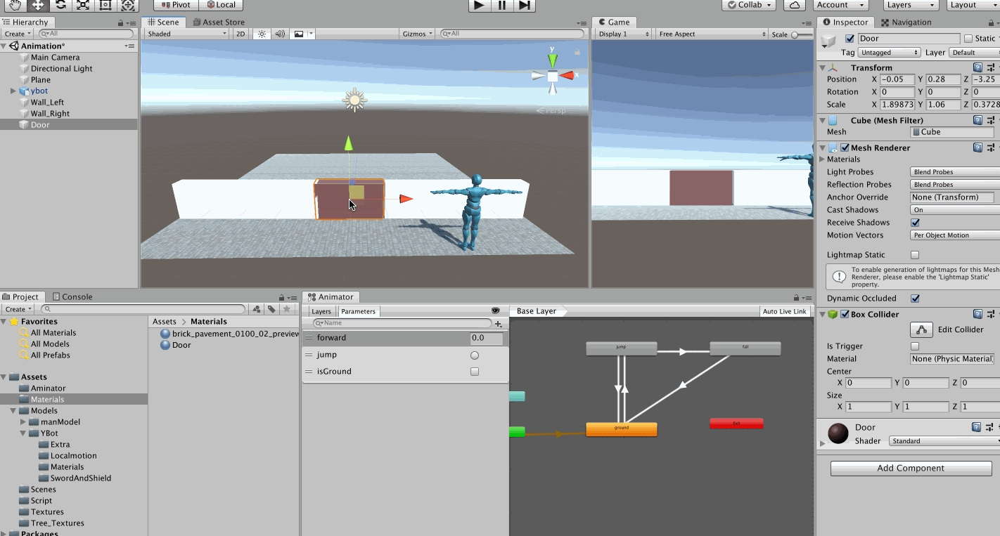

## 让模型动起来

为人物添加胶囊碰撞体和刚体，为了控制人物后续的碰撞等行为

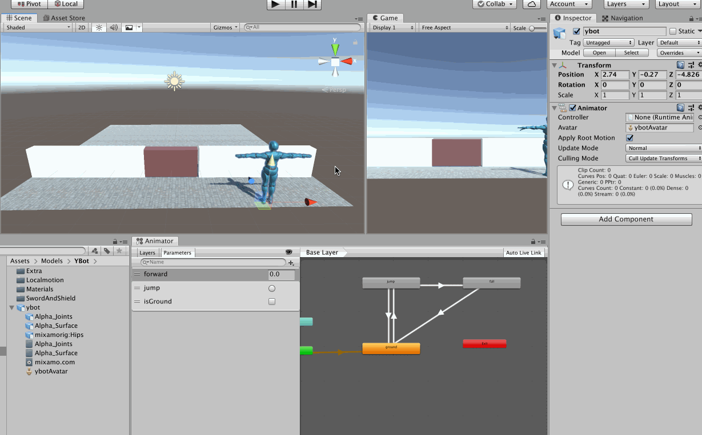

为人物添加脚本，让人物可以通过键盘控制动起来（暂时不加动画效果）

```c#
using System.Collections;
using System.Collections.Generic;
using UnityEngine;

public class PlayerControl : MonoBehaviour
{
    // Start is called before the first frame update
    void Start()
    {
        
    }

    // Update is called once per frame
    void Update()
    {
        // 垂直轴
        float vertical = Input.GetAxis("Vertical");
        // 水平轴
        float horizontal = Input.GetAxis("Horizontal");
        // 方向向量
        Vector3 dir = new Vector3(horizontal, 0, vertical);
        if(dir != Vector3.zero)
        {
            // 旋转
            transform.rotation = Quaternion.LookRotation(dir);
            // 移动
            transform.Translate(Vector3.forward * 2 * Time.deltaTime);
        }
    }
}
```

>注意，比如一些行走动画，有的动画自带移动，有的动画只有行走的动作，但并不会真正产生位移！

运行效果如下

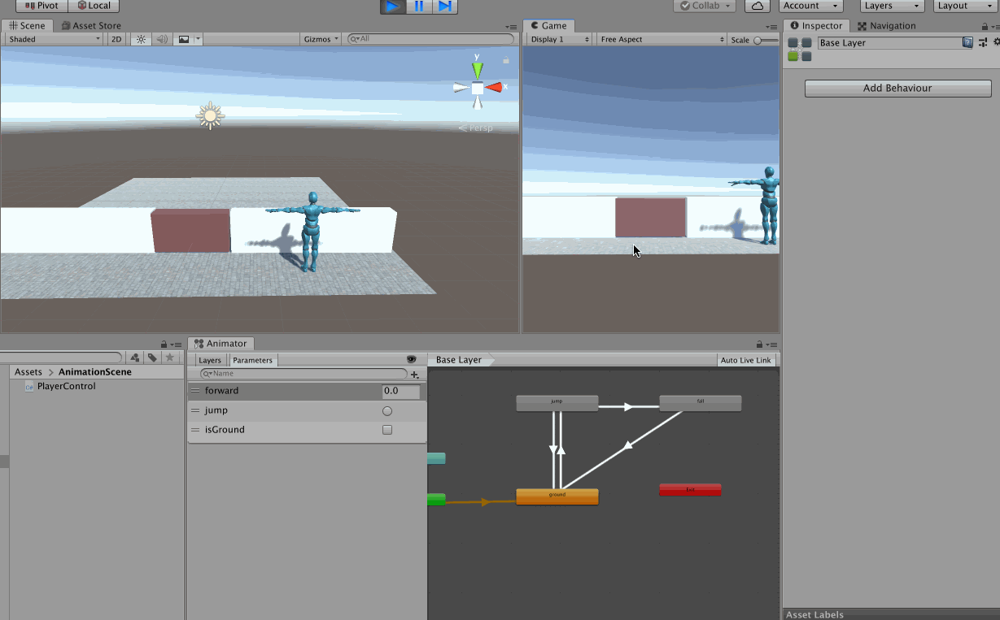

哎，为什么碰到墙之后就倒下了呢？需要为模型刚体固定旋转，然后就可以解决这个问题了

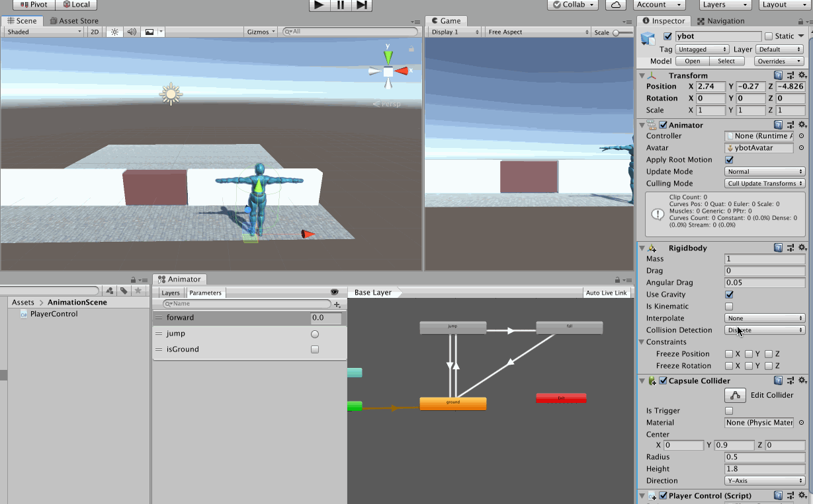

## 添加动画

人物可以动起来了，接下来我们就要添加动画，这里就简单的添加人物静止和走路的动画

首先创建一个

## 自动门


然后

>根据这个思路，我们可以实现各种效果，比如游戏中的机关、电梯、陷阱等等

## 