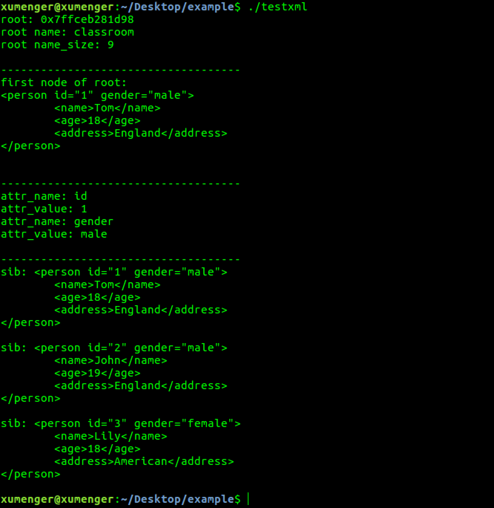

>测试环境：Ubuntu 16.04 LTS、C++11

>rapidxml是一个快速的xml库，官方网站：[http://rapidxml.sourceforge.net/](http://rapidxml.sourceforge.net/)，根据manual 看到，竟然比tinyxml 快了50-100倍

编写测试代码如下

```c++
#include "rapidxml.hpp"
#include "rapidxml_utils.hpp"
#include "rapidxml_print.hpp"
#include "rapidxml_iterators.hpp"

int main()
{

    return 0;
}
```

编译的时候直接报错如下


这些错误是因为 rapidxml_iterators.hpp 这个头文件导致的。在常规的XML 解析中，其实这个头文件并不是必须的！

所以暂时的解决方法就是先不包含这个头文件！

>[https://stackoverflow.com/questions/3830822/compile-rapidxml-under-linux-with-g](https://stackoverflow.com/questions/3830822/compile-rapidxml-under-linux-with-g)

## 加载XML 文件

用来测试的XML 文件内容如下

```xml
?xml verson="1.0" encoding="utf-8"

<classroom>
    <person>
        <name>Tom</name>
        <age>18</age>
        <address>England</address>
    </person>
    <person>
    	<name>John</name>
        <age>19</age>
        <address>England</address>
    </person>
    <person>
        <name>Lily</name>
        <age>18</age>
        <address>American</address>
    </person>
</classroom>
```

编写测试程序如下

```c++
#include "rapidxml/rapidxml.hpp"
//#include "rapidxml/rapidxml_iterators.hpp"
#include "rapidxml/rapidxml_print.hpp"
#include "rapidxml/rapidxml_utils.hpp"

#include <iostream>

int main ()
{
    rapidxml::file<> doc("./classroom.xml");

    std::cout << "----begin" << std::endl;
    std::cout << "----length: " << doc.size() << std::endl;
    std::cout << doc.data() << std::endl;
    std::cout << "----end" << std::endl;

    return 0;
}
```

编译运行


## 解析XML文件

编写代码如下

```c++
#include "rapidxml/rapidxml.hpp"
//#include "rapidxml/rapidxml_iterators.hpp"
#include "rapidxml/rapidxml_print.hpp"
#include "rapidxml/rapidxml_utils.hpp"

#include <iostream>

int main ()
{
    rapidxml::file<> xmlfile("./classroom.xml");

    std::cout << "----begin" << std::endl;
    std::cout << "----length: " << xmlfile.size() << std::endl;
    std::cout << xmlfile.data() << std::endl;
    std::cout << "----end" << std::endl;

    return 0;
}
```

编译运行



## 参考资料

* [compile rapidxml under linux with g++](https://stackoverflow.com/questions/3830822/compile-rapidxml-under-linux-with-g)
* [c++ rapidxml node_iterator example?](https://stackoverflow.com/questions/2104523/c-rapidxml-node-iterator-example)
* [RAPIDXML Manual](http://rapidxml.sourceforge.net/manual.html)
* [rapidxml,一个快速的xml库](https://www.cnblogs.com/lancidie/archive/2013/04/13/3019527.html)
* [c++开源库rapidxml介绍与示例](https://blog.csdn.net/v_xchen_v/article/details/75634273)