想要深入研究原理，首先要把环境搭建起来！

[Elasticsearch](https://www.elastic.co/) 是实时全文搜索和分析引擎，提供搜集、分析、存储数据三大功能。开放RESTful 和Java API 等接口提供搜索功能，也是可扩展的分布式系统。它构建于Apache Luncene 搜索引擎智商

Logstash 是一个搜集、分析、过滤日志的工具。它支持几乎任何类型的日志，包括系统日志、错误日志和自定义应用程序日志。它可以从许多来源接收日志，这些来源包括syslog、消息传递（RabbitMQ、Kafka）和JMX，它能够以多种方式输出数据，包括电子邮件、websockets 和Elasticsearch

Kibana 是一个基于Web 的图形界面，用于搜索、分析和可视化存储在Elasticsearch 中的日志数据。它利用Elasticsearch 的RESTful 接口来检索数据，不仅允许用户创建他们自己的数据的定制仪表板视图，还允许用户以特殊的方式查询和过滤数据

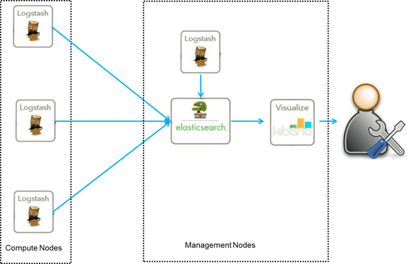

>在[https://www.elastic.co/cn/downloads/](https://www.elastic.co/cn/downloads/) 可以下载Elasticsearch、Logstash、Kibana……

## 安装Elasticsearch

```shell
wget https://artifacts.elastic.co/downloads/elasticsearch/elasticsearch-7.4.2-darwin-x86_64.tar.gz

tar -zxvf elasticsearch-7.4.2-darwin-x86_64.tar.gz

rm elasticsearch-7.4.2-darwin-x86_64.tar.gz

cd ./elasticsearch-7.4.2/

./bin/elasticsearch
```

ES 端口默认为9200。到浏览器输入[http://localhost:9200/](http://localhost:9200/) 查看

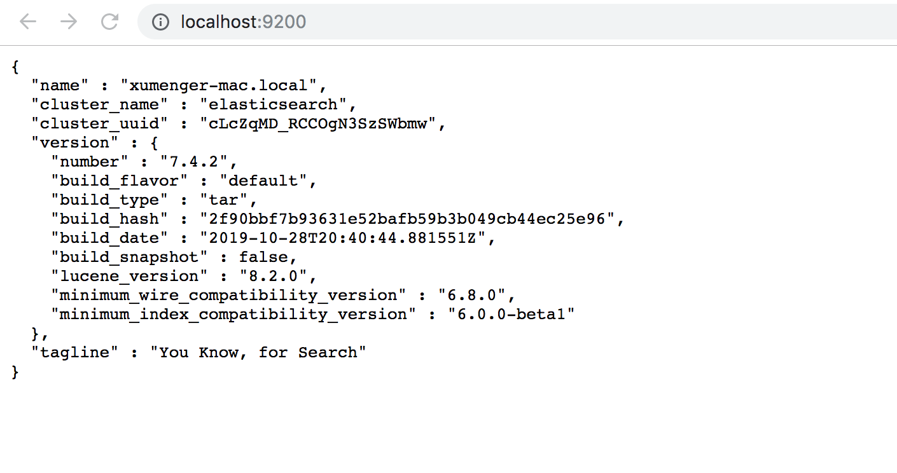

>control + C 可以停掉ES 服务

## 使用curl与ES交互

安装并将ES 服务启动之后，可以通过curl 直接以HTTP 的方式与之交互

?后面的是可选参数

**查看集群健康状态**

```
curl -X GET 'localhost:9200/_cat/health?v'
```

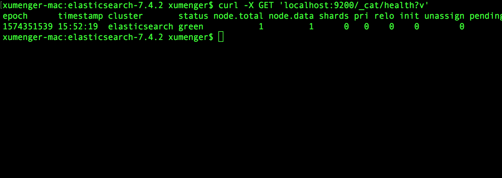

**索引操作**

```
--查看索引
curl -X GET 'localhost:9200/_cat/indices?v'

--创建索引
curl -X PUT 'localhost:9200/customer?pretty'

--删除索引
curl -X DELETE 'localhost:9200/customer?pretty'
```

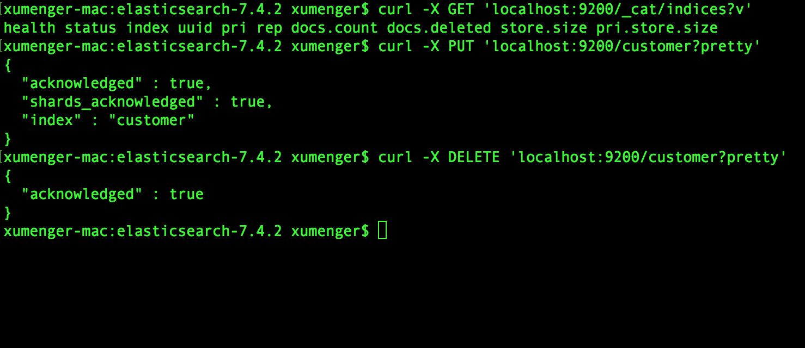

**文档操作**

```
--添加文档
curl -X PUT "localhost:9200/customer/_doc/1?pretty" -H 'Content-Type: application/json' -d'{"name":"xumeng"}'

--查询文档
curl -X GET "localhost:9200/customer/_doc/1?pretty"

--更新文档
curl -X POST "localhost:9200/customer/_doc/1/_update?pretty" -H 'Content-Type: application/json' -d'{"doc":{"name":"joker"}}'

--删除文档
curl -X DELETE "localhost:9200/customer/_doc/1?pretty"
```

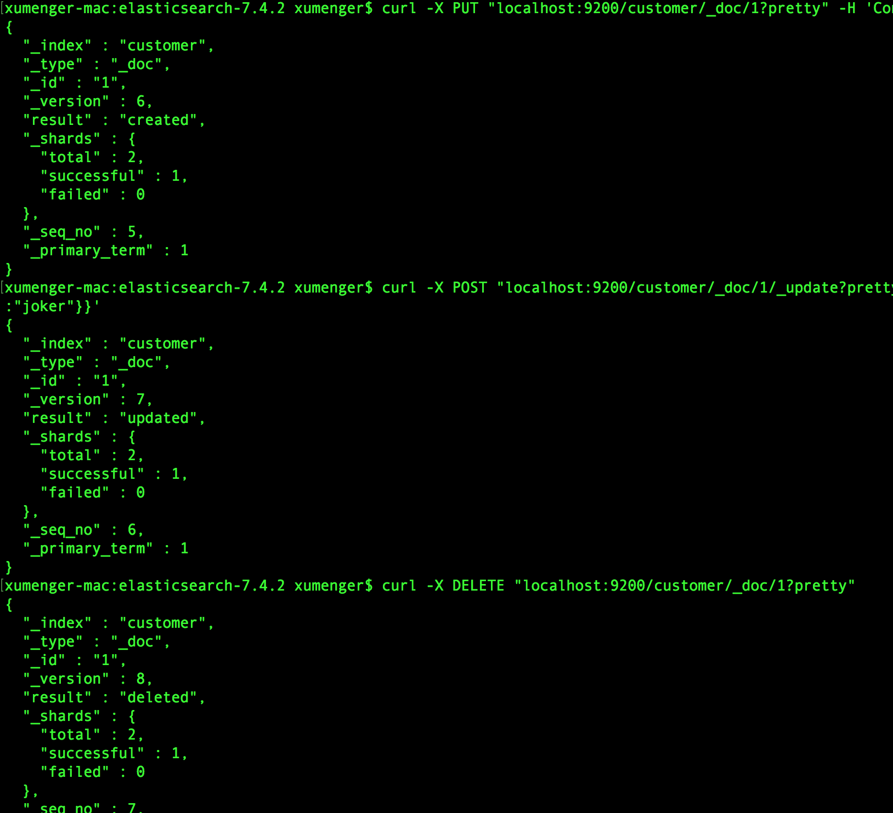

更多文档资料，参考：[https://www.elastic.co/guide/en/elasticsearch/reference/current/index.html](https://www.elastic.co/guide/en/elasticsearch/reference/current/index.html)

## 安装Kibana

```shell
wget https://artifacts.elastic.co/downloads/kibana/kibana-7.4.2-darwin-x86_64.tar.gz

tar -zxvf kibana-7.4.2-darwin-x86_64.tar.gz

cd ./kibana-7.4.2-darwin-x86_64

./bin/kibana
```

Kibana 的默认端口为5601。在网页输入[http://localhost:5601](http://localhost:5601) 查看是否可以使用

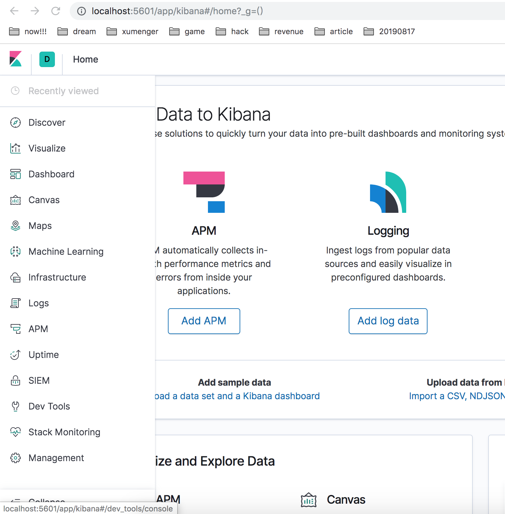

左侧的菜单栏是Kibana 的主要操作菜单，这里的每一个功能都值得好好研究，了解背后对应的原理

这里就不详细展示了

## 通过Kibana访问ES

查看现有的索引，最开始的时候是没有的

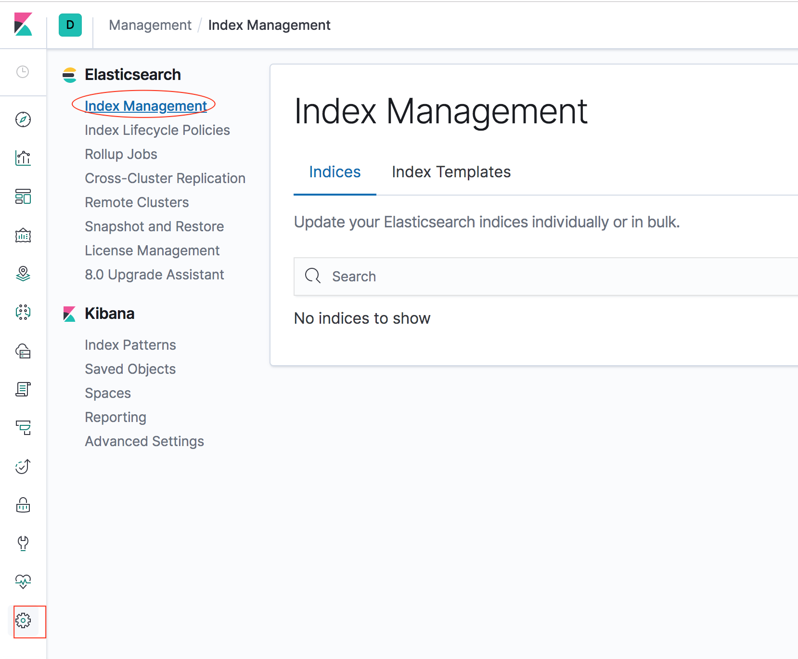

使用下面命令创建customer 索引后，刷新Kibana，再Kibana 中去查看索引

```
curl -X PUT 'localhost:9200/customer?pretty'
```

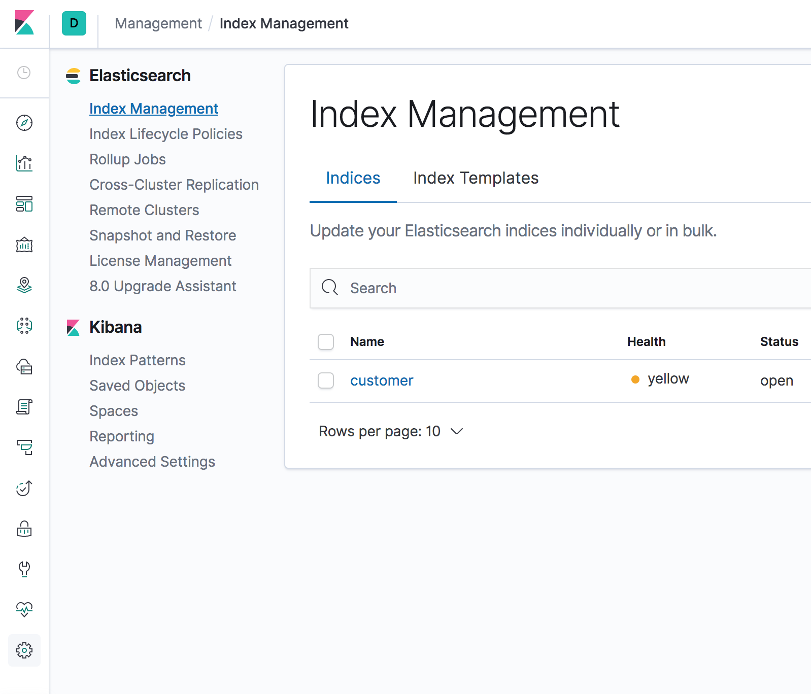

尝试去创建索引模式（对于ES 的索引现在还不是很了解），但是当现在没有数据的时候是不能创建index pattern 的

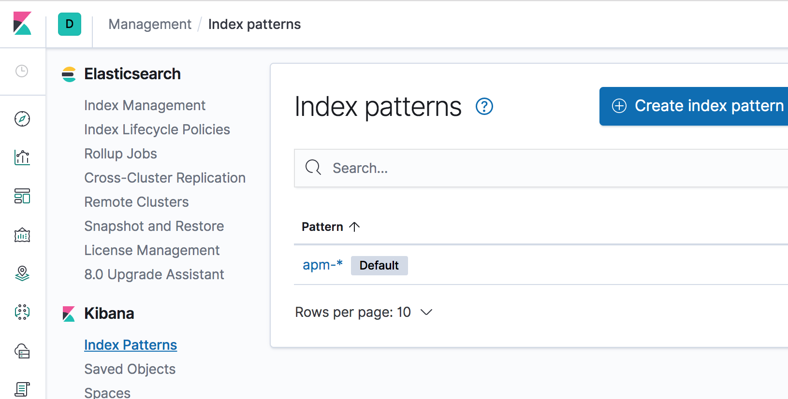

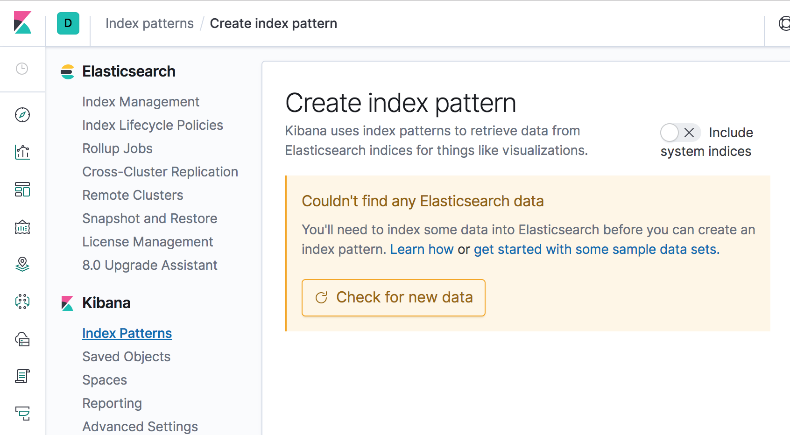

执行下面命令，在customer 索引下创建文档后，在创建index pattern

```
curl -X PUT "localhost:9200/customer/_doc/1?pretty" -H 'Content-Type: application/json' -d'{"name":"xumeng"}'
```

创建index pattern 的时候，随便输入一个index pattern，不可以匹配到任何一个索引

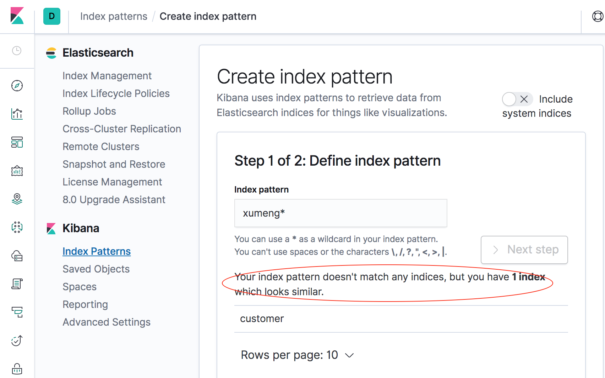

所以index pattern 要与已有的index 相关

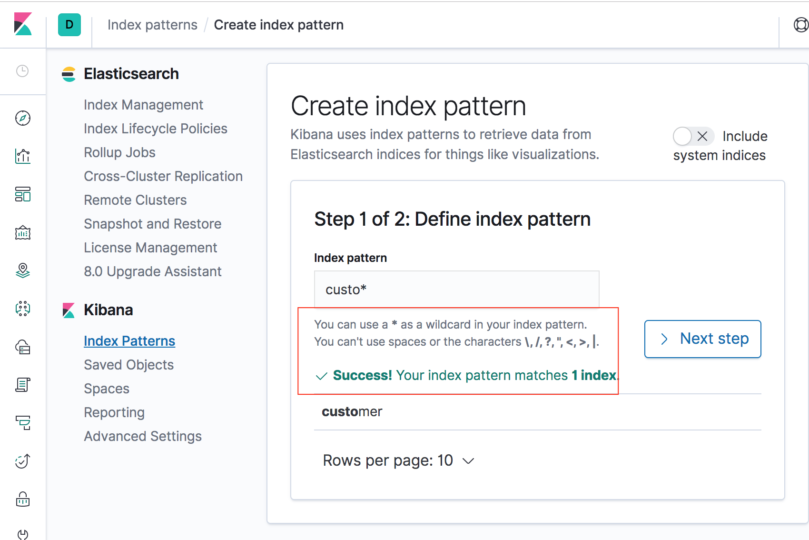

假如我创建一个index pattern 为 custome\*，并将其设置为default pattern （点击下图中的星星）

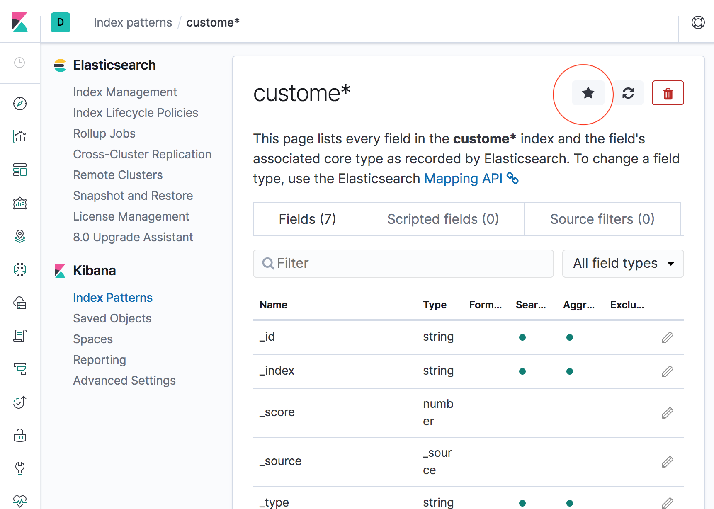

然后到Discover 菜单中可以尝试根据关键字进行搜索

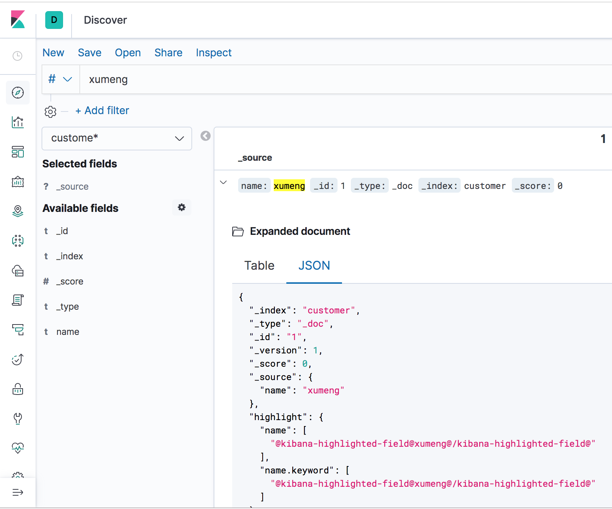

## 更多内容

本文就不再继续讲Logstash 的安装和配置了

本文也没有更详细的讲ES、Kibana 的配置，也没有详细讲它们的工作原理

另外，在现在常见的应用场景中，从Kafka 中获取日志信息是很主流的做法，具体如何实现，本文也没有详细讲到

ES、Kibana 的更多操作、更多原理这里也暂不涉及

倒排索引的原理是什么？为什么可以实现这么高效的搜索？

更多使用curl 操作ES 的语法？

Kibana 界面上更多的功能？交互操作？

如何使用Kibana 做出来柱状图？饼图？


## 参考资料

* [快速搭建ELK日志分析系统](https://www.cnblogs.com/yuhuLin/p/7018858.html)
* [Kafka的高可用策略](http://www.xumenger.com/kafka-replica-20190316/)
* [搭建Kafka运行环境](http://www.xumenger.com/kafka-zookeeper-20181117/)
* [分布式消息队列Kafka](http://www.xumenger.com/eclipse-kafka-20181113/)
* [100亿数据1万属性数据架构设计](https://www.w3cschool.cn/architectroad/architectroad-data-architecture-design.html)
* [深入浅出搜索架构引擎、方案与细节（上）](https://www.w3cschool.cn/architectroad/architectroad-search-architecture.html)
* [如何迅猛的实现搜索需求](https://www.w3cschool.cn/architectroad/architectroad-implement-search-needs.html)
* [百度如何能实时检索到15分钟前新生成的网页？](https://www.w3cschool.cn/architectroad/architectroad-real-time-search.html)
* [MAC ELK环境搭建](https://blog.csdn.net/zhengdesheng19930211/article/details/80249919)
* [Mac上搭建ELK](http://blog.ywheel.cn/post/2017/03/04/setup_elk_on_mac/)
* [ELK + kafka 日志方案](https://www.cnblogs.com/demodashi/p/8458072.html)
* [使用 Kafka 和 ELK 搭建测试日志系统（1）](https://www.cnblogs.com/sammyliu/p/7614209.html)
* [CURL 快速操作ES](https://www.jianshu.com/p/a9322a6609be)
