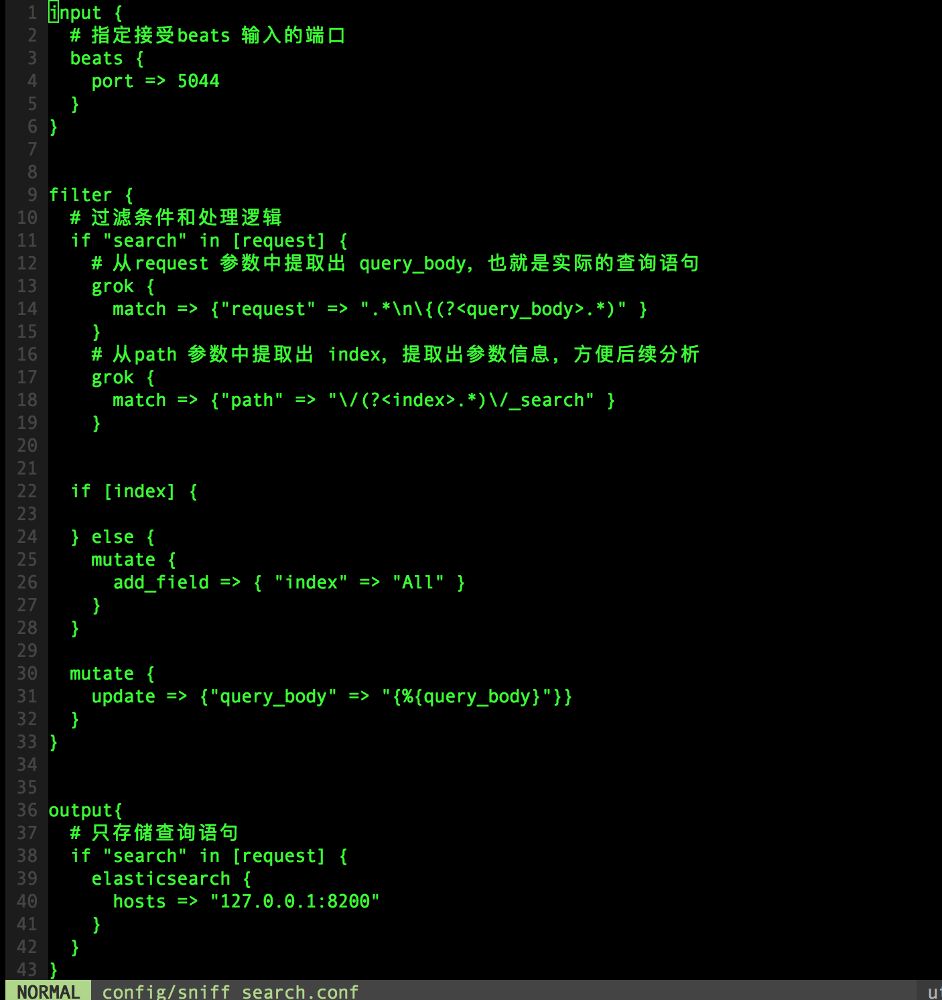
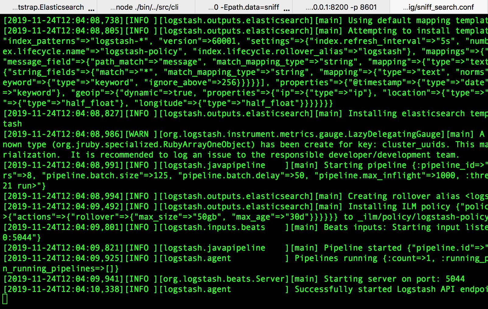

>本文的实战完全参考自[《Elastic Stack入门》](https://www.imooc.com/video/16131)

首先参考[《搭建ELK环境》](http://www.xumenger.com/elk-20191123/)，搭建好Elasticsearch、Kibana 的环境。另外需要的logstash、packetbeat 等也都可以在[https://www.elastic.co/cn/downloads/](https://www.elastic.co/cn/downloads/) 下载

收集Elasticsearch 集群的查询语句，分析查询语句的常用语句、响应时长等

使用Packetbeat 和Logstash 完成数据收集的工作；使用Kibana 和Elasticsearch 完成数据分析的工作


* 使用Packetbeat 监控某个业务Elasticsearch 集群的查询语句的情况
* Packetbeat 通过网络抓包的方式，将监控到的数据发送给Logstash
* 然后Logstash 对抓取到的数据作一些处理，然后存储到监控Elasticsearch 中
* 再通过监控集群的Kibana 对数据进行分析

## 准备测试环境

业务Elasticsearch 集群使用默认的配置就好

```
--默认配置启动Elasticsearch，监听在9200 端口
./bin/elasticsearch


--默认配置启动Kibana，监听在5601 端口，并且接收9200 的ES 的数据
./bin/kibana
```

监控Elasticsearch 集群需要修改端口等信息，不要和业务ES 集群冲突，防止陷入抓包死循环！

```
--监控ES，监听8200 端口
--指定集群名，如果两个ES 应用的集群名一样，则会加入到一个集群中
--修改数据存储所在的目录
./bin/elasticsearch -Ecluster.name=sniff_search -Ehttp.port=8200 -Epath.data=sniff


--对应的Kibana，监听8601 端口
--设置接收8200 的ES 的数据
./bin/kibana -e http://127.0.0.1:8200 -p 8601
```

在浏览器中访问[http://127.0.0.1:5601](http://127.0.0.1:5601) 可以访问到业务ES 对应的Kibana，对应可以做一些操作

在浏览器中访问[http://127.0.0.1:8601](http://127.0.0.1:8601) 可以访问到监控ES 对应的Kibana，对应可以做一些操作

后面的流程就是，在[http://127.0.0.1:5601](http://127.0.0.1:5601) 中做一些文档的创建、查询等操作，通过Packetbeat 抓包，发给Logstash 进行分析，然后存储到监控ES 中，再在[http://127.0.0.1:8601](http://127.0.0.1:8601) 中查看、分析这些数据

## logstash

指定sniff_search.conf 的内容如下

```
input { 
  # 指定接受beats 输入的端口
  beats { 
    port => 5044 
  }
}


filter {
  # 过滤条件和处理逻辑
  if "search" in [request] {
    # 从request 参数中提取出 query_body，也就是实际的查询语句
    grok { 
      match => {"request" => ".*\n\{(?<query_body>.*)" }
    }
    # 从path 参数中提取出 index，提取出参数信息，方便后续分析
    grok { 
      match => {"path" => "\/(?<index>.*)\/_search" }
    }


  if [index] {

  } else {
    mutate {
      add_field => { "index" => "All" }
    }
  }

  mutate {
    update => {"query_body" => "{%{query_body}"}}
  }
}


output{
  # 只存储查询语句
  if "search" in [request] {
    elasticsearch { 
      hosts => "127.0.0.1:8200" 
    }
  }
}
```

然后执行下面的命令可以以指定配置文件的方式启动logstash

```
./bin/logstash -f ./config/sniff_search.conf
```



## packetbeat

其配置内容sniff_search.yml 如下

```
packetbeat.interfaces.device: lo0

packetbeat.protocols.http: 
    # 监听的端口
    ports: [9200]
    # 记录所有的请求内容
    send_request: true
    include_body_for: ["application/json", "x-www-form-urlencoded"]

output.logstash: 
    # 抓取结果后，传输给指定地址的logstash
    hosts: ["127.0.0.1:5044"]
```

然后执行下面的命令可以以指定配置文件的方式启动packetbeat

```
sudo ./packetbeat -e -c sniff_search.yml -strict.perms=false
```



## 


## 总结和展望

这个小的实战项目仅仅只是展示了ELK 的一个极小的功能点，但是从效果看起来，真的已经是很强大了

学会查阅和搜索官方文档：[https://www.elastic.co/learn](https://www.elastic.co/learn)

学会在社区正确地提问：[https://elasticsearch.cn/](https://elasticsearch.cn/)

通过Elastic 日报持续学习：[https://elasticsearch.cn/explore/category-18](https://elasticsearch.cn/explore/category-18)
