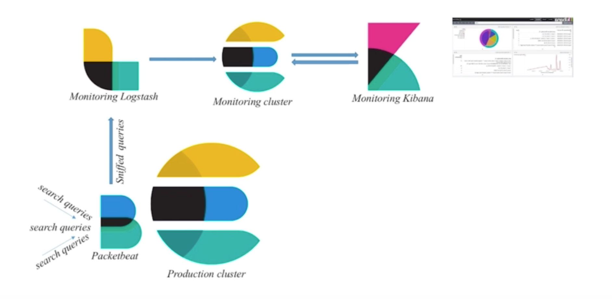

>本文的实战完全参考自[Elastic Stack入门](https://www.imooc.com/video/16131)

首先参考[搭建ELK环境](http://www.xumenger.com/elk-20191123/)，搭建好Elasticsearch、Kibana 的环境

收集Elasticsearch 集群的查询语句，分析查询语句的常用语句、响应时长等

使用Packetbeat 和Logstash 完成数据收集的工作；使用Kibana 和Elasticsearch 完成数据分析的工作

* 使用Packetbeat 监控某个业务Elasticsearch 集群的查询语句的情况
* Packetbeat 通过网络抓包的方式，将监控到的数据发送给Logstash
* 然后Logstash 对抓取到的数据作一些处理，然后存储到监控Elasticsearch 中
* 再通过监控集群的Kibana 对数据进行分析

## 

## 总结和展望

这个小的实战项目仅仅只是展示了ELK 的一个极小的功能点，但是从效果看起来，真的已经是很强大了

学会查阅和搜索官方文档：[https://www.elastic.co/learn](https://www.elastic.co/learn)

学会在社区正确地提问：[https://elasticsearch.cn/](https://elasticsearch.cn/)

通过Elastic 日报持续学习：[https://elasticsearch.cn/explore/category-18](https://elasticsearch.cn/explore/category-18)