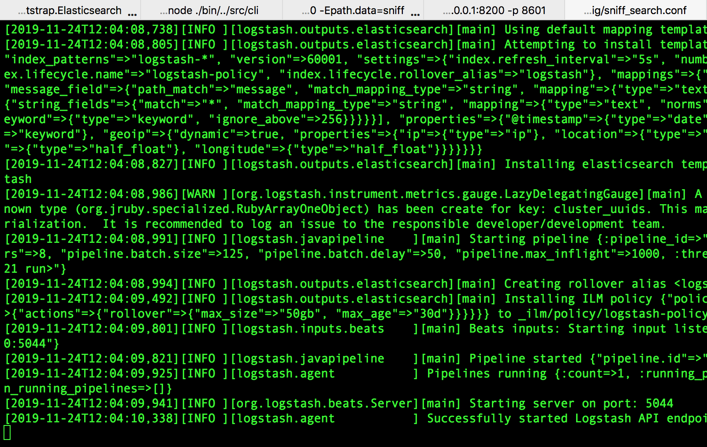
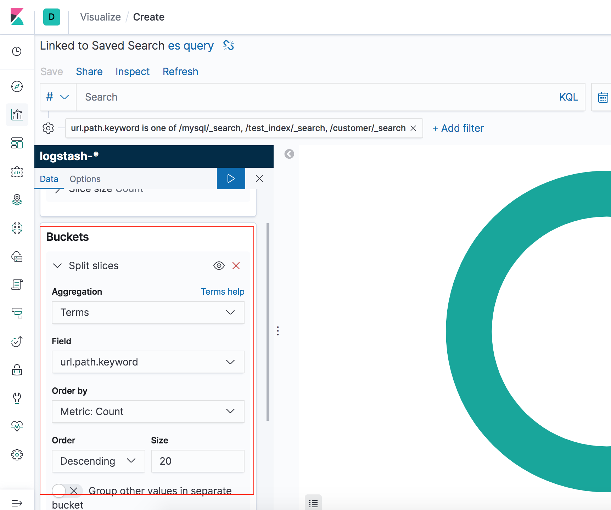

>本文的实战完全参考自[《Elastic Stack入门》](https://www.imooc.com/video/16131)

首先参考[《搭建ELK环境》](http://www.xumenger.com/elk-20191123/)，搭建好Elasticsearch、Kibana 的环境。另外需要的logstash、packetbeat 等也都可以在[https://www.elastic.co/cn/downloads/](https://www.elastic.co/cn/downloads/) 下载

收集Elasticsearch 集群的查询语句，分析查询语句的常用语句、响应时长等

使用Packetbeat 和Logstash 完成数据收集的工作；使用Kibana 和Elasticsearch 完成数据分析的工作


* 使用Packetbeat 监控某个业务Elasticsearch 集群的查询语句的情况
* Packetbeat 通过网络抓包的方式，将监控到的数据发送给Logstash
* 然后Logstash 对抓取到的数据作一些处理，然后存储到监控Elasticsearch 中
* 再通过监控集群的Kibana 对数据进行分析

## 准备测试环境

业务Elasticsearch 集群使用默认的配置就好

```
--默认配置启动Elasticsearch，监听在9200 端口
./bin/elasticsearch


--默认配置启动Kibana，监听在5601 端口，并且接收9200 的ES 的数据
./bin/kibana
```

监控Elasticsearch 集群需要修改端口等信息，不要和业务ES 集群冲突，防止陷入抓包死循环！

```
--监控ES，监听8200 端口
--指定集群名，如果两个ES 应用的集群名一样，则会加入到一个集群中
--修改数据存储所在的目录
./bin/elasticsearch -Ecluster.name=sniff_search -Ehttp.port=8200 -Epath.data=sniff


--对应的Kibana，监听8601 端口
--设置接收8200 的ES 的数据
./bin/kibana -e http://127.0.0.1:8200 -p 8601
```

在浏览器中访问[http://127.0.0.1:5601](http://127.0.0.1:5601) 可以访问到业务ES 对应的Kibana，对应可以做一些操作

在浏览器中访问[http://127.0.0.1:8601](http://127.0.0.1:8601) 可以访问到监控ES 对应的Kibana，对应可以做一些操作

后面的流程就是，在[http://127.0.0.1:5601](http://127.0.0.1:5601) 中做一些文档的创建、查询等操作，通过Packetbeat 抓包，发给Logstash 进行分析，然后存储到监控ES 中，再在[http://127.0.0.1:8601](http://127.0.0.1:8601) 中查看、分析这些数据

## logstash配置

指定sniff_search.conf 的内容如下


然后执行下面的命令可以以指定配置文件的方式启动logstash

```
./bin/logstash -f ./config/sniff_search.conf
```



## packetbeat配置

其配置内容sniff_search.yml 如下

```
packetbeat.interfaces.device: lo0

packetbeat.protocols.http: 
    # 监听的端口
    ports: [9200]
    # 记录所有的请求内容
    send_request: true
    include_body_for: ["application/json", "x-www-form-urlencoded"]

output.logstash: 
    # 抓取结果后，传输给指定地址的logstash
    hosts: ["127.0.0.1:5044"]
```

然后执行下面的命令可以以指定配置文件的方式启动packetbeat

```
sudo ./packetbeat -e -c sniff_search.yml -strict.perms=false
```


## 在业务ES集群造一些测试数据

在[《搭建ELK环境》](http://www.xumenger.com/elk-20191123/) 讲到了如何使用curl 增删改查索引、文档

另外在Kibana 的Dev Tools 中也可以做这些操作


具体的内容拷贝如下，可以参考下面这些操作，进行更多的查询，这样在监控ES 中就可以收到更多的数据，统计的时候就会更加丰富

```
# 创建索引
PUT /test_index?pretty


# 查看索引test_index
GET /test_index/_search


# 查看customer索引的文档
GET customer/_search


# 按照条件查询customer索引
GET customer/_search
{
  "query":{
    "match" : {
      "name" : "xumeng"
    }
  }
}


# 在test_index中创建一个文档，类型是_doc，id是1
POST test_index/_doc/1
{
  "username": "joker",
  "age": "18",
  "sex": "male"
}


# 创建文档
POST test_index/_doc/2
{
  "username": "john",
  "age": "18",
  "sex": "male"
}


# 查询test_index
GET test_index/_search
{
  "query": {
    "match": {
      "age": "18"
    }
  }
}


# 更多增删改查操作

# 创建索引
PUT /test_index_1?pretty

# 删除索引
DELETE /test_index_1


# 建议创建更多索引
# 进行更多查询操作
```

## 在监控ES集群查看数据

上面的操作在业务ES 集群中进行了很多的查询，对应的packetbeat 也抓了很多的数据发给监控ES，接下来就通过Kibana 去监控ES 查看这些数据，进行简单的数据分析

首先我们把logstash 进行索引，【Management】->【Index patterns】->【Create index pattern】


一旦加入之后，就可以通过【Discover】去查看数据了


将index（注意是index，而不是\_index，index 是从业务ES 中收集过来的查询数据所查询的索引，\_index 是监控ES 中每个文档自己对应的索引）、	url.path 添加到Selected fields 中，可以看到大量的查询其实都是Kibana 定时去向ES 发起的查询，而不是我们自己业务索引的查询


## Kibana可视化展示

因为logstash 的配置文件中filter 的错误配置，导致现在监控ES 收到的数据中，index 值都是All（关于logstash 配置，后续再详细研究）


为了方便统计，所以我们还是根据url.path 进行统计，先在Discover 中对`logstash-*` 这个index pattern 的查询保存为es query


然后进入到【Visualize】，创建一个Visualization


有多种可视化选项，这里我选择饼图


选择es query 这个数据源


然后按照path 过滤，只选择我们自己创建的index，过滤掉ES 内置的index


然后【Add Buckets】->【Split slices】->【Terms】



填写好配置之后，点击【播放】按钮，然后就看到统计的查询请求饼状图


## 总结和展望

这个小的实战项目仅仅只是展示了ELK 的一个极小的功能点，但是从效果看起来，真的已经是很强大了

这里只是展示了Kibana 自带的可视化的一种饼状图统计，试想一下，实际生产业务中存在很多的数据需要统计的

* 从Kafka 中获取日志信息
* 统计某个时段内，IP 请求nginx 服务器的请求量，可以用于分析是否为爬虫或攻击行为
* 在支付系统中，统计交易在不同时刻的成功比
* 在支付系统中，统计每天，不同商户的交易量和成功率
* 统计用户的年龄、性别、地域分布等来分析用户的行为，如此可以设计出针对性的营销策略
* 等等等等

所以围绕这些业务需求，进一步深究Kibana，总之，Kibana、ES 远不止本文展示的如此简单。更多的可视化功能、时序功能、通过接口编程定制新的功能等这些都值得好好研究！

学会查阅和搜索官方文档：[https://www.elastic.co/learn](https://www.elastic.co/learn)

另外还有这些中文文档：[Elasticsearch-PHP 中文手册(6.0)](https://www.elastic.co/guide/cn/elasticsearch/php/current/index.html)、[Kibana 中文手册(6.0)](https://www.elastic.co/guide/cn/kibana/current/index.html)、[Elasticsearch 权威指南中文版(2.x)](https://www.elastic.co/guide/cn/elasticsearch/guide/current/index.html)

学会在社区正确地提问：[https://elasticsearch.cn/](https://elasticsearch.cn/)

通过Elastic 日报持续学习：[https://elasticsearch.cn/explore/category-18](https://elasticsearch.cn/explore/category-18)
