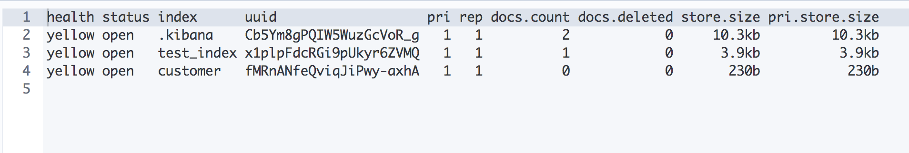
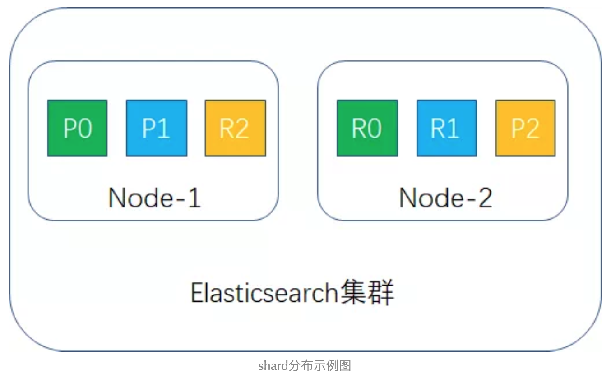

## 查看集群状态

下面介绍一些在Dev Tools 中的一些查看当前集群信息的命令

**查看当前集群状态**

>GET /\_cat/health?v


**查看当前集群中的所有索引**

>GET /\_cat/indices?v



看到输出结果中的信息，存在这样几个疑问

* health 的值有green、yellow，分别是什么意思？
* pri 列是什么含义？
* rep 列是什么含义？

**查看某个具体的索引信息**

>GET /customer


看到输出结果中的信息，存在这样几个疑问

* mappings 是什么意思？
* number_of_shards 是什么意思？
* number_of_replicas 是什么意思？

## 分片机制

在创建索引的时候可以指定分片（shard）数量，这就是索引数据分片机制。或者先创建索引，然后在没有写入document 的时候指定shard 的数量

因为在document 写入ES 的时候，会按照下面的公式计算其需要落到哪个shard 上，查询的时候也是按照这个规则先找到对应的shared。假如先写入数据，用下面的公式计算得到了shard，但是后面改了shard 的数量，那么读document 的时候就无法路由到正确的shared

>shard = hash(routing) % number\_of\_primary\_shards

>routing 默认是document 的ID值，也可以自行指定

比如下图，我创建了一个test\_shard 索引，指定其分片数量为3、副本数量为1


用查看所有索引的命令查看test\_shard 的配置，健康状态是yellow，primary shard 是3、replica shard为1，并且当前没有document


因为当前索引中没有document，但是当前索引是open 状态，所以不可以修改shared 配置


## ES存储目录结构

上面看到新建的这个test\_shard 的UUID 是-QDBZjYsQkm3XM6bLAfC9w，所以去ES 的安装目录下的/data 目录下（data/nodes/0/indices）可以查看其目录结构


因为当前ES 集群中只有一个节点，所以这个index 的3个shard 都在当前节点上，所以当前node 下该index 目录下对应有0、1、2 三个shard 目录

然后尝试往里面写入一些document


然后直接可以在这个index 对应的目录下找到对应的内容


>关于ES 具体是使用什么数据格式存储文档信息的，这里就暂不深究了

## 搭建ES集群

上面看到test\_shard 的三个分片都在这一个节点上，那当这个节点挂掉之后，岂不是所有的数据都丢了？怎么办？

>扩展：想想Kafka 的Topic 的分区机制和副本机制是怎么做的？

既然想要容灾，那么就需要分布式部署，一个节点当然没有办法做到容灾了

搭建ES 集群也很简单，先关掉当前的ES 节点，修改配置文件为（node.name 设置为master）

```yml
#集群名称
cluster.name: es_cluster
#集群中节点名称 （2个节点以此为：master、slave ）
node.name: master
#服务接口（本实例采用单机部署，每个节点端口都不一样）
#http.port: 9200
#transport.tcp.port: 9300
#节点信息
discovery.zen.ping.unicast.hosts: ["127.0.0.1:9300"]

node.max_local_storage_nodes: 2
```

然后重新启动

为了避免data、log 存储的冲突，直接再将elasticsearch 程序拷贝一份，然后再为新的程序改配置如下（node.name 设置为slave）

```yml
#集群名称
cluster.name: es_cluster
#集群中节点名称 （2个节点以此为：master、slave ）
node.name: slave
#服务接口（本实例采用单机部署，每个节点端口都不一样）
http.port: 9201
transport.tcp.port: 9301
#节点信息
discovery.zen.ping.unicast.hosts: ["127.0.0.1:9300"]

node.max_local_storage_nodes: 2
```

然后重启这个拷贝的elasticsearch 程序

在Kibana 中查看集群节点信息如下，两个节点都已经加入到一个集群中了


>注：这个过程中，一直搭建集群不成功，所以中间集群数据删除了多次，又按照上面的过程重新配了一遍，所以很多原有的index 都删除了，test\_shard 这个索引对应的UUID 又变了，所以本文后续可能和上面展示的数据会不一致！

更多的介绍可以好好参考[Elasticsearch系列---分布式架构机制讲解](https://mp.weixin.qq.com/s/mn6r8MPKnHoOCfvsUkPJUA)、[elasticsearch伪集群模式配置](https://www.jianshu.com/p/5fed66a6ad77) 这几篇文章！

## 容灾与扩展

先将两个节点都关掉，然后数据都删掉，先只开启一个节点，在这个节点中创建索引、新增数据


查看test\_shard 索引，状态是yellow、UUID 是9GI1P5EQTHm3PIX75MTefg


查看本地的当前节点的本地目录


参考[Elasticsearch系列---分布式架构机制讲解](https://mp.weixin.qq.com/s/mn6r8MPKnHoOCfvsUkPJUA)

假定Elasticsearch 集群只有一个node，primary shard 设置为3，replica shard 设置为1，这样1 个索引就应该有3个primary shard，3个replica shard，但primary shard 不能与其replica shard 放在一个node 里，导致replica shard 无法分配，这样集群的status为yellow（正如上面看到的），示例图如下


集群可以正常工作，一旦出现node宕机，数据全部丢失，并且集群不可用

>结论：单node 环境容错性为0

## 两个节点的容灾性呢

按照上面的配置，将slave 节点启动起来，现在集群的节点状态是这样的


当新加入一个slave 时，触发master 的shard 进行重新分配

primary shard 与replica shard 的设置与上文相同，此时Elasticsearch 集群只有2个node，shard 分布如下图所示



正常应该在slave 的数据目录下，应该也有数据，但是去查看对应test\_shard 下的分片，竟然没有数据！


为什么呢？为什么新节点加入后，没有重新分配呢？配置修改为上面之后，因为没有设置为数据节点，所以去索引目录下搜不到数据（不像上面那样在.tlog 日志中！！）


master 和slave 节点分别显式设置为数据节点，分别新增这个参数

```yml
node.data: true
```

然后对集群执行下面的命令

```
PUT /_cluster/settings
{
  "persistent":
  {
    "cluster.routing.allocation.enable": "all",
    "cluster.routing.rebalance.enable": "all"
  }
}
```

但是还是没有重新分配过去！！！！

另外还发现一个问题，当slave 没有加入到集群的时候，目前的索引状态是这样的


为什么slave 加入到集群之后，反而都变成yellow 了呢？


>更多的容灾、扩容的机制，建议详细阅读[Elasticsearch系列---分布式架构机制讲解](https://mp.weixin.qq.com/s/mn6r8MPKnHoOCfvsUkPJUA)

## 汇总问题

* 为什么新加入节点到集群中之后，反而所有index 都变成yellow 了呢？
* 为什么新节点加入到集群之后，没有触发test\_shard 索引的分片重新分配呢？
* Kafka 的分布式、副本策略和Elasticsearch 的分布式、副本策略有什么异同？
* Kafka 集群的常用维护策略，查看/修改/新增topic、producer、consumer 的命令？
* Elasticsearch 的运维命令还有哪些？
* Elasticsearch 的配置文件的更多参数分别是什么作用？
* Elasticsearch 的分布式存储策略？
* Kafka 的分布式存储策略？
* Elasticsearch 磁盘数据存储的格式？
* Elasticsearch 的网络通信格式？
* Kafka 的网络通信格式？
* Elasticsearch 中判断index 是yellow 还是green 的原理是什么？
* Elasticsearch 是怎么保证数据一致性的？
* Kafka 是如何保证数据一致性的？
* Elasticsearch 是怎么保证数据不丢失的？
* Kafka 是如何保证数据不丢失的？
* Elasticsearch 中索引的mapping 配置是什么作用？
* Elasticsearch 是如何实现倒排索引和搜索的？
* 想要用Elasticsearch 具体分析工作中的一些场景，如何对业务进行建模？有什么好的理论依据？
* Kafka 流机制的原理和应用场景？

所有这些针对性的问题，后续都要针对性的解决！深入研究ES、Kafka 的分布式架构原理！深入研究Kafka 和ES 的业务应用，灵活使用这两个强大的工具解决业务问题！

后面还是要多写针对性的文章，将这些知识系统化！

## 参考资料

* [ElasticSearch读写底层原理及性能调优](https://juejin.im/post/5de0c453f265da05aa65d8b1)
* [400+节点的 Elasticsearch 集群运维](http://www.525.life/article?id=1510739742907)
* [Elasticsearch系列---分布式架构机制讲解](https://mp.weixin.qq.com/s/mn6r8MPKnHoOCfvsUkPJUA)
* [Elasticsearch—生产环境集群核心配置](https://segmentfault.com/a/1190000019900040?utm_source=tag-newest)
* [Elasticsearch 集群](https://www.jianshu.com/p/044571f793dd)
* [elasticsearch系列：ES 集群管理（集群规划、集群搭建、集群管理）](https://blog.csdn.net/alan_liuyue/article/details/94036355)
* [Elasticsearch简单介绍 和 集群环境部署记录](https://www.cnblogs.com/kevingrace/p/7693422.html)
* [Ubuntu16.0.4下单机集群式elasticsearch 安装、配置及示例](https://www.jianshu.com/p/40a66c04aa7a)
* [elasticsearch伪集群模式配置](https://www.jianshu.com/p/5fed66a6ad77)
* [Elasticsearch之如何合理分配索引分片](https://blog.csdn.net/alan_liuyue/article/details/79585345)
