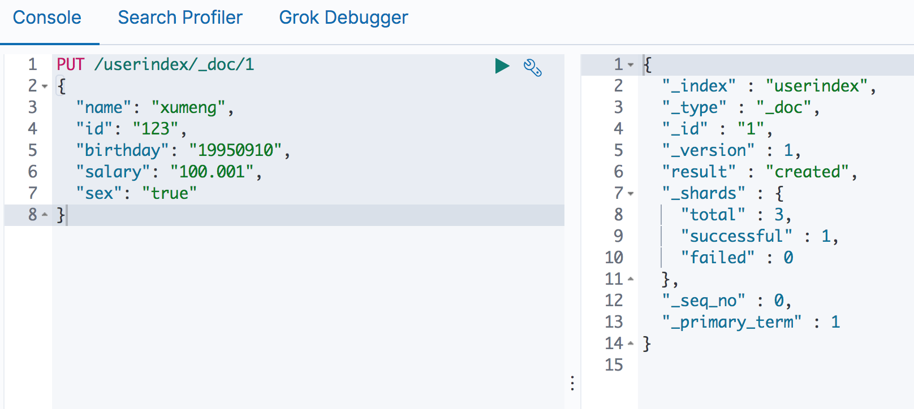

>在ES 中创建一个索引类似于在数据库中建立一个数据库

>ES6.0 之后类似于创建一个表

>在ES 中创建一个mapping 映射类似于在数据库中定义表结构，即表里面有哪些字段、字段是什么类型、字段的默认值等

## ES中的索引

```
PUT testindex
{
  "settings" : {
    "index" : {
      "number_of_shards" : 3, 
      "number_of_replicas" : 2 
    }
  },

 "mappings" : {
    "testtype" : {
      "properties" : {
        "field1" : { "type" : "text" },
        "field2" : { "type" : "keyword" }
      }
    }
  }
}
```

上面的命令在ES7 之前可以执行，但是ES7 默认不在支持指定索引类型，默认索引类型是\_doc，如果想改变，则配置include\_type\_name: true 即可

建议不要这么做，因为ES 8 之后就不再提供该字段

这也就是上面说的，在ES 中创建一个索引类似于在数据库中建立一个数据库，**但ES6.0 之后类似于创建一个表**

所以在ES 7 中要这么创建

```
PUT userindex
{
  "settings" : {
    "index" : {
      "number_of_shards" : 3, 
      "number_of_replicas" : 2 
    }
  },

  "mappings" : {
    "properties" : {
      "name" : {
        "type" : "text",
        "fields": {
          "keyword": {
            "type" : "keyword",
            "ignore_above" : 256
          }
        }
      },
      "id" : {
        "type" : "long"
      },
      "birthday" : { 
        "type" : "date" 
      },
      "salary" : { 
        "type" : "float" 
      },
      "sex" : { 
        "type" : "boolean" 
      }
    }
  }
}
```


## 简单类型映射

定义               | 解释说明
------------------|---------------------
type              | 类型：基本数据类型，integer,long,date,boolean,keyword,text...
enable            | 是否启用：默认为true。 false：不能索引、不能搜索过滤，仅在_source中存储
boost             | 权重提升倍数：用于查询时加权计算最终的得分
format            | 格式：一般用于指定日期格式，如 yyyy-MM-dd HH:mm:ss.SSS
ignore_above      | 长度限制：长度大于该值的字符串将不会被索引和存储
ignore_malformed  | 转换错误忽略：true代表当格式转换错误时，忽略该值，被忽略后不会被存储和索引
include_in_all    | 是否将该字段值组合到_all中
null_value        | 默认控制替换值。如空字符串替换为”NULL”，空数字替换为-1
store             | 是否存储：默认为false。true意义不大，因为_source中已有数据
index             | 索引模式：analyzed (索引并分词，text默认模式), not_analyzed (索引不分词，keyword默认模式)，no（不索引）
analyzer          | 索引分词器：索引创建时使用的分词器，如ik_smart,ik_max_word,standard
search_analyzer   | 搜索分词器：搜索该字段的值时，传入的查询内容的分词器
fields            | 多字段索引：当对该字段需要使用多种索引模式时使用

对于fields，如：城市搜索New York

```json
"city": {
  "type" : "text",
  "analyzer" : "ik_smart",
  "fields" : {
    "raw" : {
      "type" : "keyword"
    }
  }
}
```

那么以后搜索过滤和排序就可以使用city.raw 字段名

## ES中的文档

往指定索引中写入文档

```
PUT /userindex/_doc/1
{
  "name": "xumeng",
  "id": "123",
  "birthday": "19950910",
  "salary": "100.001",
  "sex": "true"
}
```



再插入几条数据

```
PUT /userindex/_doc/2
{
  "name": "xu meng",
  "id": "123",
  "birthday": "19950910",
  "salary": "100.001",
  "sex": "true"
}

PUT /userindex/_doc/3
{
  "name": "meng xu",
  "id": "123",
  "birthday": "19950910",
  "salary": "100.001",
  "sex": "true"
}

PUT /userindex/_doc/4
{
  "name": "meng xu",
  "id": "123",
  "birthday": "19950910",
  "salary": "100.001",
  "sex": "true"
}
```

查询，name 用于全文索引 match，name.keyword 用于排序和聚合

```
GET userindex/_search
{
  "query": {
    "match": {
      "name": "meng" 
    }
  },
  "sort": {
    "name.keyword": "asc" 
  },
  "aggs": {
    "Names": {
      "terms": {
        "field": "name.keyword" 
      }
    }
  }
}
```


输出结果是这样的

```json
{
  "took" : 7,
  "timed_out" : false,
  "_shards" : {
    "total" : 3,
    "successful" : 3,
    "skipped" : 0,
    "failed" : 0
  },
  "hits" : {
    "total" : {
      "value" : 3,
      "relation" : "eq"
    },
    "max_score" : null,
    "hits" : [
      {
        "_index" : "userindex",
        "_type" : "_doc",
        "_id" : "4",
        "_score" : null,
        "_source" : {
          "name" : "meng",
          "id" : "123",
          "birthday" : "19950910",
          "salary" : "100.001",
          "sex" : "true"
        },
        "sort" : [
          "meng"
        ]
      },
      {
        "_index" : "userindex",
        "_type" : "_doc",
        "_id" : "3",
        "_score" : null,
        "_source" : {
          "name" : "meng xu",
          "id" : "123",
          "birthday" : "19950910",
          "salary" : "100.001",
          "sex" : "true"
        },
        "sort" : [
          "meng xu"
        ]
      },
      {
        "_index" : "userindex",
        "_type" : "_doc",
        "_id" : "2",
        "_score" : null,
        "_source" : {
          "name" : "xu meng",
          "id" : "123",
          "birthday" : "19950910",
          "salary" : "100.001",
          "sex" : "true"
        },
        "sort" : [
          "xu meng"
        ]
      }
    ]
  },
  "aggregations" : {
    "Names" : {
      "doc_count_error_upper_bound" : 0,
      "sum_other_doc_count" : 0,
      "buckets" : [
        {
          "key" : "meng",
          "doc_count" : 1
        },
        {
          "key" : "meng xu",
          "doc_count" : 1
        },
        {
          "key" : "xu meng",
          "doc_count" : 1
        }
      ]
    }
  }
}
```

## 索引模板

新增/修改名为tempae_1的模板，匹配名称为te\* 或 bar\*的索引创建：

```
PUT _template/template_1
{
    "index_patterns": ["te*", "bar*"],
    "settings": {
        "number_of_shards": 1
    },
    "mappings": {
        "type1": {
            "_source": {
                "enabled": false
             },
            "properties": {
                "host_name": {
                    "type": "keyword"
                },
                "created_at": {
                    "type": "date",
                    "format": "EEE MMM dd HH:mm:ss Z YYYY"
                }
            }
        }
    }
}
```

可以用下面的命令查看索引模板

```
GET /_template/template_1
 
GET /_template/temp*
 
GET /_template/template_1,template_2
 
GET /_template
```

## 一些问题

关于Elasticsearch 的进阶内容

* 分词经常应用到哪些场景
* Elasticsearch如何指定路由查询文档？
* Elasticsearch如何进行数据备份？
* 如何对Elasticsearch进行性能分析和性能调优？
* 写性能分析与优化
* 读性能分析与优化
* 什么是脑裂问题？

如何进行数据分析

* 如果索引中有了数据了，如何使用Kibana 进行数据分析
* 数据分析的时候，依据什么原则建模型？
* 常用的数据分析方法有哪些？
* 以时间维度的数据分析如何实现？

## 参考资料

* [elasticsearch最全详细使用教程：入门、索引管理、映射详解、索引别名、分词器、文档管理、路由、搜索详解](https://zyc88.blog.csdn.net/article/details/91463253)
* [Elasticsearch常用操作命令——增删改查、集群维护、数据备份](https://zyc88.blog.csdn.net/article/details/102485214)
* [ElasticSearch 7.x 默认不在支持指定索引类型](https://blog.csdn.net/u014646662/article/details/94718834)
* [ElasticSearch实战三（分词和映射）](https://blog.csdn.net/gosaint/article/details/83687060)
* [Elasticsearch 6.x Mapping设置](https://www.jianshu.com/p/e8a9feea683c)