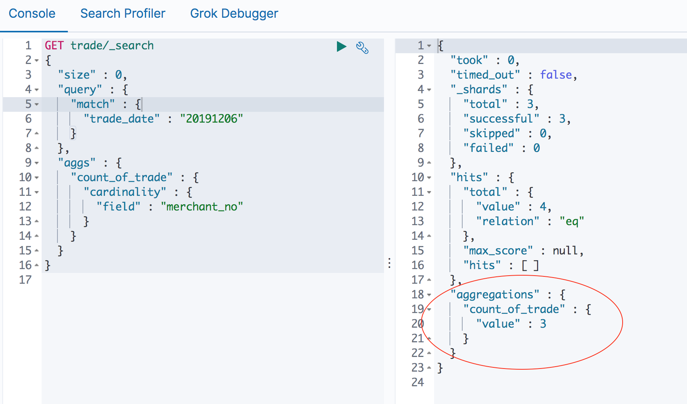
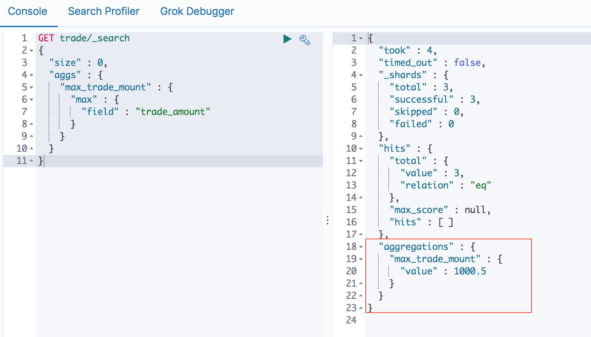

比如对于一个交易系统，你可能要统计这些维度的数据

* 每天会有多少交易量
* 最近一个小时内，交易请求量，和交易的成功率
* 每天的交易总金额是多少
* 交易金额的分布，10元以下的多少，100元至1000元的多少，1000以上的多少
* 每天会发生多少退款
* 最近一个小时内，退款请求量，和退款的成功率
* 查询发生的请求量
* 哪些商户的交易量比较大，具体的交易量是多少
* 某个时间段，交易量/退款量激增、报错激增，想要立马看到报错原因的分布
* 等等等等

对于一个营销系统，可能要统计这些维度的数据

* 最近一周，领取了多少优惠券
* 最近一周，有多少用户参加了优惠活动
* 某次票券营销活动，多少用户领取了券，多少用户使用了券
* 某次立减营销活动，多少用户参与该活动
* 等等等等

所有这些数据可以帮助我们评估系统的健康程度，分析是否存在性能瓶颈，分析某次营销活动的效果等等，基于这些真实的数据，可以最好的帮助我们分析和决策

显然，任何系统都是有日志的，而且日志格式都是符合一定的规范的，那么显然将日志做解析，解析出关键的要素（请求的URL、商户信息、交易金额、票券信息、立减活动信息、退款金额、报错信息等等），然后导入到ES 专门设计了mapping 的index 中，然后再基于这些索引中的数据帮助我们做数据分析

## 数据库的概念


想想我们可能有这样的一张数据库表来存储交易数据

```sql
create table trade(
    trade_no         varchar(40),           -- 交易流水，主键
    trade_date       int,                   -- 交易日期
    trade_time       int,                   -- 交易时间
    order_no         varchar(40),           -- 订单流水
    order_date       int,                   -- 订单日期
    merchant_no      varchar(10),           -- 商户编号
    user_no          varchar(40),           -- 用户编号
    trade_amount     float(15, 2),          -- 交易金额
    coupon_no        varchar(40),           -- 优惠券号码
    coupon_amount    float(15, 2),          -- 优惠券优惠金额
    discount_no      varchar(40),           -- 立减活动号码
    discount_amount  float(15, 2),          -- 立减优惠金额
    request_ip       varchar(20),           -- 用户请求ip
    trade_status     varchar(1),            -- 交易状态
    trade_error_code varchar(10)            -- 交易错误码
);
```

很显然，我们都比较熟悉数据库，针对这张数据表，我们可以通过SQL 统计这些数据

统计20191206，所有成功交易的笔数

```sql
select count(trade_no) 
from trade 
where trade_status = '1' 
  and trade_date = 20191206;
```

统计20191206，商户0000100001 下的交易数量

```sql
select count(trade_no) 
from trade 
where merchant_no = '0000100001' 
  and trade_date = 20191206;
```

统计20191206 当天交易总额

```sql
select sum(trade_amount) 
from trade 
where trade_status = '1' 
  and trade_date = 20191206;
```

统计20191206 当天参与立减活动"ANN00019991" 的交易数量

```sql
select count(trade_no) 
from trade 
where discount_no = 'ANN00019991' 
  and trade_date = 20191206;
```

对201901206 各个商户的成功交易量

```sql
select merchant_no, count(trade_no) as trade_count
from trade
where trade_status = '1'
group by merchant_no;
```

等等等等，我们想要什么维度的数据，通过SQL 的语法，我们都可以方便的统计得到

但每次统计都要连到生产的数据库（备库）上去执行这些SQL 吗，而且只有冷冰冰的数据，而我们希望能够通过图表展示出具体的交易趋势、错误原因分布、商户交易量分布……信息

假如我想统计付款之后，立即进行退款的交易数据有什么规律，比如主要是哪些商户、主要是哪些用户、主要来自哪些IP 等，以判断是否是薅羊毛行为，要怎么写SQL，是否要买一张退款表，然后交易表和退款表进行连接查询？

另外还要考虑为了满足我们各种场景的查询和统计，就像上面那样，会写出各种各样的SQL，where 谓词各种各样，对应应该如何考虑数据表的索引设计？

>其实上面的过程就是数据建模的过程

## 数据建模

所谓数据建模就是通过抽象的实体和实体之间联系的形式去描述业务规则，从而实现对现实世界的映射

首先是概念建模

确定系统的核心需求和范围边界，设计实体和实体间的关系

其次是逻辑建模

进一步梳理业务需求，确定每个实体的属性、关系和约束等

最后确定物理模型，解决数据落地的问题

结合具体的数据库产品，在满足业务读写性能等需求的前提下确定最终的定义。可以使用MySQL、MongoDB、Redis、Elasticsearch 等



## 在Elasticsearch是什么样的呢？

在[《Elasticsearch映射机制》](http://www.xumenger.com/es-mapping-20191204/)，我们提到，在ES 7.0 之后，ES 中的索引可以类比数据中的表，所以对于上面的数据表，在ES 中我们可能建的索引是这样的（这里只是展示了一种简单的mapping 用法，还有更多参数值得深究的，analyzer、doc\_values、fielddata 等，不过这里就不深究了）

```
PUT trade
{
  "settings" : {
    "index" : {
      "number_of_shards" : 3, 
      "number_of_replicas" : 2 
    }
  },

 "mappings" : {
    "properties" : {
      "trade_no"         : { "type" : "keyword" },
      "trade_date"       : { "type" : "integer" },
      "trade_time"       : { "type" : "integer" },
      "order_date"       : { "type" : "integer" },
      "merchant_no"      : { "type" : "keyword" },
      "user_no"          : { "type" : "keyword" },
      "trade_amount"     : { "type" : "float"   },
      "coupon_no"        : { "type" : "keyword" },
      "coupon_amount"    : { "type" : "float"   },
      "discount_no"      : { "type" : "keyword" },
      "discount_amount"  : { "type" : "float"   },
      "request_ip"       : { "type" : "keyword" },
      "trade_status"     : { "type" : "keyword" },
      "trade_error_code" : { "type" : "keyword" }
    }
  }
}
```

可以用下面的命令模拟一些测试数据

```
PUT /trade/_doc/1
{
  "trade_no"         : "00000000001",
  "trade_date"       : "20191206",
  "trade_time"       : "100000",
  "order_date"       : "20191206",
  "merchant_no"      : "9999900001",
  "user_no"          : "user_0001",
  "trade_amount"     : "12.05",
  "coupon_no"        : "88888000010000001",
  "coupon_amount"    : "3.00",
  "discount_no"      : "CNNNPN00001",
  "discount_amount"  : "1.05",
  "request_ip"       : "127.0.0.1",
  "trade_status"     : "1",
  "trade_error_code" : "success"
}
```

统计交易金额最大的交易

```
GET trade/_search
{
  "size" : 0,
  "aggs" : {
    "max_trade_mount" : {
      "max" : {
        "field" : "trade_amount"
      }
    }
  }
}
```



统计20191206 发生了交易的商户的个数

```
GET trade/_search
{
  "size" : 0,
  "query" : {
    "match" : {
      "trade_date" : "20191206"
    }
  },
  "aggs" : {
    "count_of_trade" : {
      "cardinality" : {
        "field" : "merchant_no"
      }
    }
  }
}
```


这里只是展示了Eleastcsearch 的一些简单的功能和效果

聚合分析（Aggregation）是ES 除搜索功能外提供的针对ES 数据做统计分析的功能。提供Bucket、Metric、Pipeline 等多种分析方式，可以满足大部分的分析需求；实时性高，所有的计算结果都是即时返回的，而Hadoop 等大数据系统一般都是T+1 的！

>关于ES 的查询和聚合分析，更多内容参考[Elasticsearch Reference](https://www.elastic.co/guide/en/elasticsearch/reference/current/index.html) 的Aggregations 部分说明

>建议在具体使用的时候，直接去多多的参考官方文档，完善对Elastic Stack 的认知度，而本文只是引人入门而已，更多更强大的功能，根本就没有涉及到，这里只是授之以鱼，建议自己去看文档，学习“渔”

## 数据可视化


## 参考资料

* [数据库是如何工作的？](http://www.xumenger.com/how-databases-work-20180415/)
* [es查询，聚合、平均值、值范围、cardinality去重查询](https://blog.csdn.net/sxf_123456/article/details/78195829)
* [Elasticsearch Reference](https://www.elastic.co/guide/en/elasticsearch/reference/current/index.html)
* [Elastic Stack and Product Documentation](https://www.elastic.co/guide/index.html)
* [Elasticsearch for Apache Hadoop and Spark [7.5] ](https://www.elastic.co/guide/en/elasticsearch/hadoop/current/index.html)
