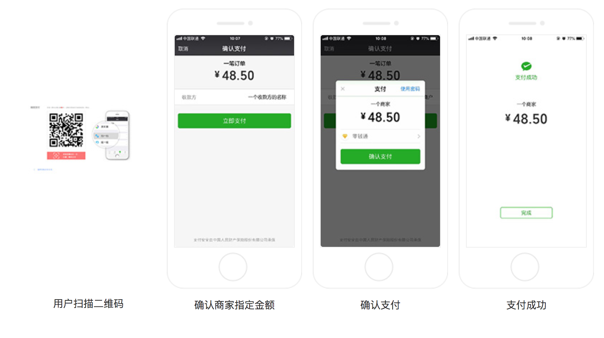

Native 支付是指商户系统按微信支付协议生成支付二维码，用户再用微信“扫一扫”完成支付的模式。该模式适用于PC 网站、实体店单品或订单、媒体广告支付等场景

在入驻时选择PC 网站场景的商户系统默认开通此功能，其他商户如有需要，可以在入驻后前往【商户品台】-->【产品中心】-->【Native 支付】申请开通

用户的交互逻辑如下

比如商品付款、充值VIP 等，很多网站都会选用这种方式，总之最后付款的那一刻，在网页上展示付款码，让用户去扫并付款即可，因为这种方式不是面对面付款，所以必须保证客户付款的金额时准确的，所以这个二维码不是固定的，是根据账单金额生成的，用户扫码之后就可以马上看到需要付款的金额，确认无误再进行付款！

关于模式一的方式这里就不赘言，直接参考这里[https://pay.weixin.qq.com/wiki/doc/api/native.php?chapter=6_4](https://pay.weixin.qq.com/wiki/doc/api/native.php?chapter=6_4)

下面对Native 支付的模式二进行简单讲解。直接参考[https://pay.weixin.qq.com/wiki/doc/api/native.php?chapter=6_5](https://pay.weixin.qq.com/wiki/doc/api/native.php?chapter=6_5)

商户后台系统先吊用微信支付的统一下单接口，微信后台系统返回链接参数code\_url，商户后台系统将code\_url 值生产二维码图片，用户使用微信客户端扫码后发起支付。code\_url 有效期为2小时

## 业务流程

结合上面的时序图，解释业务流程如下

1. 商户后台系统根据用户选购的商品生成订单
2. 用户确认支付后调用微信支付【[统一下单API](https://pay.weixin.qq.com/wiki/doc/api/native.php?chapter=9_1)】生产预支付交易
3. 微信支付系统收到请求后盛出预支付交易单，并返回交易会话的二维码链接code\_url
4. 商户后台系统根据返回的code\_url 生成二维码
5. 用户打开微信**扫一扫**扫描二维码，微信客户端将扫码内容发送到微信支付系统
6. 微信支付系统收到客户端请求，验证链接有效性后发起用户支付，要求用户授权
7. 用户在微信客户端输入密码，确认支付后，微信客户端提交授权
8. 微信支付系统根据用户授权完成支付交易
9. 微信支付系统完成支付交易后给微信客户端返回交易结果，并将交易结果通过短信、微信消息提示用户。微信客户端展示支付交易结果页面
10. 微信支付系统通过发送异步消息通知商户后台系统支付结果。商户后台系统需回复接收情况，通知微信后台系统不再发送该单的支付通知
11. 未收到支付通知的情况，商户后台系统调用【[查询订单API](https://pay.weixin.qq.com/wiki/doc/api/native.php?chapter=9_2)】
12. 商户确认订单已支付后给用户发货

>[API 列表](https://pay.weixin.qq.com/wiki/doc/api/native.php?chapter=9_1)

>[最佳实践](https://pay.weixin.qq.com/wiki/doc/api/native.php?chapter=23_9)

## 生成二维码

对应链接格式[weixin://wxpay/bizpayurl?sr=XXXXX](weixin://wxpay/bizpayurl?sr=XXXXX)。请商户调用第三方库将code\_url 生成二维码图片。该模式链接较短，生成的二维码打印到结账小票上的识别率较高

例如，将[weixin://wxpay/s/An4baqw](weixin://wxpay/s/An4baqw) 生成二维码

>[二维码的生成细节和原理](https://coolshell.cn/articles/10590.html)

## 参考资料

* [微信native支付](https://pay.weixin.qq.com/static/product/product_intro.shtml?name=native)
* [微信支付开发文档](https://pay.weixin.qq.com/wiki/doc/api/native.php?chapter=6_1)
* [微信支付之Native扫码支付功能](https://www.jianshu.com/p/940842647ebc)
* [微信支付二维码native原生支付开发模式一](https://blog.csdn.net/hugengyong/article/details/77099151?utm_source=blogxgwz8)
* [二维码的生成细节和原理](https://coolshell.cn/articles/10590.html)
