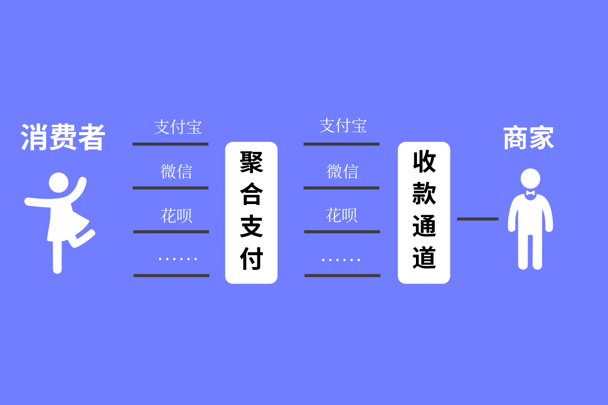

## 关于聚合支付

简单地说，聚合支付是融合了支付宝、微信支付、花呗、翼支付等多种支付方式的一种“包容性”支付工具。对于消费者来说，无论是使用支付宝还是微信支付，或者其他支付工具，都可以进行支付；对于收款行来说，不必担心消费者的支付工具与自己的收银工具冲突，而且也可以了解每个支付工具的数据

以二维码举例说明，消费者看到的是一个码，用支付宝或者微信支付等工具都可以扫码支付，省时省力

商家可以从后台看到这笔钱是从支付宝进来的，还是从微信支付进来的。每个支付通道收了多少钱，收了多少笔，都可以看出来，简单便捷

>[https://www.sohu.com/a/290656691_591077](https://www.sohu.com/a/290656691_591077)

## 聚合支付原理

聚合支付和第三方支付、银行谈支付接口的开通和对接服务。以前，支付宝自己的码、微信也有自己的码，现在通过开放支付接口和服务，支付宝和微信都能识别自己授予了权限的第三方支付的码，所以不管你是用支付宝还是微信扫码，都能识别

我们所看到的聚合二维码实际上是一个包含了收款连接的二维码，当用户扫码时，该二维码自动识别二维码的应用程序类型，如果检测到是支付宝，就自动跳转到支付宝的支付接口；如果是微信，则跳转到微信的支付页面，从而完成支付过程

## 参考资料

* [各大银行发力聚合支付](http://www.498.net/hyxw/article-503.html)
* [如何设计聚合支付系统，实现原理是什么？](http://www.498.net/hyxw/article-466.html)
* [聚合支付浅析](https://www.jianshu.com/p/ab42416515f6)
* [第一次有人把聚合支付讲的这么简单明了](https://www.sohu.com/a/290656691_591077)
* [支付宝微信都能扫的聚合支付二维码是怎么实现的？](https://baijiahao.baidu.com/s?id=1610027603986476823&wfr=spider&for=pc)
* [一位银行人的亲身经历：为什么千疮百孔，还要继续做聚合支付？](http://www.mpaypass.com.cn/news/201902/26133856.html)
* [用支付宝和微信都可以扫的聚合支付码，其原理是什么？](https://www.aduer.com/NewsDetail.aspx?id=204)
* [在街上收银产品介绍，聚合支付，收银系统软件](https://www.bilibili.com/video/av8187620?from=search&seid=11527410782405449527)
* [移动支付势头迅猛，聚合支付的未来在哪里？](http://dy.163.com/v2/article/detail/DIVD5NU70511VHRJ.html)
