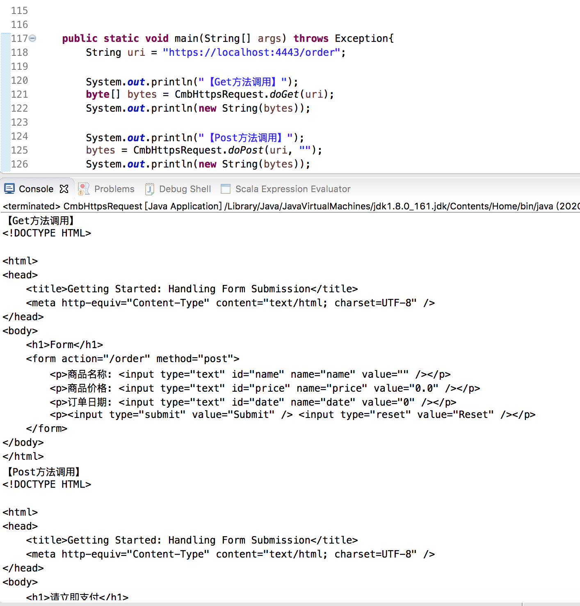

关于HTTP 和HTTPS 协议，之前在[《HTTP与HTTPS协议》](http://www.xumenger.com/https-20190217/) 简单介绍过

1. 客户端使用https 的URL 访问Web 服务器，要求与Web 服务器建立SSL 连接
2. Web 服务器收到客户端请求后，会将网站的证书信息（包含公钥）传送一份到客户端
3. 客户端与Web 服务器开始协商SSL 连接的安全等级，也就是信息加密的等级
4. 客户端根据双方同意的安全等级，建立会话秘钥，然后利用网站的公钥将会话秘钥加密，并传送给网站
5. Web 服务器利用自己的私钥解密出会话秘钥
6. Web 服务器利用会话秘钥加密与客户端之间的通信


## SpringBoot搭建HTTPS服务

在[阿里云平台](https://www.aliyun.com/product/cas?spm=5176.10695662.1171680.2.286f720f7nlNMo&aly_as=hbJTFCvT)申请SSL 证书！

测试使用，直接申请免费证书即可


申请的时候可能需要你在阿里云有购买过域名，另外提交申请后，需要等一段时间后（大概等30分钟）查看申请结果


审核通过后，下载证书，对应选择tomcat，下载到本地后解压得到这样的文件，.pfx是证书文件、pfx\_password.txt 是证书文件的密码


将.pfx 复制到SpringBoot 项目的resources 目录下，然后在application.properties 中添加配置内容

```
# https
server.ssl.key-store=classpath:3431309_xumenger.com.pfx
server.ssl.key-store-password=8Bnf0hUn
server.ssl.key-store-type=PKCS12
server.port=443
```

然后新增HttpConfig 类

```java
package com.cmb.order;

import org.apache.tomcat.util.descriptor.web.SecurityCollection;
import org.apache.tomcat.util.descriptor.web.SecurityConstraint;
import org.apache.catalina.Context;

import org.springframework.boot.context.embedded.EmbeddedServletContainerFactory;
import org.springframework.boot.context.embedded.tomcat.TomcatEmbeddedServletContainerFactory;
import org.springframework.context.annotation.Bean;
import org.springframework.context.annotation.Configuration;

@Configuration
public class HttpsConfig {
    @Bean
    public EmbeddedServletContainerFactory servletContainer() {
        TomcatEmbeddedServletContainerFactory tomcat = new TomcatEmbeddedServletContainerFactory() {
            @Override
            protected void postProcessContext(Context context) {
                SecurityConstraint constraint = new SecurityConstraint();
                constraint.setUserConstraint("CONFIDENTIAL");
                SecurityCollection collection = new SecurityCollection();
                collection.addPattern("/*");
                constraint.addCollection(collection);
                context.addConstraint(constraint);
            }
        };
        return tomcat;
    }
}
```

启动之后，会发现这个报错


临时解决方案是将端口设置为4443

```
# https
server.ssl.key-store=classpath:3431309_xumenger.com.pfx
server.ssl.key-store-password=8Bnf0hUn
server.ssl.key-store-type=PKCS12
server.port=4443
```

然后重新启动后，在控制台可以看到HTTPS 服务已经成功启动


比如我编写的这个Springboot 测试程序，现在可以通过[https://localhost:4443/order](https://localhost:4443/order) 去访问


>关于如何编写SpringBoot 应用，可以参考[《Spring Boot开发Web程序》](http://www.xumenger.com/java-springboot-20180322/)、[《搭建Spring Boot源码环境》](http://www.xumenger.com/spring-boot-eclipse-maven-20181201/)、[《从Spring到Spring Boot》](http://www.xumenger.com/spring-ioc-20181206/)

>为什么会在浏览器上看到【此连接非私人连接】的提示？！

## 补充SpringBoot程序代码

application.properties 内容

```
# template
spring.mvc.view.prefix=classpath:/templates/
spring.mvc.view.suffix=.html

# https
server.ssl.key-store=classpath:3431309_xumenger.com.pfx
server.ssl.key-store-password=8Bnf0hUn
server.ssl.key-store-type=PKCS12
server.port=4443
```

RunApplication.java。启动程序

```java
package com.order;

import org.springframework.boot.SpringApplication;
import org.springframework.boot.autoconfigure.SpringBootApplication;

@SpringBootApplication
public class RunApplication 
{
    public static void main(String[] args) 
    {
        SpringApplication.run(RunApplication.class, args);
    }
}
```

OrderController.java。控制器，设置请求URL，以及对应POST、GET 方法的执行代码，分别跳转到order.html 模板、result.html 模板

```java
package com.order;

import java.util.Map;
import java.util.TreeMap;

import org.springframework.stereotype.Controller;
import org.springframework.ui.Model;
import org.springframework.web.bind.annotation.GetMapping;
import org.springframework.web.bind.annotation.ModelAttribute;
import org.springframework.web.bind.annotation.PostMapping;


@Controller
public class OrderController
{
    @GetMapping("/order")
    public String orderForm(Model model) 
    {
        model.addAttribute("order", new Order());
        return "order";
    }
    
    @PostMapping("/order")
    public String orderSubmit(@ModelAttribute Order order) 
    {
        return "result";
    }
}
```

order.html 模板

```html
<!DOCTYPE HTML>
<html xmlns:th="http://www.thymeleaf.org">
<head>
    <title>Getting Started: Handling Form Submission</title>
    <meta http-equiv="Content-Type" content="text/html; charset=UTF-8" />
</head>
<body>
    <h1>Form</h1>
    <form action="#" th:action="@{/order}" th:object="${order}" method="post">
        <p>商品名称: <input type="text" th:field="*{name}" /></p>
        <p>商品价格: <input type="text" th:field="*{price}" /></p>
        <p>订单日期: <input type="text" th:field="*{date}" /></p>
        <p><input type="submit" value="Submit" /> <input type="reset" value="Reset" /></p>
    </form>
</body>
</html>
```

result.html 模板

```html
<!DOCTYPE HTML>
<html xmlns:th="http://www.thymeleaf.org">
<head>
    <title>Getting Started: Handling Form Submission</title>
    <meta http-equiv="Content-Type" content="text/html; charset=UTF-8" />
</head>
<body>
    <h1>请立即支付</h1>
    <p th:text="'商品名称  : ' + ${order.name}" />
    <p th:text="'商品价格  : ' + ${order.price}" />
    <p th:text="'订单日期  : ' + ${order.date}" />
    
    
    
    <p/>
    <a href="/order">再次填写商品信息</a>
</body>
</html>
```

## 如何编写HTTPS客户端访问

上面展示了可以通过浏览器访问HTTPS 服务，那么怎么编写Java 客户端代码访问HTTPS 服务呢？

使用Java 编写代码访问HTTP 服务是很简单的。这是基于SpringBoot 提供的接口实现的，当然这只是一种实现方式

```java
import java.util.Map;

import java.nio.charset.Charset;

import org.springframework.web.client.RestTemplate;
import org.springframework.http.HttpHeaders;
import org.springframework.http.MediaType;
import org.springframework.http.converter.StringHttpMessageConverter;
import org.springframework.http.HttpEntity;


/**
 * url: 请求链接
 * requestBody: 请求HTTP报文体
 */
public static Map<String, String> postForEntity(String url, String requestBody)
{
    // 创建HTTP 客户端
    RestTemplate client = new RestTemplate();
    client.getMessageConverters().add(0, new StringHttpMessageConverter(Charset.forName("UTF-8")));

    // 创建HTTP Header
    HttpHeaders headers = new HttpHeaders();

    // 设置HTTP头部
    headers.setContentType(MediaType.APPLICATION_JSON);
    headers.add("appid", "app_id");
    headers.add("timestamp", "1580955195");
    headers.add("sign", "sign_value");

    // 将请求头部和参数合成一个请求
    HttpEntity<String> requestEntity = new HttpEntity<String>(requestBody, headers);

    // 执行HTTP请求
    Map<String,String> response = client.postForEntity(url, requestEntity, Map.class).getBody();

    return response;
}
```

下面看一下如何使用Java 编写代码访问HTTPS 服务

```java
package com.cmb.util;

import java.io.ByteArrayInputStream;
import java.io.ByteArrayOutputStream;
import java.io.IOException;
import java.io.InputStream;
import java.io.OutputStream;
import java.net.URL;
import java.security.KeyManagementException;
import java.security.NoSuchAlgorithmException;
import java.security.SecureRandom;

import javax.net.ssl.HostnameVerifier;
import javax.net.ssl.HttpsURLConnection;
import javax.net.ssl.KeyManager;
import javax.net.ssl.SSLContext;
import javax.net.ssl.SSLSession;
import javax.net.ssl.SSLSocketFactory;
import javax.net.ssl.TrustManager;
import javax.net.ssl.X509TrustManager;

public class HttpsRequestUtil
{
	private static final class DefaultTrustManager implements X509TrustManager 
    {
		@Override
		public void checkClientTrusted(java.security.cert.X509Certificate[] arg0, String arg1)
				throws java.security.cert.CertificateException 
		{
			
		}

		@Override
		public void checkServerTrusted(java.security.cert.X509Certificate[] arg0, String arg1)
				throws java.security.cert.CertificateException 
		{
			
		}

		@Override
		public java.security.cert.X509Certificate[] getAcceptedIssuers() 
		{
			return null;
		}
    }
	
	
	private static HttpsURLConnection getHttpsURLConnection(String uri, String method) throws IOException 
	{
        SSLContext ctx = null;
        try {
            ctx = SSLContext.getInstance("TLS");
            ctx.init(new KeyManager[0], new TrustManager[] { new DefaultTrustManager() }, new SecureRandom());
        } catch (KeyManagementException e) {
            e.printStackTrace();
        } catch (NoSuchAlgorithmException e) {
            e.printStackTrace();
        }
        SSLSocketFactory ssf = ctx.getSocketFactory();
 
        URL url = new URL(uri);
        HttpsURLConnection httpsConn = (HttpsURLConnection) url.openConnection();
        httpsConn.setSSLSocketFactory(ssf);
        httpsConn.setRequestProperty("Content-Type","application/x-www-form-urlencoded;charset=UTF-8");
        httpsConn.setRequestProperty("Authorization","username");
        httpsConn.setRequestProperty("User-Agent", "Mozilla/5.0 (Windows NT 6.1; WOW64) AppleWebKit/537.11 (KHTML, like Gecko) Chrome/23.0.1271.95 Safari/537.11");
        /*
        在握手期间，如果 URL 的主机名和服务器的标识主机名不匹配，
        则验证机制可以回调此接口的实现程序来确定是否应该允许此连接。
        策略可以是基于证书的或依赖于其他验证方案。
        当验证 URL 主机名使用的默认规则失败时使用这些回调。
         */
        httpsConn.setHostnameVerifier(new HostnameVerifier() {
            @Override
            public boolean verify(String arg0, SSLSession arg1) {
                return true;
            }
        });
        httpsConn.setRequestMethod(method);
        httpsConn.setDoInput(true);
        httpsConn.setDoOutput(true);
        return httpsConn;
    }
 
    private static byte[] getBytesFromStream(InputStream is) throws IOException {
        ByteArrayOutputStream baos = new ByteArrayOutputStream();
        byte[] kb = new byte[1024];
        int len;
        while ((len = is.read(kb)) != -1) {
            baos.write(kb, 0, len);
        }
        byte[] bytes = baos.toByteArray();
        baos.close();
        is.close();
        return bytes;
    }
 
    private static void setBytesToStream(OutputStream os, byte[] bytes) throws IOException {
        ByteArrayInputStream bais = new ByteArrayInputStream(bytes);
        byte[] kb = new byte[1024];
        int len;
        while ((len = bais.read(kb)) != -1) {
            os.write(kb, 0, len);
        }
        os.flush();
        os.close();
        bais.close();
    }
 
    public static byte[] doGet(String uri) throws IOException {
        HttpsURLConnection httpsConn = getHttpsURLConnection(uri, "GET");
        return getBytesFromStream(httpsConn.getInputStream());
    }
 
    public static byte[] doPost(String uri, String data) throws IOException {
        HttpsURLConnection httpsConn = getHttpsURLConnection(uri, "POST");
        setBytesToStream(httpsConn.getOutputStream(), data.getBytes());
        return getBytesFromStream(httpsConn.getInputStream());
    }
    
    
    
    /**
     * 测试程序
     */
    public static void main(String[] args) throws Exception
    {
    	String uri = "https://localhost:4443/order";
        
        System.out.println("【Get方法调用】");
        byte[] bytes = CmbHttpsRequest.doGet(uri);
        System.out.println(new String(bytes));
        
        System.out.println("【Post方法调用】");
        System.out.println(new String(bytes));
        bytes = CmbHttpsRequest.doPost(uri, "");
        System.out.println(new String(bytes));
    }
}
```

>参考[java实现https请求](https://blog.csdn.net/lufeiRversing/article/details/85683417)



## 参考资料

* [Spring Boot 集成配置 HTTPS](https://www.bysocket.com/springboot/2386.html)
* [Spring Boot开发Web程序](http://www.xumenger.com/java-springboot-20180322/)
* [搭建Spring Boot源码环境](http://www.xumenger.com/spring-boot-eclipse-maven-20181201/)
* [从Spring到Spring Boot](http://www.xumenger.com/spring-ioc-20181206/)
* [如何在java中发起http和https请求](https://www.cnblogs.com/ncy1/p/9684330.html)
