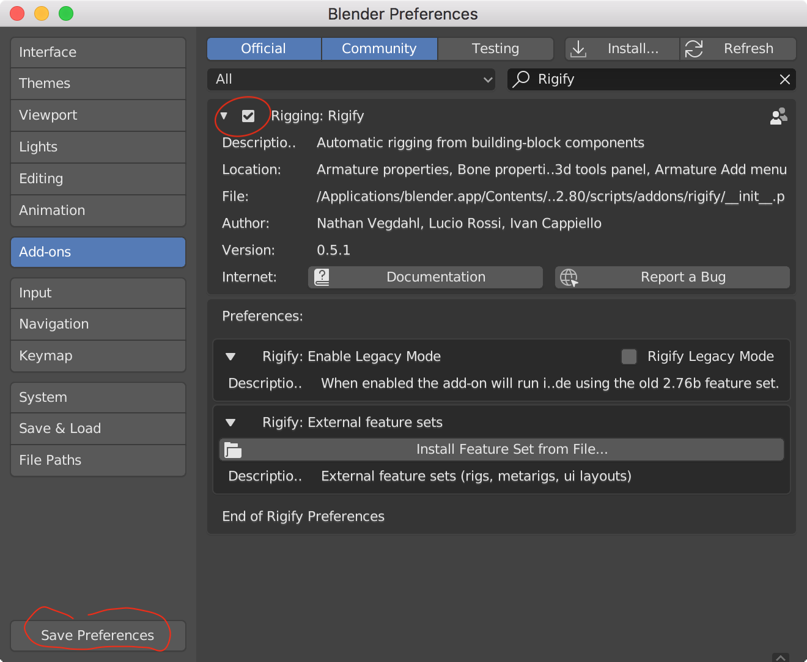
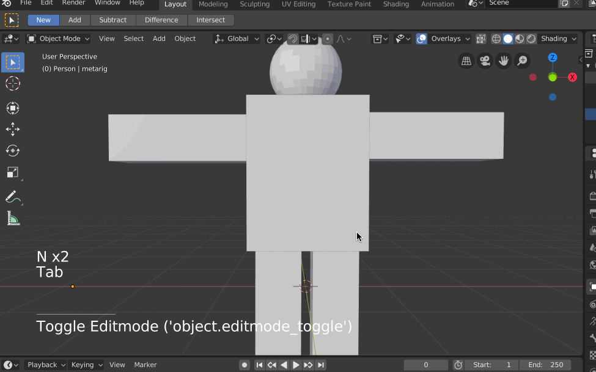
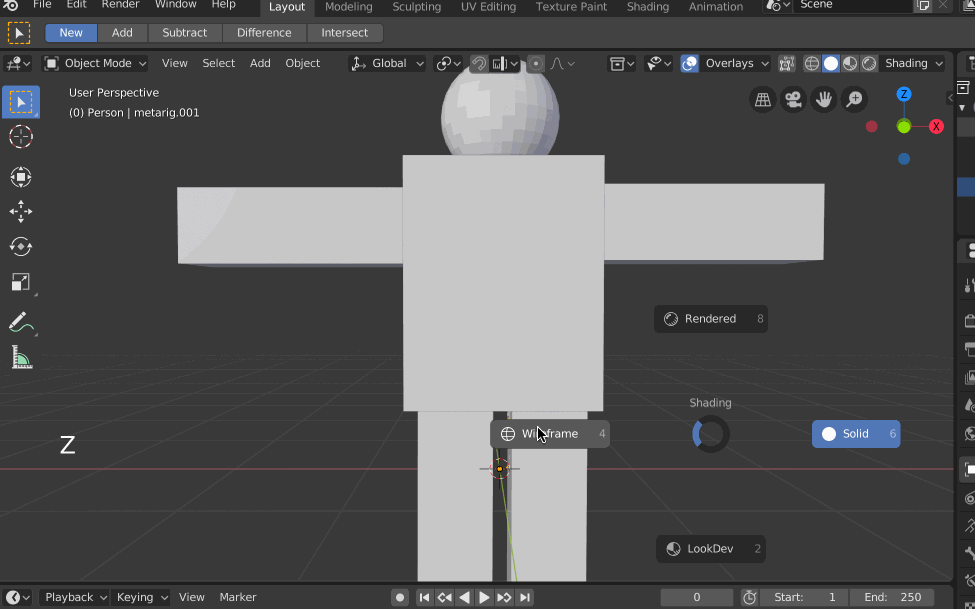
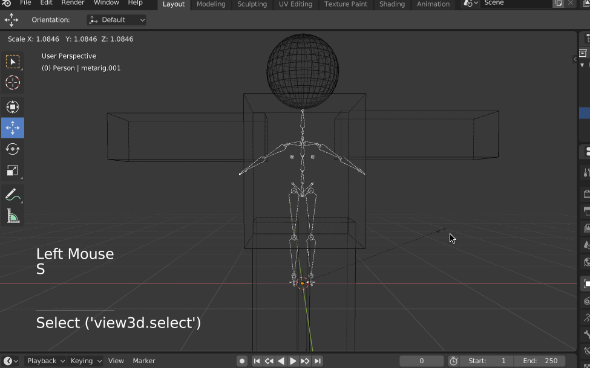
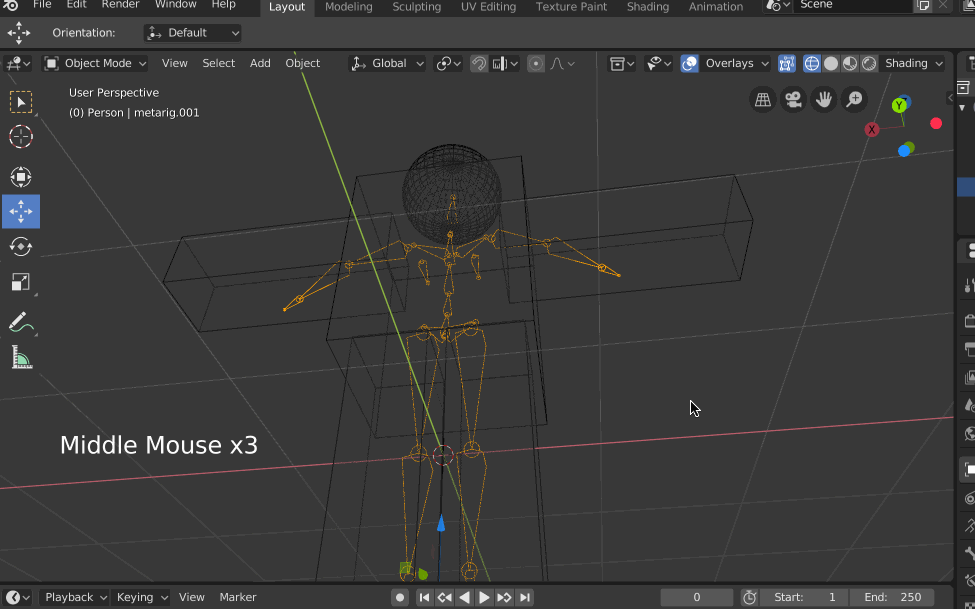

>本文使用的Blender 的版本是2.8 Beta，后续会尽快升级到Blender 2.8 稳定版

在[摸索Blender：绑定骨骼](http://www.xumenger.com/blender-bone-03-20190908/) 展示了如何绑定骨骼，但只是简单的展示用法，如果我在Blender 中做了一个人物模型，想要对这个人物绑定骨骼，要怎么处理呢？本文就使用Blender 的Rigging:Rigify 的插件来完成这个流程

【Edit】->【Preferences】->[Add-ons]，搜索Rigify，勾选安装Rigging:Rigify ，然后点击底部的【保存用户设置】

这里我简单的用正方体和球体做了一个“所谓的人物模型”吧，后面针对此沙雕模型进行绑骨的操作

【tab】切换到object mode，【shift-a】->【Armature】->【Basic】->【Basic Human (Meta-Rig)】

但这时候看不到骨头（被Cube 挡住了），【z】切换为线条显示（Wireframe），现在，你就可以看到刚刚添加的骨头了

选中骨骼，【s】后对其进行缩放，首先调整到和人物模型差不多的大小

可以按住【鼠标中键】旋转视图看到模型和骨骼的相对位置

【tab】进入edit mode，打开【选项】里的【x镜像】，这样就只需要调节一边的骨骼就好了

参考[摸索Blender：绑定骨骼](http://www.xumenger.com/blender-bone-03-20190908/)，对于骨骼的基础操作快捷键包括：选中骨干后，【r】可以旋转、【s】可以放大、【e】可以沿着选中的点再长出一根骨头

调整骨骼，让骨骼与人物模型充分匹配，注意头部的骨骼最好是拉长到头顶，胯部的骨骼稍微往外面靠点。经过调整后的人物和骨骼的相对位置变成现在这样

## 设置骨骼权重

骨骼位置匹配好了之后，【tab】退出edit mode，先点选人物模型，再按住【shift】加选骨骼，按【ctrl＋p】，选择“附带自动权重”，Blender 会自动地讲权重付给模型

在骨架面板选择“姿态位置”，然后进入姿态模式，测试下骨骼是否有问题，没有问题的话就直接保存

>再次强调，尽可能多的了解和掌握Blender 的快捷键将会极大的提升效率！！

## 和Unity3D配合使用

上面在Blender 中完成的绑定骨骼的操作，那么怎么将这个绑定好骨骼的模型到出到Unity 中使用呢？

在Blender 中，【File】->【Export】->【FBX(.fbx)】，导出fbx 文件

直接将该模型放入到Unity 工程的Asset 文件夹下，即可在Unity 中使用

在Unity 中选中模型，在rig 窗口的animationtype 选中humanoid ，再点击apply

在Unity 中可以试着去摆动该模型做出各种动作

>Blender 中绑定好骨骼的模型，如果我在mixamo 中下载了未绑定骨骼的原始罐头动画，怎么将这个动画作用到这个模型上？

## 在Unity3D中摆动画

这里不展示怎么为已经绑定骨骼的动画与已有的罐头动画关联起来，使罐头动画可以直接应用到我们的模型上

既然现在从Blender 中到处的模型是绑定好骨骼的，所以可以直接利用Unity 的动画系统，先为模型在各个关键帧摆出来某种姿势，然后利用Unity 的动画系统串联这些关键帧即可形成自制动画

接下来看一下怎么操作

## 在Blender中摆动画

>详细的操作过程可以参见我对应录制并上传到[bilibili 的视频教程]()！

## 参考资料

* [blender 给人物角色绑定骨骼到unity3d](https://blog.csdn.net/qq_18609315/article/details/50417087)
* [摸索Blender：绑定骨骼](http://www.xumenger.com/blender-bone-03-20190908/)
* [Blender人物骨骼绑定](https://blog.csdn.net/perry0528/article/details/89181512)
* [Blender怎么快速制作人体骨骼？创建人体骨骼教程分享](https://www.golue.com/news/v365537.html)
* [Blender角色骨骼绑定01-搭建](https://www.bilibili.com/video/av50949442/)
* [摸索Blender：使用Blender进行建模](http://www.xumenger.com/blender-example-02-20190907/)
* [摸索Blender：Blender常用基础操作](http://www.xumenger.com/blender-example-01-20190907/)
* [Mixamo的自动骨骼绑定算法是如何实现的？](https://www.zhihu.com/question/62493885)
* [骨骼动画的原理及在Unity中的使用](https://www.cnblogs.com/blueberryzzz/p/9960131.html)
