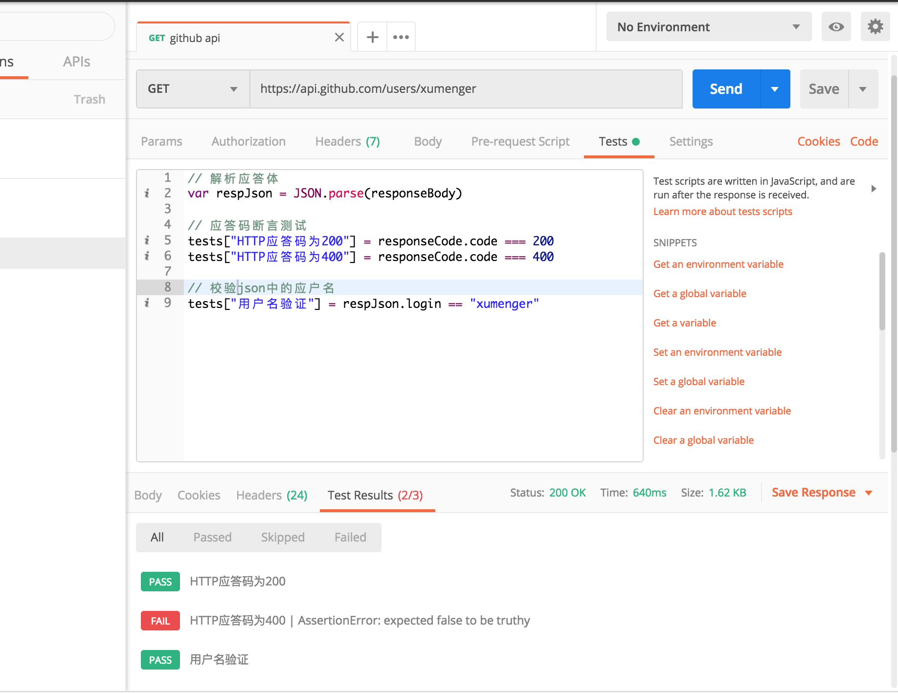
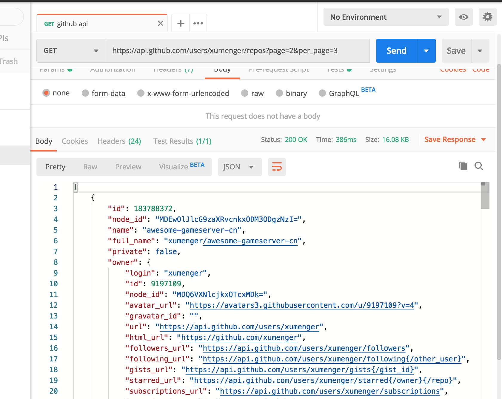

选择[Github API](https://developer.github.com/) 作为测试对象！

比如在Postman 中构造请求去查询我的个人信息

按照Github 提供的API，直接GET 方法请求[https://api.github.com/users/xumenger](https://api.github.com/users/xumenger)即可


应答内容有，应答头（包括应答码……），还有应答体，应答体是这样的

```json
{
    "login": "xumenger",
    "id": 9197109,
    "node_id": "MDQ6VXNlcjkxOTcxMDk=",
    "avatar_url": "https://avatars3.githubusercontent.com/u/9197109?v=4",
    "gravatar_id": "",
    "url": "https://api.github.com/users/xumenger",
    "html_url": "https://github.com/xumenger",
    "followers_url": "https://api.github.com/users/xumenger/followers",

    .
    .
    .
}
```

## Tests测试案例

>Test scripts are written in JavaScript, and are run after the response is received

>Test 脚本使用JS 编写，在收到应答后执行

针对上面请求返回的应答，用JavaScript 编写Tests 如下：

```javascript
// 解析JSON格式的应答体
var respJson = JSON.parse(responseBody)

// 应答码断言测试
tests["HTTP应答码为200"] = responseCode.code === 200
tests["HTTP应答码为400"] = responseCode.code === 400

// 校验json中的应户名
tests["用户名验证"] = respJson.login == "xumenger"
```

运行点击Send 之后，在收到应答后，按照Tests 的内容对应答进行断言测试的结果如下



使用新的Github API，通过分页的方式查询某个用户的仓库，[https://api.github.com/users/xumenger/repos?page=2&per_page=3](https://api.github.com/users/xumenger/repos?page=2&per_page=3)



针对这种带有数组的Json 应答报文，比如可以写一个这样的Tests 脚本

```javascript
// 解析JSON格式的应答体
var respJson = JSON.parse(responseBody)

// 获取应答数组中的第一个，解析其中的owner->login
tests["用户名验证"] = respJson[0].owner.login == "xumenger"
```

## Pre-request Script

>Pre-request scripts are written in JavaScript, and are run before the request is sent

>Pre-request 脚本使用JS 编写，在发送请求前


>本文只展示了简单的Tests、Pre-request 语法，作为一个简单的入门，作为一个HTTP 测试，甚至是Web 渗透工具，Postman 组合Tests、Pre-request 可以实现很强大的功能！

## 参考资料

* [Python的Requests库：HTTP请求和响应](http://www.xumenger.com/python-request-02-20170114/)
* [Postman Pre-request 使用](https://www.jianshu.com/p/cae50f9b61ab)
* [postman pre-request-script 操作方法记录](https://www.cnblogs.com/zjhblogs/p/10219346.html)
* [Postman使用详解](https://www.cnblogs.com/xiaoxi-3-/p/7839278.html)
* [一篇文章搞定Github API 调用 (v3）](https://www.jianshu.com/p/a0c7d0482415)
