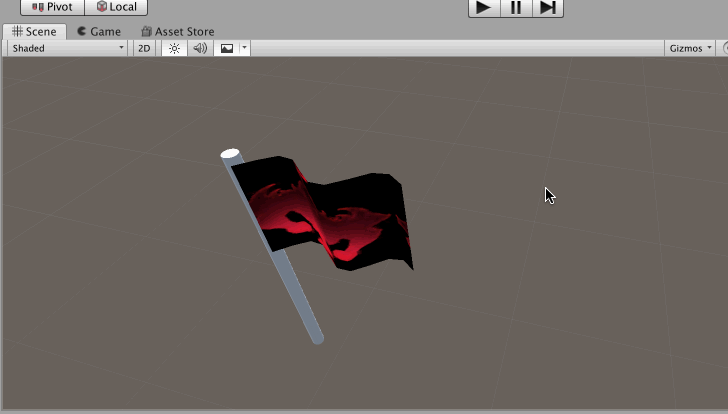

先看一下一个“粗制滥造”的旗帜飘扬的效果。旗帜飘扬，而且旗帜上面的贴图会像跑马灯一样播放



对应的Shader 代码是这样的

```shader
Shader "Unlit/Flag Unlit Shader"
{
    Properties
    {
        _MainTex ("Texture", 2D) = "white" {}
    }

    SubShader
    {
        Tags { "RenderType"="Opaque" }
        LOD 100

        Pass
        {
            CGPROGRAM

            #pragma vertex vert
            #pragma fragment frag
            // make fog work
            #pragma multi_compile_fog

            #include "UnityCG.cginc"

            struct appdata
            {
                float4 vertex : POSITION;
                float2 uv : TEXCOORD0;
            };

            struct v2f
            {
                float2 uv : TEXCOORD0;
                UNITY_FOG_COORDS(1)
                float4 vertex : SV_POSITION;
            };

            sampler2D _MainTex;
            float4 _MainTex_ST;

            v2f vert (appdata v)
            {
                v2f o;

                v.vertex.y = cos(v.vertex.x + _Time.w);

                o.vertex = UnityObjectToClipPos(v.vertex);
                o.uv = TRANSFORM_TEX(v.uv, _MainTex);
                UNITY_TRANSFER_FOG(o,o.vertex);
                return o;
            }

            fixed4 frag (v2f i) : SV_Target
            {
                float2 offset = float2(0, 0);
                offset.x = _Time.y * 0.25;
                offset.y = _Time.y * 0.25;

                // sample the texture
                fixed4 col = tex2D(_MainTex, i.uv + offset);

                // apply fog
                UNITY_APPLY_FOG(i.fogCoord, col);
                return col;
            }

            ENDCG
        }
    }
}
```

## 拆解以上代码介绍Shader语法

Properties 块中的内容，是显示在面板上的属性

```shader
Properties
{
    _MainTex ("Texture", 2D) = "white" {}
}
```

子着色器

```shader
// 子着色器
SubShader
{
    Tags { "RenderType"="Opaque" }
    LOD 100
```

Pass 是一个完整的通道，3D 渲染流水线，显卡把3D 物体绘制出来

```
Pass
{
    CGPROGRAM     // CG编程语言开始

    ...

    ENDCG         // CG代码结束的地方
```

#pragma 是和编译器交互的部分

```shader
// 告诉编译器，vert函数是顶点着色器的入口函数
#pragma vertex vert

// 告诉编译器，frag函数是片元着色器的入口函数
#pragma fragment frag

// make fog work
#pragma multi_compile_fog
```

Shader 头文件。Unity 提供了一些封装好的标准函数，可以直接调用，和C 语言有些类似

```shader
#include "UnityCG.cginc"
```

分别声明两个数据结构，appdata 是系统调用顶点着色器函数的时候的参数类型，会自动填充其中的属性值

v2f 是顶点着色器的输出，是片元着色器的输入

```shader
// 声明一个结构体
struct appdata
{
    float4 vertex : POSITION;   // 位置
    float2 uv : TEXCOORD0;      // 纹理贴图
};

// 声明一个结构体
struct v2f
{
    float2 uv : TEXCOORD0;
    UNITY_FOG_COORDS(1)
    float4 vertex : SV_POSITION;
};
```

在Properties定义的属性，可以在面板上让开发者输入，但如果想要在CG代码中获取这些属性值，那么就需要在这里再声明一次

```shader
sampler2D _MainTex;
float4 _MainTex_ST;
```

顶点着色器函数，输入参数类型是appdata。运行时调用该顶点着色器的函数的，系统会把顶点的位置（POSITION）、纹理贴图（TEXCOORD0）对应的填充到该结构体中的对应属性值中！

```
v2f vert (appdata v)
{
    v2f o;

    // 实现UV动画，让旗帜飘动
    // 在Shader中，通过_Time获取当前时间
    // _Time是一个4元变量(x, y, z, w) -> (t/20, t, t*2, t*3)
    // t表示自场景加载到目前的时间
    v.vertex.y = cos(v.vertex.x + _Time.w);

    o.vertex = UnityObjectToClipPos(v.vertex);
    o.uv = TRANSFORM_TEX(v.uv, _MainTex);
    UNITY_TRANSFER_FOG(o,o.vertex);
    return o;
}
```

返回v2f类型的数据，返回到Pass通道，Pass通道再调用片元着色器函数的时候，会作为片元着色器的入参

```shader
fixed4 frag (v2f i) : SV_Target
{
    // 以下代码，实现贴图在模型上随时间移动的效果
    // 可以用来制作光影效果等等
    float2 offset = float2(0, 0);
    offset.x = _Time.y * 0.25;
    offset.y = _Time.y * 0.25;

    // sample the texture
    fixed4 col = tex2D(_MainTex, i.uv + offset);

    // apply fog
    UNITY_APPLY_FOG(i.fogCoord, col);
    return col;
}
```

## 在C# 代码中调用Shader脚本播放特效

下面的代码只是展示C# 中与Shader、Material 交互API 的例子而已

除了在Shader 中使用\_Time 变量来实现动画效果，也可以结合C# 和Shader 来实现动画效果

```c#
using UnityEngine;
using System;
using System.Collections;
using System.Collections.Generic;

public class CallShader: MonoBehaviour
{
    private Shader myShader;
    private Material myMaterial;

    private float values;

    void Start()
    {
        // 通过Shader的名称找到对应的Shader
        myShader = Shader.Find("Unlit/Flag Unlit Shader");

        // 创建一个材质
        myMaterial = new Material(myShader);

        values = 0;
    }

    // 在完成了所有的图像渲染后，调用这个函数
    void OnRenderImage(RenderTexture rta, RenderTexture rtb)
    {
        if (null != myShader)
        {
            // 渲染材质
            Graphics.Blit(rta, rtb, myMaterial);
        }
        else 
        {
            Graphics.Blit(rta, rtb);
        }
    }

    void Update()
    {
        values = Mathf.Lerp(values, 1f, Time.deltaTime * 0.5f);

        // 为Shader的_Value属性赋值
        myMaterial.SetFloat("_Value", values);
    }
}
```
