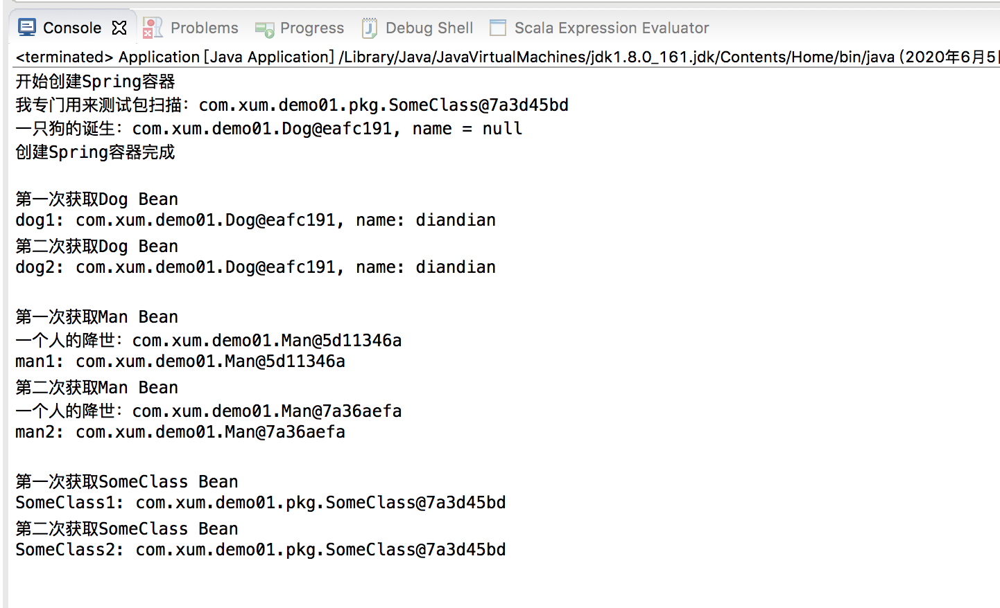
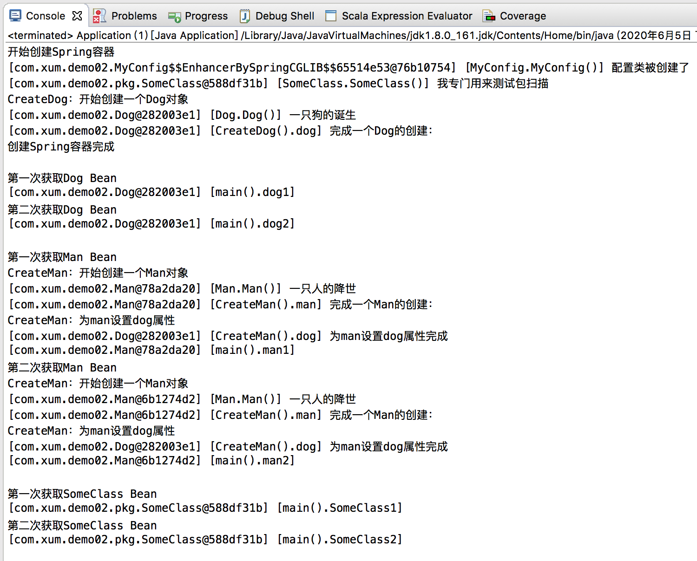

之前关于Spring、SpringMVC、SpringBoot 也整理过一些文章

* [Spring Boot开发Web程序](http://www.xumenger.com/java-springboot-20180322/)
* [搭建Spring Boot源码环境](http://www.xumenger.com/spring-boot-eclipse-maven-20181201/)
* [用AspectJ进行AOP编程](http://www.xumenger.com/aspectj-aop-spring-20181204/)
* [从Spring到Spring Boot](http://www.xumenger.com/spring-ioc-20181206/)
* [Java Web开发：理解Servlet](http://www.xumenger.com/java-web-01-servlet-20190105/)
* [Java Web开发：Spring MVC](http://www.xumenger.com/java-web-02-springmvc-20190106/)
* [Java Web开发：Spring Boot](http://www.xumenger.com/java-web-03-springboot-20190107/)

从这里开始我计划对Spring 的原理、源码进行一些初步的研究，希望对于Spring 框架内对象的内存、生命周期达到像以前对于C++ 相关的熟悉程度，比如

* [Delphi配合VC++开发：基础数据类型对应关系](http://www.xumenger.com/delphi-vc-dll-1-20160903/)
* [Delphi配合VC++开发：结构体对齐机制](http://www.xumenger.com/delphi-vc-dll-2-20160903/)
* [Delphi配合VC++开发：Visual C++使用说明](http://www.xumenger.com/delphi-vc-dll-3-20160903/)
* [Delphi配合VC++开发：使用DLL进行对接](http://www.xumenger.com/delphi-vc-dll-4-20160903/)
* [Delphi配合VC++开发：跨语言传字符串](http://www.xumenger.com/delphi-vc-dll-5-20160903/)
* [C++对象内存模型：先简单展示几种典型C++类](http://www.xumenger.com/cpp-object-memory-20161104/)
* [C++对象内存模型：简单继承与多态下的内存模型](http://www.xumenger.com/cpp-object-memory-01-20161105/)
* [C++对象内存模型：编译器对C++的影响](http://www.xumenger.com/cpp-object-memory-02-20161105/)
* [C++对象内存模型：对象内存对齐机制](http://www.xumenger.com/cpp-object-memory-03-20161105/)
* [C++对象内存模型：通过重载与覆盖理解虚函数表指针](http://www.xumenger.com/cpp-override-overload-20161106/)
* [C++对象内存模型：构造、析构与拷贝](http://www.xumenger.com/cpp-object-memory-01-20161113/)
* [C++对象内存模型：模板、异常与RTTI](http://www.xumenger.com/cpp-object-memory-02-20161113/)
* [C++对象内存模型：C++的string和Delphi的string](http://www.xumenger.com/cpp-delphi-string-20161116/)
* [Delphi对象内存模型：Delphi和VC++使用类进行对接](http://www.xumenger.com/class-delphi-cpp-01-20161128/)
* [Delphi对象内存模型：Delphi的虚方法表和动态方法表](http://www.xumenger.com/class-delphi-cpp-02-20161128/)
* [汇编与逆向基础：VC++6.0 调试模式下探究Win32进程堆内存模型](http://www.xumenger.com/windows-vcpp-debug-20161203/)
* [Windows下32位进程内存模型](http://www.xumenger.com/01-windows-process-memory-20170101/)
* [Linux下32位进程内存模型](http://www.xumenger.com/02-linux-process-memory-20170101/)

我的目标是通过通过本系列博文快速熟悉Spring 一些关键的类、接口、注解背后的原理，讲解如何通过阅读代码帮助开发者深入理解Spring 底层，然后在使用SpringBoot 进行各个领域的应用的时候不至于再经常因为Spring 底层的一些原理不清楚而困扰

首先我这里总结一下使用Spring 框架注入Bean 的几种方式，并且初步说一下阅读源码的思路

在[https://mvnrepository.com/](https://mvnrepository.com/) 可以搜索到我们需要的依赖的dependency ，比如

```xml
<!-- https://mvnrepository.com/artifact/org.springframework/spring-context -->
<dependency>
    <groupId>org.springframework</groupId>
    <artifactId>spring-context</artifactId>
    <version>5.1.15.RELEASE</version>
</dependency>
```

## 使用配置文件的方式

然后分别创建几个测试用的类，注意SomeClass 的包更深，用来测试包扫描

创建这个Dog 类，用于测试Bean 为单例时候的生命周期情况

```java
package com.xum.demo01;

public class Dog 
{
    private String name;
    
    public Dog()
    {
        System.out.println("一只狗的诞生：" + this + ", name = " + name);
    }

    public String getName() 
    {
        return name;
    }

    public void setName(String name) 
    {
        this.name = name;
    }
}
```

创建这个Man 类，用于测试Bean 为多例时候的生命周期情况

```java
package com.xum.demo01;

public class Man 
{
    public Man()
    {
        // 看这个输入什么时候执行可以看到这个Bean 什么时候被创建
        System.out.println("一个人的降世：" + this);
    }
}
```

SomeClass 这个类用来测试包扫描

```java
package com.xum.demo01.pkg;

import org.springframework.stereotype.Component;

// 需要配合@Component实现包扫描
@Component
public class SomeClass 
{
    public SomeClass()
    {
        System.out.println("我专门用来测试包扫描：" + this);
    }
}
```

在src/main/resources 下面创建一个xml 文件，比如applicationContext.xml

```xml
<?xml version="1.0" encoding="UTF-8"?>
<beans xmlns="http://www.springframework.org/schema/beans"
       xmlns:xsi="http://www.w3.org/2001/XMLSchema-instance"
       xmlns:context="http://www.springframework.org/schema/context"
       xmlns:mvc="http://www.springframework.org/schema/mvc"
       xsi:schemaLocation="http://www.springframework.org/schema/beans
          http://www.springframework.org/schema/beans/spring-beans-4.2.xsd
          http://www.springframework.org/schema/mvc
          http://www.springframework.org/schema/mvc/spring-mvc-4.2.xsd
          http://www.springframework.org/schema/context
          http://www.springframework.org/schema/context/spring-context-4.2.xsd">
        
    <!-- 包扫描 -->
    <context:component-scan base-package="com.xum.demo01.pkg"/>
    
    <!-- 指定具体的Bean，默认的scope就是singleton：单例 -->
    <bean id="dog" class="com.xum.demo01.Dog" scope="singleton">
        <!-- 设置属性值 -->
        <property name="name" value="diandian"></property>
    </bean>
    
    <!-- 指定具体的Bean，设置scope为prototype -->
    <bean id="man" class="com.xum.demo01.Man" scope="prototype"></bean>
    
    <!-- Spring2.0以后，增加了session、request、global session三种专用于Web应用程序上下文的Bean -->
    <!-- 这里暂不演示 -->
</beans>
```

然后编写测试类，包括上面几个类，都有打印的语句，用于我们下面观察打印语句的执行时机，分析Bean 的生命周期行为

```java
package com.xum.demo01;

import org.springframework.context.support.ClassPathXmlApplicationContext;

import com.xum.demo01.pkg.SomeClass;

public class Application 
{
    @SuppressWarnings("resource")
    public static void main(String args[]) 
    {
        // 创建一个Spring容器
        System.out.println("开始创建Spring容器");
        ClassPathXmlApplicationContext applicationContext = new ClassPathXmlApplicationContext("applicationContext.xml");
        System.out.println("创建Spring容器完成");
        System.out.println("");
        
        // dog是单例，所以这里面多次获取这个Bean，其实是一个，可以看打印的地址是相同的
        System.out.println("第一次获取Dog Bean");
        Dog dog1 = (Dog)applicationContext.getBean("dog");
        System.out.println("dog1: " + dog1 + ", name: " + dog1.getName());
        
        System.out.println("第二次获取Dog Bean");
        Dog dog2 = (Dog)applicationContext.getBean("dog");
        System.out.println("dog2: " + dog2 + ", name: " + dog2.getName());
        System.out.println("");
        
        // man是多例，所以这里面多次获取这个Bean，每次都会创建一个，地址不同
        System.out.println("第一次获取Man Bean");
        Man man1 = (Man)applicationContext.getBean("man");
        System.out.println("man1: " + man1);
        
        System.out.println("第二次获取Man Bean");
        Man man2 = (Man)applicationContext.getBean("man");
        System.out.println("man2: " + man2);
        System.out.println("");
        
        System.out.println("第一次获取SomeClass Bean");
        SomeClass clz1 = (SomeClass)applicationContext.getBean(SomeClass.class);
        System.out.println("SomeClass1: " + clz1);
        
        System.out.println("第二次获取SomeClass Bean");
        SomeClass clz2 = (SomeClass)applicationContext.getBean(SomeClass.class);
        System.out.println("SomeClass2: " + clz2);
    }
}
```

运行程序的效果是这样的



可以看到这样的规律

* 单例类型的Bean，在Spring 的IoC 容器创建的时候就同时被创建
* 多例类型的Bean，在调用getBean 的时候才被创建
* 单例类型的Bean，每次getBean 的时候都是同一个对象
* 多例类型的Bean，每次getBean 的时候都创建一个新的对象
* 可以在配置文件中通过bean 标签具体注入某个指定的Bean
* 也可以使用包扫描的方式注入某个包里面所有的Bean

## 使用注解的方式

现在基本上很少使用配置文件的方式注入Bean 了，所以关于其如何工作的、配置规则，这里我不会再赘述，多说一下现在用的更多的使用注解的方式注入Bean

首先编写几个测试用的类

Dog 类用于测试单例Bean

```java
package com.xum.demo02;

public class Dog 
{
	public Dog()
	{
		// 将地址打印在前面，统一，方便查看输出信息
		System.out.println("[" + this + "] [Dog.Dog()] 一只狗的诞生");
	}
}
```

Man 类用来测试多例Bean

```java
package com.xum.demo02;

public class Man 
{
	private String name;
	private Integer age;
	
	private Dog dog;
	
	public Man()
	{
		System.out.println("[" + this + "] [Man.Man()] 一只人的降世");
	}

	public String getName() {
		return name;
	}

	public void setName(String name) {
		this.name = name;
	}

	public Integer getAge() {
		return age;
	}

	public void setAge(Integer age) {
		this.age = age;
	}

	public Dog getDog() {
		return dog;
	}

	public void setDog(Dog dog) {
		this.dog = dog;
	}
}
```

SomeClass 用来测试包扫描

```java
package com.xum.demo02.pkg;

import org.springframework.stereotype.Component;

//需要配合@Component实现包扫描
//或者使用@Service、@Controller、@Repository中的一个
@Component
public class SomeClass 
{
	public SomeClass()
	{
		System.out.println("[" + this + "] [SomeClass.SomeClass()] 我专门用来测试包扫描");
	}
}
```

然后编写一个配置类，使用@Configuration 注解，其作用就类似于原来的配置文件，并且使用@ComponentScan 指明包扫描的地址

```java
package com.xum.demo02;

import org.springframework.context.annotation.Bean;
import org.springframework.context.annotation.ComponentScan;
import org.springframework.context.annotation.Configuration;
import org.springframework.context.annotation.Scope;

/**
 * 通过在@Configuration注解的类中使用@Bean实现注入
 * 配置类就类似之前的配置文件
 *
 * 使用@ComponentScan指定扫描哪个包，可以指明多个包
 */
@Configuration
@ComponentScan({"com.xum.demo02.pkg"})
public class MyConfig 
{
	public MyConfig()
	{
		System.out.println("[" + this + "] [MyConfig.MyConfig()] 配置类被创建了");
	}
	
	// 给容器中注册一个Bean，类型默认为返回值类型，id默认是方法名，或者用value指明
	// 这样在容器启动的时候就会执行这个dog()方法，将返回值放到Spring IoC容器中
	@Bean(value="dog")
	Dog CreateDog()
	{
		System.out.println("CreateDog：开始创建一个Dog对象");
		Dog dog = new Dog();
		System.out.println("[" + dog + "] [CreateDog().dog] 完成一个Dog的创建：");
		
		return dog;
	}
	
	//prototype：多例
	//singleton：单例（默认）
	//request：同一个HTTP请求创建一个实例
	//session：同一个Session创建一个实例
	@Scope("prototype")
	@Bean(value="man")
	Man CreateMan()
	{
		System.out.println("CreateMan：开始创建一个Man对象");
		Man man = new Man();
		System.out.println("[" + man + "] [CreateMan().man] 完成一个Man的创建：");
		
		System.out.println("CreateMan：为man设置dog属性");
		Dog dog = CreateDog();
		man.setDog(dog);
		System.out.println("[" + dog + "] [CreateMan().dog] 为man设置dog属性完成");
		
		return man;
	}
}
```

不同于使用配置文件，如果使用配置类的话，创建Spring IoC 容器需要使用AnnotationConfigApplicationContext 类

```java
package com.xum.demo02;

import org.springframework.context.annotation.AnnotationConfigApplicationContext;

import com.xum.demo02.pkg.SomeClass;

public class Application 
{
	@SuppressWarnings("resource")
	public static void main(String args[]) 
	{
		// 创建一个Spring容器
		System.out.println("开始创建Spring容器");
		AnnotationConfigApplicationContext applicationContext = new AnnotationConfigApplicationContext(MyConfig.class);
		System.out.println("创建Spring容器完成");
		System.out.println("");
		
		// dog是单例，所以这里面多次获取这个Bean，其实是一个，可以看打印的地址是相同的
		System.out.println("第一次获取Dog Bean");
		Dog dog1 = (Dog)applicationContext.getBean("dog");
		System.out.println("[" + dog1 + "] [main().dog1]");
		
		System.out.println("第二次获取Dog Bean");
		Dog dog2 = (Dog)applicationContext.getBean("dog");
		System.out.println("[" + dog2 + "] [main().dog2]");
		System.out.println("");
		
		// man是多例，所以这里面多次获取这个Bean，每次都会创建一个，地址不同
		System.out.println("第一次获取Man Bean");
		Man man1 = (Man)applicationContext.getBean("man");
		System.out.println("[" + man1 + "] [main().man1]");
		
		System.out.println("第二次获取Man Bean");
		Man man2 = (Man)applicationContext.getBean("man");
		System.out.println("[" + man2 + "] [main().man2]");
		System.out.println("");
		
		System.out.println("第一次获取SomeClass Bean");
		SomeClass SomeClass1 = (SomeClass)applicationContext.getBean(SomeClass.class);
		System.out.println("[" + SomeClass1 + "] [main().SomeClass1]");
		
		System.out.println("第二次获取SomeClass Bean");
		SomeClass SomeClass2 = (SomeClass)applicationContext.getBean(SomeClass.class);
		System.out.println("[" + SomeClass2 + "] [main().SomeClass2]");
		System.out.println("");
		
		// 获取Spring 容器中所有的Bean（因为所有的类都是Object的子类，所以这样可以获取所有的Bean
		System.out.println("获取Spring IoC容器中所有的Bean");
		String[] namesForType = applicationContext.getBeanNamesForType(Object.class);
		for (String name: namesForType) {
			System.out.println(name);
		}
	}
}
```

其运行效果如下



可以看到这些规律

* CreateDog() 对应的Bean 是单例的，所以在初始化Spring IoC 容器的时候，CreateDog() 被调用
* CreateMan() 对应的Bean 是多例的，所以在初始化Spring IoC 容器的时候，CreateMan() 没有被调用
* 单例类型的Bean，在Spring 的IoC 容器创建的时候就同时被创建
* 多例类型的Bean，在调用getBean 的时候才被创建
* 单例类型的Bean，每次getBean 的时候都是同一个对象
* 多例类型的Bean，每次getBean 的时候都创建一个新的对象
* MyConfig 也在初始化IoC 容器时被创建，说明MyConfig 也是Bean
* 因为CreateMan() 对应的Bean 是多例的，所以每次调用getBean("man") 时，都会调用CreateMan()
	* CreateMan() 代码中调了CreateDog()，但dog 是单例的，所以在输出信息中可以看到实际上并没调用
	* 因为dog 是单例的，所以在CreateMan() 中要获取dog 的时候直接从IoC 容器中拿出来即可
	* 所以虽然代码中CreateDog() 被调用了，但实际运行效果看并没有，很有意思，要多看底层源码

在看最后输出的IoC 容器中所有的Bean


MyConfig 也在初始化IoC 容器时被创建，且后续打印所有Bean 时也打印了MyConfig，说明MyConfig 也是Bean；另外虽然CreateMan() 对应的Bean 是多例的，但可以看到IoC 容器中还是有man 这个Bean 的，说明IoC 中的Bean 并不是一个具体对象

除了我们这个项目中明确的几个Bean，还有一些Spring 框架自带的Bean

* org.springframework.context.annotation.internalConfigurationAnnotationProcessor
* org.springframework.context.annotation.internalAutowiredAnnotationProcessor
* org.springframework.context.annotation.internalCommonAnnotationProcessor
* org.springframework.context.event.internalEventListenerProcessor
* org.springframework.context.event.internalEventListenerFactory
* environment
* systemProperties
* systemEnvironment
* org.springframework.context.annotation.ConfigurationClassPostProcessor.importRegistry
* messageSource
* applicationEventMulticaster
* lifecycleProcessor

## 简单总结

以上，对于两种注入Bean 的方式进行了简单总结，并通过打印关键信息的方式帮助我们梳理清楚了各种方法的调用关系、Bean 的生命周期等信息

在后续的文章中，我会进一步研究Spring！

参考资料

* [spring中bean配置和bean注入](https://www.cnblogs.com/wuchanming/p/5426746.html)
* [使用spring配置类代替xml配置文件注册bean类](https://www.cnblogs.com/dubhlinn/p/10662763.html)
* [Spring基础——在Spring Config 文件中配置 Bean](https://www.cnblogs.com/solverpeng/archive/2016/07/15/5673415.html)
