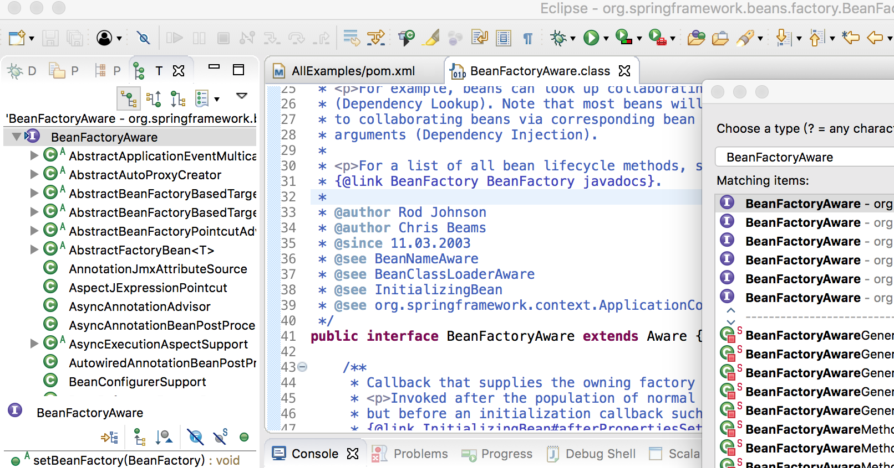
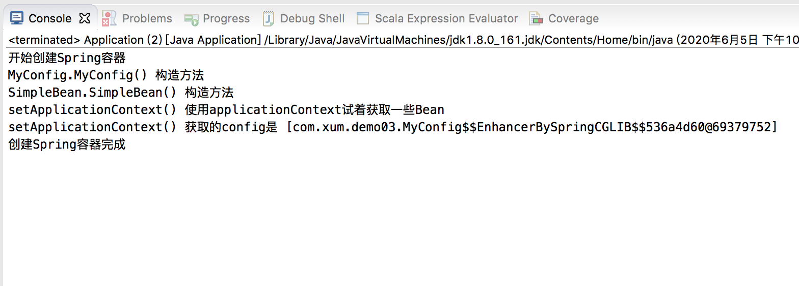
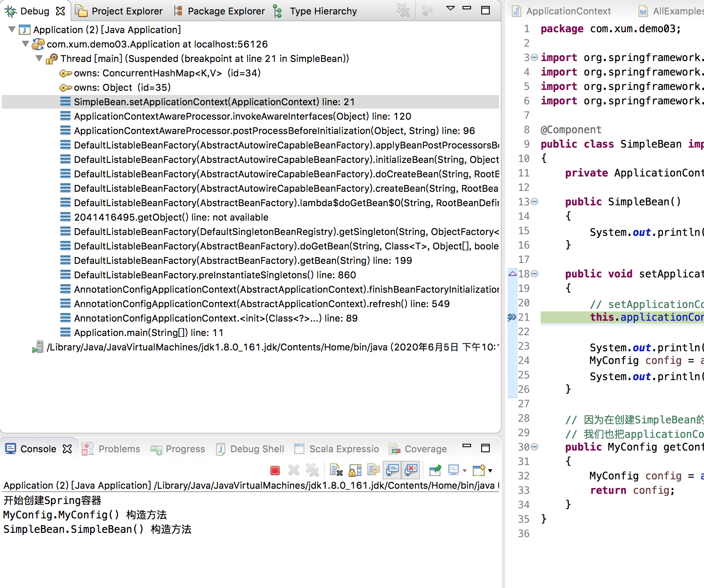
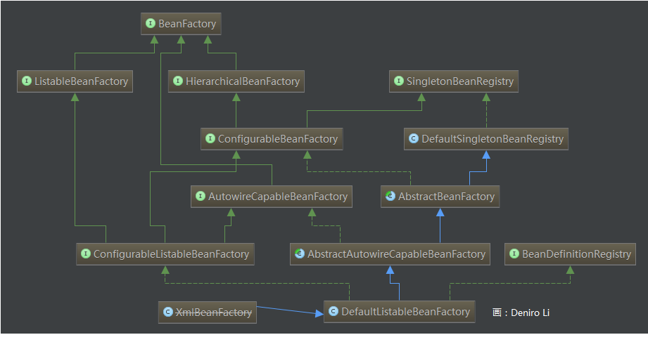
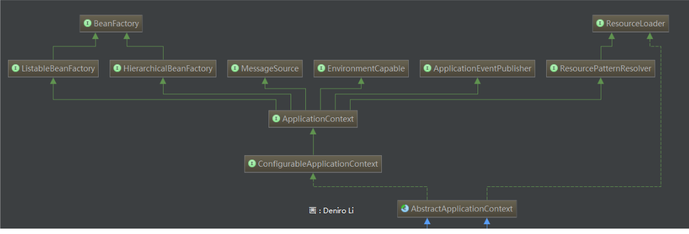

在上一篇文章中，我通过几个简单的例子的运行效果，展示了Spring IoC 容器是如何注入Bean 的，以及Bean 在内存中的情况（同输出信息中的引用地址可以看到对象的内存分布），本文则继续介绍Spring 中一个关键的接口Aware！

首先介绍一下Eclipse 的一些高效的快捷键

使用【Ctrl-Shift-H】，可以搜索一些类、接口的定义，比如这里搜索BeanFactoryAware，可以看到其就是继承自Aware



【Ctrl-T】，可以查看某个类、接口的所有子类、实现类，查看Aware 的子类、实现类，可以看到有

* ApplicationContextAware
* ApplicationEventPublisherAware
* BeanClassLoaderAware
* BeanFactoryAware
* BeanNameAware
* EmbeddedValueResolverAware
* EnvironmentAware
* ImportAware
* LoadTimeWeaverAware
* MessageSourceAware
* NotificationPublisherAware
* ResourceLoaderAware

Aware 的设计就是为了我们的Bean 能够具有使用Spring 底层对象的功能，类似于回调函数的风格，只要实现xxxAware 接口，那么这个Aware 规定的方法在对象创建的时候就会被调用

## ApplicationContextAware接口

按照上面的解释，我们自己的Bean 如何实现了ApplicationContextAware 接口，那么当这个Bean 对象被创建的时候，ApplicationContextAware 对应的方法就会被调用，Spring 底层就会通过该方法将ApplicationContext 对象给到这个Bean！

直接看一个例子，先编写一个实现了ApplicationContextAware 的Bean 类

```java
package com.xum.demo03;

import org.springframework.beans.BeansException;
import org.springframework.context.ApplicationContext;
import org.springframework.context.ApplicationContextAware;
import org.springframework.stereotype.Component;

@Component
public class SimpleBean implements ApplicationContextAware
{
    private ApplicationContext applicationContext;
    
    public SimpleBean()
    {
        System.out.println("SimpleBean.SimpleBean() 构造方法");
    }

    public void setApplicationContext(ApplicationContext applicationContext) throws BeansException 
    {
        // setApplicationContext传入applicationContext，可以保存下来，Bean在后面也许可以用到
        this.applicationContext = applicationContext;
        
        System.out.println("setApplicationContext() 使用applicationContext试着获取一些Bean");
        MyConfig config = applicationContext.getBean(MyConfig.class);
        System.out.println("setApplicationContext() 获取的config是 [" + config + "]");
    }
    
    // 因为在创建SimpleBean的时候，Spring底层调用setApplicationContext把applicationContext传了进来
    // 我们也把applicationContext保存了下来，所以可以使用applicationContext去拿到一些Bean
    public MyConfig getConfig()
    {
        MyConfig config = applicationContext.getBean(MyConfig.class);
        return config;
    }
}
```

然后实现一个配置类，并且扫描上面SimpleBean 所在的包

```java
package com.xum.demo03;

import org.springframework.context.annotation.ComponentScan;
import org.springframework.context.annotation.Configuration;

@Configuration
@ComponentScan({"com.xum.demo03"})
public class MyConfig 
{
    public MyConfig()
    {
        System.out.println("MyConfig.MyConfig() 构造方法");
    }
}
```

最后编写主类

```java
package com.xum.demo03;

import org.springframework.context.annotation.AnnotationConfigApplicationContext;

public class Application 
{
    public static void main(String[] args)
    {
        // 创建一个Spring容器
        System.out.println("开始创建Spring容器");
        AnnotationConfigApplicationContext applicationContext = new AnnotationConfigApplicationContext(MyConfig.class);
        System.out.println("创建Spring容器完成");
        System.out.println("");
    }
}
```

运行这个测试程序，效果如下



很明显可以看到，SimpleBean 实现了ApplicationContextAware ，在SimpleBean 被构造之后，Spring 回调了setApplicationContext() 方法，把ApplicationContext 传了进来

## 通过断点帮我们分析

以上通过在关键节点打印日志可以看到setApplicationContext() 是在Spring 容器初始化的时候执行的，但是我还想看更多的细节怎么办？那么就可以结合Eclipse 对程序打断单帮助我们分析源码

在SimpleBean 类的setApplicationContext() 方法中加一个断点，然后以Debug 的方式运行程序，程序会预期命中断点



为了方便，我直接把命中该断点后，程序的调用栈信息拷贝如下（从下往上看方法的调用顺序）

```
Application (2) [Java Application]    
    com.xum.demo03.Application at localhost:56126    
        Thread [main] (Suspended (breakpoint at line 21 in SimpleBean))    
            owns: ConcurrentHashMap<K,V>  (id=34)    
            owns: Object  (id=35)    
            SimpleBean.setApplicationContext(ApplicationContext) line: 21    
            ApplicationContextAwareProcessor.invokeAwareInterfaces(Object) line: 120    
            ApplicationContextAwareProcessor.postProcessBeforeInitialization(Object, String) line: 96    
            DefaultListableBeanFactory(AbstractAutowireCapableBeanFactory).applyBeanPostProcessorsBeforeInitialization(Object, String) line: 414    
            DefaultListableBeanFactory(AbstractAutowireCapableBeanFactory).initializeBean(String, Object, RootBeanDefinition) line: 1763    
            DefaultListableBeanFactory(AbstractAutowireCapableBeanFactory).doCreateBean(String, RootBeanDefinition, Object[]) line: 593    
            DefaultListableBeanFactory(AbstractAutowireCapableBeanFactory).createBean(String, RootBeanDefinition, Object[]) line: 515    
            DefaultListableBeanFactory(AbstractBeanFactory).lambda$doGetBean$0(String, RootBeanDefinition, Object[]) line: 320    
            2041416495.getObject() line: not available    
            DefaultListableBeanFactory(DefaultSingletonBeanRegistry).getSingleton(String, ObjectFactory<?>) line: 226    
            DefaultListableBeanFactory(AbstractBeanFactory).doGetBean(String, Class<T>, Object[], boolean) line: 318    
            DefaultListableBeanFactory(AbstractBeanFactory).getBean(String) line: 199    
            DefaultListableBeanFactory.preInstantiateSingletons() line: 860    
            AnnotationConfigApplicationContext(AbstractApplicationContext).finishBeanFactoryInitialization(ConfigurableListableBeanFactory) line: 877    
            AnnotationConfigApplicationContext(AbstractApplicationContext).refresh() line: 549    
            AnnotationConfigApplicationContext.<init>(Class<?>...) line: 89    
            Application.main(String[]) line: 11    
    /Library/Java/JavaVirtualMachines/jdk1.8.0_161.jdk/Contents/Home/bin/java (2020年6月5日 下午10:17:05)    
```

简单分析一下这个调用链，可以帮助我来初步理解Spring 的源码，首先是AnnotationConfigApplicationContext 的构造方法

```java
    public AnnotationConfigApplicationContext(Class<>... componentClasses) {
        this();
        register(componentClasses);
        refresh();
    }
```

然后调用到refresh() 方法，这个也是Spring IoC 容器初始化最重要的一个方法，在这里做了很多事情，也是后续研究Spring 源码的一大关键

```java
    @Override
    public void refresh() throws BeansException, IllegalStateException {
        synchronized (this.startupShutdownMonitor) {
            // Prepare this context for refreshing.
            prepareRefresh();

            // Tell the subclass to refresh the internal bean factory.
            ConfigurableListableBeanFactory beanFactory = obtainFreshBeanFactory();

            // Prepare the bean factory for use in this context.
            prepareBeanFactory(beanFactory);

            try {
                // Allows post-processing of the bean factory in context subclasses.
                postProcessBeanFactory(beanFactory);

                // Invoke factory processors registered as beans in the context.
                invokeBeanFactoryPostProcessors(beanFactory);

                // Register bean processors that intercept bean creation.
                registerBeanPostProcessors(beanFactory);

                // Initialize message source for this context.
                initMessageSource();

                // Initialize event multicaster for this context.
                initApplicationEventMulticaster();

                // Initialize other special beans in specific context subclasses.
                onRefresh();

                // Check for listener beans and register them.
                registerListeners();

                // Instantiate all remaining (non-lazy-init) singletons.
                finishBeanFactoryInitialization(beanFactory);

                // Last step: publish corresponding event.
                finishRefresh();
            }

            catch (BeansException ex) {
                if (logger.isWarnEnabled()) {
                    logger.warn("Exception encountered during context initialization - " +
                            "cancelling refresh attempt: " + ex);
                }

                // Destroy already created singletons to avoid dangling resources.
                destroyBeans();

                // Reset 'active' flag.
                cancelRefresh(ex);

                // Propagate exception to caller.
                throw ex;
            }

            finally {
                // Reset common introspection caches in Spring's core, since we
                // might not ever need metadata for singleton beans anymore...
                resetCommonCaches();
            }
        }
    }
```

再接着调用finishBeanFactoryInitialization() 方法，初始化所有的单例Bean

```java
    /**
     * Finish the initialization of this context's bean factory,
     * initializing all remaining singleton beans.
     */
    protected void finishBeanFactoryInitialization(ConfigurableListableBeanFactory beanFactory) {
        // Initialize conversion service for this context.
        if (beanFactory.containsBean(CONVERSION_SERVICE_BEAN_NAME) &&
                beanFactory.isTypeMatch(CONVERSION_SERVICE_BEAN_NAME, ConversionService.class)) {
            beanFactory.setConversionService(
                    beanFactory.getBean(CONVERSION_SERVICE_BEAN_NAME, ConversionService.class));
        }

        // Register a default embedded value resolver if no bean post-processor
        // (such as a PropertyPlaceholderConfigurer bean) registered any before:
        // at this point, primarily for resolution in annotation attribute values.
        if (!beanFactory.hasEmbeddedValueResolver()) {
            beanFactory.addEmbeddedValueResolver(strVal -> getEnvironment().resolvePlaceholders(strVal));
        }

        // Initialize LoadTimeWeaverAware beans early to allow for registering their transformers early.
        String[] weaverAwareNames = beanFactory.getBeanNamesForType(LoadTimeWeaverAware.class, false, false);
        for (String weaverAwareName : weaverAwareNames) {
            getBean(weaverAwareName);
        }

        // Stop using the temporary ClassLoader for type matching.
        beanFactory.setTempClassLoader(null);

        // Allow for caching all bean definition metadata, not expecting further changes.
        beanFactory.freezeConfiguration();

        // Instantiate all remaining (non-lazy-init) singletons.
        beanFactory.preInstantiateSingletons();
    }
```

再调用preInstantiateSingletons() 方法，这个方法里面遍历所有的Bean 的名称，然后去初始化Bean

```java
    @Override
    public void preInstantiateSingletons() throws BeansException {
        if (logger.isTraceEnabled()) {
            logger.trace("Pre-instantiating singletons in " + this);
        }

        // Iterate over a copy to allow for init methods which in turn register new bean definitions.
        // While this may not be part of the regular factory bootstrap, it does otherwise work fine.
        List<String> beanNames = new ArrayList<>(this.beanDefinitionNames);

        // Trigger initialization of all non-lazy singleton beans...
        for (String beanName : beanNames) {
            RootBeanDefinition bd = getMergedLocalBeanDefinition(beanName);
            if (!bd.isAbstract() && bd.isSingleton() && !bd.isLazyInit()) {
                if (isFactoryBean(beanName)) {
                    Object bean = getBean(FACTORY_BEAN_PREFIX + beanName);
                    if (bean instanceof FactoryBean) {
                        final FactoryBean<?> factory = (FactoryBean<?>) bean;
                        boolean isEagerInit;
                        if (System.getSecurityManager() != null && factory instanceof SmartFactoryBean) {
                            isEagerInit = AccessController.doPrivileged((PrivilegedAction<Boolean>)
                                            ((SmartFactoryBean<?>) factory)::isEagerInit,
                                    getAccessControlContext());
                        }
                        else {
                            isEagerInit = (factory instanceof SmartFactoryBean &&
                                    ((SmartFactoryBean<?>) factory).isEagerInit());
                        }
                        if (isEagerInit) {
                            getBean(beanName);
                        }
                    }
                }
                else {
                    getBean(beanName);
                }
            }
        }

        // Trigger post-initialization callback for all applicable beans...
        for (String beanName : beanNames) {
            Object singletonInstance = getSingleton(beanName);
            if (singletonInstance instanceof SmartInitializingSingleton) {
                final SmartInitializingSingleton smartSingleton = (SmartInitializingSingleton) singletonInstance;
                if (System.getSecurityManager() != null) {
                    AccessController.doPrivileged((PrivilegedAction<Object>) () -> {
                        smartSingleton.afterSingletonsInstantiated();
                        return null;
                    }, getAccessControlContext());
                }
                else {
                    smartSingleton.afterSingletonsInstantiated();
                }
            }
        }
    }
```

继续调用getBean() 方法

```java
    @Override
    public Object getBean(String name) throws BeansException {
        return doGetBean(name, null, null, false);
    }
```

继续调用doGetBean() 方法，一层层往下调用（暂时省略一些方法），调用到postProcessBeforeInitialization()

```java
    @Override
    @Nullable
    public Object postProcessBeforeInitialization(final Object bean, String beanName) throws BeansException {
        AccessControlContext acc = null;

        if (System.getSecurityManager() != null &&
                (bean instanceof EnvironmentAware || bean instanceof EmbeddedValueResolverAware ||
                        bean instanceof ResourceLoaderAware || bean instanceof ApplicationEventPublisherAware ||
                        bean instanceof MessageSourceAware || bean instanceof ApplicationContextAware)) {
            acc = this.applicationContext.getBeanFactory().getAccessControlContext();
        }

        if (acc != null) {
            AccessController.doPrivileged((PrivilegedAction<Object>) () -> {
                invokeAwareInterfaces(bean);
                return null;
            }, acc);
        }
        else {
            invokeAwareInterfaces(bean);
        }

        return bean;
    }
```

接着调用invokeAwareInterfaces()，这个方法里面判断Bean 实现了哪些Aware 接口，对应回调这个Aware 的方法

```java
    private void invokeAwareInterfaces(Object bean) {
        if (bean instanceof Aware) {
            if (bean instanceof EnvironmentAware) {
                ((EnvironmentAware) bean).setEnvironment(this.applicationContext.getEnvironment());
            }
            if (bean instanceof EmbeddedValueResolverAware) {
                ((EmbeddedValueResolverAware) bean).setEmbeddedValueResolver(this.embeddedValueResolver);
            }
            if (bean instanceof ResourceLoaderAware) {
                ((ResourceLoaderAware) bean).setResourceLoader(this.applicationContext);
            }
            if (bean instanceof ApplicationEventPublisherAware) {
                ((ApplicationEventPublisherAware) bean).setApplicationEventPublisher(this.applicationContext);
            }
            if (bean instanceof MessageSourceAware) {
                ((MessageSourceAware) bean).setMessageSource(this.applicationContext);
            }
            if (bean instanceof ApplicationContextAware) {
                ((ApplicationContextAware) bean).setApplicationContext(this.applicationContext);
            }
        }
    }
```

显然，最后就调用回SimpleBean 的setApplicationContext() 方法了


## BeanFactory 和 ApplicationContext

>直接参考[说说 Spring 框架中的 BeanFactory 和 ApplicationContext](https://www.jianshu.com/p/2808f7c4a24f)

BeanFactory 是类的通用工厂，它可以创建并管理各种类的对象，这些类就是 POJO，Spring 称这些被创建并管理的类对象为 Bean

BeanFactory 体系结构



ApplicationContext 由 BeanFactory 派生而来，提供了很多实际应用的功能 。 在 BeanFactory 中，很多功能需要以编程的方式实现，而在 ApplicationContext 中则可以通过配置的方式来实现



## 参考资料

* [你了解Spring BeanFactoryAware嘛](https://blog.csdn.net/gosaint/article/details/85241451)
* [浅析Spring IoC源码（八）了解BeanFactoryAware](https://blog.csdn.net/clypm/article/details/53390727)
* [说说 Spring 框架中的 BeanFactory 和 ApplicationContext](https://www.jianshu.com/p/2808f7c4a24f)