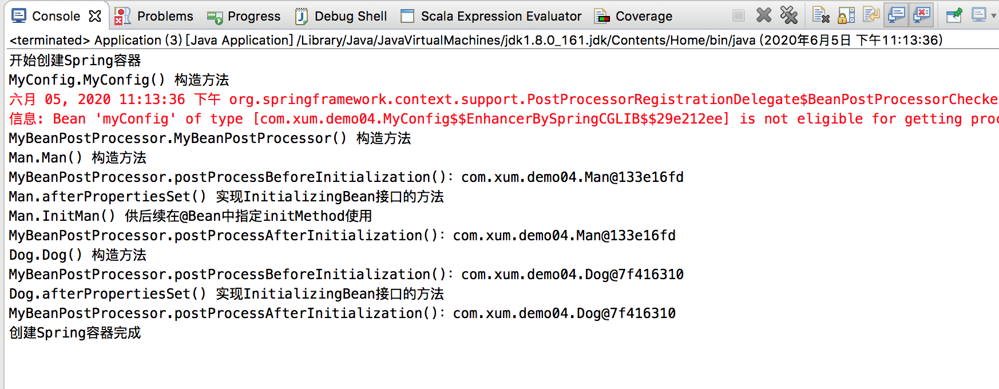
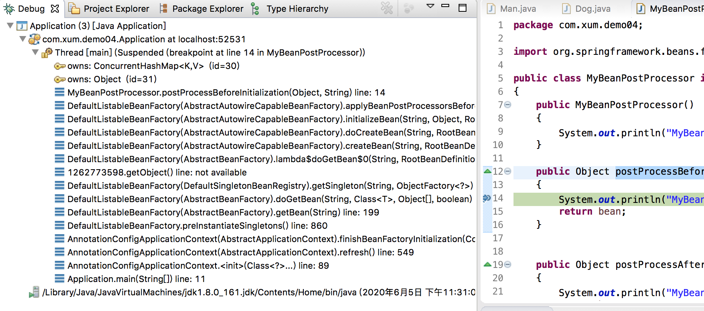

这篇文章直接从一个具体的例子开始！不多废话！

先编写一个Man 类，实现InitializingBean, DisposableBean，实现这两个类，就可以编写对应的方法，当Bean 被创建和销毁的时候来回调这两个方法，比如可以实现资源申请和资源释放的控制；并且实现InitMan、DestroyMan 供@Bean 的initMethod、destroyMethod 指定

```java
package com.xum.demo04;

import org.springframework.beans.factory.DisposableBean;
import org.springframework.beans.factory.InitializingBean;

public class Man implements InitializingBean, DisposableBean
{
	// 类自己的构造方法
	public Man()
	{
		System.out.println("Man.Man() 构造方法");
	}

	// 实现DisposableBean接口的方法
	public void destroy() throws Exception 
	{
		System.out.println("Man.destroy() 实现DisposableBean接口的方法");
	}

	// 实现InitializingBean接口的方法
	public void afterPropertiesSet() throws Exception 
	{
		System.out.println("Man.afterPropertiesSet() 实现InitializingBean接口的方法");
	}
	
	// 供后续在@Bean中指定initMethod使用
	public void InitMan()
	{
		System.out.println("Man.InitMan() 供后续在@Bean中指定initMethod使用");
	}

	// 供后续在@Bean中执行destroyMethod使用
	public void DestroyMan()
	{
		System.out.println("Man.DestroyMan() 供后续在@Bean中执行destroyMethod使用");
	}
}
```

再编写一个Dog 类，只实现InitializingBean, DisposableBean

```java
package com.xum.demo04;

import org.springframework.beans.factory.DisposableBean;
import org.springframework.beans.factory.InitializingBean;

public class Dog implements InitializingBean, DisposableBean
{
	// 类自己的构造方法
	public Dog()
	{
		System.out.println("Dog.Dog() 构造方法");
	}

	// 实现DisposableBean接口的方法
	public void destroy() throws Exception 
	{
		System.out.println("Dog.destroy() 实现DisposableBean接口的方法");
	}

	// 实现InitializingBean接口的方法
	public void afterPropertiesSet() throws Exception 
	{
		System.out.println("Dog.afterPropertiesSet() 实现InitializingBean接口的方法");
	}
}
```

实现一个类继承BeanPostProcessor 类

```java
package com.xum.demo04;

import org.springframework.beans.factory.config.BeanPostProcessor;

public class MyBeanPostProcessor implements BeanPostProcessor 
{
	public MyBeanPostProcessor()
	{
		System.out.println("MyBeanPostProcessor.MyBeanPostProcessor() 构造方法");
	}
	
	public Object postProcessBeforeInitialization(Object bean, String beanName) 
	{
		System.out.println("MyBeanPostProcessor.postProcessBeforeInitialization()：" + bean);
		return bean;
	}

	public Object postProcessAfterInitialization(Object bean, String beanName) 
	{
		System.out.println("MyBeanPostProcessor.postProcessAfterInitialization()：" + bean);
		return bean;
	}
}
```

最后分别实现配置类和主类

```java
package com.xum.demo04;

import org.springframework.context.annotation.Bean;
import org.springframework.context.annotation.Configuration;

@Configuration
public class MyConfig 
{
	public MyConfig()
	{
		System.out.println("MyConfig.MyConfig() 构造方法");
	}
	
	@Bean(initMethod="InitMan", destroyMethod="DestroyMan")
	public Man CreateMan()
	{
		return new Man();
	}
	
	@Bean()
	public Dog CreateDog()
	{
		return new Dog();
	}
	
	// MyBeanPostProcessor也需要作为Bean 注入到IoC 容器中
	@Bean
	public MyBeanPostProcessor CreateMyBeanPostProcessor()
	{
		return new MyBeanPostProcessor();
	}
}
```

```java
package com.xum.demo04;

import org.springframework.context.annotation.AnnotationConfigApplicationContext;

public class Application 
{
	public static void main(String[] args)
	{
		// 创建一个Spring容器
		System.out.println("开始创建Spring容器");
		AnnotationConfigApplicationContext applicationContext = new AnnotationConfigApplicationContext(MyConfig.class);
		System.out.println("创建Spring容器完成");
		System.out.println("");
	}
}
```

运行程序的效果是这样的



可以看到有这些规律

* Man Bean 的DestroyMan() 方法没有被执行
* Man、Dog 的实现DisposableBean 接口的destroy() 方法也都没有执行
* 对于Man 这个Bean 而言，其几个和初始化相关的方法的执行顺序是这样的
	* 构造方法最先执行
	* 实现了InitializingBean 接口的afterPropertiesSet() 方法接着执行
	* @Bean 执行的initMethod 方法最后执行
* 实现了BeanPostProcessor 的类，在Bean 构造完成，初始化之前，执行postProcessBeforeInitialization()
* 实现了BeanPostProcessor 的类，在Bean 初始化完成后，执行postProcessAfterInitialization()
* postProcessBeforeInitialization()、postProcessAfterInitialization() 的入参是具体的Bean
* 可以利用BeanPostProcessor 子类在Bean 初始化的时候对Bean 做一些必要的处理

有一些很重要的注解都是通过BeanPostProcessor 实现功能的，比如AutowiredAnnotationBeanPostProcessor，其继承树是这样的

```
AutowiredAnnotationBeanPostProcessor
	extends InstantiationAwareBeanPostProcessorAdapter
		implements SmartInstantiationAwareBeanPostProcessor
			extends InstantiationAwareBeanPostProcessor
				extends BeanPostProcessor
	implements MergedBeanDefinitionPostProcessor
		extends BeanPostProcessor
```

## 通过断点分析源码

在MyBeanPostProcessor 的postProcessBeforeInitialization() 方法中添加一个断点，然后Debug 击中断点



将调用栈信息拷贝如下

```
Application (3) [Java Application]	
	com.xum.demo04.Application at localhost:52531	
		Thread [main] (Suspended (breakpoint at line 14 in MyBeanPostProcessor))	
			owns: ConcurrentHashMap<K,V>  (id=30)	
			owns: Object  (id=31)	
			MyBeanPostProcessor.postProcessBeforeInitialization(Object, String) line: 14	
			DefaultListableBeanFactory(AbstractAutowireCapableBeanFactory).applyBeanPostProcessorsBeforeInitialization(Object, String) line: 414	
			DefaultListableBeanFactory(AbstractAutowireCapableBeanFactory).initializeBean(String, Object, RootBeanDefinition) line: 1763	
			DefaultListableBeanFactory(AbstractAutowireCapableBeanFactory).doCreateBean(String, RootBeanDefinition, Object[]) line: 593	
			DefaultListableBeanFactory(AbstractAutowireCapableBeanFactory).createBean(String, RootBeanDefinition, Object[]) line: 515	
			DefaultListableBeanFactory(AbstractBeanFactory).lambda$doGetBean$0(String, RootBeanDefinition, Object[]) line: 320	
			1262773598.getObject() line: not available	
			DefaultListableBeanFactory(DefaultSingletonBeanRegistry).getSingleton(String, ObjectFactory<?>) line: 226	
			DefaultListableBeanFactory(AbstractBeanFactory).doGetBean(String, Class<T>, Object[], boolean) line: 318	
			DefaultListableBeanFactory(AbstractBeanFactory).getBean(String) line: 199	
			DefaultListableBeanFactory.preInstantiateSingletons() line: 860	
			AnnotationConfigApplicationContext(AbstractApplicationContext).finishBeanFactoryInitialization(ConfigurableListableBeanFactory) line: 877	
			AnnotationConfigApplicationContext(AbstractApplicationContext).refresh() line: 549	
			AnnotationConfigApplicationContext.<init>(Class<?>...) line: 89	
			Application.main(String[]) line: 11	
	/Library/Java/JavaVirtualMachines/jdk1.8.0_161.jdk/Contents/Home/bin/java (2020年6月5日 下午11:31:08)	
```

通过调用链基本可以分析到在Spring IoC 加载的过程中，在初始化单例Bean 的时候，会触发BeanPostProcessor 的postProcessBeforeInitialization() 方法执行

其中applyBeanPostProcessorsBeforeInitialization() 方法是这样的

```java
	@Override
	public Object applyBeanPostProcessorsBeforeInitialization(Object existingBean, String beanName)
			throws BeansException {

		Object result = existingBean;
		for (BeanPostProcessor processor : getBeanPostProcessors()) {
			Object current = processor.postProcessBeforeInitialization(result, beanName);
			if (current == null) {
				return result;
			}
			result = current;
		}
		return result;
	}
```

当一个Bean 初始化的时候，会遍历所有的BeanPostProcessor 实现类，调用其postProcessBeforeInitialization() 方法，并将当前初始化过程中的Bean 传给该PostProcessor 后置处理器进行处理

## @Autowired自动注入原理

比如实现这样的一个Bean，为其参数添加@Autowired 注解，在IoC 加载的过程中，如果容器中有Dog 这个Bean，那么会自动将其注入到Man 的dog 参数上！

```java
@Component
public class Man 
{
	@Autowired
	private Dog dog;

	...
}
```

如上面所说的，@Autowired 效果的实现就是通过一个后置处理器AutowiredAnnotationBeanPostProcessor 实现的