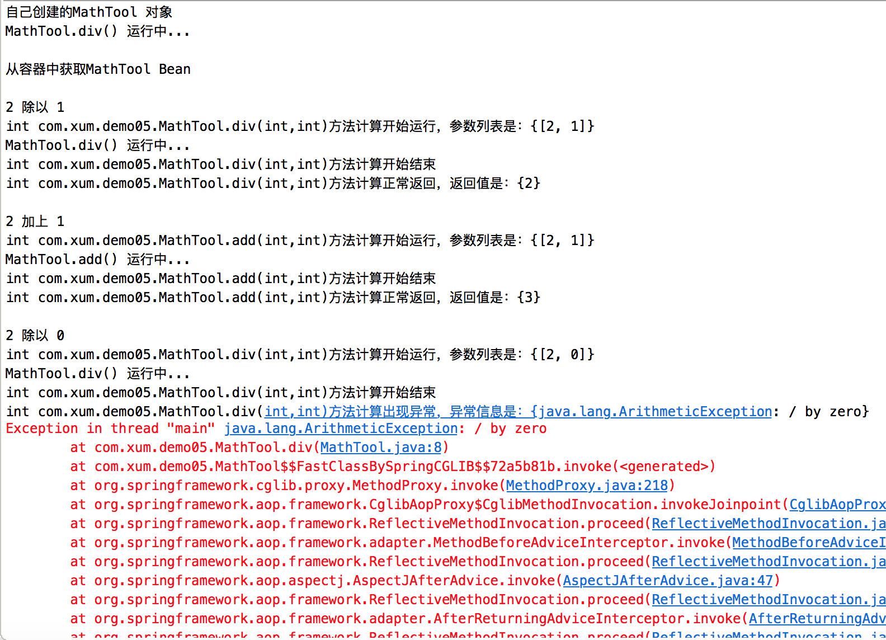
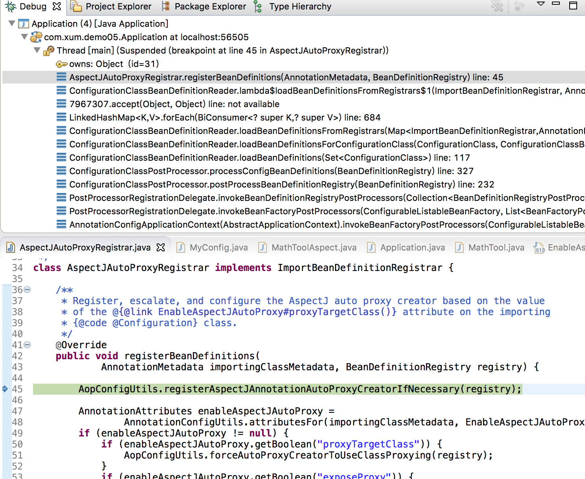
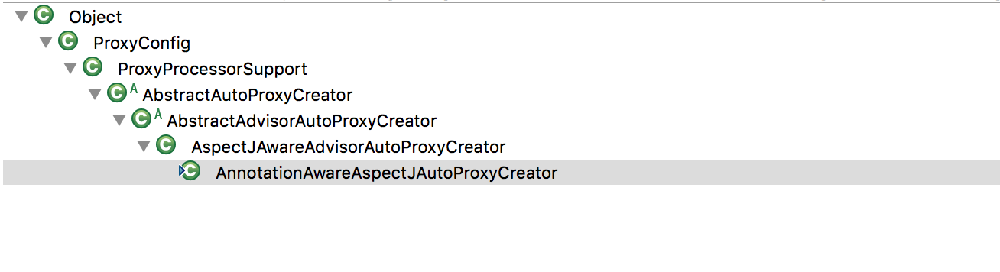

>[《用AspectJ进行AOP编程》](http://www.xumenger.com/aspectj-aop-spring-20181204/)

>可以简单地理解AOP 是在程序运行期间动态地将某段代码切入到指定方法的指定位置进行运行的编程方式

## 先直接看一个例子

先在pom.xml 中导入需要的包

```xml
<dependency>
  <groupId>org.springframework</groupId>
  <artifactId>spring-context</artifactId>
  <version>5.1.15.RELEASE</version>
</dependency>

<dependency>
  <groupId>org.springframework</groupId>
  <artifactId>spring-aspects</artifactId>
  <version>5.1.15.RELEASE</version>
</dependency>
```

然后定义被切的类

```java
package com.xum.demo05;

public class MathTool 
{
    public int div(int i, int j)
    {
        System.out.println("MathTool.div() 运行中...");
        return i / j;
    }
    
    public int add(int i, int j)
    {
        System.out.println("MathTool.add() 运行中...");
        return i + j;
    }
}
```

再定义切面类，通过@Aspect 告诉Spring 该类是切面类；在切面类的每个方法上标注相关注解，比如@Before、@After 等，告诉Spring 何时何地运行；还有一个重点是写好切入点表达式

```java
package com.xum.demo05;

import java.util.Arrays;

import org.aspectj.lang.JoinPoint;
import org.aspectj.lang.annotation.After;
import org.aspectj.lang.annotation.AfterReturning;
import org.aspectj.lang.annotation.AfterThrowing;
import org.aspectj.lang.annotation.Aspect;
import org.aspectj.lang.annotation.Before;
import org.aspectj.lang.annotation.Pointcut;

/**
 * 针对MathTool 的切面类
 * 这个类里面的方法需要动态感知被切入的类方法运行到哪一步了，然后动态的执行
 *
 * @Aspect 告诉Spring 该类是一个切面类，而不是其他的普通类
 */
@Aspect
public class MathToolAspect 
{
    // 抽取公共的切入点表达式
    @Pointcut("execution(public int com.xum.demo05.MathTool.*(..))")
    public void pointCut() {};
    
    // 前置通知：在除法运行之前切入
    // @Before()指明函数的包路径、参数、返回值等信息
    // @Before("public int com.xum.demo05.MathTool.div(int, int)")
    // 或者可以指定切入到某个类的所有方法
    // @Before("public int com.xum.demo05.MathTool.*(..)")
    // 或者使用上面定义的公共切入点表达式。如果一个使用公共的切入点表达式，另外的方法使用上面这种自定义表达式，运行会报错！
    // 所以建议所有的通知方法都使用一个公共表达式！
    @Before("pointCut()")
    public void divBegin(JoinPoint joinPoint)
    {
        System.out.println(joinPoint.getSignature() + "方法计算开始运行，参数列表是：{" + Arrays.asList(joinPoint.getArgs()) + "}");
    }
    
    // 后置通知：在除法运行完成后执行，无论方法正常结束还是异常结束
    // @After("public int com.xum.demo05.Divide.div(int, int)")
    // 或者可以通过上面定义的@Pointcut 直接使用
    @After("pointCut()")
    public void divEnd(JoinPoint joinPoint)
    {
        System.out.println(joinPoint.getSignature() + "方法计算开始结束");
    }
    
    // 返回通知：除法正常返回时执行，returning指定返回值名
    @AfterReturning(value = "pointCut()", returning="result")
    // JoinPoint必须出现在参数表的第一位！
    public void divReturn(JoinPoint joinPoint, Object result)
    {
        System.out.println(joinPoint.getSignature() + "方法计算正常返回，返回值是：{" + result + "}");
    }
    
    // 异常通知：除法出现异常时执行，
    @AfterThrowing(value = "pointCut()", throwing = "exception")
    public void divException(JoinPoint joinPoint, Exception exception)
    {
        System.out.println(joinPoint.getSignature() + "方法计算出现异常，异常信息是：{" + exception + "}");
    }
    
    // 环绕通知（@Around）：。。。
}
```

将被切的类和切面类都加入到IoC 容器中，另外注意要在配置类上标注@EnableAspectJAutoProxy

```java
package com.xum.demo05;

import org.springframework.context.annotation.Bean;
import org.springframework.context.annotation.Configuration;
import org.springframework.context.annotation.EnableAspectJAutoProxy;

// 配置
@Configuration
// 给配置类加一个@EnableAspectJAutoProxy，开启AOP功能
// 开启基于注解的AOP模式
@EnableAspectJAutoProxy
// 要想使用切面，则切面类和被切的类都要加入到IoC容器中
public class MyConfig 
{
    @Bean
    public MathTool mathTool()
    {
        return new MathTool();
    }
    
    @Bean
    public MathToolAspect mathToolAspect()
    {
        return new MathToolAspect();
    }
}
```

编写一个启动程序

```java
package com.xum.demo05;

import org.springframework.context.annotation.AnnotationConfigApplicationContext;

public class Application 
{
    public static void main(String[] args)
    {
        // 创建一个Spring容器
        AnnotationConfigApplicationContext applicationContext = new AnnotationConfigApplicationContext(MyConfig.class);
        
        // 自己创建的对象是无法被切的
        System.out.println("自己创建的MathTool 对象");
        MathTool mathTool1 = new MathTool();
        mathTool1.div(2, 1);
        System.out.println("");
        
        // 只有在IoC容器中的才可以被切
        System.out.println("从容器中获取MathTool Bean");
        MathTool mathTool2 = applicationContext.getBean(MathTool.class);
        System.out.println("");
        
        System.out.println("2 除以 1");
        mathTool2.div(2, 1);
        System.out.println("");
        
        System.out.println("2 加上 1");
        mathTool2.add(2, 1);
        System.out.println("");
        
        System.out.println("2 除以 0");
        mathTool2.div(2, 0);
        System.out.println("");
        
        // 关闭容器
        applicationContext.close();
    }
}
```

然后运行程序，运行的效果是这样的！



## EnableAspectJAutoProxy注解

EnableAspectJAutoProxy 注解的定义是这样的

```java
@Target(ElementType.TYPE)
@Retention(RetentionPolicy.RUNTIME)
@Documented
@Import(AspectJAutoProxyRegistrar.class)
public @interface EnableAspectJAutoProxy {

    /**
     * Indicate whether subclass-based (CGLIB) proxies are to be created as opposed
     * to standard Java interface-based proxies. The default is {@code false}.
     */
    boolean proxyTargetClass() default false;

    /**
     * Indicate that the proxy should be exposed by the AOP framework as a {@code ThreadLocal}
     * for retrieval via the {@link org.springframework.aop.framework.AopContext} class.
     * Off by default, i.e. no guarantees that {@code AopContext} access will work.
     * @since 4.3.1
     */
    boolean exposeProxy() default false;
}
```

@Import(AspectJAutoProxyRegistrar.class) 表示为IoC 容器注入AspectJAutoProxyRegistrar！

AspectJAutoProxyRegistrar 的代码是这样的

```java
class AspectJAutoProxyRegistrar implements ImportBeanDefinitionRegistrar {

    /**
     * Register, escalate, and configure the AspectJ auto proxy creator based on the value
     * of the @{@link EnableAspectJAutoProxy#proxyTargetClass()} attribute on the importing
     * {@code @Configuration} class.
     */
    @Override
    public void registerBeanDefinitions(
            AnnotationMetadata importingClassMetadata, BeanDefinitionRegistry registry) {

        AopConfigUtils.registerAspectJAnnotationAutoProxyCreatorIfNecessary(registry);

        AnnotationAttributes enableAspectJAutoProxy =
                AnnotationConfigUtils.attributesFor(importingClassMetadata, EnableAspectJAutoProxy.class);
        if (enableAspectJAutoProxy != null) {
            if (enableAspectJAutoProxy.getBoolean("proxyTargetClass")) {
                AopConfigUtils.forceAutoProxyCreatorToUseClassProxying(registry);
            }
            if (enableAspectJAutoProxy.getBoolean("exposeProxy")) {
                AopConfigUtils.forceAutoProxyCreatorToExposeProxy(registry);
            }
        }
    }
}
```



AspectJAutoProxyRegistrar 实现了ImportBeanDefinitionRegistrar 接口，ImportBeanDefinitionRegistrar 接口能够自定义为Spring 容器中注册组件

针对`AopConfigUtils.registerAspectJAnnotationAutoProxyCreatorIfNecessary(registry);`往下看代码。这里摘出来关键的代码片段如下：

```java
    @Nullable
    public static BeanDefinition registerAspectJAnnotationAutoProxyCreatorIfNecessary(BeanDefinitionRegistry registry) {
        return registerAspectJAnnotationAutoProxyCreatorIfNecessary(registry, null);
    }

    @Nullable
    public static BeanDefinition registerAspectJAnnotationAutoProxyCreatorIfNecessary(
            BeanDefinitionRegistry registry, @Nullable Object source) {

        return registerOrEscalateApcAsRequired(AnnotationAwareAspectJAutoProxyCreator.class, registry, source);
    }
```

所以上面的作用是为容器中注入一个AnnotationAwareAspectJAutoProxyCreator 类型的Bean

>运行程序，在关键的逻辑处下断点，看调用栈，单步调试跟着代码走，帮助我们理解代码

>理解Spring 的一个思路是，看给容器中注册了什么组件？这个组件什么时候工作？这个组件工作的时候做什么？

## AnnotationAwareAspectJAutoProxyCreator类

直接看一下AnnotationAwareAspectJAutoProxyCreator 类的继承树



转换成另一种格式，同样列出来在继承树中又实现了哪些接口！

```
AnnotationAwareAspectJAutoProxyCreator
    extends AspectJAwareAdvisorAutoProxyCreator
        extends AbstractAdvisorAutoProxyCreator
            extends AbstractAutoProxyCreator
                extends ProxyProcessorSupport
                implements SmartInstantiationAwareBeanPostProcessor, BeanFactoryAware
```

其有实现SmartInstantiationAwareBeanPostProcessor、BeanFactoryAware，关于BeanPostProcessor、BeanFactoryAware 的原理，在前两篇文章刚好有讲到

* SmartInstantiationAwareBeanPostProcessor 在Bean 初始化前后做相关事情
* BeanFactoryAware 实现了BeanFactory 的自动装配！

## 

