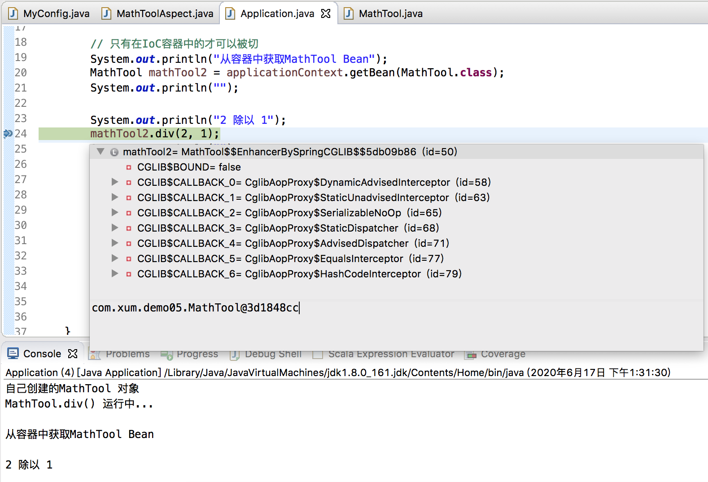

先列一下[Spring浅谈：面向切面编程AOP](http://www.xumenger.com/spring-aop-20200615/) 中的例子（做了一些必要的精简处理，仅保留了一些必要的代码）

首先是定义被切入的类

```java
package com.xum.demo05;

public class MathTool 
{
    public int div(int i, int j)
    {
        System.out.println("MathTool.div() 运行中...");
        return i / j;
    }
}
```

再定义切面类，通过@Aspect 告诉Spring 该类是切面类；在切面类的每个方法上标注相关注解，比如@Before、@After 等，告诉Spring 何时何地运行；还有一个重点是写好切入点表达式

```java
package com.xum.demo05;

import java.util.Arrays;

import org.aspectj.lang.JoinPoint;
import org.aspectj.lang.annotation.Aspect;
import org.aspectj.lang.annotation.Before;
import org.aspectj.lang.annotation.Pointcut;

// @Aspect 告诉Spring 该类是一个切面类，而不是其他的普通类
@Aspect
public class MathToolAspect 
{
    // 抽取公共的切入点表达式
    @Pointcut("execution(public int com.xum.demo05.MathTool.*(..))")
    public void pointCut() {};

    @Before("pointCut()")
    public void divBegin(JoinPoint joinPoint)
    {
        System.out.println(joinPoint.getSignature() + "方法计算开始运行，参数列表是：{" + Arrays.asList(joinPoint.getArgs()) + "}");
    }

    // 后置处理 @After
    // 返回通知 @AfterReturning
    // 异常通知 @AfterThrowing
    // 环绕通知 @Around
}
```

然后编写一个（配置类就不说了，请看[原文](http://www.xumenger.com/spring-aop-20200615/)）

```java
package com.xum.demo05;

import org.springframework.context.annotation.AnnotationConfigApplicationContext;

public class Application 
{
    public static void main(String[] args)
    {
        // 创建一个Spring容器
        AnnotationConfigApplicationContext applicationContext = new AnnotationConfigApplicationContext(MyConfig.class);
        
        // 只有在IoC容器中的才可以被切
        MathTool mathTool2 = applicationContext.getBean(MathTool.class);
        
        // 按照之前的说明，调用mathTool2.div() 其实是代理对象在执行方法！！！！
        mathTool2.div(2, 1);
        
        // 关闭容器
        applicationContext.close();
    }
}
```

按照之前的简单学习，在调用`mathTool2.div(2, 1);` 的时候，实际上是代理对象在执行方法，那这里就看一下这个方法的执行流程，为什么可以在执行的时候就先去执行前置通知，以及在对应的时机执行对应的通知方法的？

## 通过断点帮助分析

在`mathTool2.div(2, 1);` 处加一个断点，执行之后，命中断点，这个时候可以看到mathTool2 就已经是一个Cglib 的代理对象（增强后的对象）了，而不是原来的对象了



