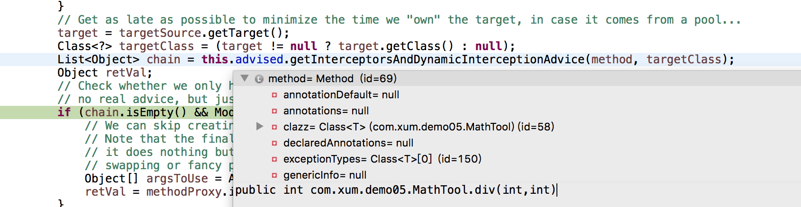

先列一下[Spring浅谈：面向切面编程AOP](http://www.xumenger.com/spring-aop-20200615/) 中的例子（做了一些必要的精简处理，仅保留了一些必要的代码）

首先是定义被切入的类

```java
package com.xum.demo05;

public class MathTool 
{
    public int div(int i, int j)
    {
        System.out.println("MathTool.div() 运行中...");
        return i / j;
    }
}
```

再定义切面类，通过@Aspect 告诉Spring 该类是切面类；在切面类的每个方法上标注相关注解，比如@Before、@After 等，告诉Spring 何时何地运行；还有一个重点是写好切入点表达式

```java
package com.xum.demo05;

import java.util.Arrays;

import org.aspectj.lang.JoinPoint;
import org.aspectj.lang.annotation.Aspect;
import org.aspectj.lang.annotation.Before;
import org.aspectj.lang.annotation.Pointcut;

// @Aspect 告诉Spring 该类是一个切面类，而不是其他的普通类
@Aspect
public class MathToolAspect 
{
    // 抽取公共的切入点表达式
    @Pointcut("execution(public int com.xum.demo05.MathTool.*(..))")
    public void pointCut() {};

    @Before("pointCut()")
    public void divBegin(JoinPoint joinPoint)
    {
        System.out.println(joinPoint.getSignature() + "方法计算开始运行，参数列表是：{" + Arrays.asList(joinPoint.getArgs()) + "}");
    }

    @After("pointCut()")
    public void divEnd(JoinPoint joinPoint)
    {
        System.out.println(joinPoint.getSignature() + "方法计算开始结束");
    }
    
    @AfterReturning(value = "pointCut()", returning="result")
    public void divReturn(JoinPoint joinPoint, Object result)
    {
        System.out.println(joinPoint.getSignature() + "方法计算正常返回，返回值是：{" + result + "}");
    }
    
    @AfterThrowing(value = "pointCut()", throwing = "exception")
    public void divException(JoinPoint joinPoint, Exception exception)
    {
        System.out.println(joinPoint.getSignature() + "方法计算出现异常，异常信息是：{" + exception + "}");
    }

    // 环绕通知 @Around
}
```

然后编写一个（配置类就不说了，请看[原文](http://www.xumenger.com/spring-aop-20200615/)）

```java
package com.xum.demo05;

import org.springframework.context.annotation.AnnotationConfigApplicationContext;

public class Application 
{
    public static void main(String[] args)
    {
        // 创建一个Spring容器
        AnnotationConfigApplicationContext applicationContext = new AnnotationConfigApplicationContext(MyConfig.class);
        
        // 只有在IoC容器中的才可以被切
        MathTool mathTool2 = applicationContext.getBean(MathTool.class);
        
        // 按照之前的说明，调用mathTool2.div() 其实是代理对象在执行方法！！！！
        mathTool2.div(2, 1);
        
        // 关闭容器
        applicationContext.close();
    }
}
```

按照之前的简单学习，在调用`mathTool2.div(2, 1);` 的时候，实际上是代理对象在执行方法，那这里就看一下这个方法的执行流程，为什么可以在执行的时候就先去执行前置通知，以及在对应的时机执行对应的通知方法的？

## 通过断点帮助分析

在`mathTool2.div(2, 1);` 处加一个断点，执行之后，命中断点，这个时候可以看到mathTool2 就已经是一个Cglib 的代理对象（增强后的对象）了，而不是原来的对象了


可以试着将这些内容都分别展开，将会看到被切入的通知方法等信息

命中这个断点之后，然后在一直F5(Step into)（注意这里可能要F5 多次），将会最终进入到CglibAopProxy.intercept() 方法，显然这里就是切面执行的关键所在了


```java
@Override
@Nullable
public Object intercept(Object proxy, Method method, Object[] args, MethodProxy methodProxy) throws Throwable {
    Object oldProxy = null;
    boolean setProxyContext = false;
    Object target = null;
    TargetSource targetSource = this.advised.getTargetSource();
    try {
        if (this.advised.exposeProxy) {
            // Make invocation available if necessary.
            oldProxy = AopContext.setCurrentProxy(proxy);
            setProxyContext = true;
        }
        // Get as late as possible to minimize the time we "own" the target, in case it comes from a pool...
        target = targetSource.getTarget();
        Class<？> targetClass = (target != null ? target.getClass() : null);
        List<Object> chain = this.advised.getInterceptorsAndDynamicInterceptionAdvice(method, targetClass);
        Object retVal;
        // Check whether we only have one InvokerInterceptor: that is,
        // no real advice, but just reflective invocation of the target.
        if (chain.isEmpty() && Modifier.isPublic(method.getModifiers())) {
            // We can skip creating a MethodInvocation: just invoke the target directly.
            // Note that the final invoker must be an InvokerInterceptor, so we know
            // it does nothing but a reflective operation on the target, and no hot
            // swapping or fancy proxying.
            Object[] argsToUse = AopProxyUtils.adaptArgumentsIfNecessary(method, args);
            retVal = methodProxy.invoke(target, argsToUse);
        }
        else {
            // We need to create a method invocation...
            retVal = new CglibMethodInvocation(proxy, target, method, args, targetClass, chain, methodProxy).proceed();
        }
        retVal = processReturnType(proxy, target, method, retVal);
        return retVal;
    }
    finally {
        if (target != null && !targetSource.isStatic()) {
            targetSource.releaseTarget(target);
        }
        if (setProxyContext) {
            // Restore old proxy.
            AopContext.setCurrentProxy(oldProxy);
        }
    }
}
```

参考[34、[源码]-AOP原理-链式调用通知方法](https://www.bilibili.com/video/BV1oW41167AV?p=34)，我们要知道最终执行的时候，是通过一个链式调用的方式实现各种通知方法在对应的时刻切入执行的


## 逐行分析intercept()方法

首先获取被切入的目标对象的信息


然后获取这个目标对象的当前方法的所有通知方法（放到一个链中存储）




* org.springframework.aop.interceptor.ExposeInvocationInterceptor@7d1cfb8b
    * [Spring AOP 源码探索 之 链式调用中的 ExposeInvocationInterceptor拦截器作用](https://blog.csdn.net/weixin_42213903/article/details/100577202)
* org.springframework.aop.aspectj.AspectJAfterThrowingAdvice: 
    * advice method [public void com.xum.demo05.MathToolAspect.divException(org.aspectj.lang.JoinPoint,java.lang.Exception)]; 
    * aspect name 'mathToolAspect', 
* org.springframework.aop.framework.adapter.AfterReturningAdviceInterceptor@48e92c5c, 
* org.springframework.aop.aspectj.AspectJAfterAdvice: 
    * advice method [public void com.xum.demo05.MathToolAspect.divEnd(org.aspectj.lang.JoinPoint)]; 
    * aspect name 'mathToolAspect', 
* org.springframework.aop.framework.adapter.MethodBeforeAdviceInterceptor@2e1ef60

显然下面这四个AfterThrowing、AfterReturning、After、Before 确实是这个例子中加的通知方法

接下来进入到这一步，根据目标对象、目标方法、目标方法参数、目标类、通知链等创建CglibMethodInvocation 对象，然后调用proceed() 方法


CglibMethodInvocation.proceed() 的源码实现如下

```java
@Override
@Nullable
public Object proceed() throws Throwable {
    // We start with an index of -1 and increment early.
    if (this.currentInterceptorIndex == this.interceptorsAndDynamicMethodMatchers.size() - 1) {
        return invokeJoinpoint();
    }

    Object interceptorOrInterceptionAdvice =
            this.interceptorsAndDynamicMethodMatchers.get(++this.currentInterceptorIndex);
    if (interceptorOrInterceptionAdvice instanceof InterceptorAndDynamicMethodMatcher) {
        // Evaluate dynamic method matcher here: static part will already have
        // been evaluated and found to match.
        InterceptorAndDynamicMethodMatcher dm =
                (InterceptorAndDynamicMethodMatcher) interceptorOrInterceptionAdvice;
        Class<?> targetClass = (this.targetClass != null ? this.targetClass : this.method.getDeclaringClass());
        if (dm.methodMatcher.matches(this.method, targetClass, this.arguments)) {
            return dm.interceptor.invoke(this);
        }
        else {
            // Dynamic matching failed.
            // Skip this interceptor and invoke the next in the chain.
            return proceed();
        }
    }
    else {
        // It's an interceptor, so we just invoke it: The pointcut will have
        // been evaluated statically before this object was constructed.
        return ((MethodInterceptor) interceptorOrInterceptionAdvice).invoke(this);
    }
}
```

>本文不再赘述，仅仅是引导一下，详细的源码实现，可以自己动手Debug 的方式慢慢看！

>看懂这部分的代码，对于Java 的反射要有所了解！
