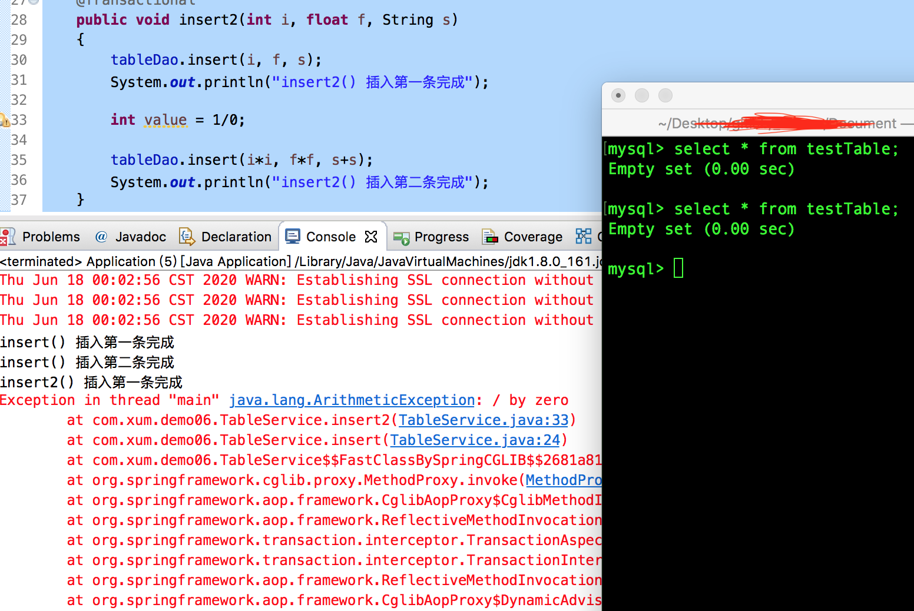

## 准备环境

先来简单回顾一下Mac 上MySQL 的相关命令

```shell
// 启动MySQL 服务器
$ mysql.server start

// 登录MySQL 服务器
$ mysql -uroot -p
```

接下来的声明式事务的测试都是基于Spring-JDBC 的，所以先在pom.xml 中引入需要依赖。这里暂时不涉及MyBatis，后续有必要的话可能会专门研究

```xml
<dependency>
  <groupId>org.springframework</groupId>
  <artifactId>spring-context</artifactId>
  <version>5.1.15.RELEASE</version>
</dependency>

<dependency>
  <groupId>org.springframework</groupId>
  <artifactId>spring-aspects</artifactId>
  <version>5.1.15.RELEASE</version>
</dependency>

<dependency>
  <groupId>org.springframework</groupId>
  <artifactId>spring-jdbc</artifactId>
  <version>5.1.15.RELEASE</version>
</dependency>

<dependency>
  <groupId>mysql</groupId>
  <artifactId>mysql-connector-java</artifactId>
  <version>8.0.11</version>
</dependency>

<dependency>
  <groupId>c3p0</groupId>
  <artifactId>c3p0</artifactId>
  <version>0.9.1.2</version>
</dependency>
```

## 准备一个测试案例

编写配置类

```java
package com.xum.demo06;

import java.beans.PropertyVetoException;

import javax.sql.DataSource;

import org.springframework.context.annotation.Bean;
import org.springframework.context.annotation.ComponentScan;
import org.springframework.context.annotation.Configuration;
import org.springframework.jdbc.core.JdbcTemplate;
import org.springframework.jdbc.datasource.DataSourceTransactionManager;
import org.springframework.transaction.PlatformTransactionManager;
import org.springframework.transaction.annotation.EnableTransactionManagement;

import com.mchange.v2.c3p0.ComboPooledDataSource;

@Configuration
@ComponentScan("com.xum.demo06")
// 开启基于注解的事务管理功能
@EnableTransactionManagement
public class MyConfig 
{
    // 设置数据源，并导入到IoC 容器中
    @Bean
    public DataSource dataSource()
    {
        ComboPooledDataSource dataSource = new ComboPooledDataSource();
        dataSource.setUser("root");
        dataSource.setPassword("");
        try {
            dataSource.setDriverClass("com.mysql.jdbc.Driver");
        } catch (PropertyVetoException e) {
            e.printStackTrace();
        }
        dataSource.setJdbcUrl("jdbc:mysql://localhost:3306/testDB");
        
        return dataSource;
    }
    
    // 为了操作数据库方便，使用JdbcTemplate 简化增删改查操作
    @Bean
    public JdbcTemplate jdbcTemplate()
    {
        // Spring 对Config 类会进行特殊处理
        // 这里调用dataSource()，并不是执行这个方法，其实是从IoC 容器中拿到这个Bean
        JdbcTemplate jdbcTemplate = new JdbcTemplate(dataSource());
        return jdbcTemplate;
    }
    
    // 使用SpringJDBC、MyBatis 的话都需要这个事务管理器
    @Bean
    public PlatformTransactionManager transactionManager()
    {
        // 事务管理器一定要把数据源传入，这样才可以控制数据源中的每个连接（事务的开启、回滚等）
        return new DataSourceTransactionManager(dataSource());
    }
}
```

Dao 类

```java
package com.xum.demo06;

import org.springframework.beans.factory.annotation.Autowired;
import org.springframework.jdbc.core.JdbcTemplate;
import org.springframework.stereotype.Component;

@Component
public class TableDao 
{
    @Autowired
    private JdbcTemplate jdbcTemplate;

    public void insert(int i, float f, String s)
    {
        String sql = "insert into `testTable`(iCol, fCol, sCol) values(?, ?, ?)";
        jdbcTemplate.update(sql, i, f, s);
    }
}
```

Service 类。这里特地在其方法中两次调用tableDao.insert() 来模拟多个数据库操作。如果使用@Transactional 注解，则因为除以0 的异常，会导致第一个insert 操作虽然调用，但是因为这个异常导致事务被回滚

如果没有使用@Transactional 注解，第一个insert 执行之后，会立即提交事务，下面的异常不会影响已经提交了的事务！

```java
package com.xum.demo06;

import org.springframework.beans.factory.annotation.Autowired;
import org.springframework.stereotype.Component;
import org.springframework.transaction.annotation.Transactional;

@Component
public class TableService 
{
    @Autowired
    private TableDao tableDao;
    
    @Transactional
    public void insert(int i, float f, String s)
    {
        tableDao.insert(i, f, s);
        System.out.println("插入第一条完成");
        
        int value = 1/0;
        
        tableDao.insert(i*i, f*f, s+s);
        System.out.println("插入第二条完成");
    }
}
```

编写测试类来调用TableService 进行测试

```java
package com.xum.demo06;

import org.springframework.context.annotation.AnnotationConfigApplicationContext;


public class Application 
{
    public static void main(String[] args)
    {
        // 创建一个Spring容器
        AnnotationConfigApplicationContext applicationContext = new AnnotationConfigApplicationContext(MyConfig.class);
        
        // 获取TableService
        TableService tableService = applicationContext.getBean(TableService.class);
        
        // 插入
        tableService.insert(1, 10.01f, "xum");
        
        // 关闭IoC 容器
        applicationContext.close();
    }
}
```

运行效果如下，在TableService.insert() 加了@Transactional 的情况下，数据库中并没有任何记录


可以试着将@Transactional 注释掉，效果就不是这样的了

## 事务嵌套

第一种情况是，调用者和被调用者都被@Transactional 标注，两个方法中都有SQL 写操作，被调用的方法中有异常

```java
package com.xum.demo06;

import org.springframework.beans.factory.annotation.Autowired;
import org.springframework.stereotype.Component;
import org.springframework.transaction.annotation.Transactional;

@Component
public class TableService 
{
    @Autowired
    private TableDao tableDao;
    
    @Transactional
    public void insert(int i, float f, String s)
    {
        tableDao.insert(i, f, s);
        System.out.println("insert() 插入第一条完成");
        
        tableDao.insert(i*i, f*f, s+s);
        System.out.println("insert() 插入第二条完成");
        
        // 调用另外一个带有@Transactional的方法？
        // 并且另外一个方法中有异常怎么办
        insert2(i*2, f*2, s);
    }
    
    @Transactional
    public void insert2(int i, float f, String s)
    {
        tableDao.insert(i, f, s);
        System.out.println("insert2() 插入第一条完成");
        
        int value = 1/0;
        
        tableDao.insert(i*i, f*f, s+s);
        System.out.println("insert2() 插入第二条完成");
    }
}
```

运行效果如下，因为被调用者有异常，导致整个事务失效，事务回滚



第二种情况是，调用者和被调用者都被@Transactional 标注，两个方法中都有SQL 写操作，调用者中有异常

```java
package com.xum.demo06;

import org.springframework.beans.factory.annotation.Autowired;
import org.springframework.stereotype.Component;
import org.springframework.transaction.annotation.Transactional;

@Component
public class TableService 
{
    @Autowired
    private TableDao tableDao;
    
    @Transactional
    public void insert(int i, float f, String s)
    {
        tableDao.insert(i, f, s);
        System.out.println("insert() 插入第一条完成");
        
        tableDao.insert(i*i, f*f, s+s);
        System.out.println("insert() 插入第二条完成");
        
        // 调用另一个被@Transactional 标注的方法
        insert2(i*2, f*2, s);
        
        // 两个方法都调用完，在调用者内部有异常会怎么样
        int value = 1/0;
    }
    
    @Transactional
    public void insert2(int i, float f, String s)
    {
        tableDao.insert(i, f, s);
        System.out.println("insert2() 插入第一条完成");
        
        tableDao.insert(i*i, f*f, s+s);
        System.out.println("insert2() 插入第二条完成");
    }
}
```

运行效果如下，调用者有异常，也会导致调用者和被调用者的SQL 都回滚，所以说明被调用者并没有自己再开启一个事务，而是在嵌套的情况下，以最外层的事务为准


## 调用者或者被调用者只有一个标注了@Transactional呢

如果调用者没有被标注@Transactional，调用者标注了@Transactional，在调用者内部出现了异常会怎么样？

```java
package com.xum.demo06;

import org.springframework.beans.factory.annotation.Autowired;
import org.springframework.stereotype.Component;
import org.springframework.transaction.annotation.Transactional;

@Component
public class TableService 
{
    @Autowired
    private TableDao tableDao;
    
//    调用者没有@Transactional 标注
//    @Transactional
    public void insert(int i, float f, String s)
    {
        // 调用者内部也不放任何SQL 操作，直接调用另外一个函数
        
        // 调用另一个被@Transactional 标注的方法
        insert2(i*2, f*2, s);
    }
    
    @Transactional
    public void insert2(int i, float f, String s)
    {
        tableDao.insert(i, f, s);
        System.out.println("insert2() 插入第一条完成");
        
        int value = 1/0;
        
        tableDao.insert(i*i, f*f, s+s);
        System.out.println("insert2() 插入第二条完成");
    }
}
```

在Application 类的main() 方法中调用TableService.insert()，TableService.insert() 内部调用TableService.insert2()

运行效果如下


显然如果事务生效的话，因为有异常，会产生回滚，数据库中不会有任何数据，这里明显说明事务没有生效。在此特地强调一下使用声明式事务的一个原则，别的类调用到某个类的数据库操作函数，必须直接调用到的那个函数带有@Transactional 注解

>为什么会这样呢？那就有必要研究Spring 的源码研究一下@Transactional 背后的实现原理来分析了！

再看另一种情况，如果调用者标注了@Transactional，被调用者没有标注@Transactional，在Application.main() 中优先调用这个标注了@Transactional 的方法呢。注意先删除数据库中的数据

```java
package com.xum.demo06;

import org.springframework.beans.factory.annotation.Autowired;
import org.springframework.stereotype.Component;
import org.springframework.transaction.annotation.Transactional;

@Component
public class TableService 
{
    @Autowired
    private TableDao tableDao;
    
//    调用者有@Transactional 标注
    @Transactional
    public void insert(int i, float f, String s)
    {
        // 调用者内部也不放任何SQL 操作，直接调用另外一个函数
        
        // 调用另一个被@Transactional 标注的方法
        insert2(i*2, f*2, s);
    }
    
//    被调用者有@Transactional 标注
//    @Transactional
    public void insert2(int i, float f, String s)
    {
        tableDao.insert(i, f, s);
        System.out.println("insert2() 插入第一条完成");
        
        int value = 1/0;
        
        tableDao.insert(i*i, f*f, s+s);
        System.out.println("insert2() 插入第二条完成");
    }
}
```

很显然，这个时候，事务就可以生效了！！！因为有异常，导致事务回滚了！

>为什么会这样呢？那就有必要研究Spring 的源码研究一下@Transactional 背后的实现原理来分析了！
