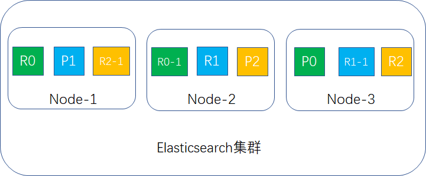
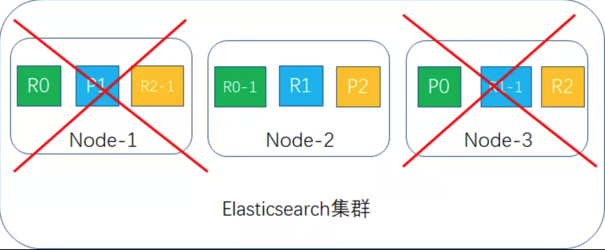

扩展阅读

* [搭建ELK环境](http://www.xumenger.com/elk-20191123/)
* [用ELK分析ELK](http://www.xumenger.com/elk-elk-20191124/)
* [Elasticsearch分布式架构](http://www.xumenger.com/es-distributed-20191201/)
* [Elasticsearch映射机制](http://www.xumenger.com/es-mapping-20191204/)
* [Elasticsearch数据分析](http://www.xumenger.com/es-data-analysis-20191206/)

## 实际应用中的一个场景

我们的应用存储了用户查询自己交易记录的接口的日志信息，想要统计在2020-07-15 21:00:00 至 2020-07-15 21:07:00 期间发起查询次数最多的几个用户，以及这个查询接口错误码的排序结果

```json
GET querylog20200715/_search {
    "query": {
        "bool": {
            "must": [
                {
                    "range": {
                        "xDatTim": {
                            "gte": "2020-07-15 21:00:00",
                            "lte": "2020-07-15 21:07:00"
                        }
                    }
                },
                {
                    "match": {
                        "xApiNam": "QueryTrade"
                    }
                }
            ]
        }
    },

    "aggs": {
        "by_UsrNam": {
            "terms": {
                "field": "xUsrNam",
                "order": {
                    "_count": "desc"
                },
                "size": 3
            }
        },
        "by_ErrCod": {
            "terms": {
                "field": "xErrCod",
                "order": {
                    "_count": "desc"
                },
                "size": 3
            }
        }
    },

    "size": 0
}
```

得到的结果是这样的

```json
{
    "took": 781,
    "time_out": false,
    "_shards": {
        "total": 12,
        "successful": 12,
        "skipped": 0,
        "failed": 0
    },
    "hits":{
        "total": 2600,
        "max_score": 0,
        "hits": []
    },
    "aggregations": {
        "by_UsrNam": {
            "doc_count_error_upper_bound": 8,
            "sum_other_doc_count": 2557,
            "buckets": [
                {
                    "key": "xumenger",
                    "doc_count": 27,
                },
                {
                    "key": "joker",
                    "doc_count": 22,
                },
                {
                    "key": "zhangsan",
                    "doc_count": 20,
                },
            ]
        },
        "by_ErrCod": {
            "doc_count_error_upper_bound": 8,
            "sum_other_doc_count": 2557,
            "buckets": [
                {
                    "key": "SUCCESS",
                    "doc_count": 1800,
                },
                {
                    "key": "FAIL001",
                    "doc_count": 1200,
                },
                {
                    "key": "FAIL003",
                    "doc_count": 1000,
                },
            ]
        }
    }
}
```

这看起来没有问题，试着扩大时间范围呢？

## 扩大时间范围

将时间范围扩大为 2020-07-15 21:00:00 至 2020-07-15 21:50:00

```json
                    "range": {
                        "xDatTim": {
                            "gte": "2020-07-15 21:00:00",
                            "lte": "2020-07-15 21:50:00"
                        }
                    }
```

然后对用户排序统计得到的结果是这样的

```json
        "by_UsrNam": {
            "doc_count_error_upper_bound": 8,
            "sum_other_doc_count": 2557,
            "buckets": [
                {
                    "key": "lisi",
                    "doc_count": 20,
                },
                {
                    "key": "wangwu",
                    "doc_count": 19,
                },
                {
                    "key": "zhangsan",
                    "doc_count": 18,
                },
            ]
        }
```

为什么会这样呢，在 2020-07-15 21:00:00 至 2020-07-15 21:07:00 这个短的时间范围内的"xumenger" 出现的次数是27，但是在 2020-07-15 21:00:00 至 2020-07-15 21:50:00 时间范围内出现的次数最多的竟然是20 次的"lisi"

显然不符合逻辑

是我们的DSL 语句写错了吗？

试着用Kinana 自带的Visualize 工具按照相同的条件统计了一下，和上面DSL 输出结果是一样的，为什么呢？

## 让结果更正确些

需要在聚合DSL 语句中加入shard_size 条件就可以得到“相对更精确”的结果

```json
    "aggs": {
        "by_UsrNam": {
            "terms": {
                "field": "xUsrNam",
                "order": {
                    "_count": "desc"
                },
                "size": 3,
                "shard_size": 100
            }
        },
        "by_ErrCod": {
            "terms": {
                "field": "xErrCod",
                "order": {
                    "_count": "desc"
                },
                "size": 3
            }
        }
    }
```

得到的结果是这样的

```json
        "by_UsrNam": {
            "doc_count_error_upper_bound": 8,
            "sum_other_doc_count": 2557,
            "buckets": [
                {
                    "key": "xumenger",
                    "doc_count": 30,
                },
                {
                    "key": "wangwu",
                    "doc_count": 27,
                },
                {
                    "key": "zhangsan",
                    "doc_count": 20,
                },
            ]
        }
```

## 为什么呢？

比如获取xUsrNam 字段中出现频率最高的前5 个，使用ES 的terms 聚合时，客户端向ES 发送聚合请求，主节点收到请求之后，会向每个独立的分片（shard）发送改请求

每个分片独立计算自己分片上前5 的xUsrNam，然后返回，当所有的分片结果都返回后，在主节点进行结果的合并，再求出频率最高的前5 个，返回给客户端

这样显然就会造成一定的误差，一个极端的例子，有3 个分片，客户端要查询xUsrNam 出现频率最高的那个，"xumenger" 在分片1 上出现3 次，在分片2 上3 次，在分片3 上 3 次；而"zhangsan" 在分片1 上出现8 次，在分片2 上出现0 次，在分片3 上出现0 次，显然，实际应该是"xumenger" 出现的次数最多，但是按照ES 的策略

* 分片1 上返回的是"zhangsan" 8次
* 分片2 上返回的是"xumenger" 3次
* 分片3 上返回的是"xumenger" 3次
* 主节点计算出来，"zhangsan"8 次，"xumenger" 6 次
* 最终返回给客户端的结果是"zhangsan" 8 次
* 显然，选出来的用户名是错误的，次数也是错误的！

为了解决上面的问题，就要像上面那样使用shard_size 参数

shard_size 规定了每个分片上返回的个数

将shard_size 的值设置的比size 大，那么每个分片返回的词条信息就会更多一些，相应的误差的几率就会减小！！！！！

既然享受了ES 的分布式存储、快速搜索、聚合、数据可视化的便利，就要“忍受”它带来的精度问题，当然如果自己的项目能够忍受一定程度的误差，比如只是想要了解一个趋势，而不是精确的值，那么选择ES 是很合适的！！

还可以选择这种解决方案，比如日志按照日期分索引，指定将每个索引放到一个分片中！这样去某个特定索引聚合的时候就不会出现跨分片

但是ES 还支持这种querylog2020\* 模糊匹配多个索引的方式，这样的话虽然某一个索引是只在一个分片上的，但是这样匹配到的多个索引可能分布在多个分片中，还是会有上面的问题，就还只能`shard_size` 参数来解决了！

## ES 分布式架构

>[Elasticsearch系列---分布式架构机制讲解](https://mp.weixin.qq.com/s/mn6r8MPKnHoOCfvsUkPJUA)

3 台node 环境下的容错

我们先按primary shard 为3，replica shard 为1进行容错性计算。此时每台node 存放2 个shard，如果一台宕机，此时另外2 台肯定还有完整的数据，如果两台宕机，剩下的那台就只有2/3 的数据，数据丢失1/3，容错性为1台。如果是这样设置，那3 台的容错性和2 台的容错性一样，就存在资源浪费的情况

那怎么样提升容错性呢？把replica shard 的值改成2，这样每台node 存放3个shard，如下图所示：



如果有2台宕机，就剩下node-2，此时集群的数据还是完整的，replica 会升成primary shard 继续提供服务，如下图所示：



结论：3 台node 环境容错性最大可以是2