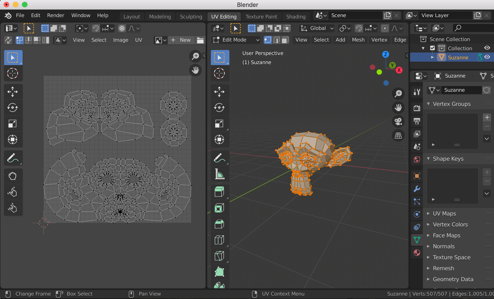
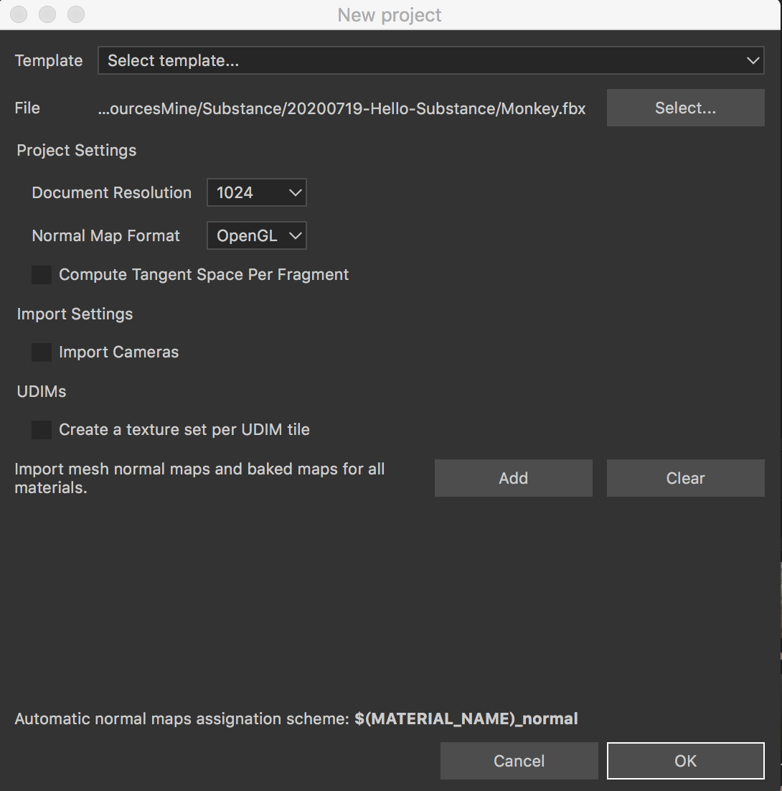
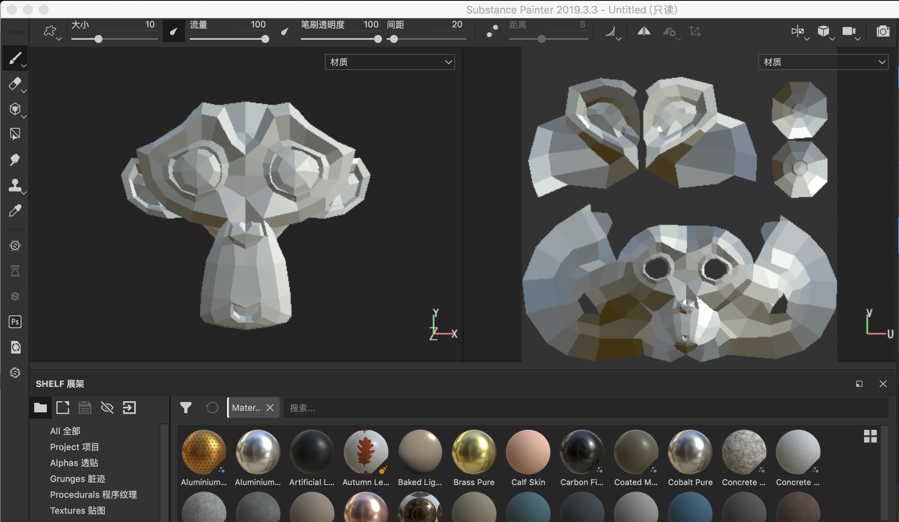
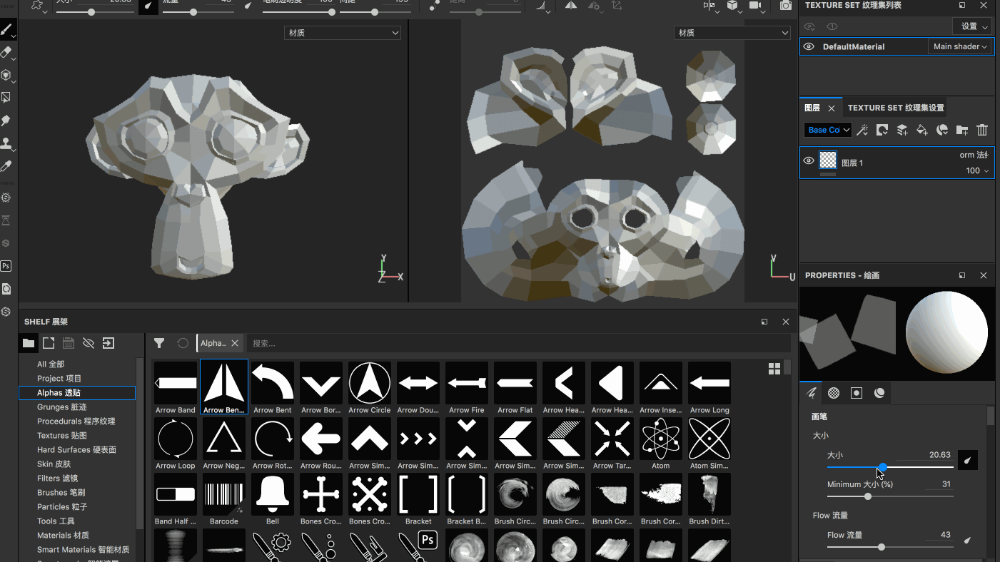
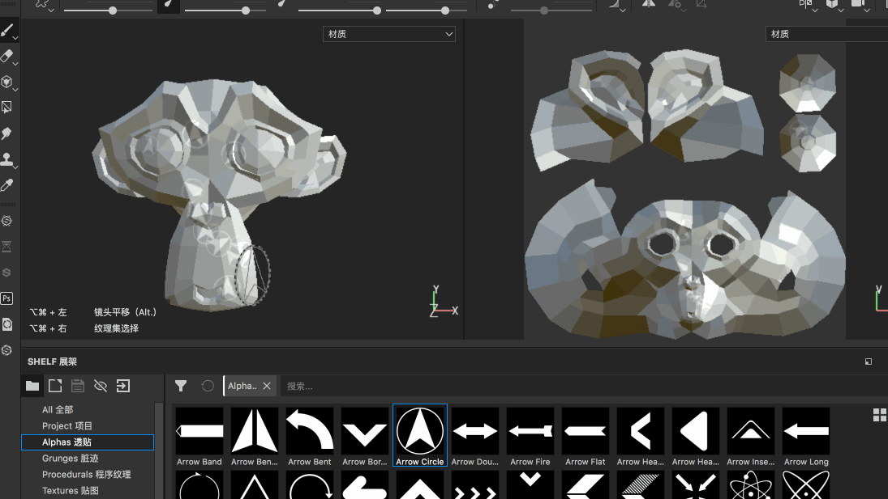
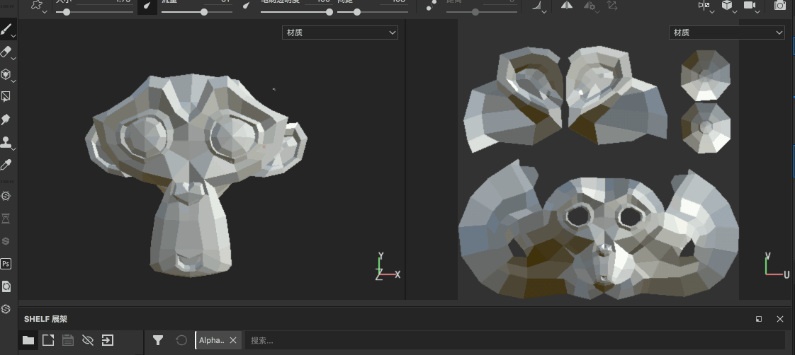

## Blender导出资源

Blender 中【shift + a】创建一个猴头，然后导出为fbx 格式，Blender 对这个模型的默认UV 展开还是不错的

## Substance创建新工程

【文件】->【新建】，就可以新建一个项目，快捷键是【command + n】

模板有下面这些类型，当然可以为空

* Adobe Dimension (allegorithmic)
* Dota 2 (allegorithmic)
* Lens Studio (allegorithmic)
* Non-PBR - Specular Glossiness (allegorithmic)
* PBR - Metallic Roughness (allegorithmic)
* PBR - Metallic Roughness Alpha-test (allegorithmic)
* PBR - Specular Glossiness (allegorithmic)
* Unity 5 (allegorithmic)
* Unreal Engine 4 (allegorithmic)

【模型】，选择你进行绘制的模型，这个是必选的

【为每个UDIM平铺创建纹理集】，如果你的纹理是UDIM 的，勾选这个选项的话，会根据每个UDIM 的UV 块来创建它的纹理集

【法线贴图格式】，可以选择OpenGL、DirectX

然后点击【OK】就可以创建一个新的工程了，模型导入成功了

## 画笔基础功能

比如下面展示了一下使用笔刷在模型表面进行绘制，当然也可以在UV 上进行绘制

关于笔刷的更多功能，比如调整颜色等这里就不详细的展示了，自己试着去操作一下Substance 笔刷的各个菜单

在模型窗口，按住【command】键就会弹出所有与【command】有关的快捷键配置

* 【alt + 鼠标左键拖动】旋转模型
* 【alt + 鼠标中间拖动】移动模型
* 【alt + 鼠标右键拖动】放大/缩小模型
* 【command + alt + 鼠标左键】移动观察模型的视角
* 【command + 鼠标右键水平移动】放大/缩小画笔笔刷的大小
* 【command + 鼠标右键垂直移动】更改画笔笔刷的硬度
* 【command + 鼠标左键水平移动】更改画笔笔刷的流量
* 【command + 鼠标左键垂直移动】旋转画笔角度
* 其他

按照上面的介绍，可以用笔刷在模型上进行“任意的涂画”，假如我想绘制直线怎么做到呢？按住【shift】键

想要绘制一定的角度的话，在某个位置先绘制一笔，然后在其他位置按住【command + shift】键，就会以原来为起点，当前位置为重点尝试绘制直线，拖动鼠标可以沿着起点旋转直线
