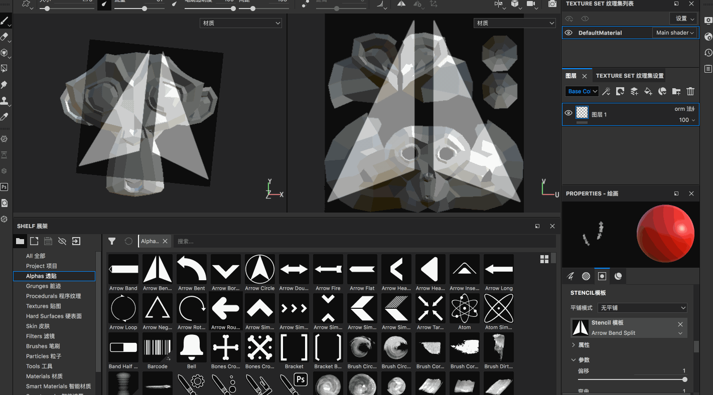
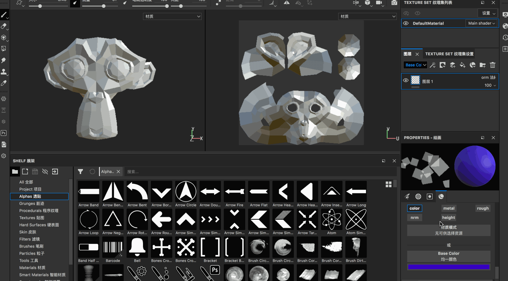
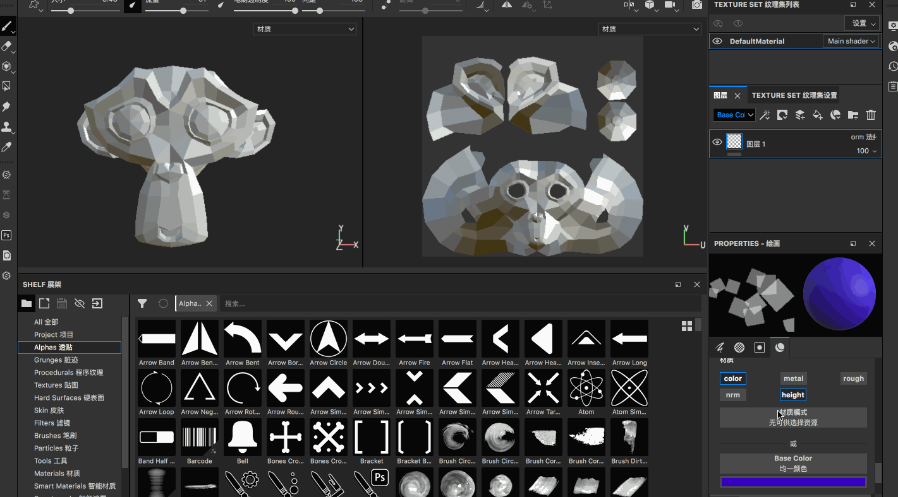
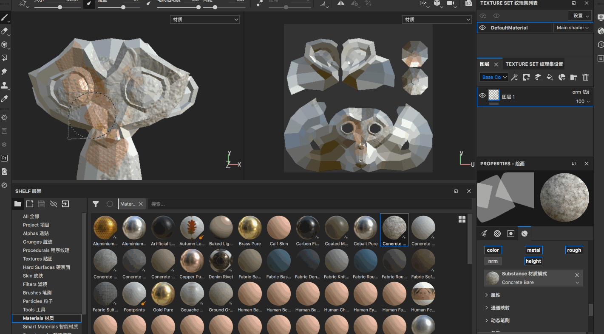
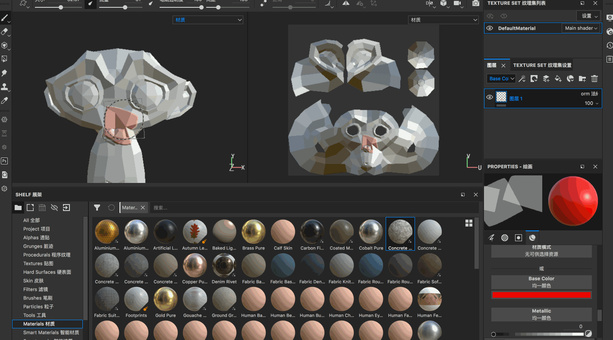

## 蒙版的使用

蒙版的效果是，当为模型放了蒙版之后，再使用画笔进行绘制的时候，那么白色的部分就可以绘制，黑色的部分则不能绘制

设置的蒙版之后

* 【s + 鼠标左键拖动】旋转蒙版图片
* 【s + 鼠标右键拖动】放大/缩小蒙版图片
* 【s + 鼠标中间拖动】蒙版图片的平移

同样的，既可以在模型上生效，也可以在UV 上生效

## 材质属性

在Substance Painter 中绘制的所有东西都是材质，材质默认由这几个通道组成

* color 颜色
* metal 金属性
* rough 粗糙程度（高光）
* nrm 法线
* height 高度

这些通道可加可见，比如只想绘制颜色，可以把其他的通道关掉

再看一个height 通道，比如打开之后，设置某个值，那么在模型表面绘制之后就会产生高低起伏的效果（正值凸起，负值凹下）

其他几个通道就不一一展示了，自己可以分别去尝试一下

## 内置的材质球

除了上面设置各个材质通道的方式，还可以使用Substance 中的一些做好的材质球

注意，选择这些材质球之后，在Substance 的材质菜单中同时会显示这个材质球的color、metal、rough、nrm、height 等属性值

## 橡皮擦工具

显而易见，就是把绘制的内容擦掉

## 快速遮罩

* 【y】编辑快速遮罩/取消编辑
* 【u】使用快速遮罩，可以针对当前快速遮罩进行画笔的绘制
* 【i】在编辑遮罩模式下，进行反转，原来没有绘制遮罩的地方反而显示为绘制遮罩！

显然使用快速遮罩涂黑的地方，当使用快速遮罩后，用画笔进行绘制的时候，这个部分是不会被影响的

注意，快速遮罩不是非黑即白的，而是也有中间的灰色地带的！

* 遮罩设置为黑色，表示画笔对其完全无影响
* 遮罩设置为白色，表示画笔对其完全影响
* 遮罩设置为灰色，表示画笔对其部分影响

