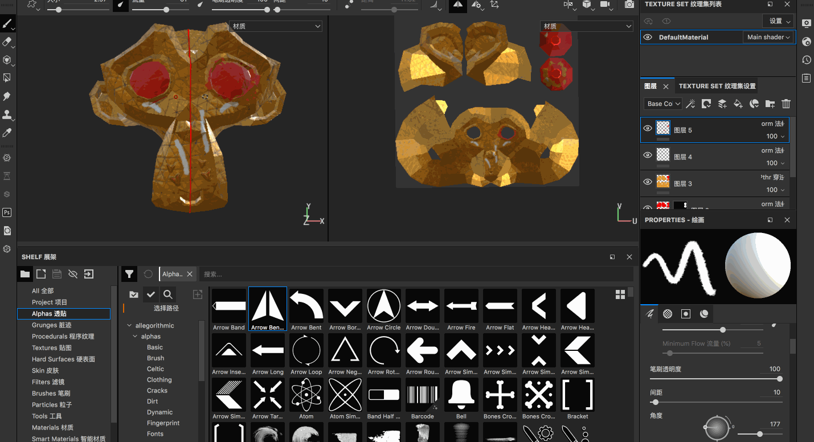

## 投射笔刷

投射笔刷的作用是把屏幕上的图像投射到我们的模型表面的，在绘制皮肤、毛发等的时候经常会用到！

>比如我们先用网上找一个金丝猴的照片，使用这个照片投射到我们的模型上，怎么将这个图片导入到Substance 中呢？

>Blender 中的绘制工具也是有一样的功能的，比如做了一个苹果的模型，后续想要使用显示中苹果的图片，然后将其投射到苹果模型上！

顺便再提一嘴Substance 的一些快捷键

* 【1】笔刷工具
* 【2】橡皮擦工具
* 【3】投射笔刷
* 【s + 鼠标左键拖动】旋转投射图片
* 【s + 鼠标右键拖动】放大/缩小投射图片
* 【s + 鼠标中间拖动】投射图片的平移

另外也可以直接在模型窗口直接右键唤出画笔/透贴/蒙版/材质等设置项

比如使用投射笔刷绘制完一定的效果之后，还是可以使用比如笔刷工具继续进行其他的绘制的

## 多边形填充工具使用

比如为当前这个猴头模型添加两个图层，图层1使用材质1，图层2使用材质2

可以看到，当图层全部打开的时候，图层2 会盖住图层1，如果只显示图层1，那么就只会看到图层1 的材质

假如我想实现这样的样子呢，猴子的眼睛使用材质2，其他部分还是使用材质1，那就要使用到多边形填充工具了

为图层2 添加【黑色遮罩】，然后快捷键【4】打开【几何体填充】，选择【UV块填充】，然后在UV 视图选中眼睛部分对应的几何块

* 在当前图层，【鼠标右键】->【删除遮罩】可以删除遮罩
* 在当前图层，【鼠标右键】->【反转遮罩】白的变黑，黑的变白
* 在当前图层，【shift + 鼠标右键】可以禁用/启用遮罩

遮罩黑色表示遮住不显示，白色表示显示，所以如果当前图层如果添加了纯黑的遮罩，那么当前效果的材质、笔刷效果是完全不展示的，如果使用多边形填充工具，使得一部分为黑色，另一部分为白色，那么黑色遮罩住的部分不现实，白色遮罩部分将正常显示当前图层！！！！

## 涂抹工具的使用方法

涂抹工具其实就是对多个材质进行混合！

比如现在有了两个图层，那么为了使用涂抹工具，且为了不破坏原来的图层，建议新增一个【绘制层】（注意不能是填充层），并且将该层的模式设置为【穿透】，然后使用快捷键【5】打开涂抹工具

>和PS 类似，Substance 中如何合理的规划自己的图层是很重要的！

## 克隆工具的使用

比如先新建一个图层，用笔刷在猴子的嘴巴上画一个标记

【6】打开克隆工具，按住键盘上的【v + 鼠标左键】获取原位置，在需要绘制的地方直接绘制即可完成对原位置的拷贝

## 材质选择器和其他视窗功能

【7】打开材质选择器，类似于一个吸管，可以对当前附着上的材质进行吸取，注意这个工具只在【绘制层】生效，在【填充层】是不行的

* 绘制图层，故名思义这个图层是可以绘制的，所有的笔刷都是可用的
* 填充图层，所有的笔刷都是禁用的，只能去更改材质的颜色等属性！

比如新建一个【绘制层】，再使用材质选择器，吸附了某个材质后，有关于当前材质球的各个通道的属性都会展示到材质属性面板上，然后再使用笔刷进行绘制即可

到目前为止，左侧工具栏包括：

* 【1】 笔刷
* 【2】 橡皮擦
* 【3】 投射笔刷
* 【4】 几何体填充
* 【5】 涂抹工具
* 【6】 克隆工具
* 【7】 材质选择器

懒惰笔刷，笔刷后面有一个拖尾的效果

镜像绘制（可以选择按X、Y、Z轴镜像）

