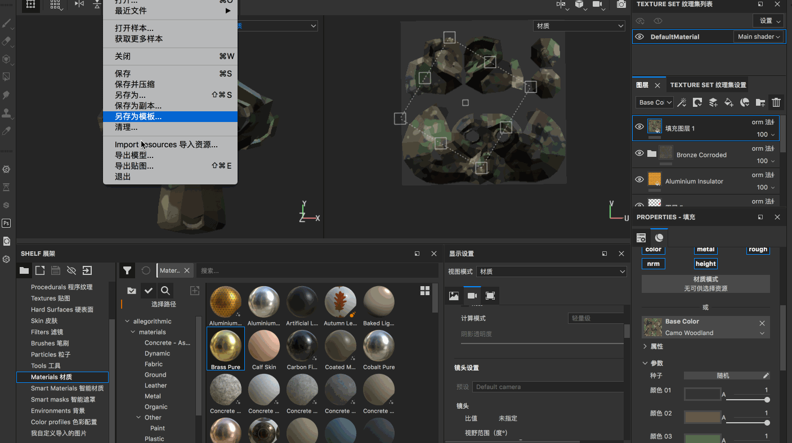

## 3D窗口通道

在3D 窗口的右上角可以选择展示的通道，也可以通过按【c】快捷键进行切换，比如我们经常需要查看某个单通道的效果

* Base Color
* Metallic
* Roughness
* Normal
* Height

3D 窗口切换通道、模型贴图、材质的快捷键

* 【c】切换查看通道
* 【b】切换查看模型贴图
* 按【m】键可以快速切换回材质通道

## 展架使用方式

比如我想导入一张图片到Substance 的展架中，作为自己的美术资源

比如在上面提到导入一些图片，然后作为投射笔刷的资源使用！

## 显示设置属性调整

【窗口】->【Views】->【显示设置】

比如可以在这里选择背景

一般是切换不同的背景图片，看我们模型在不同的光照下的效果，帮助我们调节材质！

还有这些设置

* 背景：背景透明度、背景曝光、背景旋转、背景模糊
* 阴影
* 镜头相关
* 后期特效：颜色校正、DOF自由度、色调映射、眩光、晕影、镜头扭曲变形
* 其他更多设置选项

## 创建和管理图层

* 绘制图层，故名思义这个图层是可以绘制的，所有的笔刷都是可用的
* 填充图层，所有的笔刷都是禁用的，只能去更改材质的颜色等属性！

比如直接将一个材质拖动到图层中，就对应新建一个填充图层，不可以绘制，但是可以去修改材质的属性

智能材质是由多个图层所混合的一个复杂的材质，包含很多材质的效果

## 填充图层属性

直接看一下操作吧

## 图层链接使用方法

这样的好处是，我们修改一个纹理图层，其他的对应的链接图层也是对应发生修改的

假如原来的图层是在01_Head 上创建的，链接到03_Base，那么只有在01_Head 上是可以调节的，在03_Base 上是不可以调节的

## 导入到Unity中使用

【文件】->【导出贴图】，或者【shift + command + e】可以导出当前编辑的贴图，然后将模型、贴图导入到Unity 中就可以直接使用了

## 扩展内容

这些软件分别的适用场景是什么？在游戏开发中有什么用？

* Substance Designer
* Bitmap2Material
* Quixel Bridge
* Quixel Mixer

另外推荐一些好的贴图资源网站

* [texturehaven.com](http://www.texturehaven.com/) 扎克大神推荐的贴图网站
* [texture.ninja](http://texture.ninja)
* [textures.com](http://textures.com)
* [quixel.com](https://quixel.com) 各种贴图：法线贴图、Albedo、Bump等等
* [cadnav.com](http://cadnav.com)
* [poliigon.com](http://poliigon.com) 各种贴图：法线贴图、Albedo、Bump等等
* [cc0textures.com](www.cc0textures.com) 这个是免费的资源网站，所有的贴图材质都可以直接商用
* [hdrihaven.com](www.hdrihaven.com)
