## Blender导出资源

Blender 中[Shift + A] 创建一个猴头，然后导出为fbx 格式，Blender 对这个模型的默认UV 展开还是不错的

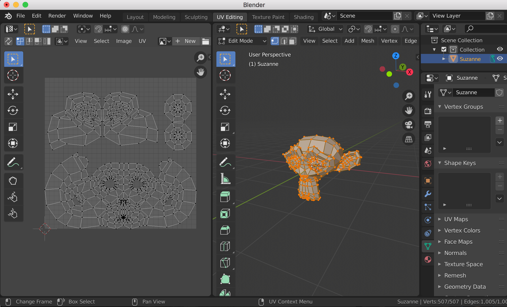

## Substance创建新工程

【文件】->【新建】，就可以新建一个项目，快捷键是【command + N】

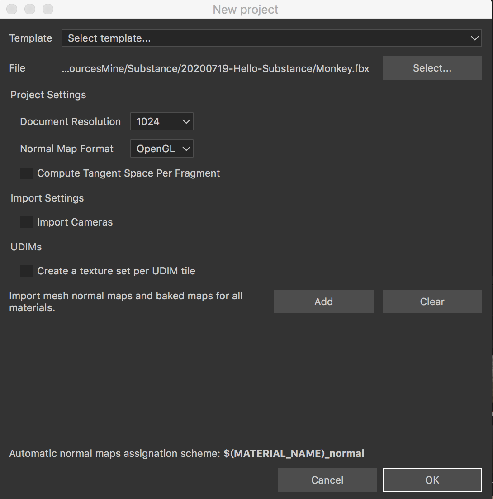

模板有下面这些类型，当然可以为空

* Adobe Dimension (allegorithmic)
* Dota 2 (allegorithmic)
* Lens Studio (allegorithmic)
* Non-PBR - Specular Glossiness (allegorithmic)
* PBR - Metallic Roughness (allegorithmic)
* PBR - Metallic Roughness Alpha-test (allegorithmic)
* PBR - Specular Glossiness (allegorithmic)
* Unity 5 (allegorithmic)
* Unreal Engine 4 (allegorithmic)

【模型File】，选择你进行绘制的模型，这个是必选的

【为每个UDIM平铺创建纹理集】，如果你的纹理是UDIM 的，勾选这个选项的话，会根据每个UDIM 的UV 块来创建它的纹理集

【法线贴图格式】，可以选择OpenGL、DirectX

然后点击【OK】就可以创建一个新的工程了，模型导入成功了

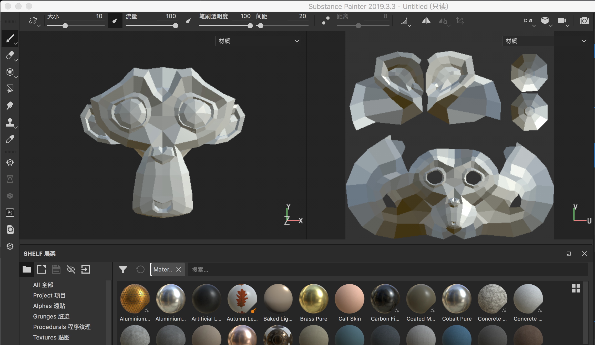

## 画笔基础功能

比如下面展示了一下使用笔刷在模型表面进行绘制，当然也可以在UV 上进行绘制

关于笔刷的更多功能，比如调整颜色等这里就不详细的展示了，自己试着去操作一下Substance 笔刷的各个菜单

在模型窗口，按住【command】键就会弹出所有与【command】有关的快捷键配置

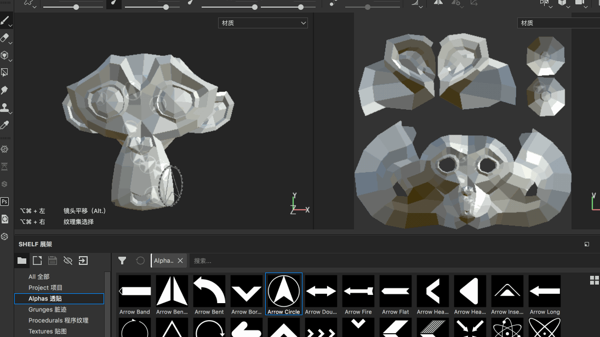

* 【alt + 鼠标左键拖动】旋转模型
* 【alt + 鼠标中间拖动】移动模型
* 【alt + 鼠标右键拖动】放大/缩小模型
* 【command + alt + 鼠标左键】移动观察模型的视角
* 【command + 鼠标右键水平移动】放大/缩小画笔笔刷的大小
* 【command + 鼠标右键垂直移动】更改画笔笔刷的硬度
* 【command + 鼠标左键水平移动】更改画笔笔刷的流量
* 【command + 鼠标左键垂直移动】旋转画笔角度
* 其他

按照上面的介绍，可以用笔刷在模型上进行“任意的涂画”，假如我想绘制直线怎么做到呢？按住【shift】键

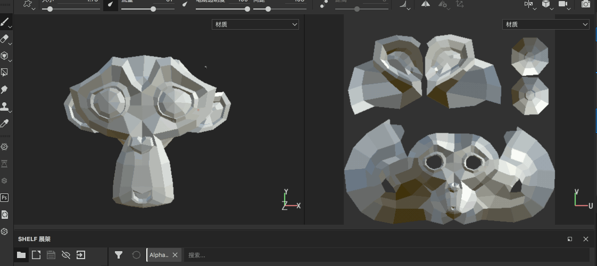

想要绘制一定的角度的话，在某个位置先绘制一笔，然后在其他位置按住【command + shift】键，就会以原来为起点，当前位置为重点尝试绘制直线，拖动鼠标可以沿着起点旋转直线

## 蒙版的使用

蒙版的效果是，当为模型放了蒙版之后，再使用画笔进行绘制的时候，那么白色的部分就可以绘制，黑色的部分则不能绘制

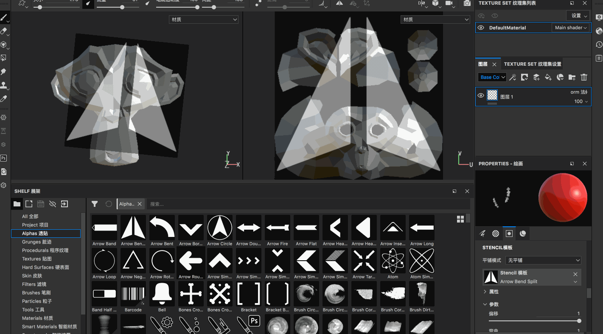

设置的蒙版之后

* 【s + 鼠标左键拖动】旋转蒙版图片
* 【s + 鼠标右键拖动】放大/缩小蒙版图片
* 【s + 鼠标中间拖动】蒙版图片的平移

同样的，既可以在模型上生效，也可以在UV 上生效

## 材质属性

在Substance Painter 中绘制的所有东西都是材质，材质默认由这几个通道组成

* color 颜色
* metal 金属性
* rough 粗糙程度（高光）
* nrm 法线
* height 高度

这些通道可加可见，比如只想绘制颜色，可以把其他的通道关掉

再看一个height 通道，比如打开之后，设置某个值，那么在模型表面绘制之后就会产生高低起伏的效果（正值凸起，负值凹下）

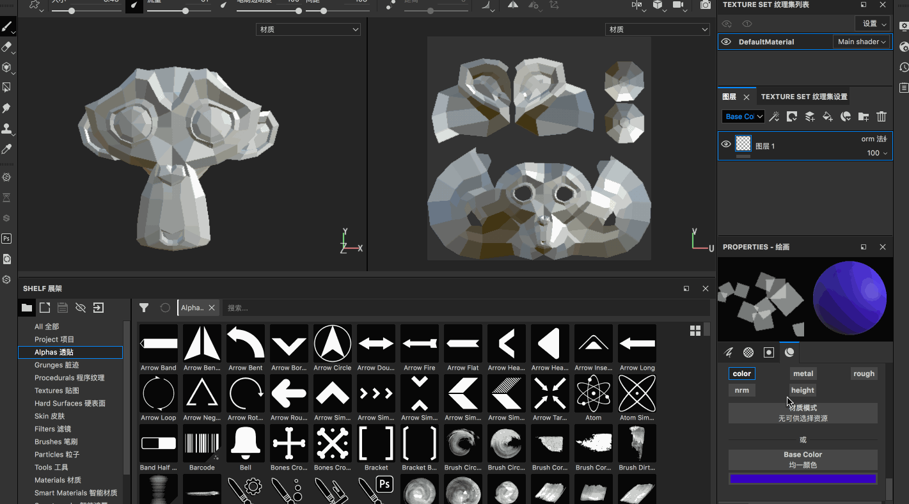

其他几个通道就不一一展示了，自己可以分别去尝试一下

## 内置的材质球

除了上面设置各个材质通道的方式，还可以使用Substance 中的一些做好的材质球

注意，选择这些材质球之后，在Substance 的材质菜单中同时会显示这个材质球的color、metal、rough、nrm、height 等属性值

## 橡皮擦

显而易见，就是把绘制的内容擦掉

## 快速遮罩

* 【y】编辑快速遮罩/取消编辑
* 【u】使用快速遮罩，可以针对当前快速遮罩进行画笔的绘制
* 【i】在编辑遮罩模式下，进行反转，原来没有绘制遮罩的地方反而显示为绘制遮罩！

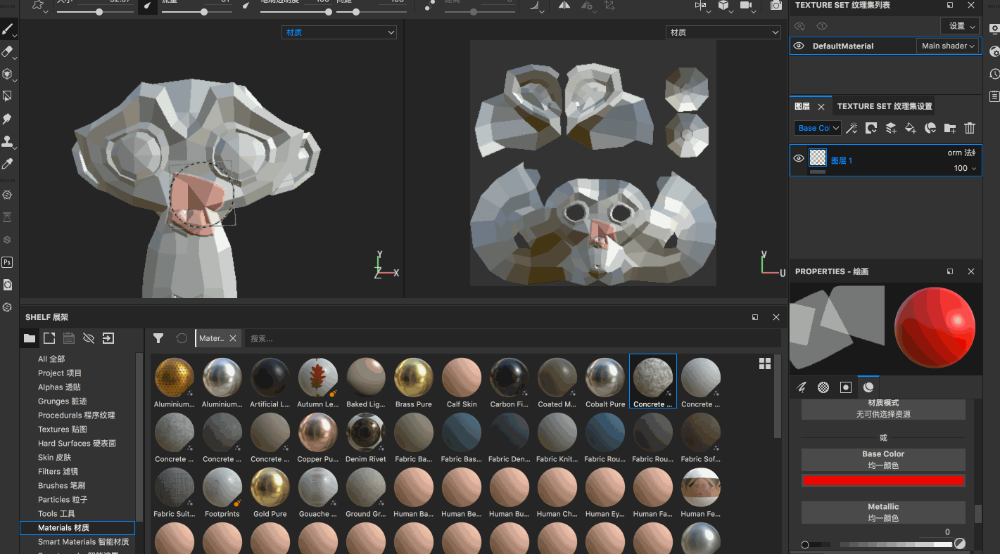

显然使用快速遮罩涂黑的地方，当使用快速遮罩后，用画笔进行绘制的时候，这个部分是不会被影响的

注意，快速遮罩不是非黑即白的，而是也有中间的灰色地带的！

* 遮罩设置为黑色，表示画笔对其完全无影响
* 遮罩设置为白色，表示画笔对其完全影响
* 遮罩设置为灰色，表示画笔对其部分影响

## 投射笔刷

投射笔刷的作用是把屏幕上的图像投射到我们的模型表面的，在绘制皮肤、毛发等的时候经常会用到！

>比如我们先用网上找一个金丝猴的照片，使用这个照片投射到我们的模型上，怎么将这个图片导入到Substance 中呢？

>Blender 中的绘制工具也是有一样的功能的，比如做了一个苹果的模型，后续想要使用显示中苹果的图片，然后将其投射到苹果模型上！

顺便再提一嘴Substance 的一些快捷键

* 【1】笔刷工具
* 【2】橡皮擦工具
* 【3】投射笔刷
* 【s + 鼠标左键拖动】旋转投射图片
* 【s + 鼠标右键拖动】放大/缩小投射图片
* 【s + 鼠标中间拖动】投射图片的平移

另外也可以直接在模型窗口直接右键唤出画笔/透贴/蒙版/材质等设置项

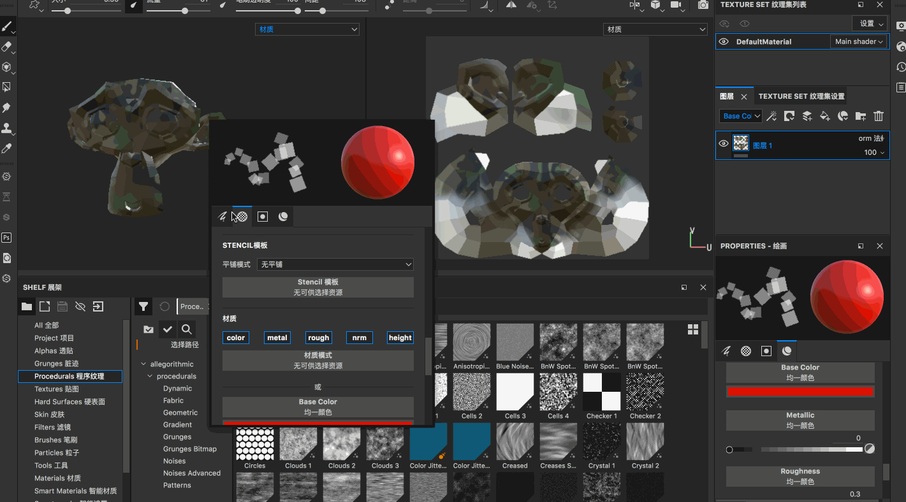

比如使用投射笔刷绘制完一定的效果之后，还是可以使用比如笔刷工具继续进行其他的绘制的

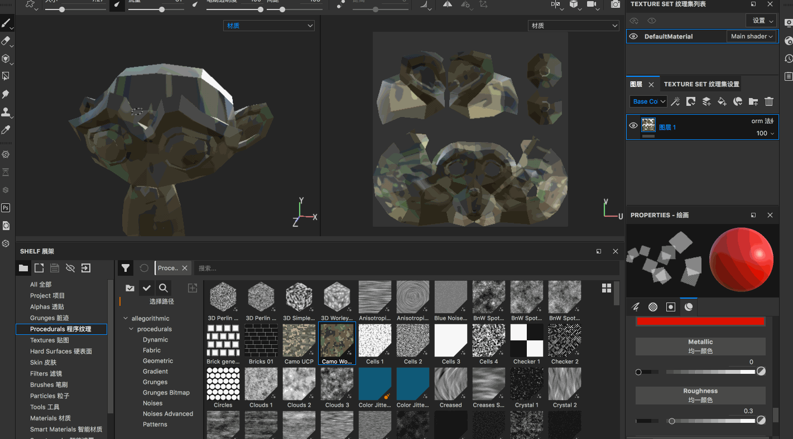

## 多边形填充工具使用

比如为当前这个猴头模型添加两个图层，图层1使用材质1，图层2使用材质2

可以看到，当图层全部打开的时候，图层2 会盖住图层1，如果只显示图层1，那么就只会看到图层1 的材质

假如我想实现这样的样子呢，猴子的眼睛使用材质2，其他部分还是使用材质1，那就要使用到多边形填充工具了

为图层2 添加【黑色遮罩】，然后快捷键【4】打开【几何体填充】，选择【UV块填充】，然后在UV 视图选中眼睛部分对应的几何块

* 在当前图层，【鼠标右键】->【删除遮罩】可以删除遮罩
* 在当前图层，【鼠标右键】->【反转遮罩】白的变黑，黑的变白
* 在当前图层，【shift + 鼠标右键】可以禁用/启用遮罩

遮罩黑色表示遮住不显示，白色表示显示，所以如果当前图层如果添加了纯黑的遮罩，那么当前效果的材质、笔刷效果是完全不展示的，如果使用多边形填充工具，使得一部分为黑色，另一部分为白色，那么黑色遮罩住的部分不现实，白色遮罩部分将正常显示当前图层！！！！

## 涂抹工具的使用方法

涂抹工具其实就是对多个材质进行混合！

比如现在有了两个图层，那么为了使用涂抹工具，且为了不破坏原来的图层，建议新增一个【绘制层】（注意不能是填充层），并且将该层的模式设置为【穿透】，然后使用快捷键【5】打开涂抹工具

>和PS 类似，Substance 中如何合理的规划自己的图层是很重要的！

## 克隆工具的使用

比如先新建一个图层，用笔刷在猴子的嘴巴上画一个标记

【6】打开克隆工具，按住键盘上的【v + 鼠标左键】获取原位置，在需要绘制的地方直接绘制即可完成对原位置的拷贝

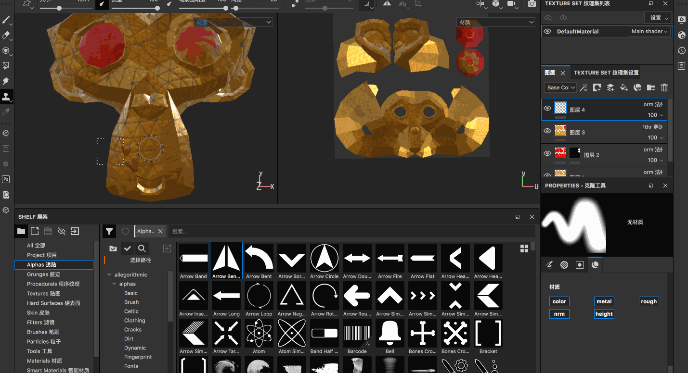

## 材质选择器和其他视窗功能

【7】打开材质选择器，类似于一个吸管，可以对当前附着上的材质进行吸取，注意这个工具只在【绘制层】生效，在【填充层】是不行的

* 绘制图层，故名思义这个图层是可以绘制的，所有的笔刷都是可用的
* 填充图层，所有的笔刷都是禁用的，只能去更改材质的颜色等属性！

比如新建一个【绘制层】，再使用材质选择器，吸附了某个材质后，有关于当前材质球的各个通道的属性都会展示到材质属性面板上，然后再使用笔刷进行绘制即可

到目前为止，左侧工具栏包括：

* 【1】 笔刷
* 【2】 橡皮擦
* 【3】 投射笔刷
* 【4】 几何体填充
* 【5】 涂抹工具
* 【6】 克隆工具
* 【7】 材质选择器

懒惰笔刷，笔刷后面有一个拖尾的效果

镜像绘制（可以选择按X、Y、Z轴镜像）

## 3D窗口通道

在3D 窗口的右上角可以选择展示的通道，也可以通过按【c】快捷键进行切换，比如我们经常需要查看某个单通道的效果

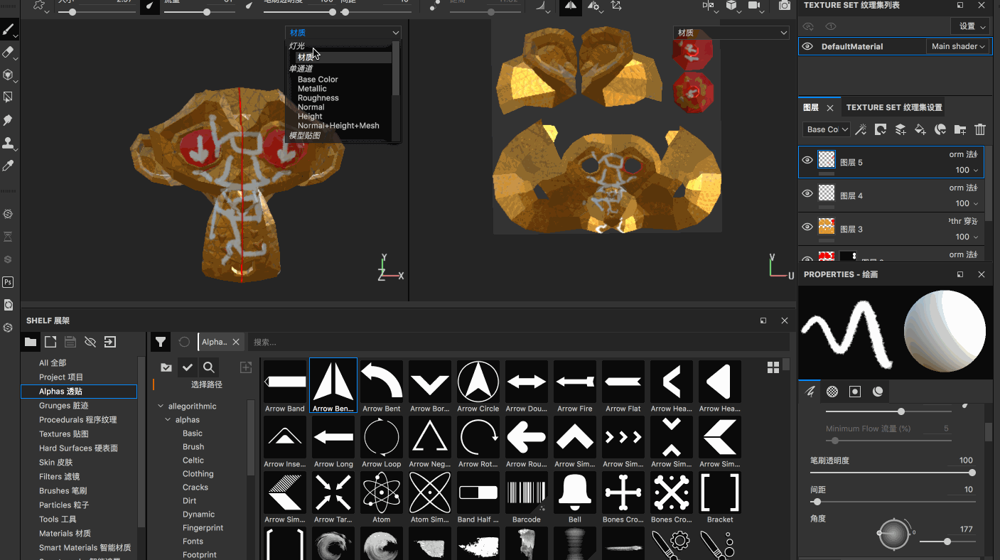

* Base Color
* Metallic
* Roughness
* Normal
* Height

* 【c】切换查看通道
* 【b】切换查看模型贴图
* 按【m】键可以快速切换回材质通道

## 展架使用方式

比如我想导入一张图片到Substance 的展架中，作为自己的美术资源

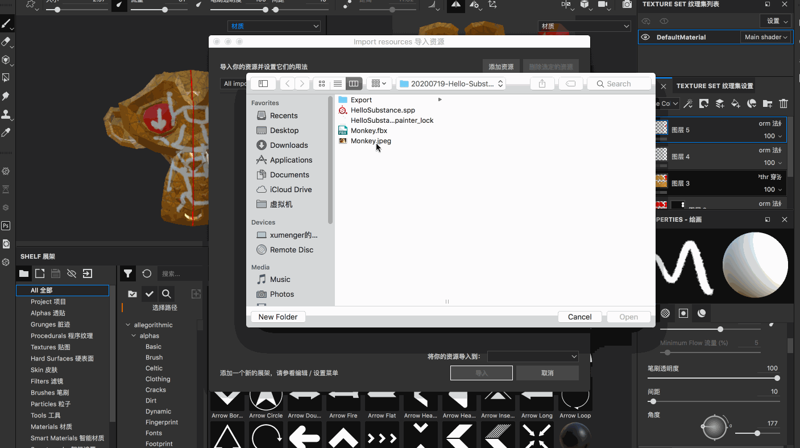

比如在上面提到导入一些图片，然后作为投射笔刷的资源使用！

## 显示设置属性调整

【窗口】->【Views】->【显示设置】

比如可以在这里选择背景

一般是切换不同的背景图片，看我们模型在不同的光照下的效果，帮助我们调节材质！

还有这些设置

* 背景
	* 背景透明度
	* 背景曝光
	* 背景旋转
	* 背景模糊
* 阴影
* 镜头相关
* 后期特效
	* 颜色校正
	* DOF自由度
	* 色调映射
	* 眩光
	* 晕影
	* 镜头扭曲变形
* 其他更多

## 创建和管理图层

* 绘制图层，故名思义这个图层是可以绘制的，所有的笔刷都是可用的
* 填充图层，所有的笔刷都是禁用的，只能去更改材质的颜色等属性！

比如直接将一个材质拖动到图层中，就对应新建一个填充图层，不可以绘制，但是可以去修改材质的属性

智能材质是由多个图层所混合的一个复杂的材质，包含很多材质的效果

## 填充图层属性

直接看一下操作吧

## 图层链接使用方法

这样的好处是，我们修改一个纹理图层，其他的对应的链接图层也是对应发生修改的

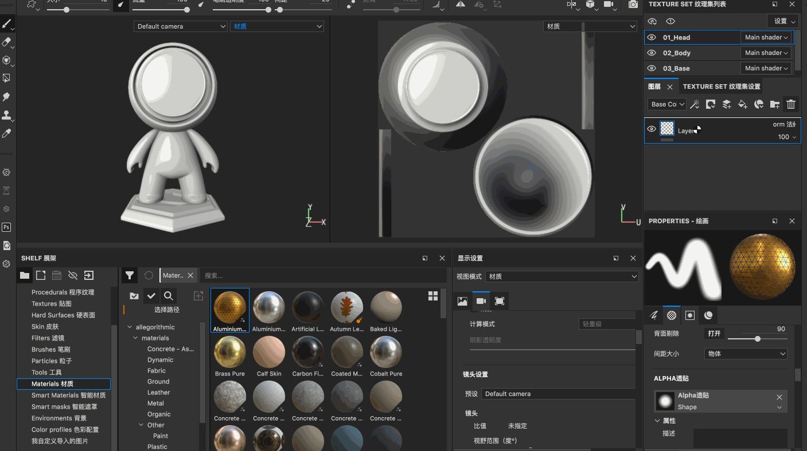

假如原来的图层是在01_Head 上创建的，链接到03_Base，那么只有在01_Head 上是可以调节的，在03_Base 上是不可以调节的

## 导入到Unity中使用

【文件】->【导出贴图】，或者【shift + command + e】可以导出当前编辑的贴图，然后将模型、贴图导入到Unity 中就可以直接使用了

## 扩展内容

这些软件分别的适用场景是什么？在游戏开发中有什么用？

* Bitmap2Material
* Quixel Bridge
* Quixel Mixer

另外推荐一些好的贴图资源网站

* [texturehaven.com](http://www.texturehaven.com/)，扎克大神推荐的贴图网站
* [texture.ninja](http://texture.ninja)
* [textures.com](http://textures.com)
* [quixel.com](https://quixel.com)，各种贴图：法线贴图、Albedo、Bump等等
* [cadnav.com](http://cadnav.com)
* [poliigon.com](http://poliigon.com)，各种贴图：法线贴图、Albedo、Bump等等
* [cc0textures.com](www.cc0textures.com)，这个是免费的资源网站，所有的贴图材质都可以直接商用
* [hdrihaven.com](www.hdrihaven.com)
