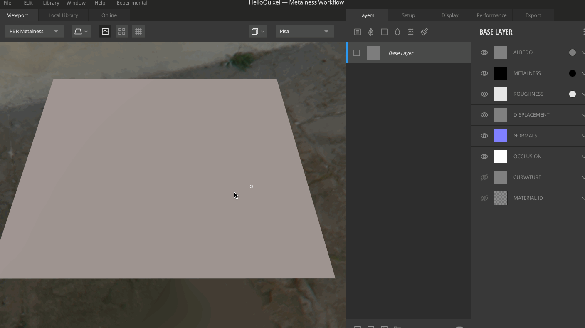
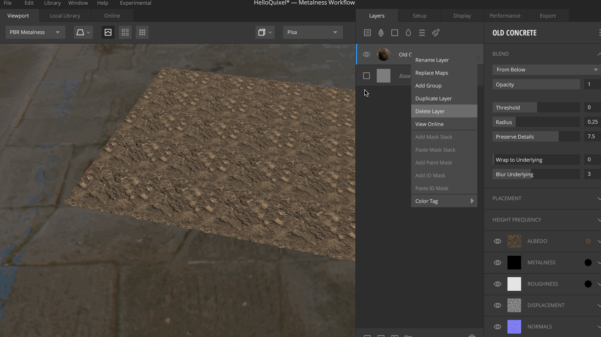

## 导入素材

【Library】菜单下可以导入素材（贴图、材质、3D模型）

* Import Assets from Folder 从文件夹导入
* Import Megascans Zips 导入Zip文件素材
* Import Custom Surface 导入自定义曲面
* Download All Acquired Assets 下载所有获得的素材

比如在互联网上找到一些优质的、没有版权问题的资源，或者去官网购买，可以导入到Mixer 中帮助进行游戏开发！

## 3D视图基础操作

* 【按住鼠标滚轮】移动
* 【alt + 鼠标左键】旋转
* 【滚轮滚动】放大/缩小
* 【alt + 滚轮滚动】更小粒度的放大/缩小

## 添加图层

在新建一个Mixer 项目后，会默认带一个Base Layer 图层

进入Local Library 界面，单击它，就会使用它并对应创建一个材质层，当然也可以加多个图层，那么Quixel Mixer 自然就会将各个图层进行混合，肉眼可见的一个混合的过程

去试着旋转视角观察，可以看到添加了某些材质后，面片会产生凹凸不平的效果，这个是因为置换贴图（Displacement）造成的效果

## 图层参数设置

选中**当前图层**之后，可以对图层进行这些参数的调整

* Height Intensity
	* High Frequency 高频率，值变大的时候，会将高的部分往上拉伸更高
	* Low Frequency 低频率，值变大的时候，会将低的部分往上拉伸更低
	* Threshold 当值为1 时，调整高频率和低频率都是没有用的
* Placement
	* Offset X X轴的偏移
	* Offset Y Y轴的偏移
	* Rotate 旋转
* Custom Scaling 自定义缩放值
	* Repetitions 重复次数
* Albedo 基础颜色，可以通过它调整当前基础颜色
* Metalness 金属值
* Gloss 光泽度

## 图层混合

比如先添加了Soil Mud，然后再添加Nordic Moss，选择Nordic Moss 图层，然后可以对混合进行设置

From Below，效果是草坪在黄泥的凹坑处；From Above，效果则是草坪在黄泥的凸起处

特别说一下其中的Preserve Details，将视图放大的话，可以看到草坪和黄泥的交界处可能会有锯齿，因为细节太多了，为了减低锯齿的问题，可以试着将Preserve Details 调小
