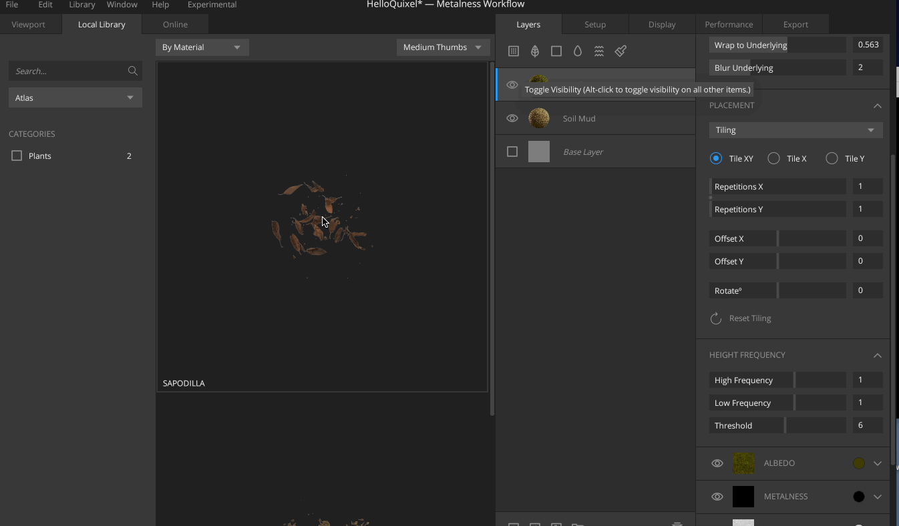
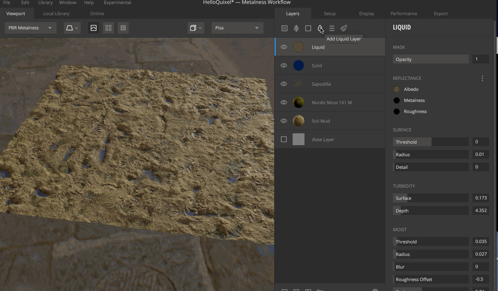
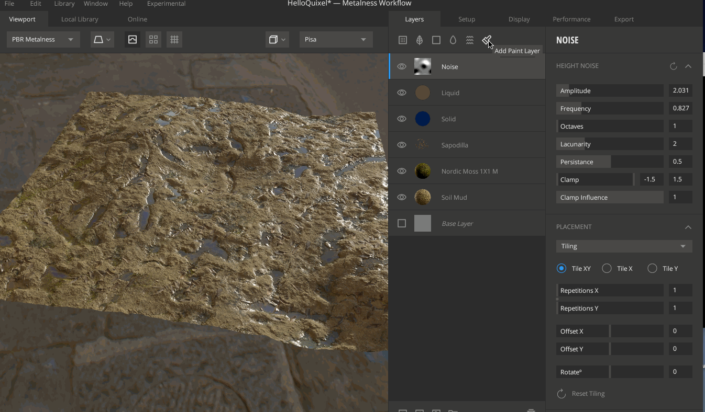
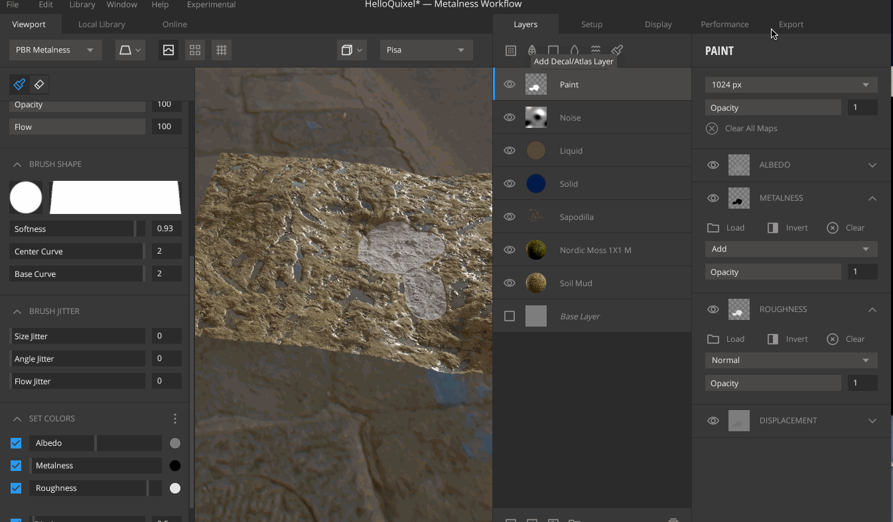

在上一篇中展示的其实只是一种图层（Sufrace Layer），在Quixel Mixer 中可以添加更多类型的图层

* Add Surface Layer 从本地的Library 资源中添加图层
* Add Decal/Atlas Layer 从本地的Library 资源中添加有Alpha 通道的资源
* Add Solid Layer 添加固有色
* Add Liquid Layer 添加液态表面
* Add Noise Layer 添加噪波层
* Add Paint Layer 添加绘制层

Add Decal/Atlas Layer 比如往原来的黄泥地材质上放上落叶细节

Add Solid Layer 添加固有色层，比如实现坑洼处的污泥的效果

Add Liquid Layer 添加液态表面，比如添加水面效果，各种参数可以进行调节，这里不一一展示！

Add Noise Layer 添加噪波层

Add Paint Layer 添加绘制层，可以用笔刷在原来的材质上进行绘制，可以设置笔刷大小、透明度、流量大小、形状等等

支持分别绘制Albedo（基本颜色）、Metalness（金属度）、Gloss（光泽度）、Displacement。绘制Displacement 的时候其实是对模型进行的编辑！

>以上每个图层都有自己的个性化的设置项，这里并没有做逐个的展示，自己在制作材质的时候各个参数都要试着去调一下，试着做出自己想要的效果

## 导出贴图资源

>一个常见的问题就是，在Mixer 中制作的效果能看出来立体感，但是倒出来的贴图放到游戏引擎中却没有立体感，这个是因为置换贴图的关系

>置换贴图的原理是什么？为什么可以实现立体感的效果？置换贴图好像是会对模型产生形变的，但是如果模型本身的面数不多，那么就算是使用比较高精度的置换贴图也产生不了精细的效果，因为这个最终还是受模型本身的面数影响的

选择导出栏，设置导出的尺寸、导出路径、选择导出贴图类型等，然后导出即可

* 

然后这些贴图就可以在UE4、Unity 等游戏引擎中直接用来制作我们的材质贴图使用了！