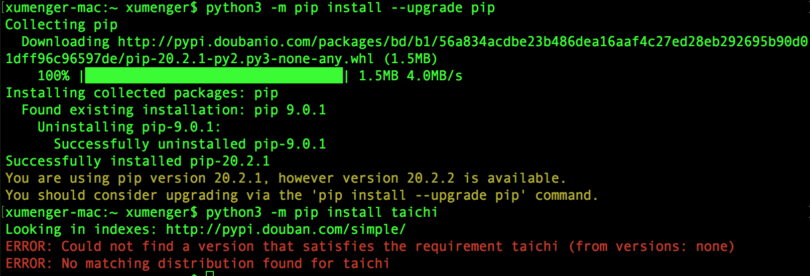

## 安装Taichi 

使用pip 安装太极（当前我的Python 版本是3.6）

```
python3 -m pip install taichi
```

出现报错！


需要升级pip 版本

```
python3 -m pip install --upgrade pip
easy_install --upgrade pip
```

再次安装还是报错



更换阿里云的源进行安装

```
python3 -m pip install taichi -i http://mirrors.aliyun.com/pypi/simple --trusted-host mirrors.aliyun.com
```

还是有问题，查了一下是需要Python3.7 及以上版本

https://www.python.org/downloads/release/python-378/

下载后直接双击后安装

然后重新安装taichi

```
python3.7 -m pip install --upgrade pip
python3.7 -m pip install taichi
python3.7 -m pip install taichi -i http://mirrors.aliyun.com/pypi/simple --trusted-host mirrors.aliyun.com
```

还是有问题，结果是不应该安装taichi，而应该安装taichi-nightly

```
python3.7 -m pip install taichi-nightly -i http://mirrors.aliyun.com/pypi/simple --trusted-host mirrors.aliyun.com
python3.7 -m pip install taichi-core -i http://mirrors.aliyun.com/pypi/simple --trusted-host mirrors.aliyun.com
```

* CPU 版本 (支持Linux, OS X and Windows)
	* python3.7 -m pip install taichi-nightly
* GPU (CUDA 10.0) (只支持Linux)
	* python3.7 -m pip install taichi-nightly-cuda-10-0
* GPU (CUDA 10.1) (只支持Linux)
	* python3.7 -m pip install taichi-nightly-cuda-10-1

## Taichi案例

>[99行代码的《冰雪奇缘》](https://zhuanlan.zhihu.com/p/97700605)

>牛逼！！！！

```
ti example 
或者 
python3.7 -m taichi example
```

可以查看当前所有可运行的Example


>python3.7 -m taichi example mpm128


>python3.7 -m taichi example stable_fluid


>python3.7 -m taichi example waterwave


## mpm128.py源码

```python

```

## 参考资料

* [pip修改国内源](https://www.cnblogs.com/abner28/p/10249630.html)
* [99行代码的《冰雪奇缘》](https://zhuanlan.zhihu.com/p/97700605)
* [Taichi安装与应用](https://blog.csdn.net/weixin_43840862/article/details/103936699)
* [物理模拟与taichi编程实现](https://blog.csdn.net/qq_33946416/article/details/104211249)

PYPI国内源路径

* 阿里云 http://mirrors.aliyun.com/pypi/simple/
* 豆瓣(douban) http://pypi.douban.com/simple/
* 清华大学 https://pypi.tuna.tsinghua.edu.cn/simple/
* 中国科学技术大学 http://pypi.mirrors.ustc.edu.cn/simple/