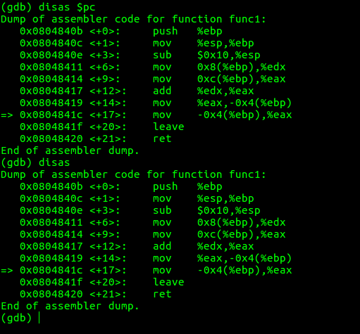
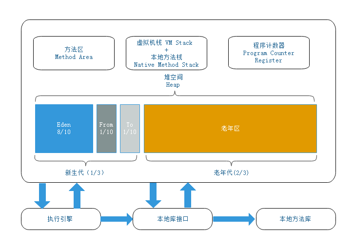
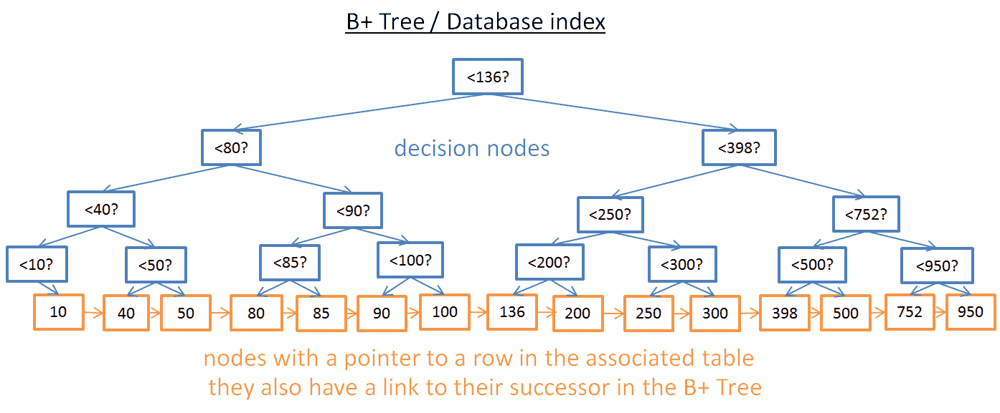
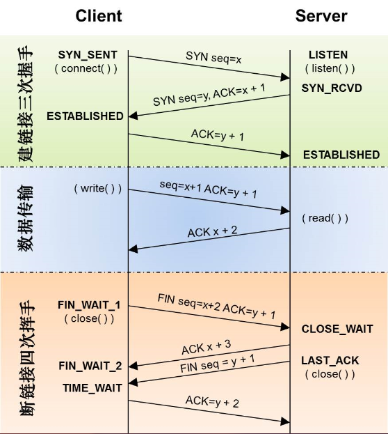

>软件是很简单的，一切无非就是围绕数据和逻辑建构起来的！

>软件也是复杂的，在实际的业务场景中，尤其是分布式系统中，跨地调用、网络超时、线程阻塞、线程死锁、数据库死锁、数据库索引失效导致性能变差、FullGC导致程序无法正常处理业务、空指针导致程序崩溃、消费者生产者处理性能不匹配、DDos攻击、一行代码的错误导致大量Socket未正常close、错误的大量写日志导致程序异常、等等，以及这些问题的组合，以及这些问题引发蝴蝶效应导致在一些看似不相关的地方出现报错，等等。具体遇到这些问题的时候，如何定位问题、如何进行调优，这些又都是很难的

我的上一份工作从事Delphi、C、C++ 相关的工作，使用这几种编程语言，开发者可以“直接”与计算机打交道，比如自己管理内存等，经常遇到的疑难杂症包括线程死锁、进程内存溢出、进程内存泄漏、并发同步导致的空指针问题、线程死循环等问题，很多问题通过内存监控、CPU监控，然后上Windbg、GDB 等调试工具，在线分析进程，或者生成转储文件后进行分析，很多问题都可以很好的解决

当然，所有这些都依赖于对底层技术的了解，因为要分析线程调用栈、分析汇编层面的逻辑、分析线程的寄存器、分析TCP连接的状态、分析堆内存，要知道CPU的工作原理、要知道虚拟内存的原理、要知道TCP状态机……比如要知道并发同步的各种语义及背后的原理才好分析多线程并发的疑难杂症，因为很多并发情况下的空指针问题都是很偶发的，这种问题的排查难度就很大！

确实有一些偶发的地址报错问题真的是很难排查！

>[Windows下32位进程内存模型](http://www.xumenger.com/01-windows-process-memory-20170101/)

>[Linux下32位进程内存模型](http://www.xumenger.com/02-linux-process-memory-20170101/)

现在的工作中主力编程语言是Java，主要是分布式系统的开发

主要的技术栈则是，Java、并发编程、Linux、Spring、Kafka、Redis、ElasticSearch、MyBatis、Oracle、MySQL，每一项技术背后都有大量的知识点，所以在进行性能调优的时候需要考虑到方方面面（具体就不赘述了，在后续每篇文章中通过一个个案例说明）

比如对于Java GC问题的调优，会引申出JVM、Java垃圾回收机制，进一步引申出JVM 的内存模型，进一步引申出JVM 的各个垃圾回收算法，再进一步引申出不同内存区域（Eden、S0、S1、Old、元数据区、堆外内存）的内存管理机制的不同，

关于多线程并发问题的调优，会引申出多线程与CPU、Java 的指令集，还会引申出Java 的各种同步机制，进一步引申出synchronized 的锁升级原理以及AQS 原理

关于数据库调优，会引申出通过执行计划分析慢查询，进一步引申出数据库索引的原理，进一步引申出B+ 树数据结构

>[数据库是如何工作的？](http://www.xumenger.com/how-databases-work-20180415/)

关于网络层面的调优，会引申出TCP 网络协议，进一步引申出TCP 状态机，以及Socket API 与TCP 状态机的对应关系，还会引申出操作系统的TCP 协议栈实现，进一步引申出epoll IO多路复用等技术点

>[一篇学会TCP/IP！](http://www.xumenger.com/tcp-ip-family-20180222/)

等等！

本系列主要是结合我自己的工作经验，自己遇到的问题以及如何排查定位，还有一些书籍上整理的经典问题，阐述具体用到的工具、排查和分析的思路，以及这个问题背后的原理（关于原理部分，我要么将其当场讲清楚，要么给出关联链接，要么会提供推荐阅读的书籍，方便进一步研究）

然后希望引申关于操作系统、网络原理、虚拟内存、CPU与多线程、网络编程、数据库原理、文件IO、虚拟机与指令集、算法与数据结构等各个方面的知识点！

这是一个持续更新的系列，每次有一些典型的问题都会及时更新到对应的文章中！
